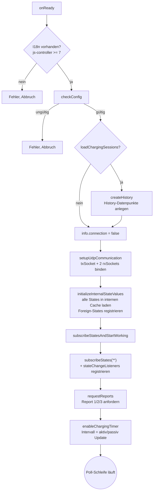
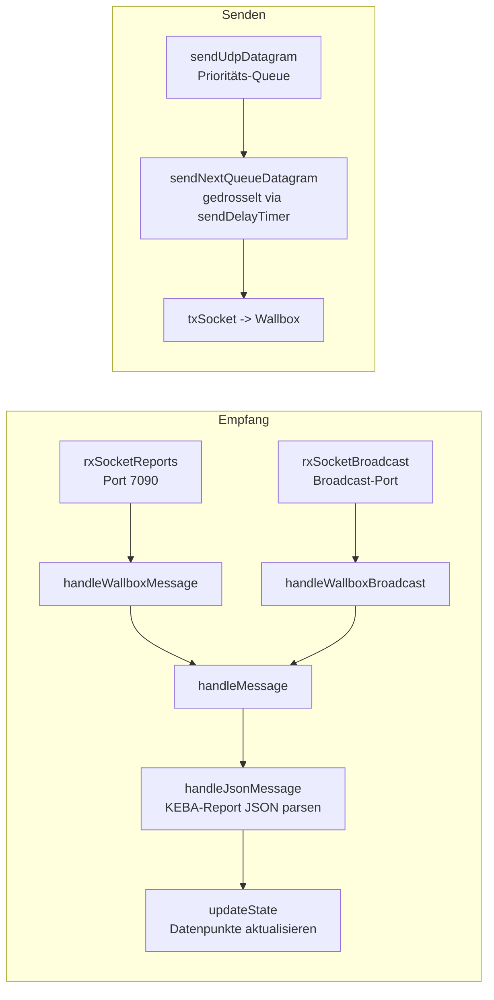
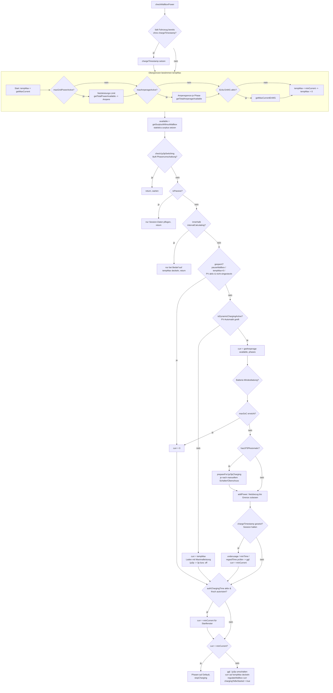

# Программаblauf – ioBroker.kecontact

Этот документ описан в разделе «Программные настройки адаптеров», в котором описаны варианты конфигурации и данные. Есть собственная логика`main.js` в классе`Kecontact` .

---

## 1. Обзор

Адаптер предназначен для KEBA KeContact P20/P30 (bzw. BMW i) Wallbox über **UDP** . Кернауфгабе: во время периодического режима работы, чтобы получить возможность использовать PV-убершусс (дополнительно от аккумуляторной батареи), он будет работать и работать в сети и в режиме ожидания.

Zwei Betriebsarten:

- **Актив** (стандартный): Адаптер для широковещательной передачи на Wallbox, поиск и повторный запуск.
- **Пассивный** (`passiveMode` Одер`subsequent wallbox` ): nur Beobachtung, keine Regelung. Обратите внимание, что у Wallbox есть **мгновенный** доступ к Broadcast-Port.

---

## 2. Lebenszyklus / Start

Важные баллы:

- `checkConfig()` verwirft ungültige IPs (`0.0.0.0` ,`127.0.0.1` ), setzt`isPassive` и интервал обновления.
- Внутренний кэш состояния (`getStateInternal` /`setStateInternal` ) просмотрите все ioBroker-States, если вы хотите выполнить асинхронное чтение повторно.
- `stateVehicleSoC` kann auf einen **Fremd-State** zeigen; dieser wird beim Start und bei Änderung dynamisch (un)подписка.

---

## 3. UDP-коммуникация

- **Senden ist gedrosselt** (Очередь +`sendDelayTimer` ), мы получим доступ к командам Wallbox.`highPriority` команда должна стоять в очереди.
- Schreiben auf steuernde Datenpunkte löst über`stateChangeListeners` das passende UDP-Kommando aus (см. Таблицу Abschnitt 6).
- Bei mehreren Instanzen tauschen sich diese über`internal.message` (`handleWallboxExchange` ) аус.

---

## 4. Регель-Шляйфе:`checkWallboxPower()`

Герц адаптеров. Wird periodisch (Таймер) и bei erzwungenen Neuberechnungen (`forceUpdateOfCalculation` ) ауфгеруфен. Эргебнис ист-эйн-Ладестрем`curr` в мА, через`regulateWallbox()` gesetzt wird – oder`stopCharging()` .

### Керн-Райхенфольге (Приоритет дер Эйншранкунген)

1. **Harte Obergrenzen** zuerst:`maxGridPower` →`maxAmperage` →`§14a EnWG` . Diese können den Strom nur **senken** , nie erhöhen.
2. **Сперрен** : Мануэль Пауза, kein Fahrzeug eingesteckt,`tempMax = 0` .
3. **Betriebsmodus** : динамизм (PV) против Maximalleistung (`isDynamicChargingActive` – abhängig von PV-Automatik,`targetSoC` ,`maxSoC` ).
4. **Überschussrechnung** с дополнительным аккумулятором.
5. **Сессион-Халтен** :`addPower` ,`underusage` ,`minTime` ,`regardTime` verhindern ständiges Ein/Aus – ein einmal gestarteter Ladevorgang wird toleriert fortgeführt.
6. **Phasenumschaltung 1p/3p** als Sonderfall, der die Rechnung neu anstößt.

---

## 5. Zusammenspiel der Optionen (Конфигурация → Verhalten)

Опционен аус`admin/jsonConfig.json` (`this.config.*` ). Fremd-States включает в себя Verweise auf Datenpunkte **anderer** Adaptor (Energiezähler, Speicher, Fahrzeug-SoC).

| Берейх           | Вариант(ен)                                                                                                                                                              | Wirkung im Ablauf                                                                  |
| ---------------- | ------------------------------------------------------------------------------------------------------------------------------------------------------------------------ | ---------------------------------------------------------------------------------- |
| Verbindung       | `host` ,`pollInterval` ,`passiveMode` ,`loadChargingSessions` ,`lessInfoLogs`                                                                                            | Основа: IP, Poll-Takt, aktiv/passiv, Session-Download, Log-Detail.                 |
| PV-Basis         | `stateSurplus` ,`stateRegard`                                                                                                                                            | Fremd-States für Überschuss / Netzbezug →`getSurplusWithoutWallbox`                |
| PV-Feintuning    | `minAmperage` ,`addPower` ,`delta` ,`underusage` ,`minTime` ,`regardTime`                                                                                                | Начало/остановка сеанса, гистерезисное выравнивание                                |
| Wallbox-Einbezug | `statesIncludeWallbox` ,`wallboxNotIncluded`                                                                                                                             | ob Wallbox-Leistung в Zählerwerten bereits enthalten ist                           |
| 1p/3p            | `state1p3pSwitch` ,`1p3pSwitchIsNO` ,`1p3pViaX2` ,`useX1forAutomatic`                                                                                                    | Phasenumschaltung через Schütz (НО/НЗ) или порт X2; X1-Эйнганг                     |
| Batteriespeicher | `stateBatteryCharging` ,`stateBatteryDischarging` ,`stateBatterySoC` ,`batteryPower` ,`batteryChargePower` ,`batteryMinSoC` ,`batteryLimitSoC` ,`batteryStorageStrategy` | ob/wie Speicher fürs Fahrzeug genutzt wird →`getBatteryStoragePower` Стратегии 1–4 |
| §14a EnWG        | `stateEnWG` ,`dynamicEnWG` ,`powerEnWG`                                                                                                                                  | fixe 6 или динамическое начало →`getMaxCurrentEnWG`                                |
| Leistungslimit   | `maxPower` ,`stateEnergyMeter1..3` ,`wallboxNotIncluded`                                                                                                                 | Gesamtleistungs-Deckel →`getTotalPowerAvailable`                                   |
| Амперлимит       | `maxAmperage` ,`stateAmperagePhase1..3` ,`amperageUnit`                                                                                                                  | Deckel je Phase →`getTotalAmperageAvailable`                                       |
| Авторизация      | `authChargingTime`                                                                                                                                                       | Zwangs-Ladefenster nach RFID-Autorisierung                                         |

Merksatz: **Fremd-States leefern Messwerte** , **Optionen liefern Parameter/Grenzen** , und die dynamischen`automatic.*` -Datenpunkte erlauben Übersteuerung zur Laufzeit.

---

## 6. Steuernde Datenpunkte (Шрайбен → UDP-Kommando)

Зарегистрироваться в`subscribeStatesAndStartWorking()` . Чтобы получить дополнительную информацию в UDP-команде, выполните следующие действия:

| Пункт данных                             | Kommando an Wallbox                         |
| ---------------------------------------- | ------------------------------------------- |
| `enableUser`                             | `ena 0/1`                                   |
| `currentUser`                            | `curr <mA>`                                 |
| `currentTimer` (+`timeoutCurrentTimer` ) | `currtime <mA> <t>`                         |
| `output`                                 | `output 0/1`                                |
| `display`                                | `display 0 0 0 0 <text>`                    |
| `setenergy`                              | `setenergy <Wh*10>`                         |
| `report`                                 | `report <n>`                                |
| `start` /`stop`                          | `start <tag>` / `stop <tag>`                |
| `setdatetime`                            | `setdatetime <...>`                         |
| `unlock`                                 | `unlock`                                    |
| `x2phaseSource` /`x2phaseSwitch`         | `x2src <n>` /`x2 <n>` (+`1p3pSwTimestamp` ) |

---

## 7. Динамический Штойер-Датенпункте`automatic.*`

Diese verändern das Regelverhalten zur Laufzeit (по сценарию/виду описания), без UDP-команды – sie fließen in`checkWallboxPower` эйн:

| Пункт данных                                         | Bedeutung                                                    |
| ---------------------------------------------------- | ------------------------------------------------------------ |
| `automatic.photovoltaics`                            | PV-Automatik an (динамичный) / aus (Maximalleistung)         |
| `automatic.pauseWallbox`                             | sofortiger Ladestopp, solange `true`                         |
| `automatic.addPower`                                 | erlaubter zusätzlicher Netzbezug (W); отрицательный = Резерв |
| `automatic.limitCurrent` /`automatic.limitCurrent1p` | Ampere-Deckel dynamisches Laden (0 = aus / aus Settings)     |
| `automatic.maxGridPower`                             | Netzleistungs-Deckel (0 = другие настройки,`maxPower` )      |
| `automatic.calcPhases`                               | Phasenzahl für Berechnung (KeContact Deutschland-Edition)    |
| `automatic.1p3pCharging`                             | erzwungen 1p oder 3p                                         |
| `automatic.batteryStorageStrategy`                   | Стратегии Шпайхера 1–4                                       |
| `automatic.batterySoCForCharging`                    | Speicher erst ab diesem SoC nutzen                           |
| `automatic.stateVehicleSoC`                          | Fremd-State mit Fahrzeug-SoC                                 |
| `automatic.targetSoC`                                | Bis zu diesem SoC ohne PV с максимальной нагрузкой           |
| `automatic.maxSoC`                                   | Oberhalb dieses SoC больше не загружен                       |
| `automatic.resetTargetSoC`                           | `targetSoC` nach Erreichen zurücksetzen                      |

---

## 8. Ergebnis-/Status-Datenpunkte

| Пункт данных                                                         | Вдох (gesetzt durch Regelung)                         |
| -------------------------------------------------------------------- | ----------------------------------------------------- |
| `statistics.surplus`                                                 | Актуеллер Überschuss für PV-Automatik                 |
| `statistics.maxPower` /`statistics.maxAmperage`                      | wirksame Leistungs-/Amperegrenze                      |
| `statistics.chargingPhases`                                          | актуальный фазенцаль                                  |
| `statistics.plugTimestamp` /`chargeTimestamp` /`authPlugTimestamp`   | Zeitstempel Einstecken / Ladebeginn / Autorisierung   |
| `statistics.consumptionTimestamp` /`1p3pSwTimestamp`                 | Таймер остановки Netzbezug / Letzte Phasenumschaltung |
| `statistics.lastChargeStart` /`lastChargeFinish` /`lastChargeAmount` | последняя сессия                                      |
| `statistics.sessionId` ,`rfid_tag` ,`rfid_class`                     | Информация о сессиях/RFID                             |
| `info.connection`                                                    | Wallbox erreichbar                                    |

Roh-Messwerte der Wallbox (из KEBA-Reports):`state` ,`plug` ,`p` ,`u1..u3` ,`i1..i3` ,`ePres` ,`eTotal` ,`maxCurrent` ,`currentHardware` ушв.

---

## 9. Kurz-Zusammenfassung des Zusammenspiels

1. **Используйте** UDP-отчет (собственный Wallbox) и другие **состояния Fremd** (Zähler, Speicher, Fahrzeug-SoC) во внутреннем кэше.
2. **Optionen** legen Parameter und harte Grenzen fest;**`automatic.*`** erlaubt Laufzeit-Übersteuerung.
3. `checkWallboxPower()` verrechnet beides zu einem Ladestrom, unter Beachtung der Reihenfolge Grenzen → Sperren → Modus → Überschuss → Session-Halten → 1p/3p.
4. Das Ergebnis wird via`regulateWallbox()` /`stopCharging()` также UDP-команда отправляется и в`statistics.*` gespiegelt.