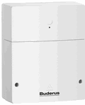

# Этот адаптер УСТАРЕЛ и больше не будет развиваться

-----

В настоящее время дальнейшее развитие этого адаптера не планируется. __Пожалуйста, перейдите на адаптер ioBroker.ems-esp__, который поддерживается.
Если вы пропустите какие-либо функции в ioBroker.ems-esp, откройте задачу в этом репозитории (https://github.com/tp1de/ioBroker.ems-esp/issues).

ioBroker.km200 будет оставаться доступным в течение некоторого времени, но имейте в виду, что он не будет адаптирован к узлу 20 и грядущему js-контроллеру v5.

-----

# IoBroker.km200
## Для Buderus KM50/KM100/KM200/KM300 и Junkers/Bosch MB LANi

[руководство на немецком языке](README_DE.md)

Адаптер поддерживает следующие системы отопления:

* Buderus с [сетевыми адаптерами](https://www.buderus.de/de/produkte/catalogue/alle-produkte/7719_gateway-logamatic-web-km200-km100-km50) KM50, KM100, KM200 и KM300
* Junkers с [сетевым адаптером](https://www.bosch-smarthome.com/de/mblani) MB LANi
* Bosch с [сетевым адаптером](https://www.bosch-smarthome.com/en/mblani) MB LANi

Для доступа к системе используется код, изначально разработанный Андреасом Ханом и описанный в его блоге [вход здесь](https://www.andreashahn.info/2014/07/kernthema-am-eigenen-leibe) и [вход там](https://www.andreashahn.info/2014/08/easycontrol-pro-unter-der-lupe-oder-m).

Системой отопления можно управлять через веб-сайт Buderus ([https://www.buderus-connect.de]) или с помощью приложения EasyControl с мобильного телефона. Приложение и веб-сайт Buderus также работают с системами отопления Junkers и Bosch.

Теперь это удалось в обоих направлениях, и адаптер уже полностью пригоден для использования.

Для этого необходимо сначала установить приложение на мобильный телефон и установить приватный пароль.
Приложение запрашивает пароль устройства и имя для входа с устройства.

Адаптеру по-прежнему нужен IP (или сетевое имя, например «BuderusKM200.fritz.box») и адрес порта (порт 80 на устройстве, но если вы изменили его через маршрутизатор...).

Если вы добавите '!' в конце адреса адаптер будет работать в режиме отладки и выдаст много информации!

Поскольку адаптер должен запрашивать данные из системы, необходимо указать интервал обновления.
Минимум 5 минут, так как для каждого обновления требуется отдельный запрос.

Вы можете использовать черный / push-список, чтобы скрыть или показать определенные данные и уменьшить количество состояний.
Этот список состоит из строк, похожих на RegExp (в которые они преобразуются адаптером), и сервисы в нагревателе затем фильтруются с их помощью.

Синтаксис таков, что `+` в самом начале означает, что это поле нельзя пропускать, даже если другое правило заблокирует его.
`-` ни на что не похоже и приводит к блокировке математического состояния.
каждое совпадение отделяется `,` и может включать `/` или `^` в начале, `*`, которые соответствуют всем, и `Синтаксис таков, что `+` в самом начале означает, что это поле нельзя пропускать, даже если другое правило заблокирует его.
`-` ни на что не похоже и приводит к блокировке математического состояния.
каждое совпадение отделяется `,` и может включать `/` или `^` в начале, `*`, которые соответствуют всем, и  в конце, чтобы соответствовать концу.

Строки чувствительны к регистру. Если вы хотите знать, какие состояния найдены, включите режим отладки и удалите все блокировки, тогда вы увидите все созданные состояния и сможете заблокировать некоторые ненужные данные с помощью списка блокировки.
Примеры: с помощью `+*temp*` вы можете затенить все, что содержит «temp», а с помощью `_HourlyСтроки чувствительны к регистру. Если вы хотите знать, какие состояния найдены, включите режим отладки и удалите все блокировки, тогда вы увидите все созданные состояния и сможете заблокировать некоторые ненужные данные с помощью списка блокировки.
Примеры: с помощью `+*temp*` вы можете затенить все, что содержит «temp», а с помощью  вы можете заблокировать все, что имеет «_Hourly» в конце, оба вместе заблокируют все _Hourly в конце, которые не имеют temp на свое имя.

Примерный список выглядит как `/gateway*, /recordings*,*SwitchPrograms*,/HeatSource*, *HolidayModes*` и скрывает около 90 из ~ 180 записей.

В настоящее время доступны два других расписания: быстрое (для состояний, опрашиваемых быстрее, чем каждые 30 минут) и медленное для состояний, которые опрашиваются часами или многочасовыми циклами.

Это позволяет вам отслеживать некоторую информацию, такую как температура в 1-5-минутных циклах и другие элементы в обычных 20-минутных циклах. Те, которые обычно не меняются даже в течение часа (например, _Daily$ или _Monthly$ и некоторые другие общие данные), не нужно читать даже каждые 30 минут, потому что они не изменятся. Эта стратегия помогает получать более быстрые показания для важных данных и более медленные чтения для не столь важных.

Данные для записи представляют собой (маленькие) исторические данные в системе отопления. Доступны 3 различных варианта: _Часовой, _Ежедневный и Ежемесячный.
Почасовой расчет обычно охватывает последние 48 часов. _Ежедневно за последние 2 месяца и Ежемесячно не более года, все с текущего времени отсчета. Некоторые точки данных показывают меньше точек данных.
Вы должны понимать, что адаптер собирает данные из 3 отдельных вызовов для каждой записанной точки данных.

`switchPrograms` теперь также можно читать и записывать, это строка JSON, которая отражает массив дней недели. Пожалуйста, не меняйте формат, только цифры при загрузке. Кажется, что цифры - это минуты, которые можно установить только с шагом 15 минут.

Начиная с V 1.1.2 скобки и запятые можно опускать, а заблокированные/выталкиваемые значения можно записывать только через запятую.

### Важно, если km200 обновляется с версии 1.1.*
Если вы ввели 64-символьный ключ доступа, вам не нужен пароль, но его не следует оставлять пустым, просто введите что-нибудь.

## Важный
* Для адаптера требуется узел >= v16.*.*

## Делать
* Дополнительная языковая поддержка и перевод текста

## Changelog

<!--
    Placeholder for the next version (at the beginning of the line):
    ### **WORK IN PROGRESS**
-->
### 2.0.5 (2023-07-09)
* (McM1957) Missing dependy to iobroker/adapter-core has been added
* (McM1957) Eslint has been activated and required adaptions to code have been done.
* (McM1957) dependencies have been updated

### 2.0.4
* fixed issue with js-controller version 5

### 2.0.3

* Adapter config update
* Blacklist is working now for any combination
* Added option not to delete unsused states

### 1.9.9

* Beta for v2.0.0
* Implemented recordings for hourly, daily and monthly data
* Changed readout for 'mins' units to enable these fields for read/write
* Implemented 2 additional time schedule where you can define fast cycle (1-30 minutes), normal with 30-60 minutes and slow with 1-24 hours. You define the lists whjich go to fast or slow in a similar way than the blocklist.
* Blocklist syntax changed sligly. `/` or `^` first is for from beginning, `*` can now be everywhere and `$` can be the end
* `switchPrograms` are supported now for read and write!

### 1.2.4

* Beta for next version, recordings supported

### 1.2.3 
* Implemented a correction to show also switchPrograms

### 1.2.2
* Adapter works also only with accesskey iin old 64 digit hex format without private passwort.

### 1.2.1 
* Adapter supports now compact mopde
* Adapter uses other module and removes need for mcrypt which makes it working on all platforms
* Adapter can now have debug mode set via '!' at end of address
* Adapter needs node >=v6

### 1.2.0
* Integrating Schupu's changes and also make the adapter ready for compact mode
* Update of adapter should continue to work with old settings

### 1.1.7
* (Schmupu) Supports Admin3
* (Schmupu) Only device password and own password needed. You do not have to get the access code anymore.

### 1.1.6
Adapter communication and retries more often to catch more errors.
* Writes are also retried
Added blocklist text in config screen

### 1.1.2
* Adapter handles better communication and retries if he got an error.
* you can set debug-mode by adding 'debug!' in front of host.
* Host port is not required and can be added to hostname with: xxx at end.
* Simpler blocklist handling, which does not ask for device which services are blocked

### 0.4.3
* Renamed repository to ioBroker.km200

### 0.4.3
Cleaning of objects / states for current adapters instance which are not part of scanned services anymore.

### 0.4.2
* Some small bug fixes and added some debug logs. Removed so dependency of 'request' and 'async' modules.

### 0.4.1
  Have only 'request' and 'async' with --save now also registered in the package.json ... Remember: Nuícht --save forget :(!

### 0.4.0
  Strings with allowedValues ​​are now converted to ioBroker states in both directions (read & write)

### 0.3.0
  Setting variables with numbers or strings now works.
  Thus, e.g. Target temperatures are changed.
  TODO: Enums and set tables

### 0.2.0
  Adapter now works with blacklist and in read-only mode.
  TODO: Implement setting values ​​in the heating system
  TODO: Implement variables with ENUMS (value lists)

### 0.1.0
  First test

## License
The MIT License (MIT)

Copyright (c) 2023 iobroker-community-adapters
Includes code copyright (c) 2016-2019 Frank Joke (frankjoke@hotmail.com)
Includes communications and crypto routines copyright (c) 2014 Andreas Hahn km200@andreashahn.info

Permission is hereby granted, free of charge, to any person obtaining a copy
of this software and associated documentation files (the "Software"), to deal
in the Software without restriction, including without limitation the rights
to use, copy, modify, merge, publish, distribute, sublicense, and/or sell
copies of the Software, and to permit persons to whom the Software is
furnished to do so, subject to the following conditions:

The above copyright notice and this permission notice shall be included in
all copies or substantial portions of the Software.

THE SOFTWARE IS PROVIDED "AS IS", WITHOUT WARRANTY OF ANY KIND, EXPRESS OR
IMPLIED, INCLUDING BUT NOT LIMITED TO THE WARRANTIES OF MERCHANTABILITY,
FITNESS FOR A PARTICULAR PURPOSE AND NONINFRINGEMENT. IN NO EVENT SHALL THE
AUTHORS OR COPYRIGHT HOLDERS BE LIABLE FOR ANY CLAIM, DAMAGES OR OTHER
LIABILITY, WHETHER IN AN ACTION OF CONTRACT, TORT OR OTHERWISE, ARISING FROM,
OUT OF OR IN CONNECTION WITH THE SOFTWARE OR THE USE OR OTHER DEALINGS IN
THE SOFTWARE.