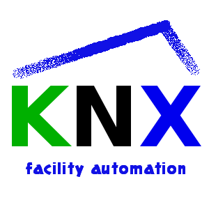

# IoBroker.knx
#### Оглавление
* [Описание](#description)
* [Требования](#требования)
* [Особенности](#features)
* [Установка](#installation)
* [Конфигурация адаптера](#adapter-configuration)
* [Установите лицензию](#install-the-license)
* [Интерфейс конфигурации](#configuration-interface)
* [Объекты](#objects)
* [Использование](#использование)
* [Типы точек данных (DPT)](#data-point-types-dpt)
* [Как работает импорт](#how-the-import-works)
* [Избегание проблем](#избегание-проблем)
* [GA-Tool](#ga-tool)
* [Прямая связь между состоянием без KNX и состоянием с KNX и наоборот](#direct-link-non-knx-state-to-knx-vice-verse)
* [Запланированные функции](#planned-features)
* [Список изменений](#changelog)

## Описание
Этот адаптер позволяет импортировать файлы `knxproj` из ETS. Он генерирует преобразование между адресами KNX-групп и ioBroker и помещает устройства в комнаты (особенно для MobileUI).

ru: [Установка и базовая настройка адаптера](docs/ru/README.md)

Он подключается к стандартным шлюзам KNX/LAN.

**Внимание: в связи с переходом на KNX-адаптер версии 2.x, условия лицензирования изменились. Новую лицензию можно получить по адресу [https://iobroker.net](https://iobroker.net/)**

**Также вам следует обновить js-контроллер и административную панель iobroker до последних версий.**

Перед началом работы: В вашем проекте ETS необходимо настроить каждый DPT для com.Objects. Каждое устройство должно быть отсортировано в соответствии со структурой вашего объекта.

## Требования
* Версия Node >= 14.15.4
* Версия администратора >= 5.2.0
* js-controller Версия >=3.3.20

Без выполнения этого требования адаптер невозможно установить или он будет работать некорректно.

## Функции
* импорт файла `knxproj`
* Создание структуры объекта, подобной ETS
* Поиск и объединение канала действия и канала состояния (эвристика)
* Обновление всех состояний при запуске
* не требуется облачные сервисы или интернет.
* Выполнение операции чтения (READ) в шине KNX при одновременной записи в объект состояния.
* Редактируйте и изменяйте объекты GA с помощью GA-Tools
* Редактирование и изменение связей между штатами и актами с помощью GA-Tools
* НОВОЕ: разрешить прямую связь с использованием не-KNX State (и наоборот)
* НОВОЕ: адаптер отвечает на запрос GroupValueRead в объекте, подключенном через directLink.
* НОВОЕ: импорт файлов проекта, защищенных паролем (благодаря aKzenT)

###Установка
Этот адаптер можно установить только с помощью npm. Установка через GitHub **не** работает.

##Конфигурация адаптера
После установки этого адаптера откройте его конфигурацию.

###Установите лицензию
Первый шаг — применение лицензии. Если лицензия не установлена, то применяется 500 точек данных.

* (1) показывает ваш идентификатор системы, он необходим для получения лицензии.
* (2) нажмите здесь, чтобы подать заявку на лицензию

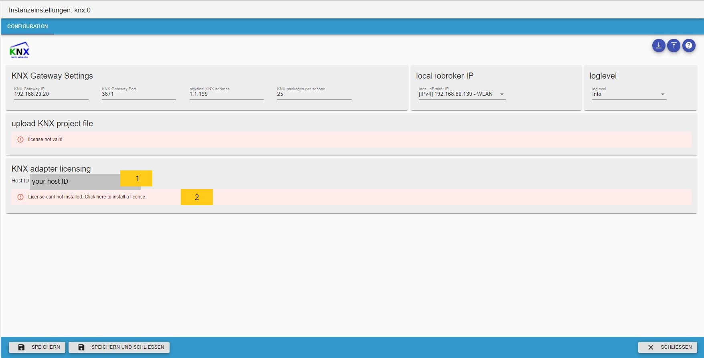

Если вы уже создали новую лицензию в соответствии с [https://iobroker.net](https://iobroker.net/), то вы можете вставить ее в (2), ИЛИ вы можете получить ее напрямую онлайн, нажав на (1)

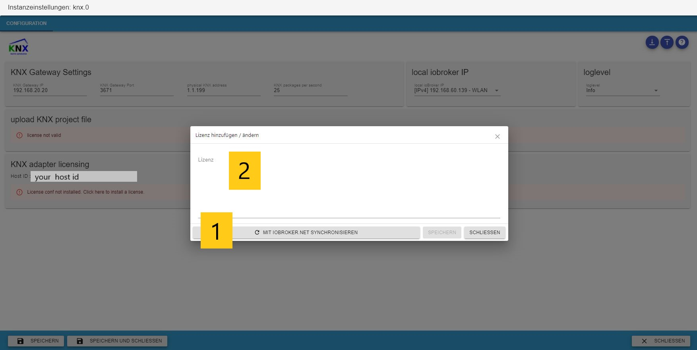

Если вы нажали на (1), введите данные для входа в свою учетную запись iobroker.net.

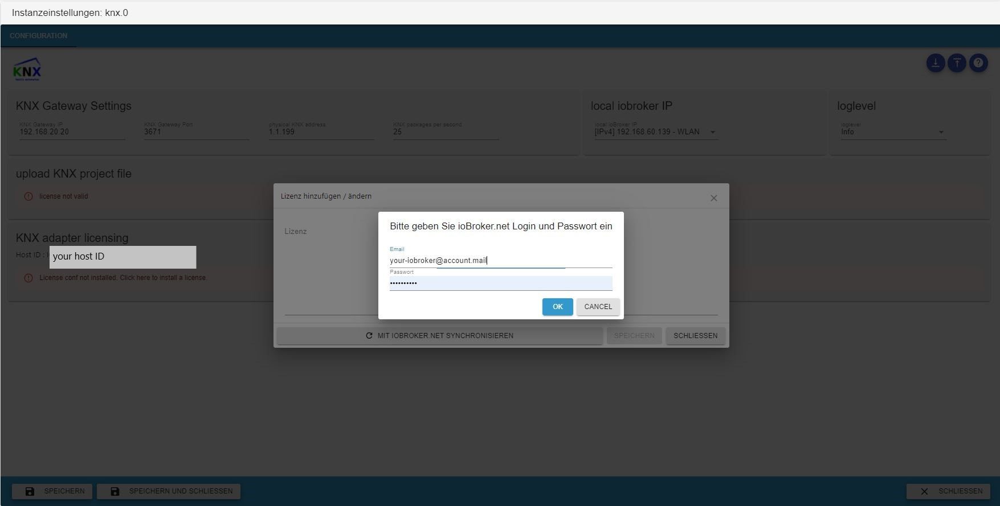

Если ваши данные верны, вы увидите все полученные вами лицензии. Выберите ту, которую хотите использовать.

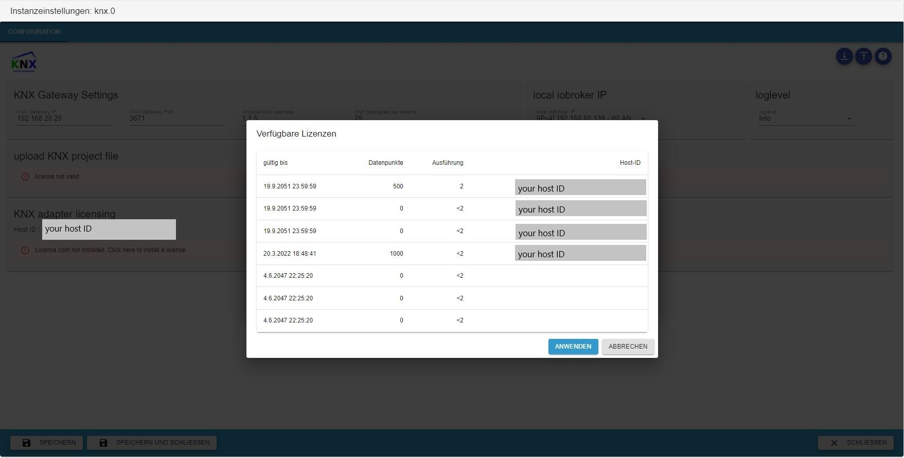

Если это сработало, сохраните это.

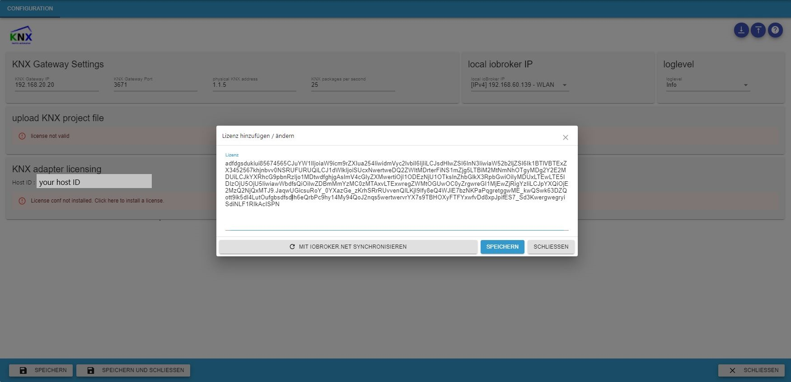

Вот и всё. Нажмите на кнопку сохранения внизу этой страницы.

### Интерфейс конфигурации
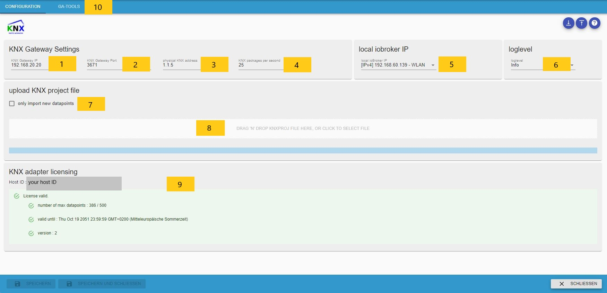

1. IP-адрес шлюза KNX: IPv4 шлюза KNX-LAN.
2. Порт KNX-шлюза: по умолчанию используется порт 3671.
3. Физический адрес: Физический адрес экземпляра iobroker knx. **Важно: это не физический адрес локальной сети.**

Шлюз!** и не может заканчиваться на 0

4. Количество пакетов KNX в секунду: это ограничивает скорость передачи пакетов. Если шлюз KNX Lan Gateway слишком часто переподключается или временно недоступен, это может привести к проблемам.

Если это доступно, то снизьте эту ставку.

5. Локальный IP-адрес iobroker: выберите IP-адрес/интерфейс, к которому будет привязан адаптер.
6. Уровень логирования: обычно это уровень «Информация», для отладки повышайте уровень.
7. Импортировать только новые точки данных: эта функция включена по умолчанию. В случае её отключения будут созданы новые GA-файлы И

Существующие GA будут созданы заново.

8. Кнопка загрузки файла: здесь доступна функция перетаскивания или при нажатии на диалоговое окно выбора файла. Здесь вы можете загрузить свой ETS.

Экспорт в формате `knxproj`.
После успешного импорта появится диалоговое окно с указанием количества импортированных объектов. Теперь нажмите «Сохранить и закрыть», и адаптер должен запуститься.
Во время запуска адаптер считывает все групповые адреса с флагами чтения и записи. Это может занять некоторое время и создать высокую нагрузку на вашу KNX-шину. Но значения в вашем vis обновляются после запуска.
Загрузка файла, защищенного паролем, пока недоступна.

9. Host-ID: это специальный идентификатор хоста iobroker. Этот идентификатор необходим для генерации и проверки лицензии.
10. GA-Tools: набор инструментов для быстро меняющихся общих алгоритмов.

### Объекты
Здесь, в папке knx.0, находится дерево групповых адресов, как в вашем проекте ETS. Для изменения свойств используйте GA-Tool.

### Использование
Если адаптер запустится успешно, ваши данные будут доступны для всего, что вы захотите сделать.

### Типы точек данных (DPT)
Все типы данных (DPT) в соответствии с разделом «Системные спецификации, взаимодействие, типы данных» от KNX Association доступны. Это означает, что вы можете получить два типа информации:

1) значение или строка 2) значения, разделенные запятыми, или массив значений (пока я не знаю, какой способ лучше использовать)

Например, DPT5.001 кодируется как беззнаковое целое число с 8 битами. Это дает одно значение. DPT3.007 (управление затемнением) кодируется как 1 бит (логическое значение) + 3 бита (беззнаковое целое число).
В результате получается, например, значение типа "0,5", где "0" означает "уменьшение", а "5" — количество интервалов.

### Как работает импорт
1. Чтение всех ссылок на объекты коммуникации (COR):

объединение идентификатора groupadressreference ID'd с DPT соответствующего COR (если существует).

2. Генерация структуры группового адреса (GAS):

Формирование GAS на основе идентификаторов GAR и установка DPT (если это еще не сделано).

3. Установление факта, касающегося данного акта, включает в себя:

В ets-exports отсутствует информация об адресах штатов и актов. Адаптер анализирует все GA типа «status» или «state».
Если есть два GA с уровнем сходства более 90%, то один адрес будет актором, а другой — штатом. Также проверяется сходство DPT. Поэтому найти пару непросто, если именование GA не согласовано.

4. Проверка флага в конфигурации устройства:

Обработка флагов осуществляется следующим образом:

| KNX | KNX | KNX | ioBroker | ioBroker | |
       |-------|-------|----------|----------|----------|----------------------------------------------------------|
| Читать | Записывать | Передавать | Читать | Записывать | Объяснение |
| - | - | - | - | - | значение будет обновлено функцией GroupValueRead |
| x | - | - | x | x | Отправка любого значения в этом состоянии запускает GroupValueRead |
| - | x | - | - | x | Записать значение в KNX с помощью GroupValueWrite |
| - | - | x | x | - | значение состояния будет обновлено функцией GroupValueResponse |
| x | - | x | x | x | Отправка любого значения в этом состоянии запускает GroupValueRead |

6. Создание узлов-партнеров данных (DPP):

Если GA, GAR и DPT действительны, будет создан DPP. Это те DPP, с которыми работает адаптер.
Если DPT отсутствует в GA, потому что его не удалось найти, то DPP не будет создан. Это можно сделать с помощью GA-Tool.

7. В начале работы адаптера:

Все данные GA, отмеченные флагом «Прочитано», проверяются в начале. Это может повлиять на увеличение автобусного потока. В конце все данные в системе актуальны.

### Предотвращение проблем
* Чистое программирование ETS, и что еще важнее, чистое программирование ETS, и самое главное, чистое программирование ETS.
* Назначьте DPT!!
* единая маркировка названий GA (например, «EG Wohnen Decke Licht schalten» и «EG Wohnen Decke Licht schalten status»)
* Избегайте использования специальных символов ",./;&%$§[]" (это может вызвать проблемы с образованием газа)
* Проверьте, доступен ли шлюз KNX/LAN. Если нет, адаптер будет постоянно пытаться подключиться.
* Правильно выберите физический адрес (важно при использовании линейных соединителей). !!! ВНИМАНИЕ: введенный физический адрес

Это НЕ адрес шлюза локальной сети, и он не должен заканчиваться на 0!!!

* Порт интерфейса локальной сети обычно равен 3671.
* В связи с возможностью запроса статуса необходимо отметить следующее: следует убедиться, что количество запросов не превышает 40 в день.

Вторые генерируются ioBroker, поскольку их можно физически сгенерировать, и они больше не могут быть переданы шлюзу адаптером.

## GA-Tool
Инструмент GA-Tool позволяет легко изменять свойства генетических алгоритмов.

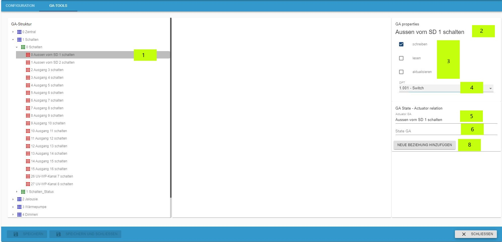

1. Отображает дерево генетических алгоритмов и выбранный генетический алгоритм.
2. В разделе свойств укажите название выбранного GA.
3. Установите флаги iobroker.
4. установить GA DPT
5. признанный акт GA
6. признанное государство GA

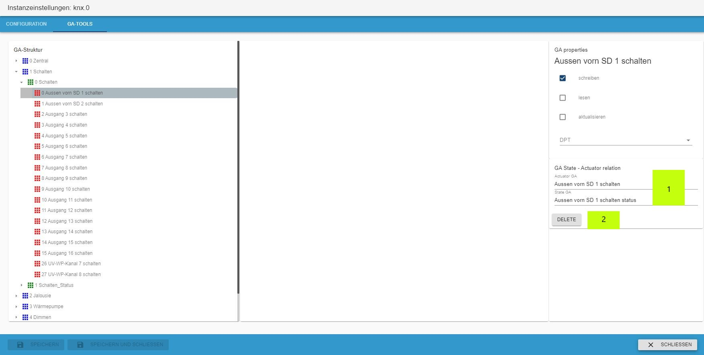

1. Покажите взаимосвязь между государством и законом.
2. Если связь существует, то её можно устранить.

Если связь отсутствует, то можно создать новую, нажав (2) для выбранного GA (1).
В диалоговом окне (3) можно выбрать партнера.

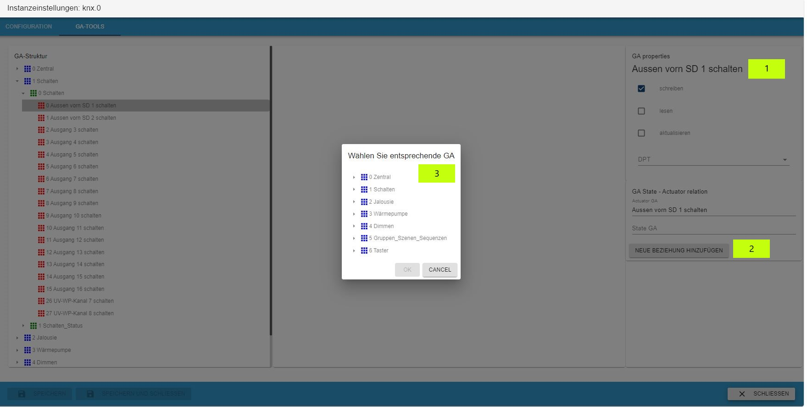

Если нужно изменить свойства нескольких GA, используйте множественный выбор. Эта функция работает только для GA, не имеющих отношения к данным.

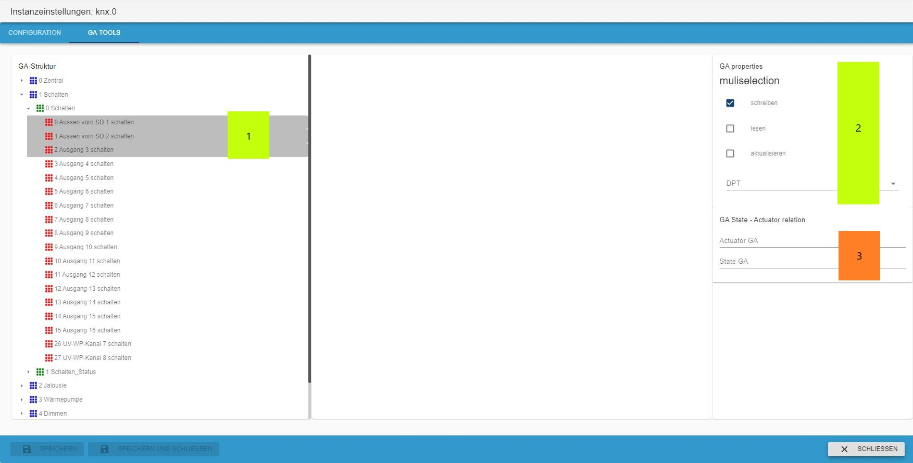

1. выбранные GA
2. свойства, которые нужно изменить
3. Изменения невозможны.

### Прямая связь между состоянием без KNX и состоянием с KNX и наоборот
Начиная с версии адаптера 2.0.6, появилась возможность напрямую связывать состояние ioBroker, не относящегося к KNX, с GA. Это можно использовать для передачи времени, даты, любых состояний или информации в KNX. (Небольшая подсказка: вы можете напрямую связать любой из ваших IoT-компонентов с GA в KNX (например, связать кнопку Homematic с KNX GA или датчик кнопки KNX с вашим проигрывателем Sonos)). Состояния можно считывать с помощью GroupValueRead, и если состояние изменяется, оно автоматически обновляется в KNX. Кроме того, если вы измените состояние в KNX, оно обновит связанное IoT-устройство, не относящееся к KNX.

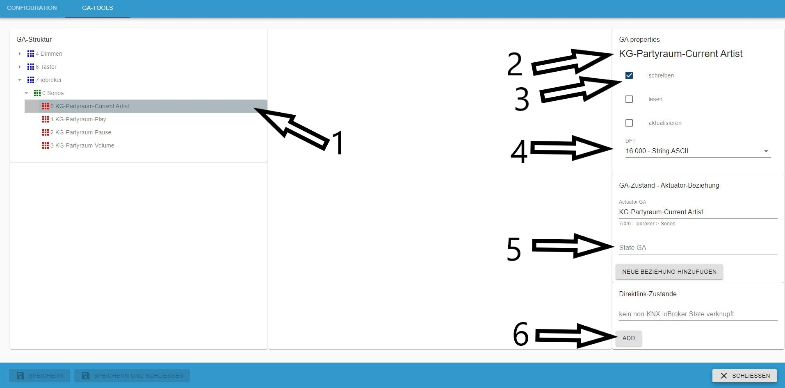

1. Выберите GA для подключения.
2. Отобразить выбранный GA
3. Данный GA должен иметь атрибут **write**.
4. Выберите допустимый тип данных (если они не совпадают, это не сработает).
5. Не допускается наличие отношения «действие-состояние».
6. Кнопка для выбора объекта, не относящегося к KNX, для связи.

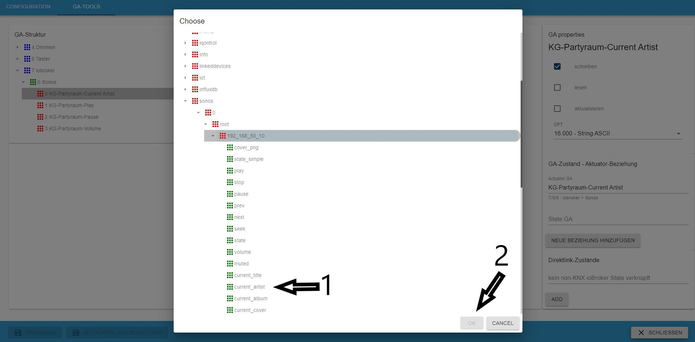

1. Выберите объект, не относящийся к KNX, который вы хотите связать.
2. Нажмите ОК, если закончили.

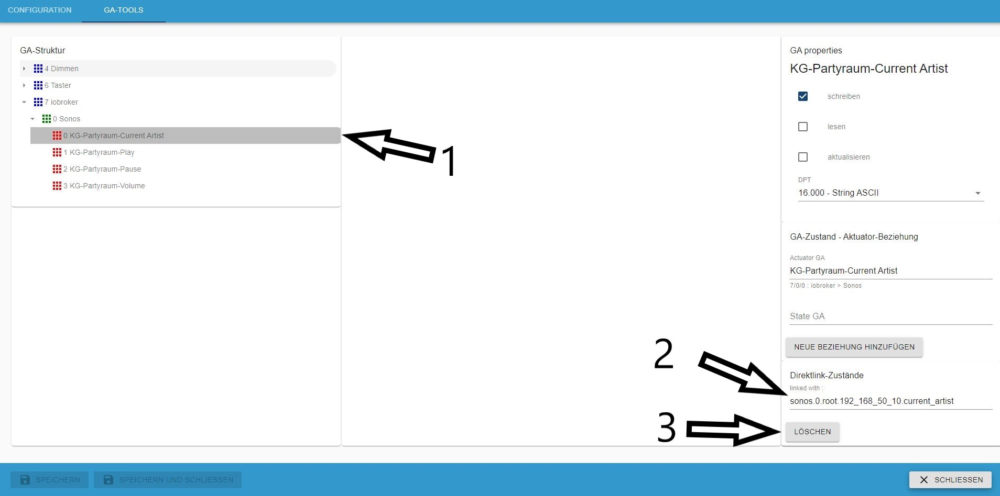

Теперь KNX-GA **(1)** напрямую связан с iobroker, не использующим KNX **(2)**. С помощью **(3)** вы можете удалить эту связь.

## Запланированные функции
* esf-import
* Инструмент мониторинга шины GA-Mon

<!-- Заполнитель для следующей версии (в начале строки):

### **РАБОТА В ПРОЦЕССЕ** -->
## Версии
### 2.0.38 (01.03.2026)
* Добавлена поддержка ETS 6.4.0

### 2.0.37 (20.02.2026)
* обновления зависимостей
* Исправлена ошибка в конфигурации адаптера

### 2.0.35 (05.02.2026)
* обновления зависимостей
* Исправление ошибок в GA-Tools
* Улучшения функциональности в GA-Tools

### 2.0.33 (22.06.2025)
* Проблема нестабильного соединения knx решена

### 2.0.31 (22.05.2025)
* Обновлена схема импорта адаптера для ETS 6.3.1
* Требуется Node.js >= 22

### 2.0.30 (22.12.2024)
* Исправлены ошибки графического интерфейса пользователя, начинается перепроектирование GA-Tools

### 2.0.29 (11.12.2024)
* Обновлена схема импорта адаптера для ETS 6.3.0
* Требуется Node.js >= 20

### 2.0.28
* Обновить данные, связанные с лицензией, и исправить версию пакета.

### 2.0.27 (02.05.2024)
* Обновлена схема импорта адаптера для ETS 6.2.2
* Исправлена ошибка UTF-8

### 2.0.26 (28.03.2024)
* Обновлена схема импорта адаптера для ETS 6.2.1
* Требуется Node.js >= 18

### 2.0.25 (03.03.2024)
* Обновлена схема импорта адаптера для ETS 6.2.0
* мелкие исправления ошибок

### 2.0.24 (24.11.2023)
* Обновлена схема импорта адаптера для ETS 6.1.1

### 2.0.23 (11.10.2023)
* Исправлена ошибка с неправильным портом шлюза после обновления адаптера
* Допускается самостоятельное определение значений для минимального и максимального значений.
* некоторые другие мелкие исправления

### 2.0.22 (04.07.2023)
* Добавлена спецификация импорта, решены проблемы в GaTools

### 2.0.21 (17.06.2023)
* исправлена обработка лицензий

### 2.0.20 (16.06.2023)
* Исправлена обработка лицензий в js-контроллере версии > 5

### 2.0.19 (29.05.2023)
* Добавлен импорт из ETS V6.1.0
* Требуемая версия Node: >= 16.13.1

### 2.0.18 (08.04.2023)
* фиксированная задержка отправки
* небольшие изменения

### 2.0.17 (14.10.2022)
* Добавлен импорт ETSv6.0.6
* Значительные изменения в пользовательском интерфейсе настройки адаптера
* Исправлено изменение настроек портов для LAN-GW

### 2.0.16 (04.09.2022)
* Добавлен импорт ETSv6.0.5

### 2.0.15 (02.06.2022)
* Исправлена ошибка импорта при работе с очень большими файлами каталога KNX.
* Исправлены нераспознанные обрывы соединения

### 2.0.14 (08.04.2022)
* Добавлена версия ETSv6.0.4 (переопределение 6.0.3)
* Небольшие исправления ошибок

### 2.0.13 (12.03.2022)
* Добавлен импорт ETSv5.7.7
* Исправлена ошибка "неизвестное значение"
* некоторые другие мелкие исправления

### 2.0.12 (25.02.2022)
* Исправлена обработка неопределенных DP
* Обновлены типы точек данных
* В будущем будет исправлено предупреждение о несовместимом DPT.
* Самое главное: меня шокирует война на Украине. Мои мысли с народом Украины.

Мне бесконечно жаль того, что с ними и их страной происходит. Это бесчеловечный позор.

* Я не могу это исправить, но призываю всех: будьте соседями, а не врагами. Уважайте друг друга и не враждуйте.

### 2.0.11
* Исправлена обработка паролей для проектов из обновленной версии ETS.

### 2.0.10
* Импорт проектов ETS6.0.2 **ETS6.0.1 невозможен**
* исправления ошибок

### 2.0.9
* импорт файлов проекта, защищенных паролем
* исправления ошибок

### 2.0.8
* Исправлена ошибка с неподтвержденной записью
* Исправлена ошибка в linkedState

### 2.0.7
* Исправлена ошибка, из-за которой не удавалось записывать данные в KNX.

### 2.0.6
* Исправлена проблема с импортом ETSv6
* множество мелких исправлений ошибок
* Реализована функция DirectLink в GA-Tools

### 2.0.5
* Исправлена проблема с импортом в ETSv4
* исправлены некоторые сообщения
* скорректированный диапазон минимальных и максимальных значений DPT14.x

### 2.0.4
* исправлен расчет DPT9.xxx
* реализована дата и время DPT19.00x
* Исправлена запутывающая ошибка "отсутствие лицензии"
* Небольшие исправления ошибок

### 2.0.3 (04.12.2021)
* Исправлен подсчет первой точки данных
* Автоматическое удаление старой лицензии V1, что предотвращает путаницу после обновления с V1 до V2.

### 2.0.1
* Исправлена проблема с принятием лицензии

### 2.0.0 (15.11.2021) **Крупный релиз**
* Критические изменения! => Требуется новая лицензия. Лицензии V1 работать не будут. => Бизнес-лицензии V1 можно заменить на V2.
* Полная рефакторизация knx-admin
* Добавлен инструмент для управления GA в knx-admin
* Исправлено множество ошибок (в knx-stack, при импорте проектов ETS, при переподключении и таймаутах).
* добавлены новые типы точек данных
* Добавлен импорт до ETS V6
* изменено управление лицензиями

### 1.0.46 (2021-03-23)
* Новый графический интерфейс администратора

### 1.0.45 (2021_03_22)
* импорт проектов ETS v5.7.5

### 1.0.44 (2021_01_22)
* фиксированная обработка актов и состояний
* Добавлены новые типы данных
* Исправлена ошибка распознавания помещений и устройств, а также распределения устройств.

### 1.0.42 (2020_09_03)
* Исправлена проблема с отсутствующим файлом index_m.html

### 1.0.41
* Исправлена ошибка в событии GroupValue_Response
* Исправлено соединение с шлюзом Gira GW

### 1.0.40
* Исправлены некоторые ошибки импорта для ETS 5.7.x
* Исправлена ошибка в событии GroupValue_Response

### 1.0.39
* Исправлена ошибка импорта

### 1.0.38
* Исправлены некоторые ошибки при импорте
* Отобразить предупреждение, если импортируемый файл защищен паролем

### 1.0.37 (2010-01-31)
* Обновление для импорта в ETS 5.7.3

### 1.0.36 (2019-10-16)
* Исправлены некоторые ошибки

### 1.0.35 (2019-09-15)
* Исправлена проблема с постоянным переподключением при отсутствии трафика в шине KNX.

### 1.0.34 (2019-09-15)
* Изменения в импортере для определения идентификатора проекта

### 1.0.33 (2019-09-12)
* Исправлена ошибка при записи в шину
* добавлены единицы измерения в штаты
* Исправлена ошибка "чтение/запись неопределенного значения"

### 1.0.32 (2019-09-03)
* Обновлен импортер для ETS V5.7.2, внесены некоторые изменения в конечный автомат стека KNX.

### 1.0.31
* Внесены некоторые исправления в импортер ETS5.7.2
* Небольшие изменения в конечном автомате стека knx
* Добавлен (снова) физический адрес в диалоговое окно настроек администратора
* Исправлена ошибка в генерации deviceTree

### 1.0.30
* Новый импортер для файлов knxproj в ETS5.7.2
* расширенные допустимые типы точек данных
* новое меню конфигурации адаптера
* Добавлен переключатель, позволяющий пользователю выбирать между значениями «true» и «false» или «0» и «1» для двоичных значений.
* Исправлена ошибка в функции GroupValue_Read
* Реализован селектор для интерфейса локальной сети для связи KNX со шлюзом.
* Расширенный объект состояния для последующих функций
* Исправлены некоторые мелкие ошибки

### 1.0.20
* Исправлена ошибка в обработке пакетов данных KNX, вызывающая периодические переподключения.
* Исправлена ошибка в процедуре загрузки файлов проекта KNX

### 1.0.19
* Для DPT1.x возвращена обработка значений true/false

### 1.0.18
* Исправлена проблема с загрузкой файлов проекта ETS5.6.x
* Изменены значения для "логического" значения с 1 и 0 на true/false
* Исправлено распознавание набора ролей для DPT1.x при переключении
* Исправлена ошибка записи DPT16.xxx в шину KNX со значениями < 14 байт

### 1.0.17 (2018-08-16)
* Улучшенная обработка состояний
* Добавить настраиваемую стоимость пакета
* Исправлена ошибка в функции "импортировать только новые объекты"

### 1.0.15 (2018-07-18)
* изменить ChID при повторном подключении
* При запуске системы ожидается ответ канала состояния или истечение таймаута при чтении.

### 1.0.13 (2018-07-04)
* Отмена специальных знаков при импорте
* мелкие исправления ошибок

### 1.0.12 (19.06.2018)
* сокращенный и отсортированный вывод логов
* мелкие исправления ошибок
* Новая функция: запрос состояния/значения объекта состояния из шины KNX.

### 1.0.11 (2018-05-27)
* Исправлена проблема с корректирующим значением DPT1
* Исправлена проблема с переподключением
* другие небольшие оптимизации и исправления

### 1.0.10 (2018-05-04)
* Закрытие локального порта в случае неопределенного состояния соединения
* Добавлен расширенный уровень отладки через adapter-config
* множество исправлений

### 1.0.9 (2018-04-29)
* изменено на обработку по штатам
* исправлен "запрос на отключение"
* Изменена обработка соединений с использованием knxd
* множество мелких исправлений

### 1.0.8 (2018-04-04)
* измененная очередь пакетов
* Исправлено подтверждение (ACK) при отправке в шину KNX.
* множество мелких исправлений

### 1.0.7 (2018-03-16)
* Исправлена блокировка адаптера при загрузке проектов

### 1.0.6 (2018-03-11)
* Исправлена проблема с подключением
* исправлен счетчик посылок

### 1.0.5 (01.03.2018)
* Исправлены пустые объекты, связанные с DPT1 (сообщение об ошибке \[object Object\] неизвестное входное значение)
* переменная фиксированного пути
* Исправлена ошибка, из-за которой в имени GA содержался символ "/" (при импорте проекта).
* Начать реализацию перекрестного обновления свойств в соответствующем DPT (при импорте проекта)

### 1.0.4 (27.02.2018)
* Обновление схемы для перечисления помещений будет включено в ETS 5.6.

### 1.0.2 (27.02.2018)
* kleine Fehler beseitigt

### 1.0.1 (2018-02-26)
* Исправлена ошибка сертификата

### 1.0.0 (2018-02-25)
* Замена используемого стека KNX на собственный стек, созданный с нуля.
* Полномасштабная реализация DPT в соответствии с «Системными спецификациями, взаимодействием и типами точек данных» от ассоциации KNX.
* Усиление обработки соединений для туннельных соединений
* Обновите интерфейс настройки адаптера, чтобы он был готов к работе с Admin3.
* Удален параметр "Delay Slider" из-за нового стека knx.
* множество других мелких изменений
* фиксированные значения после запятой соответствуют масштабному значению DPT
* Реализован режим "добавления" для загрузки проекта KNX (существующие объекты остаются без изменений, добавляются только новые).

### 0.8.6 (17.06.2017)
* Небольшие исправления ошибок
* Установите ползунок, чтобы задать задержку отправки для медленных шлюзов KNX/LAN и предотвратить потерю соединения.

### 0.8.5 (2017-06-05)
* Пересборка загрузчика проекта, dpt13-fix

### 0.8.3 (2017-04-24)
* Добавлено обновление канала действий соответствующего состояния
* Исправлена ошибка в обновлении state-vis
* оптимизированная загрузка knxproj

### 0.8.2 (2017-02-26)
* Реализован анализ конфигурации устройства из knxproj
* Лучший выбор состояния/значения объектов DP

### 0.8.1 (06.02.2017)
* Исправлена проблема с переключателем DPT1

### 0.8.0 (2017-02-xx) скоро будет доступна
### 0.7.3 (2016-12-22)
* (chefkoch009) Поддерживается больше DPT
* более быстрый запуск
* Реализовано создание списка комнат с учетом зависимостей от устройств.

### 0.7.2 (2016-11-20)
* (chefkoch009) добавил необходимые зависимости

### 0.7.1 (19.11.2016)
* (chefkoch009) Поддержка стандартных шлюзов KNX/LAN.

### 0.7.0 (2016-10-13)
* (chefkoch009) Поддержка экспорта проекта

### 0.6.0 (2016-07-20)
* (chefkoch009) редизайн

### 0.5.0
* (vegetto) include vis widget

#### 0.4.0
* (bluefox) исправление ошибок с помощью grunt

#### 0.2.0
* (bluefox) первый релиз

## Исключения и ошибки
**Этот адаптер использует библиотеки Sentry для автоматического сообщения разработчикам об исключениях и ошибках в коде.** Для получения более подробной информации и сведений о том, как отключить отправку сообщений об ошибках, см. [Документация по плагину Sentry](https://github.com/ioBroker/plugin-sentry#plugin-sentry)! Отправка сообщений Sentry используется начиная с js-controller 3.0.

Разработчик не может получить дополнительную информацию о системе/конфигурации/пользователе/среде. В случае отсутствия лицензии также указываются версия адаптера и идентификатор хоста.

Большое спасибо за поддержку и помощь!
* синяя лиса
* foxriver76

## Changelog

## License

For less than 500 data points, there is no need for registration or adding a license key.
If you have more than 500 data points, you need a license.
You can choose between yearly and permanent license.

To use this adapter in ioBroker, you need to accept the source code license of the adapter.
The source code of this adapter is available under the CC-NC-BY license.

Additionally, you need a license to use the adapter. The license editions are available
on [https://iobroker.net/www/pricing](https://iobroker.net/www/pricing)

## License

The CC-NC-BY License (CC-NC-BY)

Copyright (c) 2016-2026 K.Ringmann <info@punktnetzwerk.net>

THE WORK IS PROVIDED UNDER THE TERMS OF THIS CREATIVE
COMMONS PUBLIC LICENSE ("CCPL" OR "LICENSE"). THE WORK IS PROTECTED BY
COPYRIGHT AND/OR OTHER APPLICABLE LAW. ANY USE OF THE WORK OTHER THAN AS
AUTHORIZED UNDER THIS LICENSE OR COPYRIGHT LAW IS PROHIBITED.

BY EXERCISING ANY RIGHTS TO THE WORK PROVIDED HERE, YOU ACCEPT AND AGREE
TO BE BOUND BY THE TERMS OF THIS LICENSE. TO THE EXTENT THIS LICENSE MAY
BE CONSIDERED TO BE A CONTRACT, THE LICENSOR GRANTS YOU THE RIGHTS
CONTAINED HERE IN CONSIDERATION OF YOUR ACCEPTANCE OF SUCH TERMS AND
CONDITIONS.

Read full license text in [LICENSE](LICENSE)