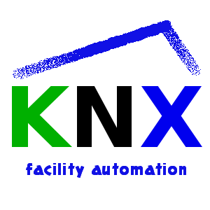

# IoBroker.knx
#### Оглавление
* [Описание](#description)
* [Требования](#требования)
* [Особенности](#features)
* [Установка](#installation)
* [Конфигурация адаптера](#adapter-configuration)
* [Установите лицензию](#install-the-license)
* [Интерфейс конфигурации](#configuration-interface)
* [Объекты](#objects)
* [Использование](#использование)
* [Типы точек данных (DPT)](#data-point-types-dpt)
* [Как работает импорт](#how-the-import-works)
* [Избегание проблем](#избегание-проблем)
* [GA-Tool](#ga-tool)
* [Прямая связь между состоянием без KNX и состоянием с KNX и наоборот](#direct-link-non-knx-state-to-knx-vice-verse)
* [Запланированные функции](#planned-features)
* [Список изменений](#changelog)

## Описание
Этот адаптер позволяет импортировать файлы `knxproj` из ETS. Он генерирует преобразование между адресами KNX-групп и ioBroker и помещает устройства в комнаты (особенно для MobileUI).

ru: [Установка и базовая настройка адаптера](docs/ru/README.md)

Он подключается к стандартным шлюзам KNX/LAN.

**Внимание: в связи с переходом на KNX-адаптер версии 2.x, условия лицензирования изменились. Новую лицензию можно получить по адресу [https://iobroker.net](https://iobroker.net/)**

**Также вам следует обновить js-контроллер и административную панель iobroker до последних версий.**

Перед началом работы: В вашем проекте ETS необходимо настроить каждый DPT для com.Objects. Каждое устройство должно быть отсортировано в соответствии со структурой вашего объекта.

## Требования
* Версия Node >= 24.0.0
* Версия администратора >= 5.2.0
* Версия js-контроллера >= 3.3.20

Без выполнения этого требования адаптер невозможно установить или он будет работать некорректно.

## Функции
* импорт файла `knxproj`
* Создание структуры объекта, подобной ETS
* Поиск и объединение канала действия и канала состояния (эвристика)
* Обновление всех состояний при запуске
* не требуется облачные сервисы или интернет.
* Выполнение операции чтения (READ) в шине KNX при одновременной записи в объект состояния.
* Редактируйте и изменяйте объекты GA с помощью GA-Tools
* Редактирование и изменение связей между штатами и актами с помощью GA-Tools
* НОВОЕ: разрешить прямую связь с использованием не-KNX State (и наоборот)
* НОВОЕ: адаптер отвечает на запрос GroupValueRead в объекте, подключенном через directLink.
* НОВОЕ: импорт файлов проекта, защищенных паролем (благодаря aKzenT)
* НОВИНКА: Адаптивный дизайн административного интерфейса (materialize)

###Установка
Этот адаптер можно установить только с помощью npm. Установка через GitHub **не** работает.

##Конфигурация адаптера
После установки этого адаптера откройте его конфигурацию.

###Установите лицензию
Первый шаг — применение лицензии. Если лицензия не установлена, то применяется 500 точек данных.

* (1) показывает ваш идентификатор системы, он необходим для получения лицензии.
* (2) нажмите здесь, чтобы подать заявку на лицензию

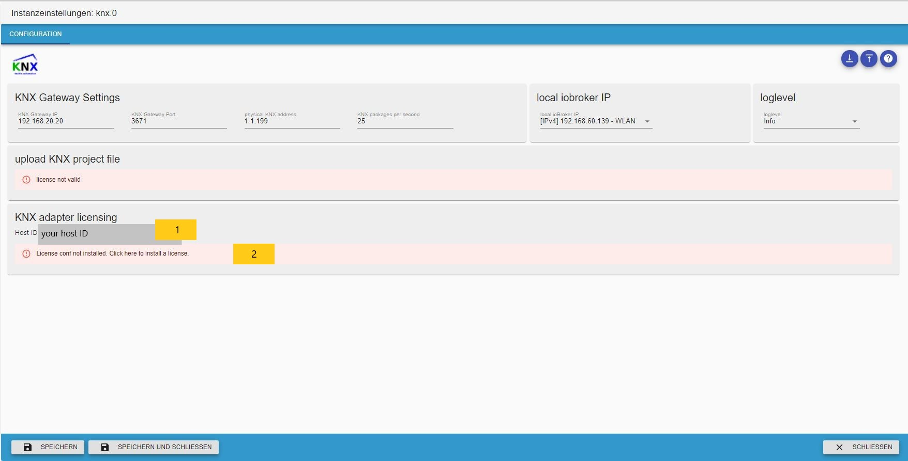

Если вы уже создали новую лицензию в соответствии с [https://iobroker.net](https://iobroker.net/), то вы можете вставить ее в (2), ИЛИ вы можете получить ее напрямую онлайн, нажав на (1)

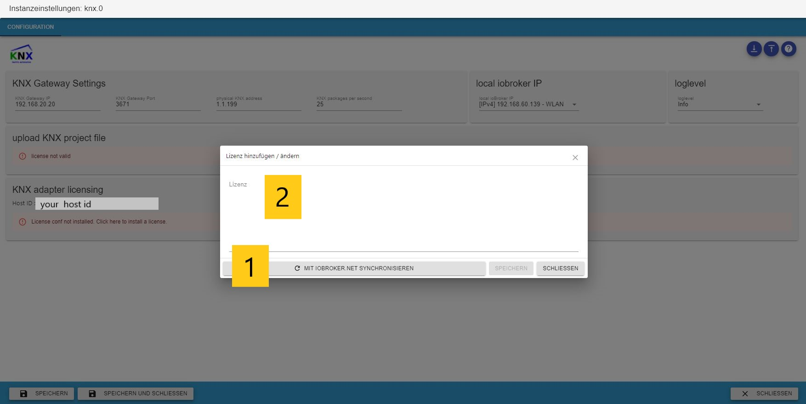

Если вы нажали на (1), введите данные для входа в свою учетную запись iobroker.net.

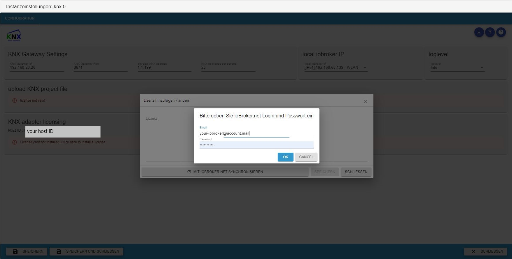

Если ваши данные верны, вы увидите все полученные вами лицензии. Выберите ту, которую хотите использовать.

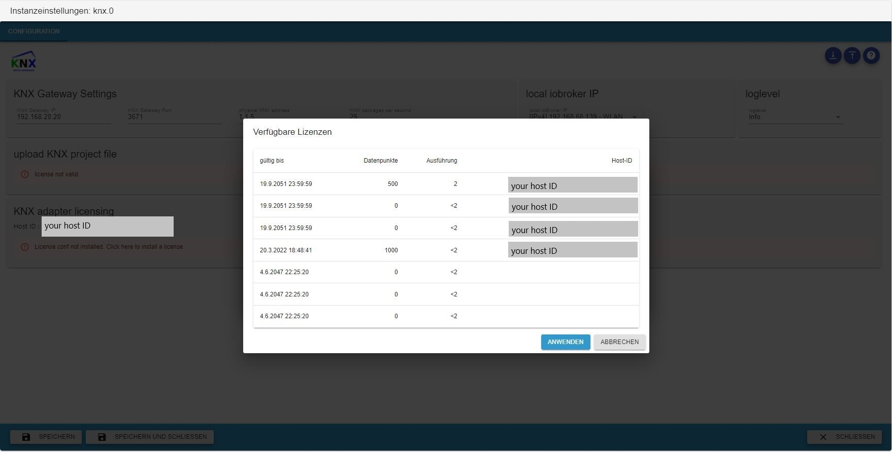

Если это сработало, сохраните это.

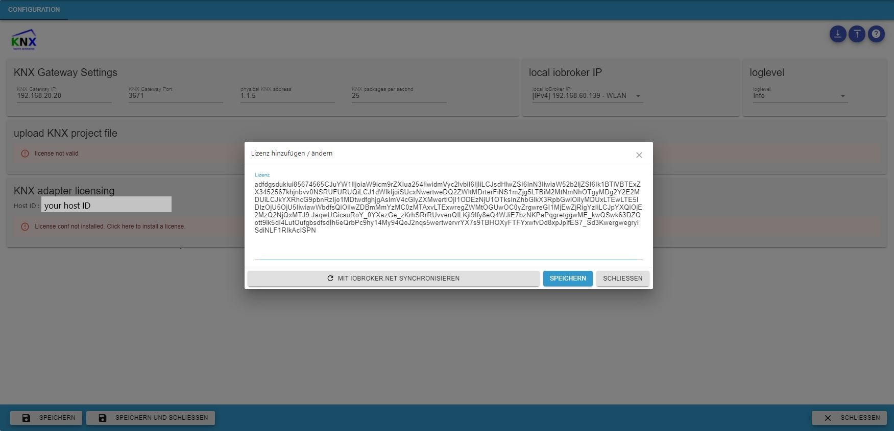

Вот и всё. Нажмите на кнопку сохранения внизу этой страницы.

### Интерфейс конфигурации
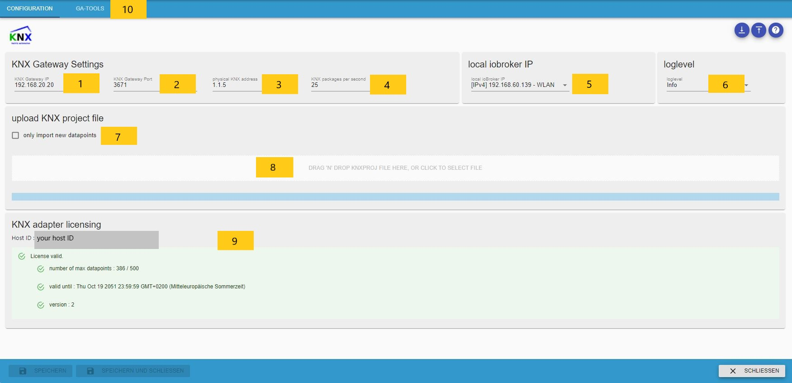

1. IP-адрес шлюза KNX: IPv4 шлюза KNX-LAN.
2. Порт KNX-шлюза: по умолчанию используется порт 3671.
3. Физический адрес: Физический адрес экземпляра iobroker knx. **Важно: это не физический адрес локальной сети.**

Шлюз!** и не может заканчиваться на 0

4. Количество пакетов KNX в секунду: это ограничивает скорость передачи пакетов. Если шлюз KNX Lan Gateway слишком часто переподключается или временно недоступен, это может привести к проблемам.

Если это доступно, то снизьте эту ставку.

5. Локальный IP-адрес iobroker: выберите IP-адрес/интерфейс, к которому будет привязан адаптер.
6. Уровень логирования: обычно это уровень «Информация», для отладки повышайте уровень.
7. Импортировать только новые точки данных: эта функция включена по умолчанию. В случае её отключения будут созданы новые GA-файлы И

Существующие GA будут созданы заново.

8. Кнопка загрузки файла: здесь доступна функция перетаскивания или при нажатии на диалоговое окно выбора файла. Здесь вы можете загрузить свой ETS.

Экспорт в формате `knxproj`.
После успешного импорта появится диалоговое окно с указанием количества импортированных объектов. Теперь нажмите «Сохранить и закрыть», и адаптер должен запуститься.
Во время запуска адаптер считывает все групповые адреса с флагами чтения и записи. Это может занять некоторое время и создать высокую нагрузку на вашу KNX-шину. Но значения в вашем vis обновляются после запуска.
Загрузка файла, защищенного паролем, пока недоступна.

9. Host-ID: это специальный идентификатор хоста iobroker. Этот идентификатор необходим для генерации и проверки лицензии.
10. GA-Tools: набор инструментов для быстро меняющихся общих алгоритмов.

### Объекты
Здесь, в папке knx.0, находится дерево групповых адресов, как в вашем проекте ETS. Для изменения свойств используйте GA-Tool.

### Использование
Если адаптер запустится успешно, ваши данные будут доступны для всего, что вы захотите сделать.

### Типы точек данных (DPT)
Все типы данных (DPT) в соответствии с разделом «Системные спецификации, взаимодействие, типы данных» от KNX Association доступны. Это означает, что вы можете получить два типа информации:

1) значение или строка 2) значения, разделенные запятыми, или массив значений (пока я не знаю, какой способ лучше использовать)

Например, DPT5.001 кодируется как беззнаковое целое число с 8 битами. Это дает одно значение. DPT3.007 (управление затемнением) кодируется как 1 бит (логическое значение) + 3 бита (беззнаковое целое число).
В результате получается, например, значение типа "0,5", где "0" означает "уменьшение", а "5" — количество интервалов.

### Как работает импорт
1. Чтение всех ссылок на объекты коммуникации (COR):

объединение идентификатора groupadressreference ID'd с DPT соответствующего COR (если существует).

2. Генерация структуры группового адреса (GAS):

Формирование GAS на основе идентификаторов GAR и установка DPT (если это еще не сделано).

3. Установление факта, касающегося данного акта, включает в себя:

В ets-exports отсутствует информация об адресах штатов и актов. Адаптер анализирует все GA типа «status» или «state».
Если есть два GA с уровнем сходства более 90%, то один адрес будет актором, а другой — штатом. Также проверяется сходство DPT. Поэтому найти пару непросто, если именование GA не согласовано.

4. Проверка флага в конфигурации устройства:

Обработка флагов осуществляется следующим образом:

| KNX | KNX | KNX | ioBroker | ioBroker | |
       |-------|-------|----------|----------|----------|----------------------------------------------------------|
| Читать | Записывать | Передавать | Читать | Записывать | Объяснение |
| - | - | - | - | - | значение будет обновлено функцией GroupValueRead |
| x | - | - | x | x | Отправка любого значения в этом состоянии запускает GroupValueRead |
| - | x | - | - | x | Записать значение в KNX с помощью GroupValueWrite |
| - | - | x | x | - | значение состояния будет обновлено функцией GroupValueResponse |
| x | - | x | x | x | Отправка любого значения в этом состоянии запускает GroupValueRead |

6. Создание узлов-партнеров данных (DPP):

Если GA, GAR и DPT действительны, будет создан DPP. Это те DPP, с которыми работает адаптер.
Если DPT отсутствует в GA, потому что его не удалось найти, то DPP не будет создан. Это можно сделать с помощью GA-Tool.

7. В начале работы адаптера:

Все данные GA, отмеченные флагом «Прочитано», проверяются в начале. Это может повлиять на увеличение автобусного потока. В конце все данные в системе актуальны.

### Предотвращение проблем
* Чистое программирование ETS, и что еще важнее, чистое программирование ETS, и самое главное, чистое программирование ETS.
* Назначьте DPT!!
* единая маркировка названий GA (например, «EG Wohnen Decke Licht schalten» и «EG Wohnen Decke Licht schalten status»)
* Избегайте использования специальных символов ",./;&%$§[]" (это может вызвать проблемы с образованием газа)
* Проверьте, доступен ли шлюз KNX/LAN. Если нет, адаптер будет постоянно пытаться подключиться.
* Правильно выберите физический адрес (важно при использовании линейных соединителей). !!! ВНИМАНИЕ: введенный физический адрес

Это НЕ адрес шлюза локальной сети, и он не должен заканчиваться на 0!!!

* Порт интерфейса локальной сети обычно равен 3671.
* В связи с возможностью запроса статуса необходимо отметить следующее: следует убедиться, что количество запросов не превышает 40 в день.

Вторые генерируются ioBroker, поскольку их можно физически сгенерировать, и они больше не могут быть переданы шлюзу адаптером.

## GA-Tool
Инструмент GA-Tool позволяет легко изменять свойства генетических алгоритмов.

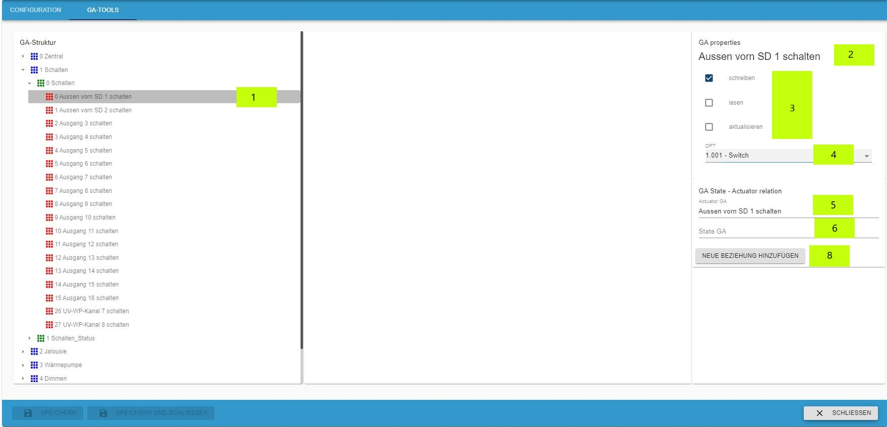

1. Отображает дерево генетических алгоритмов и выбранный генетический алгоритм.
2. В разделе свойств укажите название выбранного GA.
3. Установите флаги iobroker.
4. установить GA DPT
5. признанный акт GA
6. признанное государство GA

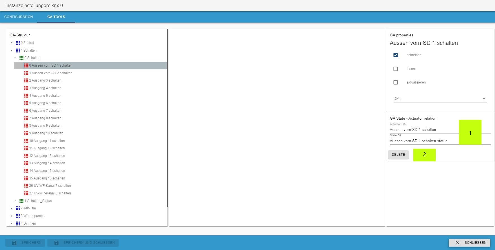

1. Покажите взаимосвязь между государством и законом.
2. Если связь существует, то её можно устранить.

Если связь отсутствует, то можно создать новую, нажав (2) для выбранного GA (1).
В диалоговом окне (3) можно выбрать партнера.

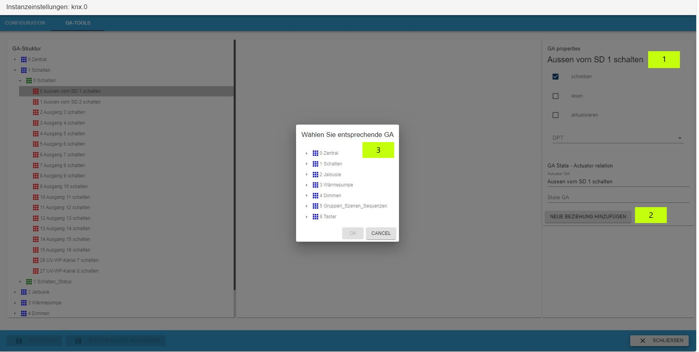

Если нужно изменить свойства нескольких GA, используйте множественный выбор. Эта функция работает только для GA, не имеющих отношения к данным.

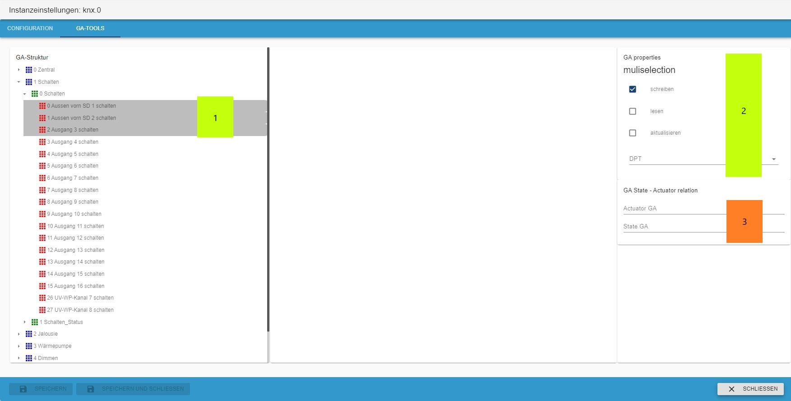

1. выбранные GA
2. свойства, которые нужно изменить
3. Изменения невозможны.

### Прямая связь между состоянием без KNX и состоянием с KNX и наоборот
Начиная с версии адаптера 2.0.6, появилась возможность напрямую связывать состояние ioBroker, не относящегося к KNX, с GA. Это можно использовать для передачи времени, даты, любых состояний или информации в KNX. (Небольшая подсказка: вы можете напрямую связать любой из ваших IoT-компонентов с GA в KNX (например, связать кнопку Homematic с KNX GA или датчик кнопки KNX с вашим проигрывателем Sonos)). Состояния можно считывать с помощью GroupValueRead, и если состояние изменяется, оно автоматически обновляется в KNX. Кроме того, если вы измените состояние в KNX, оно обновит связанное IoT-устройство, не относящееся к KNX.

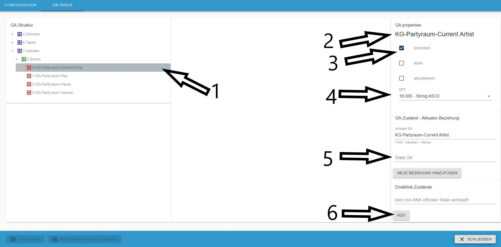

1. Выберите GA для подключения.
2. Отобразить выбранный GA
3. Данный GA должен иметь атрибут **write**.
4. Выберите допустимый тип данных (если они не совпадают, это не сработает).
5. Не допускается наличие отношения «действие-состояние».
6. Кнопка для выбора объекта, не относящегося к KNX, для связи.

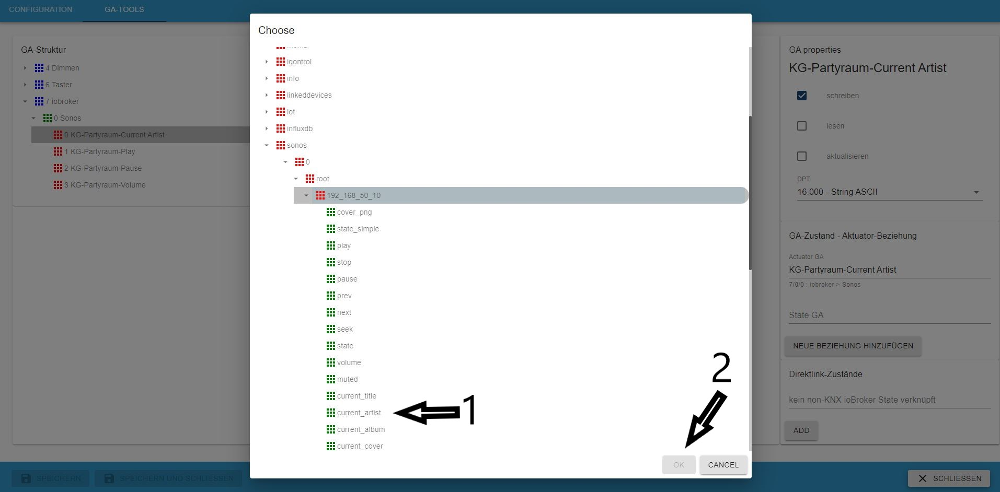

1. Выберите объект, не относящийся к KNX, который вы хотите связать.
2. Нажмите ОК, если закончили.

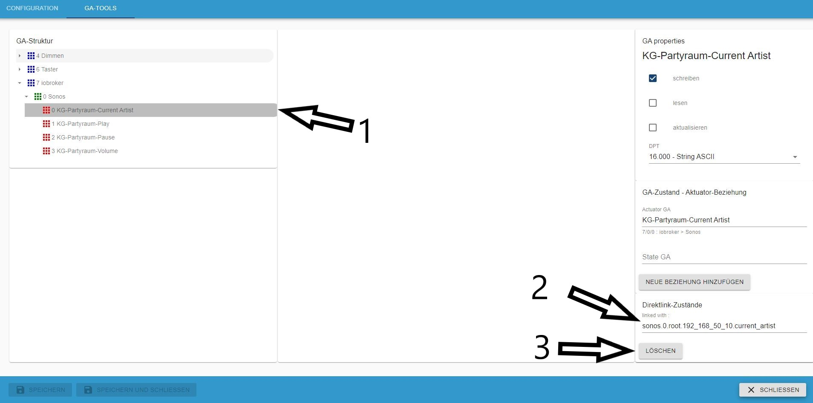

Теперь KNX-GA **(1)** напрямую связан с iobroker, не использующим KNX **(2)**. С помощью **(3)** вы можете удалить эту связь.

## Запланированные функции
* esf-import
* Инструмент мониторинга шины GA-Mon

<!-- Заполнитель для следующей версии (в начале строки):

### **РАБОТА В ПРОЦЕССЕ** -->
## Исключения и ошибки
**Этот адаптер использует библиотеки Sentry для автоматического сообщения разработчикам об исключениях и ошибках в коде.** Для получения более подробной информации и сведений о том, как отключить отправку сообщений об ошибках, см. [Документация по плагину Sentry](https://github.com/ioBroker/plugin-sentry#plugin-sentry)! Отправка сообщений Sentry используется начиная с js-controller 3.0.

Разработчик не может получить дополнительную информацию о системе/конфигурации/пользователе/среде. В случае отсутствия лицензии также указываются версия адаптера и идентификатор хоста.

Большое спасибо за поддержку и помощь!
* синяя лиса
* foxriver76

## Changelog

[Older changelogs can be found there](CHANGELOG_OLD.md)

### 2.0.40 (05.04.2026)

* fixed connection state response handling

### 2.0.39 (05.04.2026)

* added support for ETS 6.4.1
* bug fixing
* dependency updates

### 2.0.38 (01.03.2026)

* 0

### 2.0.37 (20.02.2026)

* dependency updates
* bug fix in adapter configuration

### 2.0.35 (05.02.2026)

* dependency updates
* bug fixing in GA-Tools
* feature enhancements in GA-Tools

### 2.0.33 (22.6.2025)

* unstable knx-connection problem solved

### 2.0.31 (22.05.2025)

* updated the adapter import schema for ETS 6.3.1
* nodejs >= 22 is required

### 2.0.30 (22.12.2024)

* fixed GUI errors, starting redesign GA-Tools

### 2.0.29 (11.12.2024)

* updated the adapter import schema for ETS 6.3.0
* nodejs >= 20 is required

### 2.0.28

* Update license related data and fix package version

### 2.0.27 (02.05.2024)

* updated the adapter import schema for ETS 6.2.2
* fixed UTF-8 error

### 2.0.26 (28.03.2024)

* updated the adapter import schema for ETS 6.2.1
* nodejs >= 18 is required

### 2.0.25 (03.03.2024)

* updated the adapter import schema for ETS 6.2.0
* small bug-fixes

### 2.0.24 (24.11.2023)

* updated the adapter import schema for ETS 6.1.1

### 2.0.23 (11.10.2023)

* corrected wrong GW Port after adapter upgrade
* allow self-defined values for min and max
* some small other fixes

### 2.0.22 (04.07.2023)

* added import specification, solved problems in GaTools

### 2.0.21 (17.06.2023)

* fixed license handling

### 2.0.20 (16.06.2023)

* fixed license handling with js-controller Version > 5

### 2.0.19 (29.05.2023)

* added ETS V6.1.0 import
* required node version >= 16.13.1

### 2.0.18 (08.04.2023)

* fixed send-delay
* small changes

### 2.0.17 (14.10.2022)

* added ETSv6.0.6 import
* major changes in Adapter Config UI
* fixed change of port settings for LAN-GW

### 2.0.16 (04.09.2022)

* added ETSv6.0.5 import

### 2.0.15 (02.06.2022)

* fixed import error with extrem large KNX catalogue files
* fixed unrecognized connection breaks

### 2.0.14 (08.04.2022)

* added ETSv6.0.4 (override 6.0.3)
* small bugfixes

### 2.0.13 (12.03.2022)

* added ETSv5.7.7 import
* fixed "unknown value" bug
* some other small fixes

### 2.0.12 (25.02.2022)

* fixed handling of undefined DP
* updated the data point types
* fix warning with incompatible DPT in future
* the biggest issue of all: I get shocked because of the war in Ukraine. My thoughts are with the people of Ukraine, I
  am infinitely sorry for what is happening to them and their country. It is an inhuman shame.
* can't fix it, but I appeal to everyone: Be neighbors and not enemies. Respect the other and do not fight yourselves.

### 2.0.11

* fixed password handling for projects from upgraded ETS

### 2.0.10

* import of ETS6.0.2 projects **ETS6.0.1 not possible**
* bugfixes

### 2.0.9

* import password protected project files
* bug fixes

### 2.0.8

* fixed bug with unackn write
* fixed bug in linkedState

### 2.0.7

* fixed bug with unable to write on KNX

### 2.0.6

* fixed problem on ETSv6 import
* many small bugfixes
* implemented GA-Tools directLink feature

### 2.0.5

* fixed problem on ETSv4 import
* corrected some messages
* corrected DPT14.x min and max range

### 2.0.4

* fixed DPT9.xxx calculation
* implemented date-and-time DPT19.00x
* fixed confusing "no license error"
* small bugfixes

### 2.0.3 (2021-12-04)

* fixed counting 1st Datapoint
* automaticly remove old V1 license", preventing confusion after upgrade from V1 to V2

### 2.0.1

* fixed problem with license acceptance

### 2.0.0 (2021-11-15) **Major release**

* Breaking change! => new license is neccessary V1 Licenses will not work => V1 business Licenses can changed to V2
* complete refactoring of knx-admin
* added Tool for handling GA in knx-admin
* fixed many bugs (in knx-stack, on importing ETS Projects, reconnect and timeouts)
* added new datapoint types
* added import till ETS V6
* changed license management

### 1.0.46 (2021-03-23)

* New admin GUI

### 1.0.45 (2021_03_22)

* import of ETS v5.7.5 projects

### 1.0.44 (2021_01_22)

* fixed act and state handling
* added some new datapoint types
* fix facility and room recognition and device allocation

### 1.0.42 (2020_09_03)

* Fixed problem with missing index_m.html

### 1.0.41

* fixed bug on GroupValue_Response event
* corrected connection to Gira GW

### 1.0.40

* fixed some import errors for ETS 5.7.x
* fixed bug on GroupValue_Response event

### 1.0.39

* fixed import error

### 1.0.38

* fixed some bugs on import
* show warning if import-file is password protected

### 1.0.37 (2010-01-31)

* update for ETS 5.7.3 import

### 1.0.36 (2019-10-16)

* some bugs fixed

### 1.0.35 (2019-09-15)

* fixed permanent reconnects, if no traffic on knx-bus

### 1.0.34 (2019-09-15)

* changes on importer for detecting project-id

### 1.0.33 (2019-09-12)

* fixed bug while writing to bus
* added units to states
* fixed "read/write of undefined" error

### 1.0.32 (2019-09-03)

* updated importer for ETS V5.7.2, some changes in KNX-stack state-machine

### 1.0.31

* some fixes on ETS5.7.2 importer
* small changes in knx-stack statemachine
* added (again) phys address to admin config dialog
* fixed bug in deviceTree generation

### 1.0.30

* new Importer for ETS5.7.2 knxproj files
* extended accepted Data point types
* new adapter configuration menu
* implemented a switch for the user to decide to use "true" and "false" or "0" or "1" for binary values
* fixed bug in GroupValue_Read
* implemented a selector for local network interface for KNX to Gateway communication
* extended State Object for later features
* fixed some small other bugs

### 1.0.20

* fixed bug in handling KNX-data packages, which occurs periodical reconnects
* fixed bug in KNX-project file upload procedure

### 1.0.19

* reverted to true/false handling for DPT1.x

### 1.0.18

* fixed upload issue with ETS5.6.x project files
* switched values for "boolean" from 1 and 0 to true false
* fixed recognition of role set for DPT1.x to switch
* fixed DPT16.xxx writing to KNX-Bus with values < 14Byte

### 1.0.17 (2018-08-16)

* Better state processing
* Add configurable package rate
* corrected Bug in "import only new objects"

### 1.0.15 (2018-07-18)

* change ChID on reconnect
* on Startup read wait for response of State channel or timeout

### 1.0.13 (2018-07-04)

* elimination of special signs while importing
* small bug-fixes

### 1.0.12 (2018-06-19)

* reduced and sorted log output
* small bug-fixes
* NEW Feature: request State/Val of stateObject from KNX-Bus

### 1.0.11 (2018-05-27)

* fixed DPT1 correcting value problem
* fixed reconnect problem
* other small optimizations and fixes

### 1.0.10 (2018-05-04)

* closing local port in case of undefined connection state
* added advanced debug-level via adapter-config
* many fixes

### 1.0.9 (2018-04-29)

* changed to state-wise processing
* fixed "disconnect-request"
* changed connection handling with knxd
* many small fixes

### 1.0.8 (2018-04-04)

* modified package queue
* fixed ACK if sending to KNX-Bus
* many small fixes

### 1.0.7 (2018-03-16)

* fixed Adapter-lock while uploading projects

### 1.0.6 (2018-03-11)

* fixed connection problem
* corrected package counter

### 1.0.5 (2018-03-01)

* fixed empty objects, related to DPT1 (error message \[object Object\] unknown Input value)
* fixed path variable
* fixed bug with GA's containing a "/" in the name (on proj-import)
* start implementing crosswise property update on corresponding DPT (on proj-import)

### 1.0.4 (2018-02-27)

* schema update for room enumeration coming up with ETS 5.6

### 1.0.2 (2018-02-27)

* kleine Fehler beseitigt

### 1.0.1 (2018-02-26)

* fixed certificate error

### 1.0.0 (2018-02-25)

* substitution of used KNX-stack with own from scratch build stack
* implemented full scale of DPT according to "System Specifications, Interworking, Datapointtypes" from KNX Association
* hardening connection handling for tunneling connections
* upgrade Adapter-configuration Interface to be ready with Admin3
* removed "Delay Slider" because of the new knx-stack
* many other small changes
* fixed post-comma values to scale-value of DPT
* implemented "add" mode for knx project upload (existing Objects stay as they are, only new Objects where added)

### 0.8.6 (2017-06-17)

* some small bug-fixes
* insert slider to set a sendDelay for slow KNX/LAN Gateways to prevent connection loss

### 0.8.5 (2017-06-05)

* project loader rebuild, dpt13-fix

### 0.8.3 (2017-04-24)

* added act channel update of corresponding state
* fix bug in state-vis update
* optimized knxproj upload

### 0.8.2 (2017-02-26)

* implemented device-config parsing from knxproj
* better choice of state/val of DP objects

### 0.8.1 (2017-02-06)

* fixed DPT1 switch problem

### 0.8.0 (2017-02-xx) comming soon

### 0.7.3 (2016-12-22)

* (chefkoch009) more DPT's are supported
* faster Startup
* implemented generation of room list with device dependencies

### 0.7.2 (2016-11-20)

* (chefkoch009) added necessary dependencies

### 0.7.1 (2016-11-19)

* (chefkoch009) Support standard KNX/LAN Gateways.

### 0.7.0 (2016-10-13)

* (chefkoch009) Support of project export

### 0.6.0 (2016-07-20)

* (chefkoch009) redesign

### 0.5.0

* (vegetto) include vis widget

#### 0.4.0

* (bluefox) fix errors with grunt

#### 0.2.0

* (bluefox) initial release

## License

For less than 500 data points, there is no need for registration or adding a license key.
If you have more than 500 data points, you need a license.
You can choose between yearly and permanent license.

To use this adapter in ioBroker, you need to accept the source code license of the adapter.
The source code of this adapter is available under the CC-NC-BY license.

Additionally, you need a license to use the adapter. The license editions are available
on [https://iobroker.net/www/pricing](https://iobroker.net/www/pricing)

## License

The CC-NC-BY License (CC-NC-BY)

Copyright (c) 2016-2026 K.Ringmann info@punktnetzwerk.net

THE WORK IS PROVIDED UNDER THE TERMS OF THIS CREATIVE
COMMONS PUBLIC LICENSE ("CCPL" OR "LICENSE"). THE WORK IS PROTECTED BY
COPYRIGHT AND/OR OTHER APPLICABLE LAW. ANY USE OF THE WORK OTHER THAN AS
AUTHORIZED UNDER THIS LICENSE OR COPYRIGHT LAW IS PROHIBITED.

BY EXERCISING ANY RIGHTS TO THE WORK PROVIDED HERE, YOU ACCEPT AND AGREE
TO BE BOUND BY THE TERMS OF THIS LICENSE. TO THE EXTENT THIS LICENSE MAY
BE CONSIDERED TO BE A CONTRACT, THE LICENSOR GRANTS YOU THE RIGHTS
CONTAINED HERE IN CONSIDERATION OF YOUR ACCEPTANCE OF SUCH TERMS AND
CONDITIONS.

Read full license text in [LICENSE](LICENSE)