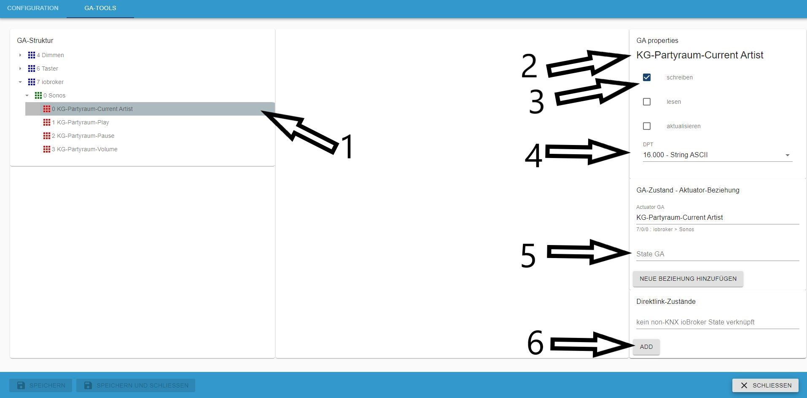

# IoBroker.knx
#### Содержание
* [Описание](#description)
* [Требования](#требования)
* [Особенности](#особенности)
* [Установка](#установка)
* [Конфигурация адаптера](#adapter-configuration)
* [Установить лицензию](#install-the-license)
* [Интерфейс конфигурации](#configuration-interface)
* [Объекты](#объекты)
* [Использование](#использование)
* [Типы точек данных (DPT)](#data-point-types-dpt)
* [Как работает импорт](#how-the-import-works)
* [Избегание проблем](#избегание-проблем)
* [GA-Tool](#ga-tool)
* [Прямая связь между состоянием, отличным от KNX, и состоянием KNX наоборот](#direct-link-non-knx-state-to-knx-vice-verse)
* [Планируемые функции](#planned-features)
* [Журнал изменений](#журнал изменений)

## Описание
ru: Этот адаптер позволяет импортировать файлы `knxproj` из ETS. Он генерирует преобразование между адресами группы KNX и ioBroker и распределяет устройства по комнатам (особенно для MobileUI).

ru: [Установка и базовая настройка адаптера](docs/ru/README.md)

Подключается к стандартным шлюзам KNX/LAN.

**Внимание: с переходом на KNX-адаптер версии 2.x условия лицензирования изменились. Вы можете получить новую лицензию по адресу [https://iobroker.net](https://iobroker.net/)**

**Вам также следует обновить iobroker js-controller и admin до последней версии.**

Перед началом работы: каждый DPT com.Objects должен быть настроен в вашем проекте ETS. Каждое устройство должно быть отсортировано в вашей структуре объекта.

## Требования
* Версия узла >= 14.15.4
* Версия администратора >= 5.2.0
* Версия js-контроллера >=3.3.20

Без этого требования адаптер не сможет быть установлен или будет работать неправильно.

## Функции
* импорт файла `knxproj`
* создание структуры объекта, подобной ETS
* поиск и объединение каналов действия и состояний (эвристика)
* обновление всех состояний при запуске
* не требуется облако или интернет
* отправка READ в шину KNX при записи в объект состояния
* редактировать и изменять объекты GA с помощью GA-Tools
* редактировать и изменять отношения между государством и законом с помощью GA-Tools
* НОВОЕ: разрешить прямую ссылку не-KNX State (наоборот)
* НОВОЕ: адаптер отвечает на GroupValueRead на объект, подключенный по прямой ссылке
* НОВОЕ: импорт файлов проекта, защищенных паролем (благодаря aKzenT)

###Установка
Этот адаптер можно установить только с помощью npm. Установка через GitHub **не** работает.

##Конфигурация адаптера
После установки данного адаптера откройте конфигурацию адаптера.

###Установить лицензию
Первый шаг — применение лицензии. Если у вас ещё нет лицензии, будут применены 500 точек данных.

* (1) показывает ваш системный ID, он необходим для получения лицензии.
* (2) нажмите здесь, чтобы применить свою лицензию

Если вы уже создали новую лицензию в соответствии с [https://iobroker.net](https://iobroker.net/), то вы можете вставить ее в (2) ИЛИ вы можете приобрести ее непосредственно в Интернете, нажав на (1)

Если вы нажали (1), введите логин своей учетной записи iobroker.net.

Если ваши данные верны, вы увидите все свои лицензии. Выберите ту, которую хотите использовать.

Если все прошло успешно, сохраните.

Вот и всё. Нажмите на кнопку «Сохранить» внизу страницы.

### Интерфейс конфигурации

1. IP-адрес шлюза KNX: IPv4 шлюза KNX-LAN.
2. Порт шлюза KNX: по умолчанию — порт 3671.
3. Физический адрес: Физический адрес экземпляра iobroker knx. **Важно: это не физический адрес шлюза локальной сети!** И не может заканчиваться на 0.
4. Количество пакетов KNX в секунду: ограничивает скорость передачи пакетов. Если шлюз локальной сети KNX слишком часто переподключается или временно недоступен, уменьшите эту скорость.
5. локальный IP-адрес iobroker: выберите IP-адрес/интерфейс, к которому будет привязан адаптер.
6. loglevel: обычно это уровень «Информация», для отладки увеличьте уровень.
7. Импортировать только новые точки данных: эта опция включена по умолчанию. При отключении будут созданы новые GA, а существующие — пересозданы.
8. Кнопка загрузки файла: перетаскивание доступно здесь или нажатие на диалоговое окно выбора файла. Здесь вы можете загрузить экспорт ETS в формате `knxproj`.

После успешного импорта откроется диалоговое окно с количеством импортированных объектов. Нажмите «Сохранить и закрыть», и адаптер должен запуститься.
При запуске адаптер считывает все групповые адреса с флагами чтения и записи. Это может занять некоторое время и привести к высокой нагрузке на шину KNX. Однако значения в вашем VIS обновляются после запуска.
Загрузка файла, защищённого паролем, пока недоступна.

9. Host-ID: это специальный идентификатор хоста iobroker. Этот идентификатор необходим для генерации и проверки лицензии.
10. GA-Tools: набор инструментов для быстро меняющихся GA

### Объекты
В разделе knx.0 показано дерево групповых адресов, как в вашем проекте ETS. Для изменения свойств используйте GA-Tool.

### Использование
Если адаптер запустится успешно, ваши точки данных будут доступны для любых ваших действий.

### Типы точек данных (DPT)
Доступны все DPT, соответствующие «Спецификации систем, взаимодействие, типы точек данных» Ассоциации KNX. Это означает, что можно получить два типа информации: 1) значение или строка; 2) значения, разделённые запятыми, или массив значений (пока не знаю, как лучше работать).

Например, DPT5.001 кодируется как беззнаковое целое число длиной 8 бит. Это даёт единственное значение. DPT3.007 (Управление яркостью) кодируется как 1 бит (логическое значение) + 3 бита (беззнаковое целое число).
В результате получается, например, значение вида «0,5», где «0» означает «уменьшение», а «5» — количество интервалов.

### Как работает импорт
1. чтение всех ссылок на объекты связи (COR):

объединение идентификатора groupadressreference с DPT соответствующего COR (если существует).

2. генерация структуры группового адреса (GAS):

генерация GAS на основе идентификаторов GAR и настройка DPT (если это еще не сделано)

3. нахождение государственных актов адресует:

В ets-exports нет информации об адресах состояний и действий. Адаптер анализирует все GA со статусом или состоянием. Если есть две GA со сходством более 90%, один адрес будет адресом актора, а другой — адресом состояния. Также проверяется схожесть DPT. Поэтому сложно найти пару, если имена в GA не согласованы.

4. Проверка флага в конфигурации устройства:

флаги обрабатываются следующим образом:

| KNX | KNX | KNX | ioBroker | ioBroker | |
    |-------|-------|----------|----------|----------|----------------------------------------------------------|
| Читать | Записать | Передавать | Читать | Записать | Объяснение |
| - | - | - | - | - | значение будет обновлено GroupValueRead |
| x | - | - | x | x | отправка любого значения в этом состоянии вызовет GroupValueRead |
| - | x | - | - | x | записать значение в KNX с помощью GroupValueWrite |
| - | - | x | x | - | значение состояния будет обновлено GroupValueResponse |
| x | - | x | x | x | отправка любого значения в этом состоянии вызовет GroupValueRead |

6. Создание одноранговых точек данных (DPP):

DPP будет создан, если GA, GAR и DPT корректны. Это те DPP, с которыми работает адаптер.
Если DPT отсутствует в GA, поскольку его не удалось найти, DPP не будет создан. Это можно сделать с помощью GA-Tool.

7. При запуске адаптера:

Все GA, отмеченные флагом «Чтение», проверяются при запуске. Это может повлиять на увеличение трафика на шине. В конечном итоге все состояния обновляются.

### Избегание проблем
* чистое программирование ETS и, что еще важнее, чистое программирование ETS и, что еще важнее, чистое программирование ETS
* Назначьте DPT!!
* единая маркировка названий GA (например, «EG Wohnen Decke Licht schalten» и «EG Wohnen Decke Licht schalten status»)
* Избегайте использования специальных символов ",./;&%$§[]" (могут возникнуть проблемы с генерацией газа)
* Проверьте доступность KNX/LAN GW. Если нет, адаптер постоянно пытается подключиться.
* Правильно выберите физический адрес (важно при использовании линейных соединителей). !!! ВНИМАНИЕ: введенный здесь физический адрес НЕ является адресом шлюза LAN и не должен заканчиваться на 0 !!!
* Порт интерфейса LAN обычно 3671.
* В связи с возможностью запроса статуса следует отметить следующее: необходимо гарантировать, что ioBroker генерирует не более 40 запросов в секунду, поскольку они могут быть физически сгенерированы

больше не может передаваться на шлюз адаптером.

## GA-Tool
GA-Tool позволяет легко изменять свойства GA.

1. показывает дерево GA и выбранную GA
2. в разделе свойств имя выбранного ГА
3. установить флаги iobroker
4. установить GA DPT
5. признанный акт GA
6. признанная государственная ассамблея

1. показать связь государства и акта
2. если связь существует, то ее можно удалить

Если связи нет, можно создать новую, нажав (2) для выбранной GA (1).
В диалоговом окне (3) можно выбрать одноранговое устройство.

Если нужно изменить свойства нескольких GA, используйте множественный выбор. Эта функция работает только для GA без связей.

1. выбранные ГА
2. свойства для изменения
3. нет возможности внесения изменений

### Прямая связь между состоянием, отличным от KNX, и состоянием KNX наоборот
Начиная с версии адаптера 2.0.6, можно напрямую привязать состояние ioBroker, не подключенного к KNX, к GA. Это можно использовать для применения времени, даты, любых состояний или информации к KNX. (Небольшая подсказка: вы можете напрямую привязать любой компонент IoT к GA в KNX (например, привязать кнопку Homematic к GA KNX или датчик кнопки KNX к плееру Sonos)). Состояния можно считывать с помощью GroupValueRead, и если состояние изменится, оно автоматически обновится в KNX. Кроме того, при изменении состояния в KNX обновится подключенное устройство IoT, не подключенное к KNX.

1. выберите GA для подключения
2. показать выбранную GA
3. этот GA должен иметь атрибут **write**
4. выберите допустимый тип точки данных (если они не совпадают, это не сработает)
5. не допускается наличие связи между актом и состоянием
6. кнопка выбора объекта, не являющегося KNX, для связи с ним

1. выберите не-KNX-объект, который вы хотите связать
2. Нажмите «ОК», если вы закончили.

Теперь KNX-GA **(1)** напрямую связан с не-KNX iobroker **(2)**. С помощью **(3)** эту связь можно удалить.

## Планируемые функции
* esf-импорт
* Инструмент мониторинга шины GA-Mon

<!-- Заполнитель для следующей версии (в начале строки):

### **РАБОТА В ХОДЕ** -->
## Версии
### 2.0.33 (22.6.2025)
* решена проблема нестабильного соединения KNX

### 2.0.31 (22.05.2025)
* обновлена схема импорта адаптера для ETS 6.3.1
* требуется nodejs >= 22

### 2.0.30 (22.12.2024)
* исправлены ошибки графического интерфейса, начат редизайн GA-Tools

### 2.0.29 (11.12.2024)
* обновлена схема импорта адаптера для ETS 6.3.0
* требуется nodejs >= 20

### 2.0.28
* Обновление данных, связанных с лицензией, и исправление версии пакета

### 2.0.27 (02.05.2024)
* обновлена схема импорта адаптера для ETS 6.2.2
* исправлена ошибка UTF-8

### 2.0.26 (28.03.2024)
* обновлена схема импорта адаптера для ETS 6.2.1
* требуется nodejs >= 18

### 2.0.25 (03.03.2024)
* обновлена схема импорта адаптера для ETS 6.2.0
* небольшие исправления ошибок

### 2.0.24 (24.11.2023)
* обновлена схема импорта адаптера для ETS 6.1.1

### 2.0.23 (11.10.2023)
* исправлен неправильный порт GW после обновления адаптера
* разрешить самостоятельно определять значения для минимума и максимума
* некоторые другие мелкие исправления

### 2.0.22 (04.07.2023)
* добавлена спецификация импорта, решены проблемы в GaTools

### 2.0.21 (17.06.2023)
* исправлена обработка лицензий

### 2.0.20 (16.06.2023)
* исправлена обработка лицензий с помощью js-controller версии > 5

### 2.0.19 (29.05.2023)
* добавлен импорт ETS V6.1.0
* требуемая версия узла >= 16.13.1

### 2.0.18 (08.04.2023)
* фиксированная задержка отправки
* небольшие изменения

### 2.0.17 (14.10.2022)
* добавлен импорт ETSv6.0.6
* значительные изменения в пользовательском интерфейсе конфигурации адаптера
* исправлено изменение настроек порта для LAN-GW

### 2.0.16 (04.09.2022)
* добавлен импорт ETSv6.0.5

### 2.0.15 (02.06.2022)
* исправлена ошибка импорта очень больших файлов каталога KNX
* исправлены нераспознанные разрывы соединения

### 2.0.14 (08.04.2022)
* добавлен ETSv6.0.4 (замена 6.0.3)
* небольшие исправления ошибок

### 2.0.13 (12.03.2022)
* добавлен импорт ETSv5.7.7
* исправлена ошибка «неизвестного значения»
* некоторые другие мелкие исправления

### 2.0.12 (25.02.2022)
* исправлена обработка неопределенных DP
* обновлены типы точек данных
* исправить предупреждение о несовместимости DPT в будущем
* Самая большая проблема: я в шоке от войны на Украине. Мои мысли с народом Украины, мне бесконечно жаль, что происходит с ними и их страной. Это нечеловеческий позор.
* Не могу это исправить, но я обращаюсь ко всем: будьте соседями, а не врагами. Уважайте друг друга и не воюйте друг с другом.

### 2.0.11
* исправлена обработка паролей для проектов из обновленной версии ETS

### 2.0.10
* импорт проектов ETS6.0.2 **ETS6.0.1 невозможен**
* исправления ошибок

### 2.0.9
* импорт защищенных паролем файлов проекта
* исправления ошибок

### 2.0.8
* исправлена ошибка с неподтвержденной записью
* исправлена ошибка в linkedState

### 2.0.7
* исправлена ошибка с невозможностью записи на KNX

### 2.0.6
* исправлена проблема с импортом ETSv6
* множество мелких исправлений
* реализована функция directLink в GA-Tools

### 2.0.5
* исправлена проблема с импортом ETSv4
* исправлены некоторые сообщения
* исправленный минимальный и максимальный диапазон DPT14.x

### 2.0.4
* исправлен расчет DPT9.xxx
* реализована дата и время DPT19.00x
* исправлена запутанная ошибка «нет лицензии»
* небольшие исправления ошибок

### 2.0.3 (04.12.2021)
* исправлен подсчет 1-й точки данных
* автоматически удаляет старую лицензию V1, предотвращая путаницу после обновления с V1 до V2

### 2.0.1
* исправлена проблема с принятием лицензии

### 2.0.0 (15.11.2021) **Основной релиз**
* Критическое изменение! => необходима новая лицензия. Лицензии V1 не будут работать. => Лицензии V1 для бизнеса можно заменить на V2.
* полный рефакторинг knx-admin
* добавлен инструмент для работы с GA в knx-admin
* исправлено множество ошибок (в knx-stack, при импорте проектов ETS, переподключении и тайм-аутах)
* добавлены новые типы точек данных
* добавлен импорт до ETS V6
* измененное управление лицензиями

### 1.0.46 (23.03.2021)
* Новый графический интерфейс администратора

### 1.0.45 (2021_03_22)
* импорт проектов ETS v5.7.5

### 1.0.44 (2021_01_22)
* фиксированная обработка действий и состояний
* добавлены некоторые новые типы точек данных
* исправление распознавания объектов и помещений, а также распределение устройств

### 1.0.42 (03.09.2020)
* Исправлена проблема с отсутствующим index_m.html

### 1.0.41
* исправлена ошибка в событии GroupValue_Response
* исправлено подключение к Gira GW

### 1.0.40
* исправлены некоторые ошибки импорта для ETS 5.7.x
* исправлена ошибка в событии GroupValue_Response

### 1.0.39
* исправлена ошибка импорта

### 1.0.38
* исправлены некоторые ошибки при импорте
* выводить предупреждение, если файл импорта защищен паролем

### 1.0.37 (31.01.2010)
* обновление для импорта ETS 5.7.3

### 1.0.36 (16.10.2019)
* исправлены некоторые ошибки

### 1.0.35 (15.09.2019)
* исправлены постоянные переподключения при отсутствии трафика на шине KNX

### 1.0.34 (15.09.2019)
* изменения в импортере для определения идентификатора проекта

### 1.0.33 (12.09.2019)
* исправлена ошибка при записи в шину
* добавлены единицы в штаты
* исправлена ошибка «чтение/запись неопределенного»

### 1.0.32 (03.09.2019)
* обновлен импортер для ETS V5.7.2, некоторые изменения в машине состояний KNX-стека

### 1.0.31
* некоторые исправления в импортере ETS5.7.2
* небольшие изменения в машине состояний knx-stack
* добавлен (снова) физический адрес в диалоговое окно конфигурации администратора
* исправлена ошибка в генерации deviceTree

### 1.0.30
* новый импортер для файлов ETS5.7.2 knxproj
* расширенные принятые типы точек данных
* новое меню конфигурации адаптера
* реализован переключатель, позволяющий пользователю выбрать использование «истина» и «ложь» или «0» или «1» для двоичных значений
* исправлена ошибка в GroupValue_Read
* реализован селектор локального сетевого интерфейса для связи KNX со шлюзом
* расширенный объект состояния для последующих функций
* исправлены некоторые другие мелкие ошибки

### 1.0.20
* исправлена ошибка в обработке пакетов данных KNX, приводившая к периодическим переподключениям
* исправлена ошибка в процедуре загрузки файла KNX-проекта

### 1.0.19
* возвращено к обработке true/false для DPT1.x

### 1.0.18
* исправлена проблема загрузки файлов проекта ETS5.6.x
* переключенные значения для "boolean" с 1 и 0 на true false
* исправлено распознавание набора ролей для переключения DPT1.x
* исправлена запись DPT16.xxx в шину KNX со значениями < 14 байт

### 1.0.17 (16.08.2018)
* Лучшая обработка состояний
* Добавить настраиваемую стоимость пакета
* исправлена ошибка в «импорте только новых объектов»

### 1.0.15 (18.07.2018)
* изменить ChID при повторном подключении
* при запуске чтение ожидание ответа государственного канала или тайм-аут

### 1.0.13 (04.07.2018)
* устранение особых знаков при импорте
* небольшие исправления ошибок

### 1.0.12 (19.06.2018)
* сокращенный и отсортированный вывод журнала
* небольшие исправления ошибок
* НОВАЯ функция: запрос состояния/значения объекта stateObject из шины KNX

### 1.0.11 (2018-05-27)
* исправлена проблема с корректирующим значением DPT1
* исправлена проблема повторного подключения
* другие мелкие оптимизации и исправления

### 1.0.10 (04.05.2018)
* закрытие локального порта в случае неопределенного состояния соединения
* добавлен расширенный уровень отладки через адаптер-конфигурацию
* множество исправлений

### 1.0.9 (29.04.2018)
* изменено на обработку по штатам
* исправлен «запрос на отключение»
* изменена обработка соединения с knxd
* множество мелких исправлений

### 1.0.8 (04.04.2018)
* измененная очередь пакетов
* исправлен ACK при отправке на шину KNX
* множество мелких исправлений

### 1.0.7 (16.03.2018)
* исправлена блокировка адаптера при загрузке проектов

### 1.0.6 (11.03.2018)
* исправлена проблема с подключением
* исправлен счетчик пакетов

### 1.0.5 (01.03.2018)
* исправлены пустые объекты, связанные с DPT1 (сообщение об ошибке \[object Object\] неизвестное входное значение)
* фиксированная переменная пути
* исправлена ошибка с GA, содержащими «/» в имени (при proj-import)
* начать реализацию перекрестного обновления свойств в соответствующем DPT (в proj-import)

### 1.0.4 (2018-02-27)
* обновление схемы для перечисления комнат, ожидаемое в ETS 5.6

### 1.0.2 (2018-02-27)
* kleine Fehler beseitigt

### 1.0.1 (2018-02-26)
* исправлена ошибка сертификата

### 1.0.0 (2018-02-25)
* замена используемого KNX-стека на собственный, созданный с нуля стек
* реализован полный масштаб DPT в соответствии с «Спецификациями системы, взаимодействием, типами точек данных» Ассоциации KNX
* упрочнение обработки соединений при туннелировании
* обновить интерфейс конфигурации адаптера для работы с Admin3
* удален «Delay Slider» из-за нового стека knx
* много других мелких изменений
* исправлены значения послезапятой в соответствии со значением шкалы DPT
* реализован режим «добавления» для загрузки проекта KNX (существующие объекты остаются как есть, добавляются только новые объекты)

### 0.8.6 (17.06.2017)
* исправлены некоторые мелкие ошибки
* вставьте ползунок, чтобы установить sendDelay для медленных шлюзов KNX/LAN, чтобы предотвратить потерю соединения

### 0.8.5 (05.06.2017)
* пересборка загрузчика проекта, dpt13-fix

### 0.8.3 (2017-04-24)
* добавлено обновление канала действия соответствующего состояния
* исправлена ошибка в обновлении State-Vis
* оптимизированная загрузка knxproj

### 0.8.2 (2017-02-26)
* реализован анализ конфигурации устройства из knxproj
* лучший выбор состояния/значения объектов DP

### 0.8.1 (06.02.2017)
* исправлена проблема с переключателем DPT1

### 0.8.0 (2017-02-xx) скоро выйдет
### 0.7.3 (2016-12-22)
* (chefkoch009) поддерживается больше DPT
* более быстрый запуск
* реализована генерация списка комнат с учетом зависимостей устройств

### 0.7.2 (2016-11-20)
* (chefkoch009) добавлены необходимые зависимости

### 0.7.1 (19.11.2016)
* (chefkoch009) Поддержка стандартных шлюзов KNX/LAN.

### 0.7.0 (13.10.2016)
* (chefkoch009) Поддержка экспорта проекта

### 0.6.0 (2016-07-20)
* (chefkoch009) редизайн

### 0.5.0
* (vegetto) включить виджет vis

#### 0.4.0
* (bluefox) исправить ошибки с grunt

#### 0.2.0
* (bluefox) первоначальный выпуск

## Исключения и ошибки
**Этот адаптер использует библиотеки Sentry для автоматического сообщения разработчикам об исключениях и ошибках кода.** Подробнее об отключении отчётов об ошибках см. в разделе [Документация по плагину Sentry](https://github.com/ioBroker/plugin-sentry#plugin-sentry)! Отчёты Sentry используются, начиная с версии js-controller 3.0.

Разработчик не может получить дополнительную специальную информацию о системе/конфигурации/пользователе/среде. Если лицензия не найдена, также сообщается версия адаптера и идентификатор хоста.

## Большое спасибо за поддержку и помощь
* голубой лис
* foxriver76

## License

For less than 500 data points, there is no need for registration or adding a license key.
If you have more than 500 data points, you need a license.
You can choose between yearly and permanent license.

To use this adapter in ioBroker, you need to accept the source code license of the adapter.
The source code of this adapter is available under the CC-NC-BY license.

Additionally, you need a license to use the adapter. The license editions are available on [https://iobroker.net/www/pricing](https://iobroker.net/www/pricing)

## License
The CC-NC-BY License (CC-NC-BY)

Copyright (c) 2016-2024 K.Ringmann <info@punktnetzwerk.net>

THE WORK IS PROVIDED UNDER THE TERMS OF THIS CREATIVE
COMMONS PUBLIC LICENSE ("CCPL" OR "LICENSE"). THE WORK IS PROTECTED BY
COPYRIGHT AND/OR OTHER APPLICABLE LAW. ANY USE OF THE WORK OTHER THAN AS
AUTHORIZED UNDER THIS LICENSE OR COPYRIGHT LAW IS PROHIBITED.

BY EXERCISING ANY RIGHTS TO THE WORK PROVIDED HERE, YOU ACCEPT AND AGREE
TO BE BOUND BY THE TERMS OF THIS LICENSE. TO THE EXTENT THIS LICENSE MAY
BE CONSIDERED TO BE A CONTRACT, THE LICENSOR GRANTS YOU THE RIGHTS
CONTAINED HERE IN CONSIDERATION OF YOUR ACCEPTANCE OF SUCH TERMS AND
CONDITIONS.

Read full license text in [LICENSE](LICENSE)