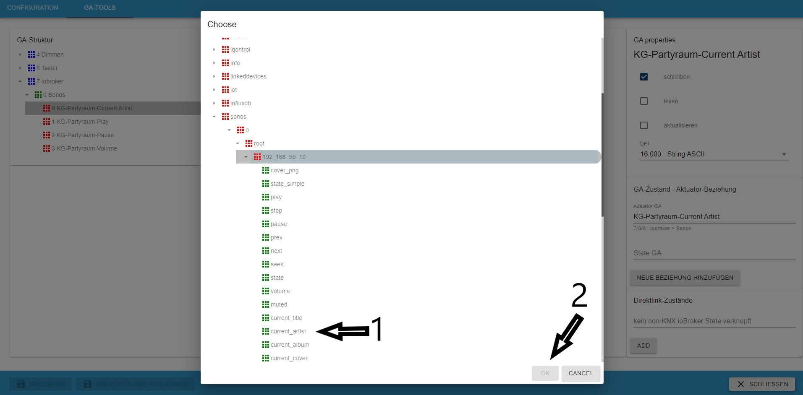

# IoBroker.knx
#### Содержание
* [Описание](#описание)
* [Требования](#требования)
* [Функции](#функции)
* [Конфигурация адаптера](#adapter-configuration)
    * [Установить лицензию](#install-the-license)
    * [Интерфейс конфигурации](#configuration-interface)
    * [Объекты](#объекты)
    * [Использование](#использование)
    * [Типы точек данных (DPT)](#data-point-types-dpt)
    * [Как работает импорт](#how-the-import-works)
    * [Избежание проблем](#предотвращение проблем)
* [GA-Tool](#ga-tool)
    * [Прямая ссылка не-KNX-состояния на KNX наоборот] (#direct-link-non-knx-state-to-knx-vice-verse)
* [Запланированные функции](#planned-features)
* [Журнал изменений](#журнал изменений)

## Описание
ru: Этот адаптер позволяет импортировать файлы knxproj из ETS. Он генерирует трансляцию между адресами KNX-group и ioBroker и помещает устройства в комнаты (особенно для MobileUI).

ру: [Установка и базовая настройка адаптера](docs/ru/README.md)

Он подключается к стандартным шлюзам KNX/LAN.

**Внимание: с переходом на KNX-Adapter Version 2.x изменилось лицензирование. Вы можете получить новую лицензию в [https://iobroker.net](https://iobroker.net/)**.

** Вам также следует обновить iobroker js-controller AND admin до последней версии. **

Перед началом: Каждый DPT com.Objects должен быть установлен в вашем проекте ETS. Каждое устройство должно быть отсортировано в структуре вашего объекта.

## Требования
* Версия узла >= 14.15.4
* Версия администратора >= 5.2.0
* Версия js-контроллера >=3.3.20

Без этого требования адаптер не может быть установлен или будет работать некорректно.

## Функции
* импорт файла `knxproj`
* создание ETS-подобной структуры объекта
* нахождение и объединение каналов действий и каналов состояний (эвристика)
* обновление всех состояний при запуске
* не требуется облако или интернет
* выдача READ на шину KNX при записи в объект состояния
* редактировать и изменять объекты GA с помощью GA-Tools
* редактировать и изменять отношения состояния и акта с помощью GA-Tools
* НОВИНКА: разрешить прямую связь без KNX State (наоборот)
* НОВОЕ: ответы адаптера на GroupValueRead для объекта, подключенного к DirectLink
* NEW: импорт защищенных паролем файлов проекта (спасибо aKzenT)

##Конфигурация адаптера
После установки этого адаптера откройте конфигурацию адаптера.

###Установить лицензию
Первым шагом является применение лицензии. Если вы не установили лицензию, применяется 500 Datapoints.

* (1) показывает идентификатор вашей системы, он нужен для получения лицензии
* (2) нажмите здесь, чтобы применить лицензию

Если вы уже создали новую лицензию в соответствии с [https://iobroker.net](https://iobroker.net/), вы можете вставить ее в (2), ИЛИ вы можете получить ее непосредственно в Интернете, нажав на (1)

Если вы нажали (1), введите логин своей учетной записи iobroker.net.

Если ваши данные были правильными, вы увидите все ваши лицензии, которые вы получили. Выберите тот, который вы хотите использовать.

Если это было успешно, сохраните его.

Это все. Нажмите на кнопку, чтобы сохранить внизу этой страницы.

### Интерфейс конфигурации

1. IP-адрес шлюза KNX: IPv4 шлюза KNX-LAN.
2. Порт KNX-Gateway: по умолчанию используется порт 3671.
3. физический адрес: физический адрес экземпляра iobroker knx **! важно: это не физ. адрес шлюза LAN !** и не может заканчиваться на 0
4. Пакетов KNX в секунду: ограничивает скорость передачи пакетов. Если KNX Lan Gateway часто повторно подключается или временно недоступен, уменьшите эту скорость.
5. локальный IP-адрес iobroker: выберите IP-адрес/интерфейс, к которому будет привязан адаптер.
6. loglevel: обычно это уровень «Информация», для отладки увеличьте уровень.
7. импортировать только новые точки данных: это включено по умолчанию. В случае отключения будут сгенерированы новые GA, а существующие GA будут воссозданы.
8. кнопка загрузки файла: перетаскивание доступно здесь или при щелчке в диалоговом окне выбора файла. Здесь вы можете загрузить свой экспорт ETS в формате knxproj.

После успешного импорта диалог показывает количество импортированных объектов. Теперь нажмите «сохранить и закрыть», и адаптер должен запуститься.
При запуске адаптер считывает все групповые адреса с флагами чтения и записи. Это может занять некоторое время и может привести к высокой нагрузке на шину KNX. Но значения в вашем висе обновляются после запуска.
Загрузка файла, защищенного паролем, пока недоступна.

9. Host-ID: это специальный идентификатор хоста iobroker. Этот идентификатор необходим для создания и проверки лицензии.
10. GA-Tools: набор инструментов для быстрого изменения GA

### Объекты
Вот под knx.0 дерево групповых адресов, как в вашем проекте ETS. Для изменения свойств используйте GA-Tool.

### Использование
Если адаптер запустится успешно, ваши точки данных будут доступны для всего, что вам нравится делать.

### Типы точек данных (DPT)
Доступны все DPT в соответствии с «Системными спецификациями, взаимодействием, типами точек данных» от KNX Association. Это означает, что вы можете получить 2 типа информации: 1) значение или строку 2) значения, разделенные запятыми, или массив значений (на данный момент я не знаю, что лучше обрабатывать)

Например, DPT5.001 кодируется как целое число без знака с 8 битами. Это дает одно значение. DPT3.007 (управление затемнением) кодируется как 1 бит (логическое значение) + 3 бита (беззнаковое целое число).
Это приводит, например. в значении типа «0,5», где «0» означает «уменьшение», а «5» означает количество интервалов.

### Как работает импорт
1. чтение всех ссылок на коммуникационные объекты (COR):

    объединение идентификатора groupaddressreference ID с DPT соответствующего COR (если существует).

2. генерация структуры группового адреса (GAS):

    создание GAS на основе идентификаторов GAR и настройка DPT (если это еще не сделано)

3. Нахождение состояния акта адресовано:

в ets-exports нет информации о состоянии и адресах действия. Адаптер анализирует все GA «статуса» или «состояния». Если есть 2 GA со сходством более 90%, то один адрес будет действующим, а другой - государственным. Существует также проверка, похожи ли DPT. Вот почему нелегко найти однорангового узла, если имена GA не соответствуют друг другу.

4. Проверка флага в конфигурации устройства:

   флаги обрабатываются следующим образом:

    | KNX | | | иоброкер | | |
    |-------|-----------|------------|----------|----------|-------------------------------------------------|
    | Читать | Написать | Передать | Читать | Написать | Пояснение |
    | - | - | - | - | - | значение будет обновлено GroupValueRead|
    | х | - | - | х | х | отправка любого значения в этом состоянии вызывает GroupValueRead|
    | - | х | - | - | х | записать значение в KNX с помощью GroupValueWrite|
    | - | - | х | х | - | значение состояния будет обновлено GroupValueResponse |
    | х | - | х | х | х | отправка любого значения в этом состоянии вызывает GroupValueRead|

6. Создание пиров точек данных (DPP):

DPP будет создан, если GA, GAR и DPT действительны. Это DPP, с которым работает адаптер.
Если DPT отсутствует в GA, потому что его не удалось найти, то DPP не будет создана. Это можно сделать с помощью GA-Tool.

7. при запуске адаптера:

все GA, отмеченные флагом «Прочитано», проверяются при запуске. Это может повлиять на более высокий автобусный трафик. В конце концов, все состояния в актуальном состоянии.

###Избежание проблем
* чистое программирование ETS и, что более важно, чистое программирование ETS и, самое главное, чистое программирование ETS
* Назначьте DPT!!
* единая маркировка названий GA (например, «EG Wohnen Decke Licht schalten» и «EG Wohnen Decke Licht schalten status»)
* Избегание специальных символов ",./;&%$§[]" (может вызвать проблемы с генерацией газа)
* Проверьте, доступен ли KNX/LAN GW. Если это не так, адаптер постоянно пытается подключиться.
* Правильно выберите физический адрес (важно при использовании линейных соединителей). !!! ВНИМАНИЕ: введенный здесь физический адрес НЕ ЯВЛЯЕТСЯ адресом LAN Gateway и не должен заканчиваться на 0!!!
* Порт интерфейса LAN обычно 3671
* Из-за возможности запроса состояния необходимо отметить одну вещь: необходимо обеспечить, чтобы ioBroker генерировал не более 40 запросов в секунду, потому что они могут быть физически сгенерированы

  адаптер больше не может передаваться шлюзу.

## GA-инструмент
GA-Tool позволяет легко изменять свойства GA.

1. показывает дерево GA и выбранный GA
2. в разделе свойств имя выбранного ГА
3. установить флаги iobroker
4. установить GA DPT
5. признанный акт ГА
6. признанная государственная ГА

1. показать государственно-актовое отношение
2. если отношение существует, то его можно удалить

Если отношения не существует, то можно создать новое, нажав (2) для выбранного GA (1).
В диалоговом окне (3) может ли выбранный пир

Если есть больше GA для изменения свойств, используйте множественный выбор. Эта функция работает только для GA без отношения.

1. выбранные ГА
2. свойства изменить
3. изменение невозможно

### Прямая связь состояния, отличного от KNX, с KNX наоборот
Начиная с версии адаптера 2.0.6, можно напрямую связать состояние не KNX ioBroker с GA. Это можно использовать для применения времени, даты, любых состояний или информации к KNX. (небольшой совет: вы можете связать любой из ваших компонентов IoT напрямую с GA в KNX (например, связать домашнюю кнопку с GA KNX или связать датчик кнопок KNX с вашим плеером Sonos)). Состояния можно прочитать с помощью GroupValueRead, и если состояния изменятся, они будут автоматически обновлены на KNX. Кроме того, если вы перейдете на KNX, будет обновлено связанное устройство iot, отличное от KNX.

1. выберите GA для подключения
2. показать выбранный GA
3. этот GA должен иметь атрибут **write**
4. выберите допустимый тип точки данных (если они не совпадают, это не сработает)
5. не допускается отношение акт-состояние
6. кнопка для выбора объекта, отличного от KNX, для связи с ним

1. выберите объект, не относящийся к KNX, который вы хотите связать
2. нажмите ОК, если вы закончили

Теперь KNX-GA **(1)** напрямую связан с не-KNX iobroker **(2)**. С помощью **(3)** вы можете удалить это отношение.

## Запланированные функции
* esf-импорт
* Инструмент мониторинга шины GA-Mon

<!-- Заполнитель для следующей версии (в начале строки):

### __РАБОТА ВЫПОЛНЯЕТСЯ__ -->
## Исключения и ошибки
**Этот адаптер использует библиотеки Sentry для автоматического сообщения об исключениях и ошибках кода разработчикам.** Дополнительные сведения и информацию о том, как отключить отчеты об ошибках, см. в [Документация по плагину Sentry](https://github.com/ioBroker/plugin-sentry#plugin-sentry)! Отчеты Sentry используются, начиная с js-controller 3.0.

Разработчик не может получить дополнительную информацию о системе/конфигурации/пользователе/среде. Если лицензия не найдена, также сообщается версия адаптера и идентификатор хоста.

## Changelog
### 2.0.8
* fixed bug with unackn write
* fixed bug in linkedState

### 2.0.7
* fixed bug with unable to write on KNX

### 2.0.6
* fixed problem on ETSv6 import
* many small bugfixes
* implemented GA-Tools directLink feature

### 2.0.5

* fixed problem on ETSv4 import
* corrected some messages
* corrected DPT14.x min and max range

### 2.0.4

* fixed DPT9.xxx calculation
* implemented date-and-time DPT19.00x
* fixed confusing "no license error"
* small bugfixes

### 2.0.3 (2021-12-04)

* fixed counting 1st Datapoint
* automaticly remove old V1 license", preventing confusion after upgrade from V1 to V2

### 2.0.1

* fixed problem with license acceptance

### 2.0.0 (2021-11-15) **Major release**

* Breaking change! => new license is neccessary V1 Licenses will not work => V1 business Licenses can changed to V2
* complete refactoring of knx-admin
* added Tool for handling GA in knx-admin
* fixed many bugs (in knx-stack, on importing ETS Projects, reconnect and timeouts)
* added new datapoint types
* added import till ETS V6
* changed license management

### 1.0.46 (2021-03-23)

* New admin GUI

### 1.0.45 (2021_03_22)

* import of ETS v5.7.5 projects

### 1.0.44 (2021_01_22)

* fixed act and state handling
* added some new datapoint types
* fix facility and room recognition and device allocation

### 1.0.42 (2020_09_03)

* Fixed problem with missing index_m.html

### 1.0.41

* fixed bug on GroupValue_Response event
* corrected connection to Gira GW

### 1.0.40

* fixed some import errors for ETS 5.7.x
* fixed bug on GroupValue_Response event

### 1.0.39

* fixed import error

### 1.0.38

* fixed some bugs on import
* show warning if import-file ist password protected

### 1.0.37 (2010-01-31)

* update for ETS 5.7.3 import

### 1.0.36 (2019-10-16)

* some bugs fixed

### 1.0.35 (2019-09-15)

* fixed permanent reconnects, if no traffic on knx-bus

### 1.0.34 (2019-09-15)

* changes on importer for detecting project-id

### 1.0.33 (2019-09-12)

* fixed bug while writing to bus
* added units to states
* fixed "read/write of undefined" error

### 1.0.32 (2019-09-03)

* updated importer for ETS V5.7.2, some changes in KNX-stack state-machine

### 1.0.31

* some fixes on ETS5.7.2 importer
* small changes in knx-stack statemachine
* added (again) phys address to admin config dialog
* fixed bug in deviceTree generation

### 1.0.30

* new Importer for ETS5.7.2 knxproj files
* extended accepted Data point types
* new adapter configuration menu
* implemented a switch for the user to decide to use "true" and "false" or "0" or "1" for binary values
* fixed bug in GroupValue_Read
* implemented a selector for local network interface for KNX to Gateway communication
* extended State Object for later features
* fixed some small other bugs

### 1.0.20

* fixed bug in handling KNX-data packages, which occurs periodical reconnects
* fixed bug in KNX-project file upload procedure

### 1.0.19

* reverted to true/false handling for DPT1.x

### 1.0.18

* fixed upload issue with ETS5.6.x project files
* switched values for "boolean" from 1 and 0 to true false 
* fixed recognition of role set for DPT1.x to switch
* fixed DPT16.xxx writing to KNX-Bus with values < 14Byte

### 1.0.17 (2018-08-16)

* Better state processing
* Add configurable package rate
* corrected Bug in "import only new objects"

### 1.0.15 (2018-07-18)

* change ChID on reconnect
* on Startup read wait for response of State channel or timeout

### 1.0.13 (2018-07-04)

* elimination of special signs while importing
* small bug-fixes

### 1.0.12 (2018-06-19)

* reduced and sorted log output
* small bug-fixes
* NEW Feature: request State/Val of stateObject from KNX-Bus

### 1.0.11 (2018-05-27)

* fixed DPT1 correcting value problem
* fixed reconnect problem
* other small optimizations and fixes

### 1.0.10 (2018-05-04)

* closing local port in case of undefined connection state
* added advanced debug-level via adapter-config
* many fixes

### 1.0.9 (2018-04-29)

* changed to state-wise processing
* fixed "disconnect-request"
* changed connection handling with knxd
* many small fixes

### 1.0.8 (2018-04-04)

* modified package queue
* fixed ACK if sending to KNX-Bus
* many small fixes

### 1.0.7 (2018-03-16)

* fixed Adapter-lock while uploading projects

### 1.0.6 (2018-03-11)

* fixed connection problem
* corrected package counter

### 1.0.5 (2018-03-01)

* fixed empty objects, related to DPT1 (error message \[object Object\] unknown Input value)
* fixed path variable
* fixed bug with GA's containing a "/" in the name (on proj-import)
* start implementing crosswise property update on corresponding DPT (on proj-import)

### 1.0.4 (2018-02-27)

* schema update for room enumeration coming up with ETS 5.6

### 1.0.2 (2018-02-27)

* kleine Fehler beseitigt

### 1.0.1 (2018-02-26)

* fixed certificate error

### 1.0.0 (2018-02-25)

* substitution of used KNX-stack with own from scratch build stack
* implemented full scale of DPT according to "System Specifications, Interworking, Datapointtypes" from KNX Association
* hardening connection handling for tunneling connections
* upgrade Adapter-configuration Interface to be ready with Admin3
* removed "Delay Slider" because of the new knx-stack
* many other small changes
* fixed post-comma values to scale-value of DPT
* implemented "add" mode for knxproject upload (existing Objects stay as they are, only new Objects where added)

### 0.8.6 (2017-06-17)

* some small bug-fixes
* insert slider to set a sendDelay for slow KNX/LAN Gateways to prevent connection loss

### 0.8.5 (2017-06-05)

* project loader rebuild, dpt13-fix

### 0.8.3 (2017-04-24)

* added act channel update of corresponding state
* fix bug in state-vis update
* optimized knxproj upload

### 0.8.2 (2017-02-26)

* implemented device-config parsing from knxproj
* better choice of state/val of DP objects

### 0.8.1 (2017-02-06)

* fixed DPT1 switch problem

### 0.8.0 (2017-02-xx) comming soon

### 0.7.3 (2016-12-22)

* (chefkoch009) more DPT's are supported
* faster Startup
* implemented generation of room list with device dependencies

### 0.7.2 (2016-11-20)

* (chefkoch009) added necessary dependencies

### 0.7.1 (2016-11-19)

* (chefkoch009) Support standard KNX/LAN Gateways.

### 0.7.0 (2016-10-13)

* (chefkoch009) Support of project export

### 0.6.0 (2016-07-20)

* (chefkoch009) redesign

### 0.5.0

*  (vegetto) include vis widget

#### 0.4.0

* (bluefox) fix errors with grunt

#### 0.2.0

* (bluefox) initial release

## License

For <500 datapoints there is no need of registration or adding a license key. If you have more then 500 datapoints you need a license. You can choose  
between yearly and permanent licence.

To use this adapter in ioBroker you need to accept the source code license of the adapter. The source code of this adapter is available under the CC-NC-BY license.

Additionally you need a license to use the adapter. The license editions are available on [https://iobroker.net/www/pricing](https://iobroker.net/www/pricing)

## License
The CC-NC-BY License (CC-NC-BY)

Copyright (c) 2016-2021 K.Ringmann <info@punktnetzwerk.net>

THE WORK IS PROVIDED UNDER THE TERMS OF THIS CREATIVE
COMMONS PUBLIC LICENSE ("CCPL" OR "LICENSE"). THE WORK IS PROTECTED BY
COPYRIGHT AND/OR OTHER APPLICABLE LAW. ANY USE OF THE WORK OTHER THAN AS
AUTHORIZED UNDER THIS LICENSE OR COPYRIGHT LAW IS PROHIBITED.

BY EXERCISING ANY RIGHTS TO THE WORK PROVIDED HERE, YOU ACCEPT AND AGREE
TO BE BOUND BY THE TERMS OF THIS LICENSE. TO THE EXTENT THIS LICENSE MAY
BE CONSIDERED TO BE A CONTRACT, THE LICENSOR GRANTS YOU THE RIGHTS
CONTAINED HERE IN CONSIDERATION OF YOUR ACCEPTANCE OF SUCH TERMS AND
CONDITIONS.

Read full license text in [LICENSE](LICENSE)