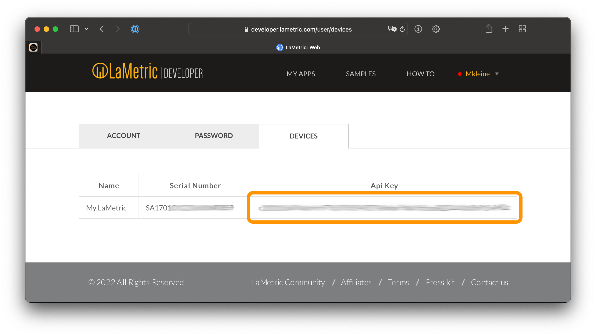

# IoBroker.lametric
## Оглавление
- [Приложения](apps.md)
- [Blockly](blockly.md)
- [Мои данные DIY](my-data-diy.md)
- [Уведомления](notifications.md)

## Требования
- Node.js 20 (или более поздняя версия)
- js-controller 6.0.0 (или более поздняя версия)
- Административный адаптер 7.6.20 (или более поздняя версия)
- _Ламетрическое время_ с прошивкой _3.2.7_ (или более поздней версии)
- Прошивка _2.3.9_ (или более поздняя) на более старых моделях (выпущенных до 2022 года)

[[Список изменений прошивки](https://firmware.lametric.com) [Список изменений прошивки Time2]](https://firmware.lametric.com/?product=time2)

## Конфигурация
1. Добавьте ламетрическое время в локальную сеть.
- Приложение LaMetric Time (с 2017 по 2021 год) - [iOS](https://apps.apple.com/de/app/lametric-time/id987445829), [Google Play Store](https://play.google.com/store/apps/details?id=com.smartatoms.lametric)
- Приложение LaMetric (с 2022 года по настоящее время) - [iOS](https://apps.apple.com/de/app/lametric/id1502981694), [Google Play Store](https://play.google.com/store/apps/details?id=com.lametric.platform)
2. Скопируйте ключ API устройства из приложения (только для моделей 2022 года и новее). Для более старых моделей используйте следующий веб-сайт:

Вы можете получить ключ API вашего устройства [здесь](https://developer.lametric.com/user/devices).

## Функции
- Настройка яркости дисплея (в процентах, автоматический/ручной режим)
- Установить громкость звука (в процентах)
- Настройка заставки (включение/выключение, по времени, при наступлении темноты)
- Активировать/деактивировать Bluetooth и изменить имя Bluetooth.
- Переключение между приложениями (следующее, предыдущее, переход к определенному приложению)
- Отправляйте уведомления с помощью Blockly (с настраиваемым приоритетом, звуком, значками, текстом и т. д.)
- Управление специальными приложениями, такими как «часы», «радио», «секундомер» или «погода».
— Используйте приложение LaMetric _Мои данные (сделай сам)_ для отображения постоянно отображаемой информации.

Функционал ограничен пунктом [официальные функции API](https://lametric-documentation.readthedocs.io/en/latest/reference-docs/lametric-time-reference.html).

## Changelog

<!--
  Placeholder for the next version (at the beginning of the line):
  ### **WORK IN PROGRESS**
-->
### 6.0.1 (2026-08-04)

* (@klein0r) Updated LaMetric firmware version recommendation to 2.3.9 (3.2.7)

### 6.0.0 (2026-05-05)

* (copilot) Adapter requires node.js >= 22 now
* (@klein0r) admin 7.6.20 and js-controller 6.0.11 (or later) are required
* (@klein0r) Updated dependencies

### 5.0.0 (2025-10-22)

* (@klein0r) admin 7.6.17 and js-controller 6.0.11 (or later) are required
* (@klein0r) package and index state of apps have been removed
* (@klein0r) Fixed app structure

### 4.2.0 (2025-08-15)

* (@klein0r) Updated LaMetric firmware version recommendation to 2.3.9 (3.2.4)

### 4.1.0 (2025-07-09)

* (@klein0r) Allow icons with placeholders in config (improved validation)
* (@klein0r) Updated LaMetric firmware version recommendation to 2.3.9 (3.2.3)

[Older changelogs can be found there](CHANGELOG_OLD.md)

## License

The MIT License (MIT)

Copyright (c) 2026 Matthias Kleine <info@haus-automatisierung.com>

Permission is hereby granted, free of charge, to any person obtaining a copy
of this software and associated documentation files (the "Software"), to deal
in the Software without restriction, including without limitation the rights
to use, copy, modify, merge, publish, distribute, sublicense, and/or sell
copies of the Software, and to permit persons to whom the Software is
furnished to do so, subject to the following conditions:

The above copyright notice and this permission notice shall be included in
all copies or substantial portions of the Software.

THE SOFTWARE IS PROVIDED "AS IS", WITHOUT WARRANTY OF ANY KIND, EXPRESS OR
IMPLIED, INCLUDING BUT NOT LIMITED TO THE WARRANTIES OF MERCHANTABILITY,
FITNESS FOR A PARTICULAR PURPOSE AND NONINFRINGEMENT. IN NO EVENT SHALL THE
AUTHORS OR COPYRIGHT HOLDERS BE LIABLE FOR ANY CLAIM, DAMAGES OR OTHER
LIABILITY, WHETHER IN AN ACTION OF CONTRACT, TORT OR OTHERWISE, ARISING FROM,
OUT OF OR IN CONNECTION WITH THE SOFTWARE OR THE USE OR OTHER DEALINGS IN
THE SOFTWARE.