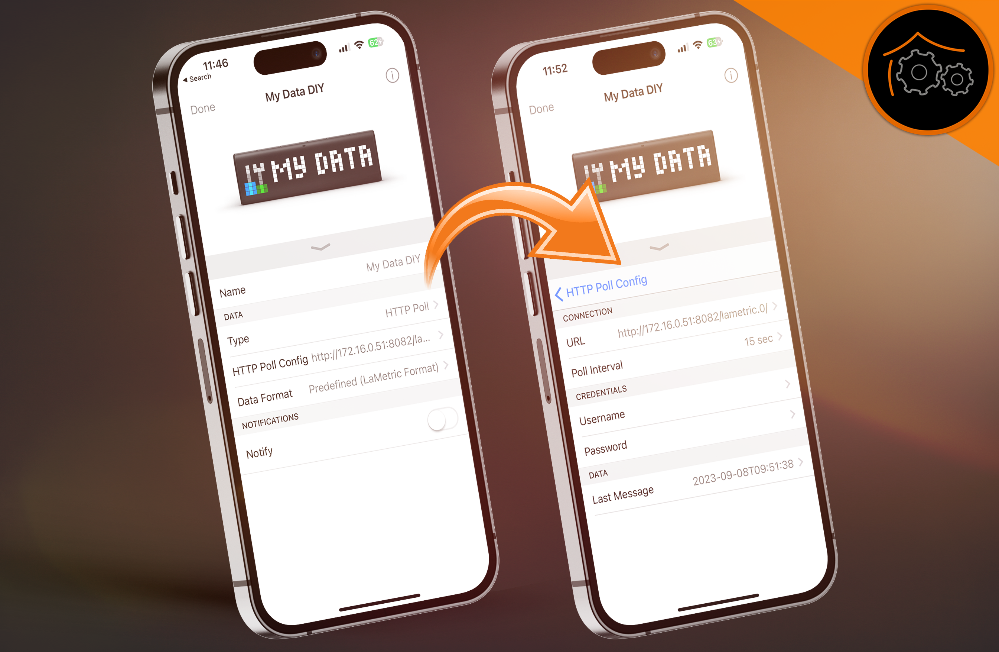

# IoBroker.lametric
*LaMetric* предлагает (через встроенный магазин приложений) дополнительное приложение для отображения вашей собственной информации. Это приложение называется [Мои данные своими руками](https://apps.lametric.com/apps/my_data__diy_/8942). Этот адаптер создает точку данных в требуемом формате.

Начиная с версии 2.0.0 этого приложения данные можно передавать на устройство на разные расстояния.

- Push: адаптер регулярно отправляет данные на устройство (если они меняются)
- Опрос: данные из *LaMetric Time* собираются регулярно (настраивается)

Оба метода описаны в этом документе.

## Мои данные (сделай сам) — нажмите *(требуется версия адаптера >= 3.0.0)*
*еще не реализовано*

## Мои данные (сделай сам) — опрос *(требуется версия адаптера >= 1.1.0)*
Для передачи данных в *LaMetric Time* можно использовать различные адаптеры:

- Веб-адаптер (рекомендуется) *(требуется версия адаптера >= 2.1.0)*
- Адаптеры REST API
- Простые адаптеры API

### Веб-адаптер (рекомендуется)
```ioBroker LaMetric Adapter -> Zustand mit Frame-Informationen <- ioBroker Web Adapter <- My Data DIY App <- LaMetric```

1. Установите [Адаптер Web ioBroker](https://github.com/ioBroker/ioBroker.web).
2. Создайте новый экземпляр веб-адаптера (например, ``web.0``).
3. Настройте порт нового веб-экземпляра (например, ``8082``).
4. Установите приложение *My Data DIY* на свой *LaMetric Time* через магазин приложений.
5. Откройте настройки приложения *Мои данные (DIY)* и настройте URL-адрес адаптера REST API (см. ниже).
6. Заходим в настройки адаптера и добавляем новые кадры со своей информацией (см. следующий раздел)
7. Не забудьте выбрать ранее настроенный веб-экземпляр!

Конфигурация HTTP-опроса:

```
URL: http://172.16.0.219:8082/lametric.0/
```

### Адаптер REST API
```ioBroker LaMetric Adapter -> Zustand mit Frame-Informationen <- ioBroker REST API Adapter <- My Data DIY App <- LaMetric```

#### Конфигурация (с аутентификацией)
1. Установите [Адаптер REST API ioBroker] (https://github.com/ioBroker/ioBroker.rest-api).
2. Создайте нового пользователя ioBroker с именем lametric и собственным паролем (например, HhX7dZl3Fe).
3. Добавьте нового пользователя lametric в группу пользователей.
4. Установите приложение *My Data DIY* на свой *LaMetric Time* через магазин приложений.
5. Откройте настройки приложения *Мои данные (DIY)* и настройте URL-адрес адаптера REST API (см. ниже).
6. Заходим в настройки адаптера и добавляем новые кадры со своей информацией (см. следующий раздел)

Конфигурация HTTP-опроса:

```
URL: http://172.16.0.219:8093/v1/state/lametric.0.mydatadiy.obj/plain?extraPlain=true
Username: lametric
Password: HhX7dZl3Fe
```

**Замените образец IP, порта, имени пользователя и пароля!**

### Простые адаптеры API
```ioBroker LaMetric Adapter -> Zustand mit Frame-Informationen <- ioBroker Simple API Adapter <- My Data DIY App <- LaMetric```

#### Конфигурация (с аутентификацией)
1. Установите [Адаптер Simple API ioBroker](https://github.com/ioBroker/ioBroker.simple-api).
2. Создайте нового пользователя ioBroker с именем lametric и собственным паролем (например, HhX7dZl3Fe).
3. Добавьте нового пользователя lametric в группу пользователей.
4. Установите приложение *My Data DIY* на свой *LaMetric Time* через магазин приложений.
5. Откройте настройки приложения *Мои данные (DIY)* и настройте URL-адрес адаптера Simple API (см. ниже).
6. Заходим в настройки адаптера и добавляем новые кадры со своей информацией (см. следующий раздел)

Конфигурация HTTP-опроса:

```
URL: http://172.16.0.219:8087/getPlainValue/lametric.0.mydatadiy.obj/?json&user=lametric&pass=HhX7dZl3Fe
```

**Важно: используйте флаг json адаптера SimpleAPI (доступен начиная с версии 2.6.2)**

**Замените пример IP, порта, имени пользователя и пароля в URL-адресе!**

#### Конфигурация (без аутентификации)
1. Установите [Адаптер Simple API ioBroker](https://github.com/ioBroker/ioBroker.simple-api).
2. Установите приложение *My Data DIY* на *LaMetric Time* через магазин приложений.
3. Откройте настройки приложения *Мои данные (DIY)* и настройте URL-адрес адаптера Simple API (см. ниже).
4. Заходим в настройки адаптера и добавляем новые кадры со своей информацией (см. следующий раздел)

Конфигурация HTTP-опроса:

```
URL: http://172.16.0.219:8087/getPlainValue/lametric.0.mydatadiy.obj/?json
```

**Важно: используйте флаг json адаптера SimpleAPI (доступен начиная с версии 2.6.2)**

**Замените пример IP и порта в URL-адресе!**

### Конфигурация фрейма
- Добавьте столько кадров, сколько хотите, используя кнопку «плюс».
- Значок: выберите значок на [официальном сайте](https://developer.lametric.com/icons) и вставьте идентификатор в поле. **Важно: используйте букву i (для статических символов) или a (для анимированных символов) в качестве префикса идентификатора (пример: `i3389`)**
- Текст: введите любой текст для отображения. Вы можете запросить информацию из точек данных, указав их идентификатор в фигурных скобках. Текущее значение точек данных затем вставляется в эту точку. (Пример: `{youtube.0.channels.HausAutomatisierungCom.statistics.subscriberCount} Подписчики`)
- Продолжительность: определяет, как долго должен отображаться каждый кадр (по умолчанию = 5 секунд).

Пример конфигурации некоторых фреймов:


### Конфигурация приложения «Мои данные DIY»
Начиная с версии 2.0.0 приложения *My Data DIY* можно выполнять дополнительные настройки.

- Введите: «HTTP-опрос».
- Конфигурация HTTP-опроса
    - URL: *см. выше (в зависимости от метода)*
    - Интервал опроса: 15 сек.
    - Имя пользователя: *см. выше (в зависимости от метода)*
    - Пароль: *см. выше (в зависимости от метода)*
- Формат данных: предопределенный (формат LaMetric).

