# ioBroker.lg-thinq

[Вернуться к файлу README](https://github.com/TA2k/ioBroker.lg-thinq/blob/master/README.md)

# Введение

Адаптер создает все точки данных, используя шаблон, полученный из точки данных.`modelJsonUri` (отклонение для устройств) и использует перевод с помощью шаблона из точки данных.`langPackModelUri` (Отклонение для устройств). Поэтому возможно, что в режиме REMOTE создаются точки данных, которые не имеют функции или недоступны для устройства.

# Краткое содержание

- [Настройки экземпляра](#instance-settings)
  - [Настройка LG-Thinq](#instance-setting-lg-thinq)
  - [Интервал Thinq1](#interval-thinq1-lg-thinq)
- [Штаты](#states)
  - [Устройство 101 Холодильник/Морозильник](#device-101-refrigeratorfreezer-thinq1--thinq2)
    - [Удалённая статистика](#101-remote-statistic-thinq2)
    - [Удаленные базовые команды](#101-remote-control-thinq1--thinq2)
    - [Снимок](#101-snapshot-thinq1--thinq2)
  - [Подпись государственного устройства 201](#device-201-washer-signature-thinq2)
    - [Удаленные базовые команды](#201-remote-control-signature-thinq2)
  - [Устройство 201, шайба](#device-201-washer-thinq1--thinq2)
    - [Удалённая статистика](#201-remote-statistic-thinq2)
    - [Удаленные базовые команды](#201-remote-control-thinq1--thinq2)
    - [Снимок](#201-snapshot-thinq1--thinq2)
  - [Сушилка State Device 202](#device-202-dryer-thinq1--thinq2)
    - [Удалённая статистика](#202-remote-statistic-thinq2)
    - [Удаленные базовые команды](#202-remote-control-thinq1--thinq2)
    - [Снимок](#202-snapshot-thinq1--thinq2)
  - [Кондиционер State Device 401 thinq2](#device-401-air-conditioner-thinq2)
    - [Удалённая статистика](#401-remote-statistic-thinq2)
    - [Удаленные базовые команды](#401-remote-control-thinq2)
    - [Удаленный отдых](#401-remote-holiday-thinq2)
    - [Снимок](#401-snapshot-thinq2)
  - [Устройство 401 кондиционер thinq1](#device-401-air-conditioner-thinq1)
    - [Удалённая статистика](#401-remote-statistic-thinq1)
    - [Удаленные базовые команды](#401-remote-control-thinq1)
    - [Снимок](#401-snapshot-thinq1)
  - [Насос State Device 406 Head](#device-406-heat-pump-thinq2)
    - [Удалённая статистика](#406-remote-statistic-thinq2)
    - [Удаленные базовые команды](#406-remote-basicctrl-thinq2)
    - [Удаленные настройки расписания](#406-remote-reservationctrl-thinq2)
    - [Снимок](#406-snapshot-thinq2)
  - [Погода](#weather)

# Настройки экземпляра

### Настройки экземпляра LG-Thinq

[Краткое содержание](#summary)

- `LG ThinQ Email` Введите адрес электронной почты приложения.
- `LG ThinQ Password` Введите пароль приложения.
- `Update interval in minutes` Рекомендуемое значение: 60 минут. Если интервал thinq1 установлен на 0, то здесь это 0,5/1 минута.
- `Update interval in seconds for Thinq1 (per device 1 Second)` Интервал для пользователей thinq1
- `Country` Введите страну — по умолчанию DE
- `Language` : Введите язык – по умолчанию de\_DE
- `Platform` : Введите платформу - по умолчанию LGThinQ
- `Delete session data` Если возникли проблемы со входом в систему, пожалуйста, удалите данные сессии (lg-thinq.0.session wird geleert).

  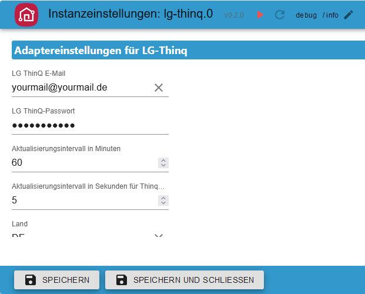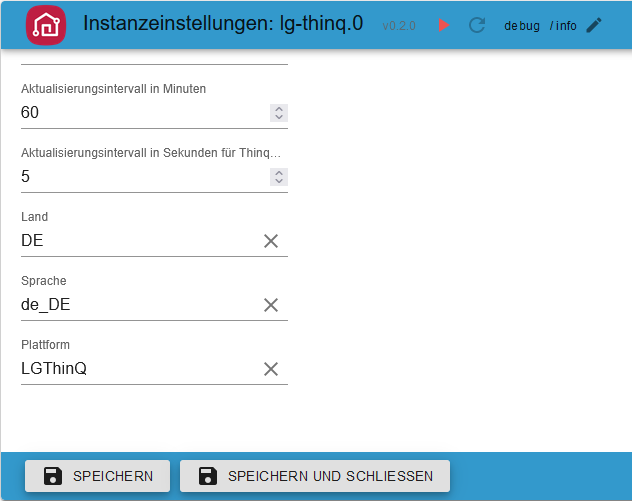

### Интервал thinq1 LG-Thinq

[Краткое содержание](#summary)

- `interval.active` Сколько устройств в настоящее время получают обновления?
- `interval.inactive` Сколько устройств в настоящее время не получают обновления?
- `interval.interval` Измените интервал в настройках экземпляра. После перезапуска адаптера настройки экземпляра будут применены.
- `interval.last_update` Последнее обновление
- `interval.status_devices`

  - `OK` Интервал в норме
  - `Fail - 0100` Запрос не выполнен — идентификатор работы создан заново.
  - `Fail - 0106` Устройство не подключено — идентификатор рабочего места создан заново.
  - `Error` Ошибка WorkID - WorkID создан заново.
  - `Error <code>` Неизвестная ошибка — идентификатор работы создан заново.
  - `Result Error` Получена ошибка - идентификатор рабочего места создан заново.
  - `Parse error` Ошибка синтаксического анализа — идентификатор работы создан заново.
  - `Unknown` Неизвестная ошибка — идентификатор работы создан заново.
  - `Request` Получение неизвестно — идентификатор работы создан заново.
  - `{}` Неизвестно - идентификатор рабочего места создан заново.

  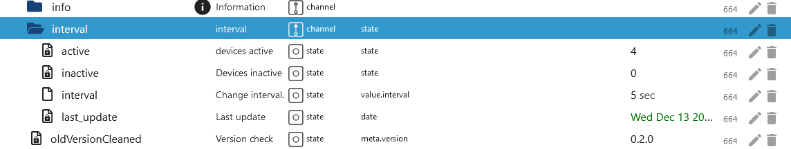

# Штаты

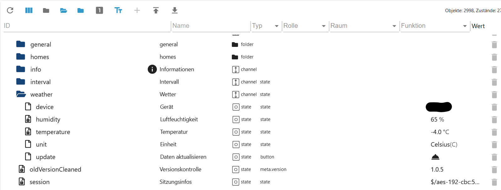

### Устройство 101 Холодильник/Морозильник thinq1 и thinq2

[Краткое содержание](#summary)

### 101 Все папки thinq1 и thinq2

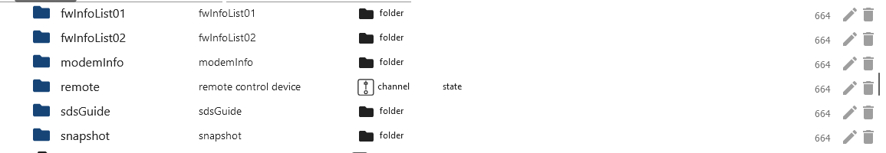

### 101 Удалённая папка thinq1 и thinq2

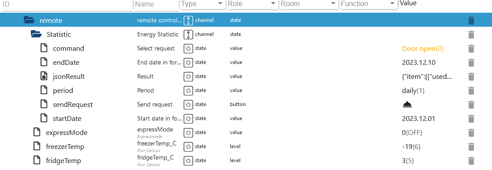

### 101 Удалённая статистика thinq2

[Краткое содержание](#summary)

- `remote.Statistic.command` Какую историю следует загрузить
- почасово
- `remote.Statistic.endDate` Введите дату для почасового отображения; начало и конец должны совпадать. Формат: 2023.12.01
- `remote.Statistic.startDate` Введите дату для почасового отображения; начало и конец должны совпадать. Формат: 2023.12.01
- Или ежедневно
- `remote.Statistic.endDate` Ежедневный ввод даты - Формат: 2023.12.06
- `remote.Statistic.startDate` Ежедневный ввод даты - Формат: 2023.12.01
- Или ежемесячно
- `remote.Statistic.endDate` Указывайте дату ежемесячно - Формат: 2023.12.01
- `remote.Statistic.startDate` Указывайте дату ежемесячно - Формат: 2023.10.01
- `remote.Statistic.period` Выберите период
- `remote.Statistic.sendRequest` Отправить выбор
- `remote.Statistic.jsonResult` Статистика в формате JSON. Если атрибуты пусты, значит, ваше устройство их не поддерживает или указана неверная дата.

  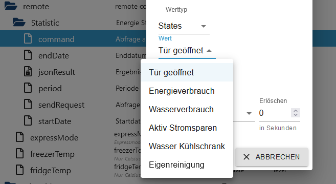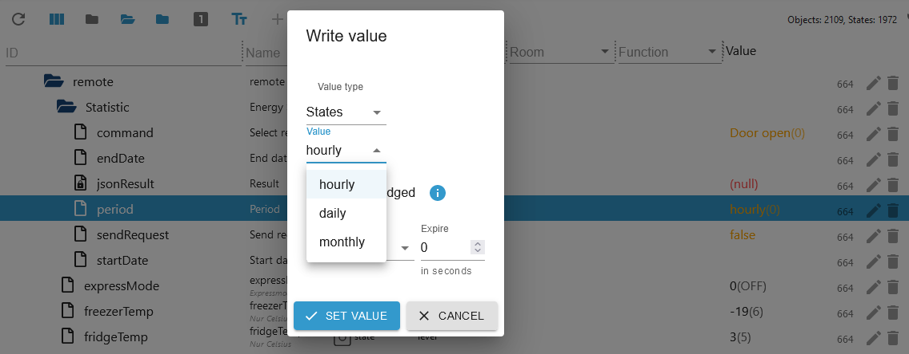

Пример JSON: Дверь открыта

```json
{
    "item": [
        {
            "usedDate": "2023-11",
            "doorType": "DID_DOOR",
            "openCount": "0",
            "openTime": "0"
        },
        {
            "usedDate": "2023-12",
            "doorType": "DID_DOOR",
            "openCount": "0",
            "openTime": "0"
        },
        {
            "usedDate": "2023-11",
            "doorType": "FREEZER_DOOR",
            "openCount": "62",
            "openTime": "713937"
        },
        {
            "usedDate": "2023-12",
            "doorType": "FREEZER_DOOR",
            "openCount": "0",
            "openTime": "0"
        },
        {
            "usedDate": "2023-11",
            "doorType": "FRIDGE_DOOR",
            "openCount": "1037",
            "openTime": "12421700"
        },
        {
            "usedDate": "2023-12",
            "doorType": "FRIDGE_DOOR",
            "openCount": "27",
            "openTime": "304857"
        },
        {
            "usedDate": "2023-11",
            "doorType": "CONVERTIBLE_DOOR",
            "openCount": "0",
            "openTime": "0"
        },
        {
            "usedDate": "2023-12",
            "doorType": "CONVERTIBLE_DOOR",
            "openCount": "0",
            "openTime": "0"
        },
        {
            "usedDate": "2023-11",
            "doorType": "ONE_DOOR",
            "openCount": "0",
            "openTime": "0"
        },
        {
            "usedDate": "2023-12",
            "doorType": "ONE_DOOR",
            "openCount": "0",
            "openTime": "0"
        }
    ]
}
```

### 101 Пульт дистанционного управления thinq1 и thinq2

[Краткое содержание](#summary)

- `remote.expressMode` Экспресс-режим включен/выключен/быстрое включение -> снимок состояния thinq1.IcePlus
- `remote.freezerTemp` Измените температуру морозильной камеры (только в градусах Цельсия).
- `remote.fridgeTemp` Измените температуру холодильника (только в градусах Цельсия).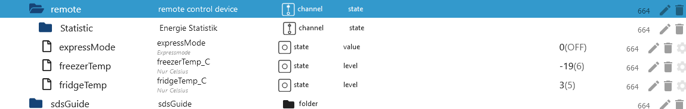

### 101 Снимок thinq1 и thinq2

[Краткое содержание](#summary)

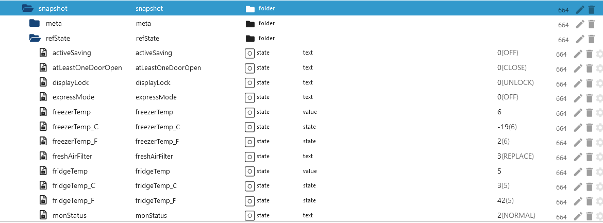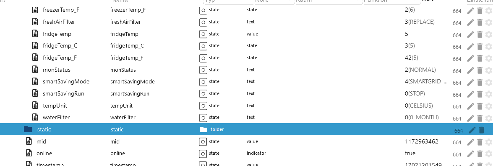

### Устройство 201 Стиральная машина Signature thinq2

[Краткое содержание](#summary)

### 201 Пульт дистанционного управления Signature thinq2

- Управлять им можно так же, как и моделью 201. Однако в нем необходимо установить следующие значения.`Course` папка.
- В папке курса: initialBit on INITIAL\_BIT\_ON
- В папке курса: remoteStart on REMOTE\_START\_ON

### Устройство 201, шайба thinq1 и thinq2

[Краткое содержание](#summary)

### 201 Все папки thinq1 и thinq2

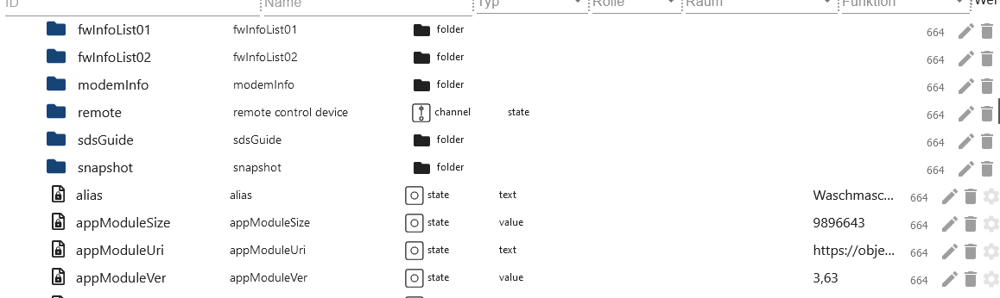

### 201 Удалённая папка thinq1 и thinq2


### 201 Удалённая статистика thinq2

[Краткое содержание](#summary)

- почасово
- `remote.Statistic.endDate` Введите дату для почасового отображения; начало и конец должны совпадать. Формат: 2023.12.01
- `remote.Statistic.startDate` Введите дату для почасового отображения; начало и конец должны совпадать. Формат: 2023.12.01
- Или ежедневно
- `remote.Statistic.endDate` Ежедневный ввод даты - Формат: 2023.12.06
- `remote.Statistic.startDate` Ежедневный ввод даты - Формат: 2023.12.01
- Или ежемесячно
- `remote.Statistic.endDate` Указывайте дату ежемесячно - Формат: 2023.12.01
- `remote.Statistic.startDate` Указывайте дату ежемесячно - Формат: 2023.10.01
- `remote.Statistic.period` Выберите период
- `remote.Statistic.sendRequest` Отправить выбор
- `remote.Statistic.jsonResult` Статистика в формате JSON. Если атрибуты пусты, значит, ваше устройство их не поддерживает или указана неверная дата.

  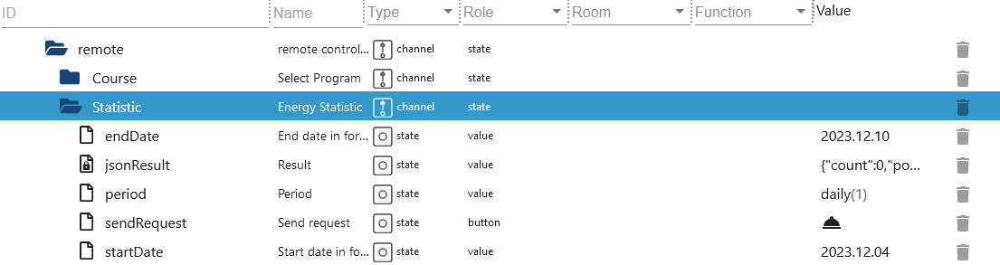

```json
{
    "count": 0,
    "power": 0,
    "energyWater": 0,
    "energyDetergent": 0,
    "energySoftener": 0,
    "powerWh": 0,
    "periodicEnergyData": 0,
    "item": [
        {
            "usedDate": "2023-12-04",
            "count": 0,
            "power": 0,
            "energyWater": 0,
            "energyDetergent": 0,
            "energySoftener": 0,
            "powerWh": 0,
            "periodicEnergyData": 0
        },
        {
            "usedDate": "2023-12-05",
            "count": 0,
            "power": 0,
            "energyWater": 0,
            "energyDetergent": 0,
            "energySoftener": 0,
            "powerWh": 0,
            "periodicEnergyData": 0
        },
        {
            "usedDate": "2023-12-06",
            "count": 2,
            "power": 2,
            "energyWater": 0,
            "energyDetergent": 0,
            "energySoftener": 0,
            "powerWh": 0,
            "periodicEnergyData": 2
        },
        {
            "usedDate": "2023-12-07",
            "count": 2,
            "power": 2,
            "energyWater": 0,
            "energyDetergent": 0,
            "energySoftener": 0,
            "powerWh": 0,
            "periodicEnergyData": 2
        },
        {
            "usedDate": "2023-12-08",
            "count": 5,
            "power": 5,
            "energyWater": 0,
            "energyDetergent": 0,
            "energySoftener": 0,
            "powerWh": 0,
            "periodicEnergyData": 5
        },
        {
            "usedDate": "2023-12-09",
            "count": 0,
            "power": 0,
            "energyWater": 0,
            "energyDetergent": 0,
            "energySoftener": 0,
            "powerWh": 0,
            "periodicEnergyData": 0
        },
        {
            "usedDate": "2023-12-10",
            "count": 0,
            "power": 0,
            "energyWater": 0,
            "energyDetergent": 0,
            "energySoftener": 0,
            "powerWh": 0,
            "periodicEnergyData": 0
        }
    ]
}
```

### 201 Пульт дистанционного управления thinq1 и thinq2

[Краткое содержание](#summary)

- `remote.Favorite` Работает только при выборе избранного элемента в приложении и при включенном устройстве.
- `remote.LastCourse` Можно выбрать последние 10 программ.
- `remote.WMDownload_Select` Выбор всех доступных программ (STD = стандартные/DL = программы для скачивания). Когда заполнен хотя бы один из 3 пунктов, выбранная программа записывается в папку курса. Затем вы можете внести здесь необходимые корректировки. Однако не все пункты в списке данных будут заполнены.`Course` Папку можно изменить. Пожалуйста, проверьте самостоятельно, какие данные принимает стиральная машина.
- `remote.WMDownload` При нажатии кнопки программа из папки «Курс» переносится в стиральную машину и отображается на дисплее (стиральная машина должна быть включена).
- `remote.WMStart` Запуск стиральной машины
- `remote.WMStop` Стоп-шайба
- `remote.WMWakeup` Проснись, стиральная машина!

  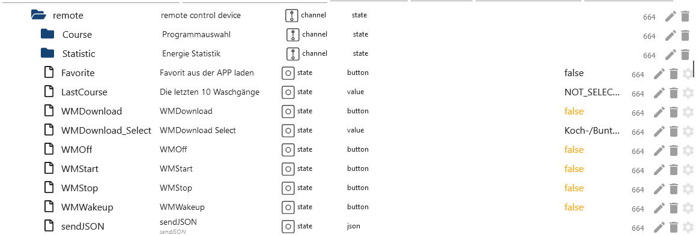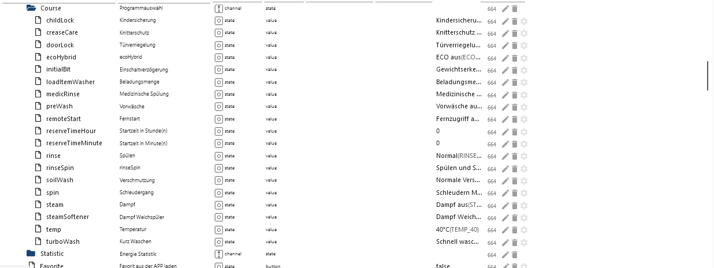

### 201 Снимок thinq1 и thinq2

[Краткое содержание](#summary)

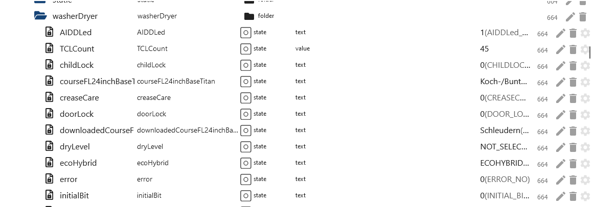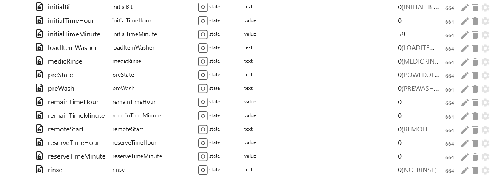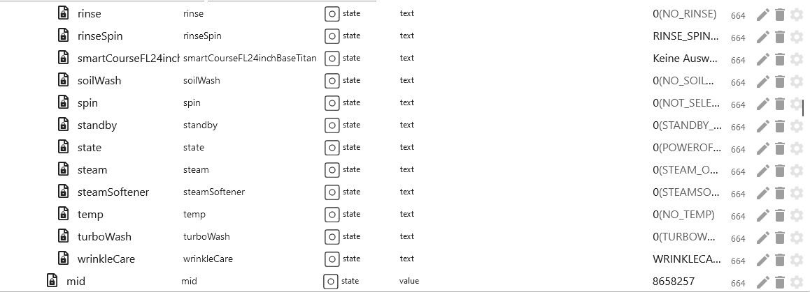

### Устройство 202 Сушилка thinq1 и thinq2

[Краткое содержание](#summary)

### 202 Все папки thinq1 и thinq2

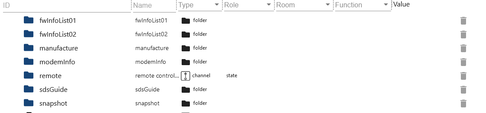

### 202 Удалённая папка thinq1 и thinq2

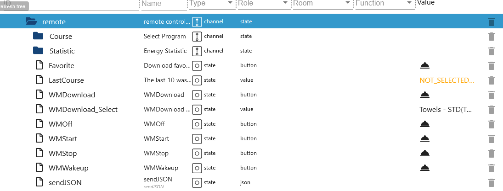

### 202 Удалённая статистика thinq2

[Краткое содержание](#summary)

- почасово
- `remote.Statistic.endDate` Введите дату для почасового отображения; начало и конец должны совпадать. Формат: 2023.12.01
- `remote.Statistic.startDate` Введите дату для почасового отображения; начало и конец должны совпадать. Формат: 2023.12.01
- Или ежедневно
- `remote.Statistic.endDate` Ежедневный ввод даты - Формат: 2023.12.06
- `remote.Statistic.startDate` Ежедневный ввод даты - Формат: 2023.12.01
- Или ежемесячно
- `remote.Statistic.endDate` Указывайте дату ежемесячно - Формат: 2023.12.01
- `remote.Statistic.startDate` Указывайте дату ежемесячно - Формат: 2023.10.01
- `remote.Statistic.period` Выберите период
- `remote.Statistic.sendRequest` Отправить выбор
- `remote.Statistic.jsonResult` Статистика в формате JSON. Если атрибуты пусты, значит, ваше устройство их не поддерживает или указана неверная дата.

  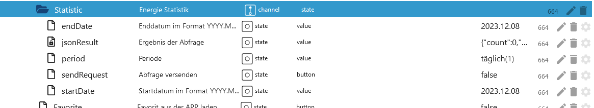

```json
{
    "count": 0,
    "power": 0,
    "energyWater": 0,
    "energyDetergent": 0,
    "energySoftener": 0,
    "powerWh": 0,
    "periodicEnergyData": 0,
    "item": [
        {
            "usedDate": "2023-12-08",
            "count": 5,
            "power": 2587, // 2587 / 1000 kwh
            "energyWater": 0,
            "energyDetergent": 0,
            "energySoftener": 0,
            "powerWh": 0,
            "periodicEnergyData": 2587
        }
    ]
}
```

### 202 Пульт дистанционного управления thinq1 и thinq2

[Краткое содержание](#summary)

- `remote.Favorite` Работает только при выборе избранного элемента в приложении и при включенном устройстве.
- `remote.LastCourse` Можно выбрать последние 10 программ.
- `remote.WMDownload_Select` Выбор всех доступных программ (STD = стандартные/DL = программы для скачивания). Когда заполнен хотя бы один из 3 пунктов, выбранная программа записывается в папку курса. Затем вы можете внести здесь необходимые корректировки. Однако не все пункты в списке данных будут заполнены.`Course` Папку можно изменить. Пожалуйста, проверьте самостоятельно, какие данные принимает сушилка.
- `remote.WMDownload` Нет функции
- `remote.WMStart` При нажатии кнопки программа из папки «Курс» переносится в сушилку и отображается на дисплее (сушилка должна быть включена).
- `remote.WMStop` Остановить сушилку
- `remote.WMWakeup` Разбудите сушилку

  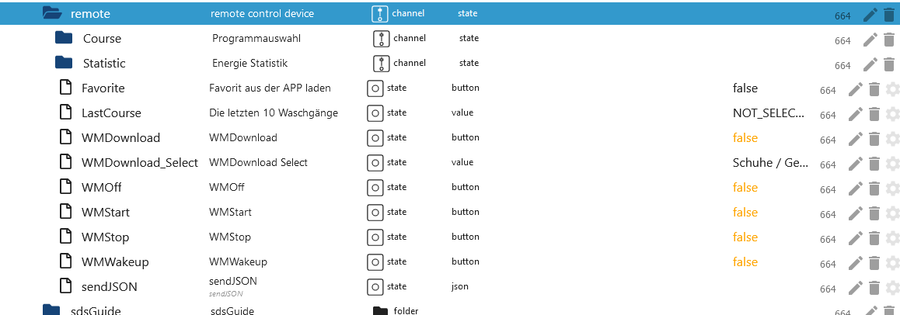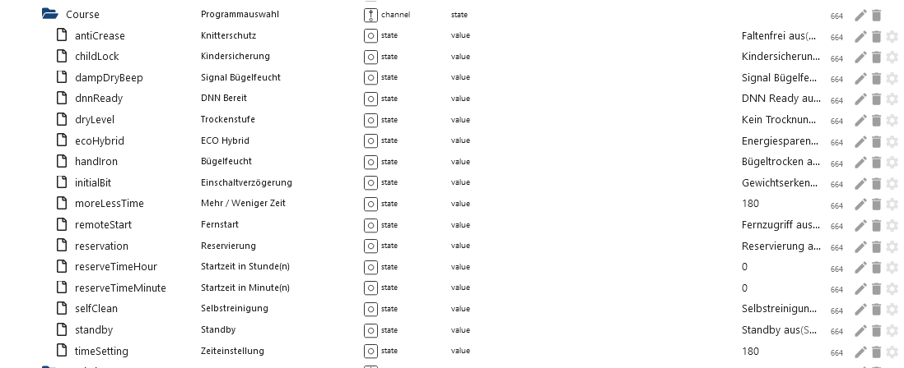

### 202 Снимок thinq1 и thinq2

[Краткое содержание](#summary)


### Устройство 401 Кондиционер thinq2

[Краткое содержание](#summary)

### 401 Все папки thinq2

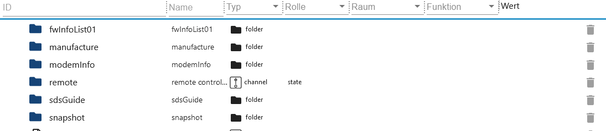

### 401 Удалённая папка thinq2

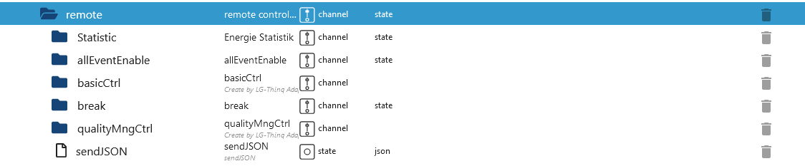

### 401 Удалённая статистика thinq2

[Краткое содержание](#summary)

- `remote.Statistic.command` Какую историю следует загрузить
- почасово
- `remote.Statistic.endDate` Введите дату для почасового отображения; начало и конец должны совпадать. Формат: 2023.12.01
- `remote.Statistic.startDate` Введите дату для почасового отображения; начало и конец должны совпадать. Формат: 2023.12.01
- Или ежедневно
- `remote.Statistic.endDate` Ежедневный ввод даты - Формат: 2023.12.06
- `remote.Statistic.startDate`Ежедневный ввод даты - Формат: 2023.12.01
- Или ежемесячно
- `remote.Statistic.endDate` Указывайте дату ежемесячно - Формат: 2023.12.01
- `remote.Statistic.startDate` Указывайте дату ежемесячно - Формат: 2023.10.01
- `remote.Statistic.period` Выберите период
- `remote.Statistic.sendRequest` Отправить выбор
- `remote.Statistic.jsonResult` Статистика в формате JSON. Если атрибуты пусты, значит, ваше устройство их не поддерживает или указана некорректная дата.

  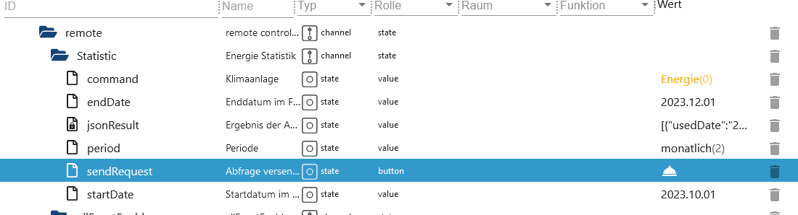

```json
[
    {
        "usedDate": "2023-04",
        "energyData": "0",
        "operationTime": "0"
    },
    {
        "usedDate": "2023-05",
        "energyData": "0",
        "operationTime": "0"
    },
    {
        "usedDate": "2023-06",
        "energyData": "3800",
        "operationTime": "13873"
    }
]
```

### 401 Пульт дистанционного управления thinq2

[Краткое содержание](#summary)

- `remote.basicCtrl.operation` 0 означает выключено, 1 — включено.

- `remote.basicCtrl.opMode` 0 — выключено, 4 — включено

- `remote.basicCtrl.hotWater` 0 означает выключено, 1 — включено.

- `remote.basicCtrl.hotWaterTarget` желаемая температура

- `remote.basicCtrl.powerHotWater` Boost 0 означает выключение, 1 — включение.

- `remote.basicCtrl.target` желаемая температура

- Если в журнале появляется сообщение об ошибке 400, значит, данная точка данных несовместима с устройством.

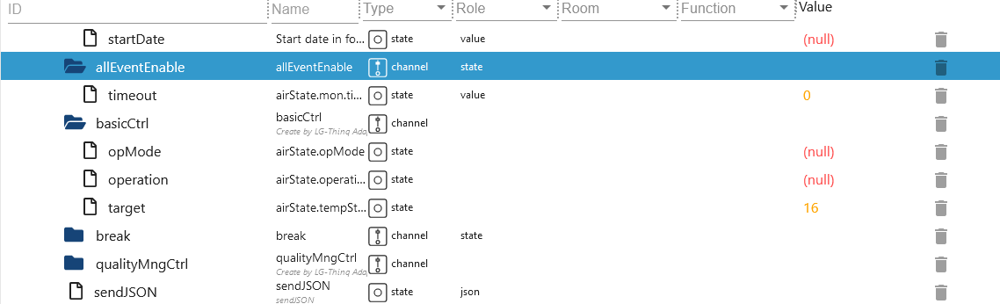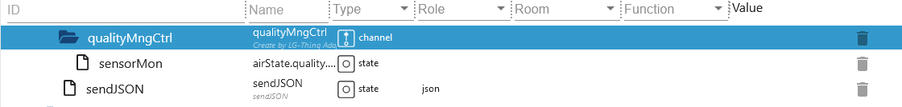

### 401 Удаленный отпуск thinq2

[Краткое содержание](#summary)

- `remote.break.holiday_silent_update` Текущие данные всегда должны сначала загружаться из облака.
- `remote.break.holiday_silent_data` Текущее расписание из облака.
- `remote.break.holiday_startdate` Введите здесь дату начала отпуска. Дата не может быть в прошлом (формат ДД.ММ.ГГ ЧЧ:ММ).
- `remote.break.holiday_enddate` Введите здесь дату окончания отпуска. Дата не может быть в прошлом и должна быть больше даты начала (формат ДД.ММ.ГГ ЧЧ:ММ).
- `remote.break.holiday_heating` Включение/выключение отопления (как в приложении)
- `remote.break.holiday_water` Включение/выключение горячей воды (как в приложении)
- `remote.break.holiday_onoff` Заполните только указанные выше поля данных, а затем активируйте/деактивируйте режим отпуска.
- `remote.break.silent_mode_starttime` Введите здесь время начала работы в режиме пониженного уровня шума. (Формат:ЧЧ:ММ)
- `remote.break.silent_mode_endtime` Введите здесь время окончания работы в тихом режиме. Разумеется, оно должно быть больше даты начала. (Формат:ЧЧ:ММ)
- `remote.break.silent_mode_onoff` Включение/выключение тихого режима
- `remote.break.holiday_sendJSON` Предназначено только для экспертов. JSON содержит массив, состоящий из JSON типов 1, 2 и 3. 1 обозначает время выполнения, 2 — режим отпуска, а тип 3 — тихий режим. Теперь вы можете добавить дополнительные JSON-объекты к типу 1 и, таким образом, получить больше вариантов времени переключения.

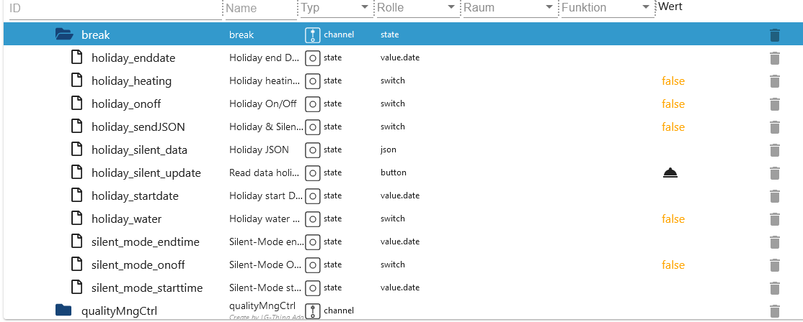

### 401 Снимок thinq2

[Краткое содержание](#summary)

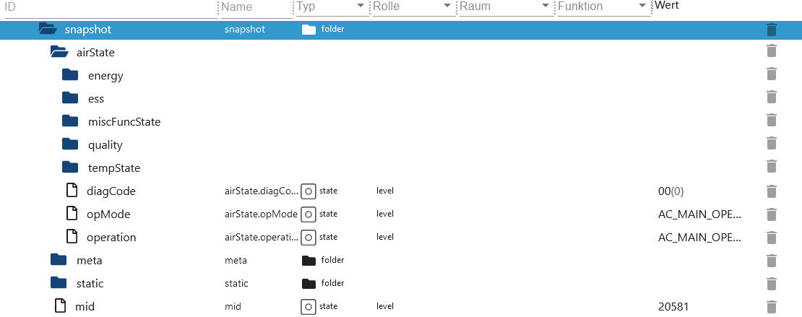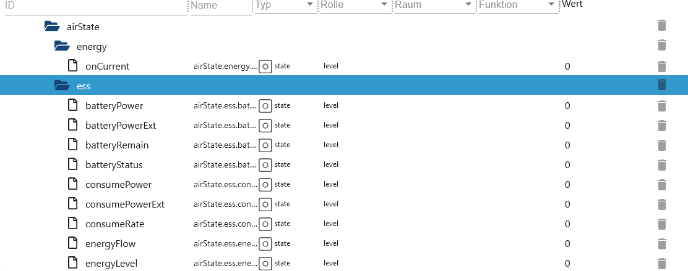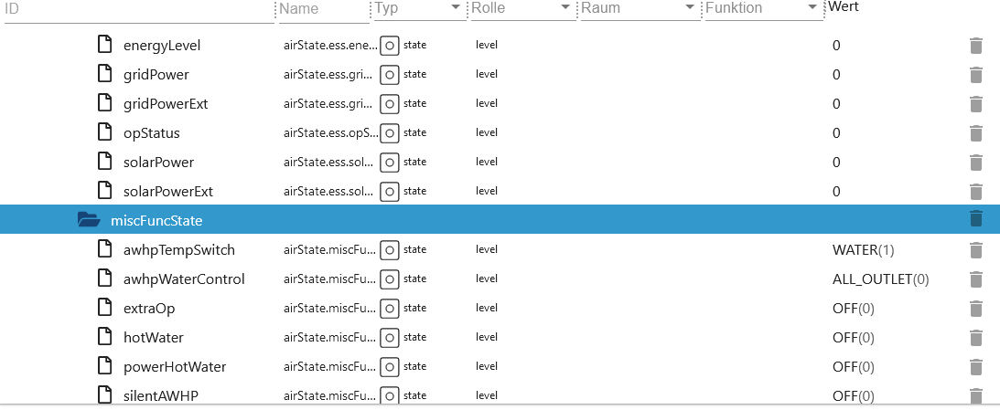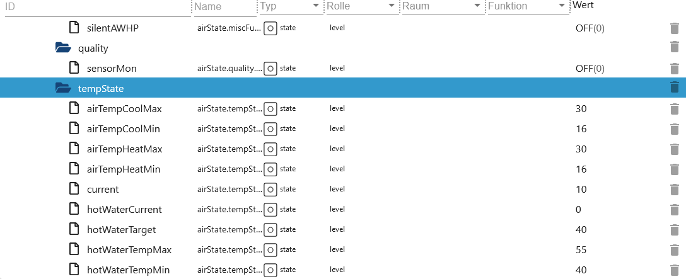

### Устройство 401 Кондиционер thinq1

[Краткое содержание](#summary)

### 401 Удалённая статистика thinq1

[Краткое содержание](#summary)

- почасово
- `remote.Statistic.endDate` Введите дату для почасового отображения; начало и конец должны совпадать. Формат: 2023.12.01
- `remote.Statistic.startDate` Введите дату для почасового отображения; начало и конец должны совпадать. Формат: 2023.12.01
- Или ежедневно
- `remote.Statistic.endDate` Ежедневный ввод даты - Формат: 2023.12.06
- `remote.Statistic.startDate` Ежедневный ввод даты - Формат: 2023.12.01
- Или ежемесячно
- `remote.Statistic.endDate` Указывайте дату ежемесячно - Формат: 2023.12.01
- `remote.Statistic.startDate` Указывайте дату ежемесячно - Формат: 2023.10.01
- `remote.Statistic.period` Выберите период
- `remote.Statistic.sendRequest` Отправить выбор
- `remote.Statistic.jsonResult` Статистика в формате JSON. Если атрибуты пусты, значит, ваше устройство их не поддерживает или указана некорректная дата.
- `remote.Statistic.ownrequest` Собственный запрос к данным. Откройте файл из`modelJsonUri` связать и применить cmd, cmdOpt и значение.
- `remote.Statistic.ownresponse` Результат `remote.Statistic.ownrequest`

  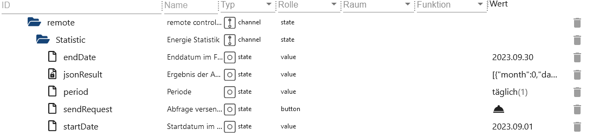

```json
[
    {
        "month": 0,
        "day": "03",
        "hour": 0,
        "min": "16",
        "kwh": 0.1
    },
    {
        "month": 0,
        "day": "04",
        "hour": 0,
        "min": "59",
        "kwh": 0.2
    },
    {
        "month": 0,
        "day": "06",
        "hour": 0,
        "min": "15",
        "kwh": 0.1
    },
    {
        "month": 0,
        "day": "07",
        "hour": 0,
        "min": "40",
        "kwh": 0.1
    },
    {
        "month": 0,
        "day": "09",
        "hour": 0,
        "min": "35",
        "kwh": 0.2
    },
    {
        "month": 0,
        "day": "10",
        "hour": 0,
        "min": "60",
        "kwh": 0.2
    },
    {
        "month": 0,
        "day": "11",
        "hour": 0,
        "min": "60",
        "kwh": 0.2
    },
    {
        "month": 0,
        "day": "12",
        "hour": 0,
        "min": "90",
        "kwh": 0.3
    }
]
```

# собственный запрос JSON

```json
{
    "method": "POST", // POST or GET Axios Request
    "url": "rti/rtiControl", // URL
    "data": {
        "lgedmRoot": {
            "deviceId": null, // Adapter replaces null
            "workId": null, // Adapter replaces null
            "cmd": "Config", // Change possible
            "cmdOpt": "Get", // Change possible
            "value": "InOutInstantPower", // Change possible
            "isControlFree": "Y" // DO NOT change
        }
    }
}
```

### 401 Пульт дистанционного управления thinq1

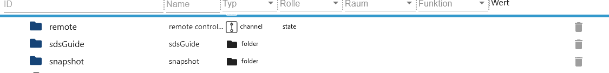

[Краткое содержание](#summary)

Какие точки данных относятся к набору...? Название точки данных указывается в её имени. lg-thinq.0.xxx.remote.SetWDirLeftRight -> {"`WDirLeftRight` ":"{{WDirLeftRight}}","`WDirUpDown` ":"0"}

- Включить пример:

- `remote.settings.Operation` установить значение 1

- `remote.SetOperation` затем установите для этой точки данных значение true.

- Пример отключения:

- `remote.settings.Operation` установить значение 0

- `remote.SetOperation` затем установите для этой точки данных значение true.

- Пример изменения температуры:

- `remote.settings.TempCfg` Введите температуру

- `remote.SetTempCfg` затем установите для этой точки данных значение true.

- Другой пример:

- `remote.settings.WDirUpDown` установить значение 0

- `remote.settings.WDirLeftRight` 0 или 1

- `remote.SetWDirLeftRight` затем установите для этой точки данных значение true.

  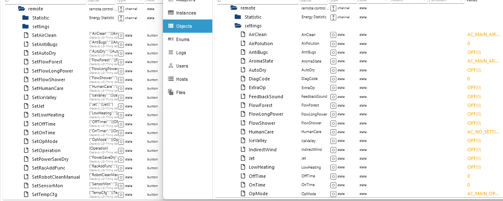

### 401 Снимок thinq1

[Краткое содержание](#summary)

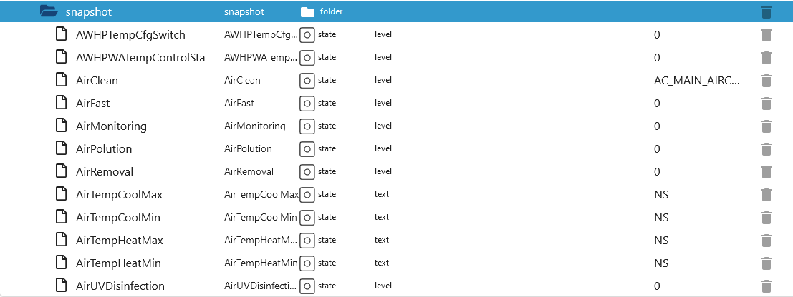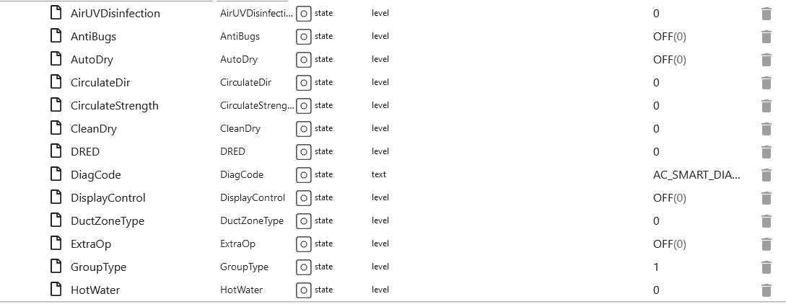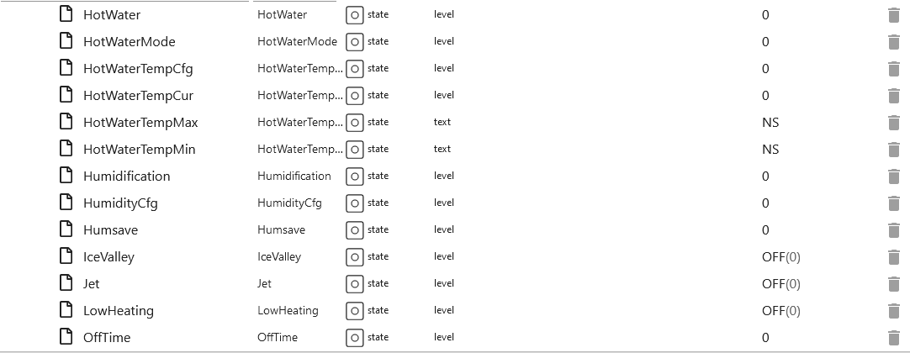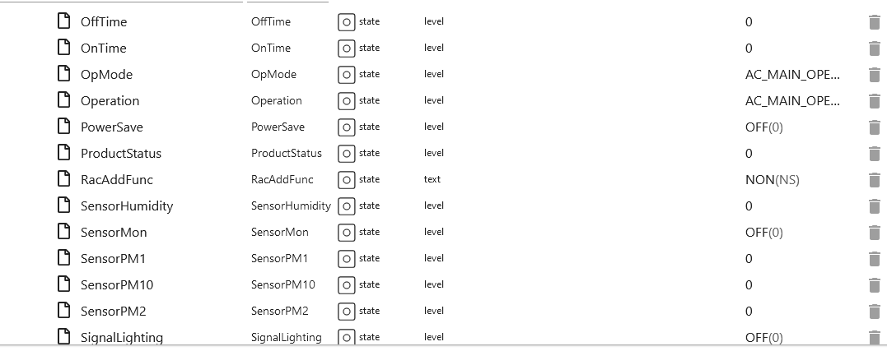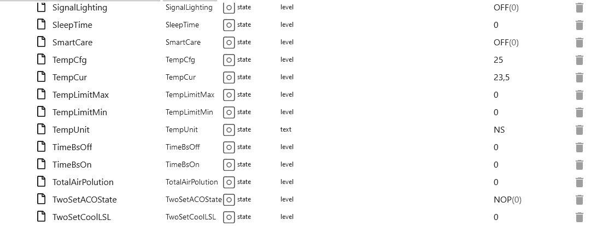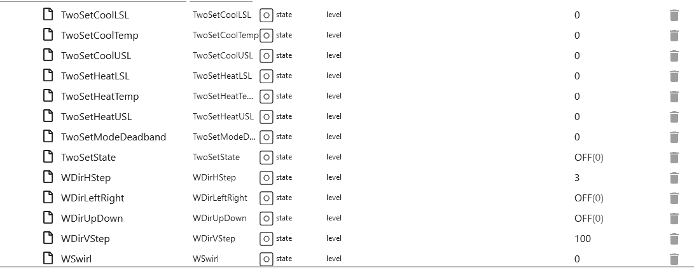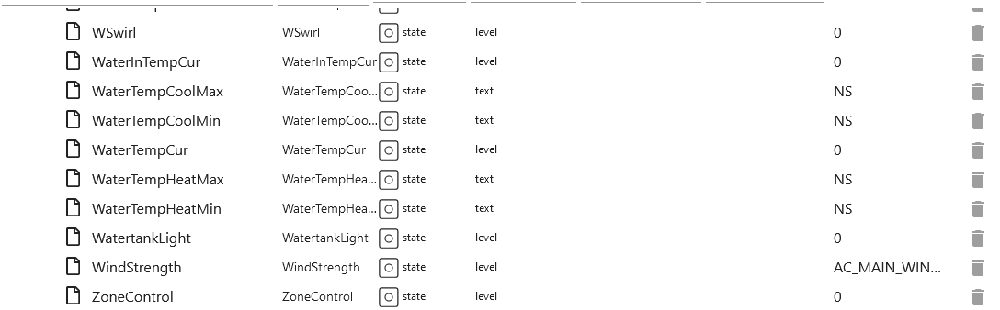

### Устройство 406 Тепловой насос thinq2

[Краткое содержание](#summary)

### 406 Все папки thinq2

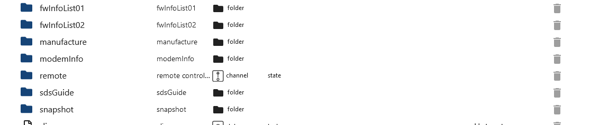

### 406 Удалённая папка thinq2

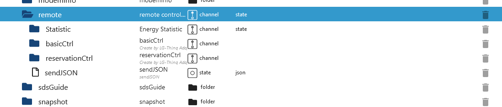

### 406 Удалённая статистика thinq2

[Краткое содержание](#summary)

- `remote.Statistic.command` Какую историю следует загрузить
- почасово
- `remote.Statistic.endDate` Введите дату для почасового отображения; начало и конец должны совпадать. Формат: 2023.12.01
- `remote.Statistic.startDate` Введите дату для почасового отображения; начало и конец должны совпадать. Формат: 2023.12.01
- Или ежедневно
- `remote.Statistic.endDate` Ежедневный ввод даты - Формат: 2023.12.06
- `remote.Statistic.startDate` Ежедневный ввод даты - Формат: 2023.12.01
- Или ежемесячно
- `remote.Statistic.endDate` Указывайте дату ежемесячно - Формат: 2023.12.01
- `remote.Statistic.startDate` Указывайте дату ежемесячно - Формат: 2023.10.01
- `remote.Statistic.period` Выберите период
- `remote.Statistic.sendRequest` Отправить выбор
- `remote.Statistic.jsonResult` Статистика в формате JSON. Если атрибуты пусты, значит, ваше устройство их не поддерживает или указана неверная дата.

  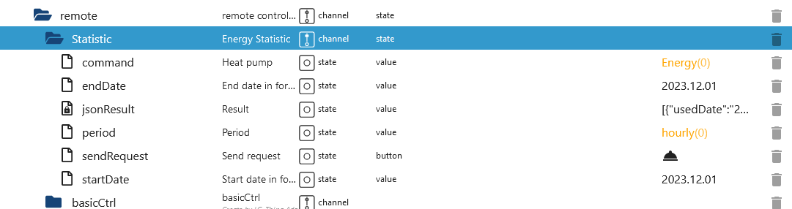

### 406 Remote basicCtrl thinq2

[Краткое содержание](#summary)

- `remote.basicCtrl.hotWaterTarget` Установка температуры
- `remote.basicCtrl.opMode` Установить режим

  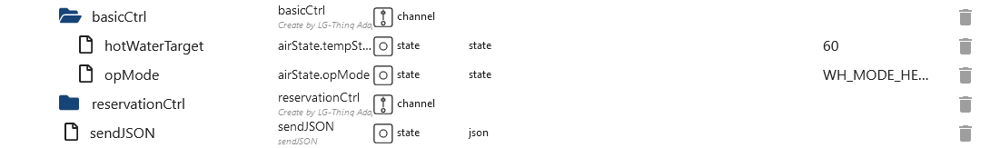

### 406 Remote reservationCtrl thinq2

[Краткое содержание](#summary)

- `remote.reservationCtrl.add_new_schedule` Создайте новое расписание. После этого будут созданы 3 новых поля данных, которые необходимо заполнить. Затем нажмите кнопку.`send_new_schedule` Чтобы сохранить новый слот, если он не будет отправлен, эти новые точки данных будут удалены после перезапуска.
- `remote.reservationCtrl.del_new_schedule` Удалите слот еще раз. Затем нажмите`send_new_schedule` ещё раз, чтобы данные были сохранены.
- `remote.reservationCtrl.send_new_schedule` Нажмите, чтобы сохранить изменения.
- `remote.reservationCtrl.01_end Enddatum` Пример 22:30.
- `remote.reservationCtrl.01_start Startdatum` Пример 21:30.
- `remote.reservationCtrl.01_state` Включить/Выключить

  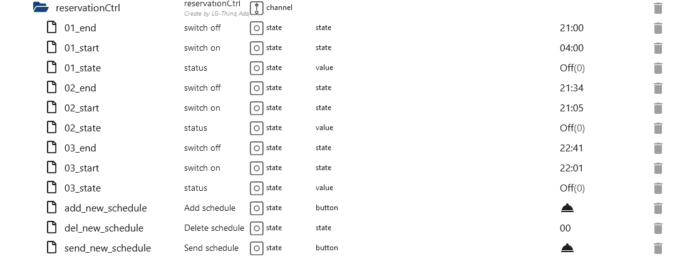

### 406 Снимок thinq2

[Краткое содержание](#summary)

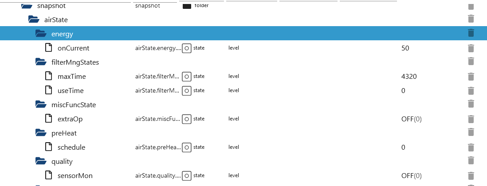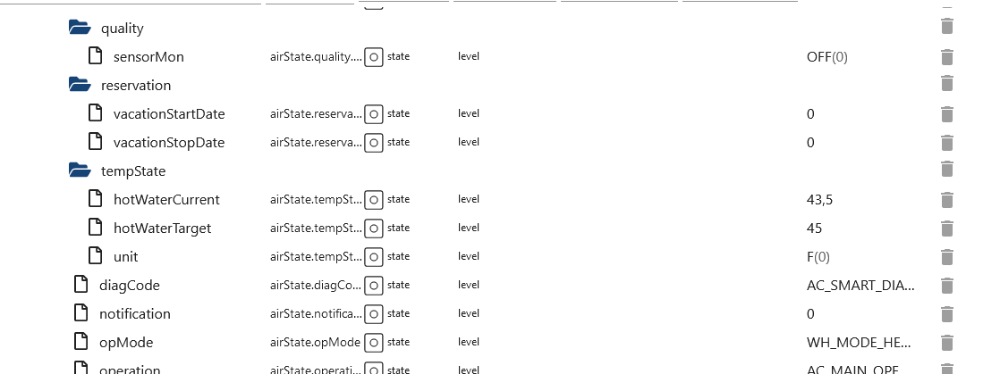

### Погода

[Краткое содержание](#summary)

Необходимо заполнить поле lg-thinq.0.xxx.are!

- `weather.device` Выберите зону. Если все устройства находятся в одной зоне, отобразится только одно устройство.
- `weather.humidity` Влажность
- `weather.temperature` Температура
- `weather.unit` Выберите градусы Цельсия или Фаренгейта.
- `weather.update` Запросите LG senden (устройство и устройство müssen gefüllt sein!)

  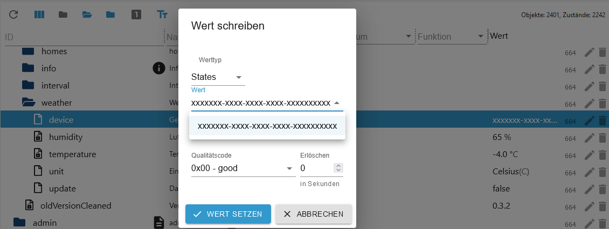

## Changelog
### 1.2.2 (2026-08-22)

- (Lucky-ESA) Added default header for login

### 1.2.1 (2026-08-14)

- (Lucky-ESA) Issue missing privKey fixed

### 1.2.0 (2026-05-31)

- (copilot) Adapter requires node.js >= 22 now
- (Lucky-ESA) Adapter requires admin >= 7.8.23 now
- (Lucky-ESA) Added translate for device 201

### 1.1.6 (2025-12-17)

- (Lucky-ESA) Fixed: Address Root-CA certificate has changed

### 1.1.5 (2025-12-15)

- (Lucky-ESA) Fixed adapter crash (thinq1 only)
- (Lucky-ESA) Fixed: Address Root-CA certificate has changed

[Older changelogs can be found there](CHANGELOG_OLD.md)

## License

MIT License

Copyright (c) 2021-2026 TA2k <tombox2020@gmail.com>

Permission is hereby granted, free of charge, to any person obtaining a copy
of this software and associated documentation files (the "Software"), to deal
in the Software without restriction, including without limitation the rights
to use, copy, modify, merge, publish, distribute, sublicense, and/or sell
copies of the Software, and to permit persons to whom the Software is
furnished to do so, subject to the following conditions:

The above copyright notice and this permission notice shall be included in all
copies or substantial portions of the Software.

THE SOFTWARE IS PROVIDED "AS IS", WITHOUT WARRANTY OF ANY KIND, EXPRESS OR
IMPLIED, INCLUDING BUT NOT LIMITED TO THE WARRANTIES OF MERCHANTABILITY,
FITNESS FOR A PARTICULAR PURPOSE AND NONINFRINGEMENT. IN NO EVENT SHALL THE
AUTHORS OR COPYRIGHT HOLDERS BE LIABLE FOR ANY CLAIM, DAMAGES OR OTHER
LIABILITY, WHETHER IN AN ACTION OF CONTRACT, TORT OR OTHERWISE, ARISING FROM,
OUT OF OR IN CONNECTION WITH THE SOFTWARE OR THE USE OR OTHER DEALINGS IN THE
SOFTWARE.