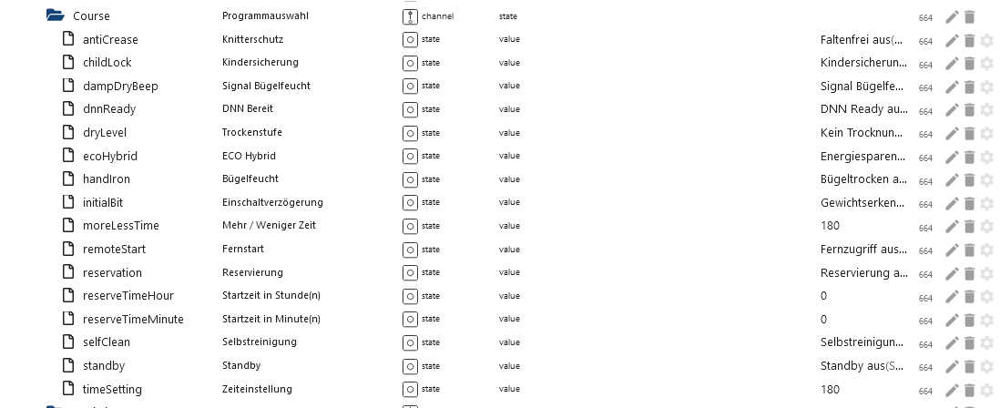

# IoBroker.lg-thinq
[Вернуться к README](/README.md)

# Введение
Адаптер создает все точки данных с шаблоном из точки данных `modelJsonUri` (отклонение для устройств) и использует преобразование с шаблоном из точки данных `langPackModelUri` (отклонение для устройств). Поэтому возможно, что в режиме REMOTE создаются точки данных, которые не имеют функции или недоступны для устройства.

# Краткое содержание
- [Настройки экземпляра](#instance-settings)
    - [Настройка LG-Thinq](#instance-setting-lg-thinq)
    - [Интервал Thinq1](#interval-thinq1-lg-thinq)
- [Точки данных](#точки данных)
    - [Устройство Datapoint 101 Холодильник/Морозильник](#device-101-холодильник-морозильник-thinq1--thinq2)
        - [Удаленная статистика](#101-remote-statistic-thinq2)
        - [Основные команды удаленного управления](#101-remote-control-thinq1--thinq2)
        - [Снимок](#101-snapshot-thinq1--thinq2)
    - [Подпись устройства Datapoint 201](#device-201-washer-signature-thinq2)
        - [Основные команды удаленного управления] (#201-remote-control-signature-thinq2)
    - [Стиральная машина Datapoint Device 201](#device-201-washer-thinq1--thinq2)
        - [Удаленная статистика](#201-remote-statistic-thinq2)
        - [Основные команды удаленного управления](#201-remote-control-thinq1--thinq2)
        - [Снимок](#201-snapshot-thinq1--thinq2)
    - [Datapoint Device 202 Dryer](#device-202-dryer-thinq1--thinq2)
        - [Удаленная статистика](#202-remote-statistic-thinq2)
        - [Основные команды удаленного управления](#202-remote-control-thinq1--thinq2)
        - [Снимок](#202-snapshot-thinq1--thinq2)
    - [Datapoint Device 401 кондиционер thinq2](#device-401-air-conditioner-thinq2)
        - [Удаленная статистика](#401-remote-statistic-thinq2)
        - [Основные команды удаленного управления] (#401-remote-control-thinq2)
        - [Удаленный отпуск] (#401-remote-holiday-thinq2)
        - [Снимок](#401-snapshot-thinq2)
    - [Datapoint Device 401 кондиционер thinq1](#device-401-air-conditioner-thinq1)
        - [Удаленная статистика](#401-remote-statistic-thinq1)
        - [Основные команды удаленного управления] (#401-remote-control-thinq1)
        - [Снимок](#401-snapshot-thinq1)
    - [Напорный насос Datapoint Device 406](#device-406-heat-pump-thinq2)
        - [Удаленная статистика](#406-remote-statistic-thinq2)
        - [Основные команды удаленного управления] (#406-remote-basicctrl-thinq2)
        - [Настройки удаленного расписания] (#406-remote-reservationctrl-thinq2)
        - [Снимок] (#406-snapshot-thinq2)

# Настройки экземпляра
### Настройка экземпляра LG-Thinq
[Краткое содержание](#summary)

- «Электронная почта LG ThinQ»: введите адрес электронной почты приложения.
- «Пароль LG ThinQ»: введите пароль приложения.
- «Интервал обновления в минутах»: рекомендуется: через 60 минут. Если интервал Thinq1 установлен на 0, то здесь будет 0,5/1 минута.
- «Интервал обновления в секундах для Thinq1 (на устройство 1 секунда)»: интервал для пользователей Thinq1.
- «Страна»: введите страну — по умолчанию DE.
- `Язык`: введите язык – по умолчанию de_DE.
- «Платформа»: введите платформу — LGThinQ по умолчанию.

 

### Интервальный think1 LG-Thinq
[Краткое содержание](#summary)

- `interval.active` Сколько устройств в настоящее время получают обновления.
- `interval.inactive` Сколько устройств в настоящее время не получают обновления
- `interval.interval` Изменить интервал в настройках экземпляра. После перезапуска адаптера настройки экземпляра применяются.
- `interval.last_update` Последнее обновление

    

# Точек данных
### Устройство 101 Холодильник/морозильник Thinq1 и ThinQ2
[Краткое содержание](#summary)

### 101 Все папки Thinq1 и Thinq2


### 101 Удаленная папка Thinq1 и Thinq2


### 101 Удаленная статистика think2
[Краткое содержание](#summary)

- `remote.Statistic.command` Какую историю следует загрузить
- почасово
- `remote.Statistic.endDate` Введите почасовую дату, конец и начало должны быть одинаковыми. Формат: 2023.12.01.
- `remote.Statistic.startDate` Введите почасовую дату, конец и начало должны быть одинаковыми. Формат: 2023.12.01.
- Или ежедневно
- `remote.Statistic.endDate` Введите дату ежедневно - Формат: 2023.12.06
- `remote.Statistic.startDate` Введите дату ежедневно - Формат: 2023.12.01
- Или ежемесячно
- `remote.Statistic.endDate` Введите дату ежемесячно - Формат: 2023.12.01
- `remote.Statistic.startDate` Введите дату ежемесячно - Формат: 2023.10.01
- `remote.Statistic. period` Выбор периода
- `remote.Statistic.sendRequest` Отправить выбор
- `remote.Statistic.jsonResult` Статистика в формате JSON. Если атрибуты пусты, значит ваше устройство их не поддерживает или была указана неправильная дата.

  

Пример JSON Дверь открыта

```json
{
  "item": [
    {
      "usedDate": "2023-11",
      "doorType": "DID_DOOR",
      "openCount": "0",
      "openTime": "0"
    },
    {
      "usedDate": "2023-12",
      "doorType": "DID_DOOR",
      "openCount": "0",
      "openTime": "0"
    },
    {
      "usedDate": "2023-11",
      "doorType": "FREEZER_DOOR",
      "openCount": "62",
      "openTime": "713937"
    },
    {
      "usedDate": "2023-12",
      "doorType": "FREEZER_DOOR",
      "openCount": "0",
      "openTime": "0"
    },
    {
      "usedDate": "2023-11",
      "doorType": "FRIDGE_DOOR",
      "openCount": "1037",
      "openTime": "12421700"
    },
    {
      "usedDate": "2023-12",
      "doorType": "FRIDGE_DOOR",
      "openCount": "27",
      "openTime": "304857"
    },
    {
      "usedDate": "2023-11",
      "doorType": "CONVERTIBLE_DOOR",
      "openCount": "0",
      "openTime": "0"
    },
    {
      "usedDate": "2023-12",
      "doorType": "CONVERTIBLE_DOOR",
      "openCount": "0",
      "openTime": "0"
    },
    {
      "usedDate": "2023-11",
      "doorType": "ONE_DOOR",
      "openCount": "0",
      "openTime": "0"
    },
    {
      "usedDate": "2023-12",
      "doorType": "ONE_DOOR",
      "openCount": "0",
      "openTime": "0"
    }
  ]
}
```

### 101 Пульт дистанционного управления Thinq1 и ThinQ2
[Краткое содержание](#summary)

- `remote.expressMode` Экспресс-режим вкл./выкл./быстрое включение -> Thinq1 Datapoint Snapshot.IcePlus
- `remote.freezerTemp` Изменить температуру морозильной камеры (только по Цельсию)
- `remote.fridgeTemp` Изменить температуру холодильника (только по Цельсию)

    

### 101 Снимок Thinq1 и Thinq2
[Краткое содержание](#summary)

 

### Устройство 201 Шайба Signature thinkq2
[Краткое содержание](#summary)

### 201 Подпись пульта дистанционного управления think2
- Можно управлять, как и 201. Однако в папке «Курс» необходимо установить следующие значения.
- В папке курса: InitialBit на INITIAL_BIT_ON
- В папке курса: RemoteStart на REMOTE_START_ON

### Устройство 201 Шайба Thinq1 и ThinQ2
[Краткое содержание](#summary)

### 201 Все папки Thinq1 и Thinq2


### 201 Удаленная папка Thinq1 и Thinq2


### 201 Удаленная статистика think2
[Краткое содержание](#summary)

- почасово
- `remote.Statistic.endDate` Введите почасовую дату, конец и начало должны быть одинаковыми. Формат: 2023.12.01.
- `remote.Statistic.startDate` Введите почасовую дату, конец и начало должны быть одинаковыми. Формат: 2023.12.01.
- Или ежедневно
- `remote.Statistic.endDate` Введите дату ежедневно - Формат: 2023.12.06
- `remote.Statistic.startDate` Введите дату ежедневно - Формат: 2023.12.01
- Или ежемесячно
- `remote.Statistic.endDate` Введите дату ежемесячно - Формат: 2023.12.01
- `remote.Statistic.startDate` Введите дату ежемесячно - Формат: 2023.10.01
- `remote.Statistic. period` Выбор периода
- `remote.Statistic.sendRequest` Отправить выбор
- `remote.Statistic.jsonResult` Статистика в формате JSON. Если атрибуты пусты, значит ваше устройство их не поддерживает или была указана неверная дата.

    

```json
{
  "count": 0,
  "power": 0,
  "energyWater": 0,
  "energyDetergent": 0,
  "energySoftener": 0,
  "powerWh": 0,
  "periodicEnergyData": 0,
  "item": [
    {
      "usedDate": "2023-12-04",
      "count": 0,
      "power": 0,
      "energyWater": 0,
      "energyDetergent": 0,
      "energySoftener": 0,
      "powerWh": 0,
      "periodicEnergyData": 0
    },
    {
      "usedDate": "2023-12-05",
      "count": 0,
      "power": 0,
      "energyWater": 0,
      "energyDetergent": 0,
      "energySoftener": 0,
      "powerWh": 0,
      "periodicEnergyData": 0
    },
    {
      "usedDate": "2023-12-06",
      "count": 2,
      "power": 2,
      "energyWater": 0,
      "energyDetergent": 0,
      "energySoftener": 0,
      "powerWh": 0,
      "periodicEnergyData": 2
    },
    {
      "usedDate": "2023-12-07",
      "count": 2,
      "power": 2,
      "energyWater": 0,
      "energyDetergent": 0,
      "energySoftener": 0,
      "powerWh": 0,
      "periodicEnergyData": 2
    },
    {
      "usedDate": "2023-12-08",
      "count": 5,
      "power": 5,
      "energyWater": 0,
      "energyDetergent": 0,
      "energySoftener": 0,
      "powerWh": 0,
      "periodicEnergyData": 5
    },
    {
      "usedDate": "2023-12-09",
      "count": 0,
      "power": 0,
      "energyWater": 0,
      "energyDetergent": 0,
      "energySoftener": 0,
      "powerWh": 0,
      "periodicEnergyData": 0
    },
    {
      "usedDate": "2023-12-10",
      "count": 0,
      "power": 0,
      "energyWater": 0,
      "energyDetergent": 0,
      "energySoftener": 0,
      "powerWh": 0,
      "periodicEnergyData": 0
    }
  ]
}
```

### 201 Пульт дистанционного управления Thinq1 и ThinQ2
[Краткое содержание](#summary)

- `remote.Favorite` Работает только тогда, когда в приложении выбран избранный элемент и когда машина включена.
- `remote.LastCourse` Можно выбрать последние 10 программ.
- `remote.WMDownload_Select` Выбор всех доступных программ (STD=Standard/DL=Загрузить программы)

Когда одна из трех точек данных заполнена, выбранная программа записывается в папку «Курс». Затем вы можете внести коррективы здесь. Однако не все точки данных в папке `Course` можно изменить. Пожалуйста, проверьте сами, какие данные принимает стиральная машина.

- `remote.WMDownload` При нажатии программа из папки «Курс» переносится на стиральную машину и отображается на дисплее (стиральная машина должна быть включена).
- `remote.WMStart` Запуск стиральной машины
- `remote.WMStop` Стопорная шайба
- `remote.WMWakeup` Стиральная машина-будильник

 

### 201 Снимок Thinq1 и Thinq2
[Краткое содержание](#summary)

  

### Устройство 202 Сушилка Thinq1 и ThinQ2
[Краткое содержание](#summary)

### 202 Все папки Thinq1 и Thinq2


### 202 Удаленная папка Thinq1 и Thinq2


### 202 Удаленная статистика think2
[Краткое содержание](#summary)

- почасово
- `remote.Statistic.endDate` Введите почасовую дату, конец и начало должны быть одинаковыми. Формат: 2023.12.01.
- `remote.Statistic.startDate` Введите почасовую дату, конец и начало должны быть одинаковыми. Формат: 2023.12.01.
- Или ежедневно
- `remote.Statistic.endDate` Введите дату ежедневно - Формат: 2023.12.06
- `remote.Statistic.startDate` Введите дату ежедневно - Формат: 2023.12.01
- Или ежемесячно
- `remote.Statistic.endDate` Введите дату ежемесячно - Формат: 2023.12.01
- `remote.Statistic.startDate` Введите дату ежемесячно - Формат: 2023.10.01
- `remote.Statistic. period` Выбор периода
- `remote.Statistic.sendRequest` Отправить выбор
- `remote.Statistic.jsonResult` Статистика в формате JSON. Если атрибуты пусты, значит ваше устройство их не поддерживает или была указана неверная дата.

    

```json
{
  "count": 0,
  "power": 0,
  "energyWater": 0,
  "energyDetergent": 0,
  "energySoftener": 0,
  "powerWh": 0,
  "periodicEnergyData": 0,
  "item": [
    {
      "usedDate": "2023-12-08",
      "count": 5,
      "power": 2587, // 2587 / 1000 kwh
      "energyWater": 0,
      "energyDetergent": 0,
      "energySoftener": 0,
      "powerWh": 0,
      "periodicEnergyData": 2587
    }
  ]
}
```

### 202 Пульт дистанционного управления Thinq1 и ThinQ2
[Краткое содержание](#summary)

- `remote.Favorite` Работает только тогда, когда в приложении выбран избранный элемент и когда машина включена.
- `remote.LastCourse` Можно выбрать последние 10 программ.
- `remote.WMDownload_Select` Выбор всех доступных программ (STD=Standard/DL=Загрузить программы)

Когда одна из трех точек данных заполнена, выбранная программа записывается в папку «Курс». Затем вы можете внести коррективы здесь. Однако не все точки данных в папке `Course` можно изменить. Пожалуйста, проверьте сами, какие данные принимает сушильная машина.

- `remote.WMDownload` Нет функции
- `remote.WMStart` При нажатии программа из папки "Курс" переносится на сушилку и отображается на дисплее (сушилка должна быть включена).
- `remote.WMStop` Остановить сушилку
- `remote.WMWakeup` Сушилка для пробуждения

 

### 202 Снимок Thinq1 и Thinq2
[Краткое содержание](#summary)

  

### Устройство 401 Кондиционер thinkq2
[Краткое содержание](#summary)

### 401 Все папки thinkq2


### 401 Удаленная папка thinkq2


### 401 Удаленная статистика think2
[Краткое содержание](#summary)

- `remote.Statistic.command` Какую историю следует загрузить
- почасово
- `remote.Statistic.endDate` Введите почасовую дату, конец и начало должны быть одинаковыми. Формат: 2023.12.01.
- `remote.Statistic.startDate` Введите почасовую дату, конец и начало должны быть одинаковыми. Формат: 2023.12.01.
- Или ежедневно
- `remote.Statistic.endDate` Введите дату ежедневно - Формат: 2023.12.06
- `remote.Statistic.startDate` Введите дату ежедневно - Формат: 2023.12.01
- Или ежемесячно
- `remote.Statistic.endDate` Введите дату ежемесячно - Формат: 2023.12.01
- `remote.Statistic.startDate` Введите дату ежемесячно - Формат: 2023.10.01
- `remote.Statistic. period` Выбор периода
- `remote.Statistic.sendRequest` Отправить выбор
- `remote.Statistic.jsonResult` Статистика в формате JSON. Если атрибуты пусты, значит ваше устройство их не поддерживает или была указана неверная дата.

    

```json
[
  {
    "usedDate": "2023-04",
    "energyData": "0",
    "operationTime": "0"
  },
  {
    "usedDate": "2023-05",
    "energyData": "0",
    "operationTime": "0"
  },
  {
    "usedDate": "2023-06",
    "energyData": "3800",
    "operationTime": "13873"
  }
]
```

### 401 Пульт дистанционного управления think2
[Краткое содержание](#summary)

- `remote.basicCtrl.operation` 0 для выключения
- `remote.basicCtrl.operation` 1 для включения
- `remote.basicCtrl.target` желаемая температура

- Если в журнале появляется сообщение об ошибке 400, значит, эта точка данных несовместима с устройством.

 

### 401 Удаленный отпуск think2
[Краткое содержание](#summary)

- `remote.break.holiday_silent_update` Текущие данные всегда должны сначала загружаться из облака.
- `remote.break.holiday_silent_data` Текущее расписание из облака.
- `remote.break.holiday_startdate` Введите здесь дату начала режима отпуска. Дата не может быть в прошлом (формат ДД.ММ.ГГ ЧЧ:ММ).
- `remote.break.holiday_enddate` Введите здесь дату окончания режима отпуска. Дата не может быть в прошлом и должна быть больше даты начала (формат ДД.ММ.ГГ ЧЧ:ММ).
- `remote.break.holiday_heating` Включение/выключение отопления (как в приложении)
- `remote.break.holiday_water` Включение/выключение горячей воды (как в приложении)
- `remote.break.holiday_onoff` Только вышеупомянутое. Заполните точки данных, а затем активируйте/деактивируйте режим отпуска здесь.
- `remote.break.silent_mode_starttime` Введите здесь время начала режима низкого шума. (Формат ЧЧ:ММ)
- `remote.break.silent_mode_endtime` Введите здесь время окончания тихого режима. Конечно, она должна быть больше даты начала. (Формат ЧЧ:ММ)
- `remote.break.silent_mode_onoff` Включить/выключить тихий режим
- `remote.break.holiday_sendJSON` Предназначен только для экспертов. JSON имеет массив, состоящий из JSON типов 1, 2 и 3. 1 обозначает время выполнения, 2 — режим отпуска и тип 3 — тихий режим. Теперь вы можете добавить дополнительные JSON к типу 1 и, таким образом, увеличить время переключения.


### 401 Снимок thinkq2
[Краткое содержание](#summary)

    

### Устройство 401 Кондиционер thinkq1
[Краткое содержание](#summary)

### 401 Удаленная статистика think1
[Краткое содержание](#summary)

- почасово
- `remote.Statistic.endDate` Введите почасовую дату, конец и начало должны быть одинаковыми. Формат: 2023.12.01.
- `remote.Statistic.startDate` Введите почасовую дату, конец и начало должны быть одинаковыми. Формат: 2023.12.01.
- Или ежедневно
- `remote.Statistic.endDate` Введите дату ежедневно - Формат: 2023.12.06
- `remote.Statistic.startDate` Введите дату ежедневно - Формат: 2023.12.01
- Или ежемесячно
- `remote.Statistic.endDate` Введите дату ежемесячно - Формат: 2023.12.01
- `remote.Statistic.startDate` Введите дату ежемесячно - Формат: 2023.10.01
- `remote.Statistic. period` Выбор периода
- `remote.Statistic.sendRequest` Отправить выбор
- `remote.Statistic.jsonResult` Статистика в формате JSON. Если атрибуты пусты, значит ваше устройство их не поддерживает или была указана неправильная дата.

    

```json
[
  {
    "month": 0,
    "day": "03",
    "hour": 0,
    "min": "16",
    "kwh": 0.1
  },
  {
    "month": 0,
    "day": "04",
    "hour": 0,
    "min": "59",
    "kwh": 0.2
  },
  {
    "month": 0,
    "day": "06",
    "hour": 0,
    "min": "15",
    "kwh": 0.1
  },
  {
    "month": 0,
    "day": "07",
    "hour": 0,
    "min": "40",
    "kwh": 0.1
  },
  {
    "month": 0,
    "day": "09",
    "hour": 0,
    "min": "35",
    "kwh": 0.2
  },
  {
    "month": 0,
    "day": "10",
    "hour": 0,
    "min": "60",
    "kwh": 0.2
  },
  {
    "month": 0,
    "day": "11",
    "hour": 0,
    "min": "60",
    "kwh": 0.2
  },
  {
    "month": 0,
    "day": "12",
    "hour": 0,
    "min": "90",
    "kwh": 0.3
  }
]
```

### 401 Пульт дистанционного управления thinkq1


[Краткое содержание](#summary)

Какие точки данных принадлежат набору... точек данных, указано в названии точки данных.
lg-thinq.0.xxx.remote.SetWDirLeftRight -> {"`WDirLeftRight`":"{{WDirLeftRight}}","`WDirUpDown`":"0"}

- Включите пример:
- для `remote.settings.Operation` установлено значение 1
- `remote.SetOperation` затем установите для этой точки данных значение true

- Пример отключения:
- для `remote.settings.Operation` установлено значение 0
- `remote.SetOperation` затем установите для этой точки данных значение true

- Пример изменения температуры:
- `remote.settings.TempCfg` Введите температуру
- `remote.SetTempCfg` затем установите для этой точки данных значение true

- Другой пример:
- для `remote.settings.WDirUpDown` установлено значение 0
- `remote.settings.WDirLeftRight` 0 или 1
- `remote.SetWDirLeftRight`, затем установите для этой точки данных значение true

    

### 401 Снимок thinkq1
[Краткое содержание](#summary)

      

### Устройство 406 Тепловой насос thinkq2
[Краткое содержание](#summary)

### 406 Все папки thinkq2


### 406 Удаленная папка thinkq2


### 406 Удаленная статистика think2
[Краткое содержание](#summary)

- `remote.Statistic.command` Какую историю следует загрузить
- почасово
- `remote.Statistic.endDate` Введите почасовую дату, конец и начало должны быть одинаковыми. Формат: 2023.12.01.
- `remote.Statistic.startDate` Введите почасовую дату, конец и начало должны быть одинаковыми. Формат: 2023.12.01.
- Или ежедневно
- `remote.Statistic.endDate` Введите дату ежедневно - Формат: 2023.12.06
- `remote.Statistic.startDate` Введите дату ежедневно - Формат: 2023.12.01
- Или ежемесячно
- `remote.Statistic.endDate` Введите дату ежемесячно - Формат: 2023.12.01
- `remote.Statistic.startDate` Введите дату ежемесячно - Формат: 2023.10.01
- `remote.Statistic. period` Выбор периода
- `remote.Statistic.sendRequest` Отправить выбор
- `remote.Statistic.jsonResult` Статистика в формате JSON. Если атрибуты пусты, значит ваше устройство их не поддерживает или была указана неправильная дата.

    

### 406 Удаленный основнойCtrl thinkq2
[Краткое содержание](#summary)

- `remote.basicCtrl.hotWaterTarget` Установка температуры
- `remote.basicCtrl.opMode` Установить режим

    

### 406 Удаленное резервированиеCtrlthinq2
[Краткое содержание](#summary)

- `remote.reservationCtrl.add_new_schedule` Создайте новое расписание. Затем будут созданы 3 новые точки данных, которые необходимо заполнить. Затем нажмите send_new_schedule, чтобы сохранить новый слот. Если он не отправлен, эти новые точки данных будут удалены после перезапуска.
- `remote.reservationCtrl.del_new_schedule` Снова удалите слот. Затем снова нажмите send_new_schedule, чтобы данные были сохранены.
- `remote.reservationCtrl.send_new_schedule` Нажмите, чтобы сохранить изменения.
- `remote.reservationCtrl.01_end Enddatum` Пример 22:30.
- `remote.reservationCtrl.01_start Startdatum` Пример 21:30.
- `remote.reservationCtrl.01_state` Включить/Отключить

    

### 406 Снимок think2
[Краткое содержание](#summary)

 

## Changelog
### **WORK IN PROGRESS**

-   (Lucky-ESA) Added save modelJSON local

### 0.3.1 (2023-12-20)

-   (Lucky-ESA) Fixed crash thinq1 interval

### 0.3.0 (2023-12-15)

-   (Lucky-ESA) Added device 406 (heat pump)
-   (Lucky-ESA) Added description
-   (Lucky-ESA) Added new thinq1 interval
-   (Lucky-ESA) Added statistic for thinq1 device 401
-   (Lucky-ESA) Bugfixe

### 0.2.0

-   (Lucky-ESA) Added automatic terms acceptance
-   (Lucky-ESA) Added 401 Thinq1 device
-   (Lucky-ESA) Added 101 Thinq1 device
-   (TA2k) Bugfix

### 0.1.4

-   (TA2k) Added warning for not supported devices

### 0.1.1

-   (TA2k) Added AC Device 401 thinq2
-   (TA2k) Bugfix

### 0.1.0

-   (TA2k) Added MQTT connection for live status updates

### 0.0.3

-   (TA2k) initial release

## License

MIT License

Copyright (c) 2021-2023 TA2k <tombox2020@gmail.com>

Permission is hereby granted, free of charge, to any person obtaining a copy
of this software and associated documentation files (the "Software"), to deal
in the Software without restriction, including without limitation the rights
to use, copy, modify, merge, publish, distribute, sublicense, and/or sell
copies of the Software, and to permit persons to whom the Software is
furnished to do so, subject to the following conditions:

The above copyright notice and this permission notice shall be included in all
copies or substantial portions of the Software.

THE SOFTWARE IS PROVIDED "AS IS", WITHOUT WARRANTY OF ANY KIND, EXPRESS OR
IMPLIED, INCLUDING BUT NOT LIMITED TO THE WARRANTIES OF MERCHANTABILITY,
FITNESS FOR A PARTICULAR PURPOSE AND NONINFRINGEMENT. IN NO EVENT SHALL THE
AUTHORS OR COPYRIGHT HOLDERS BE LIABLE FOR ANY CLAIM, DAMAGES OR OTHER
LIABILITY, WHETHER IN AN ACTION OF CONTRACT, TORT OR OTHERWISE, ARISING FROM,
OUT OF OR IN CONNECTION WITH THE SOFTWARE OR THE USE OR OTHER DEALINGS IN THE
SOFTWARE.