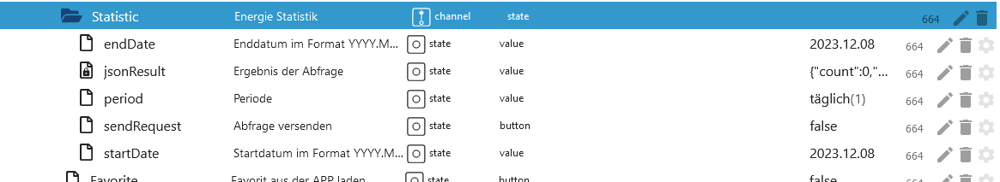
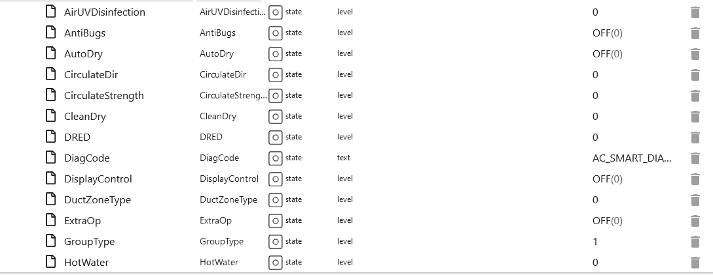
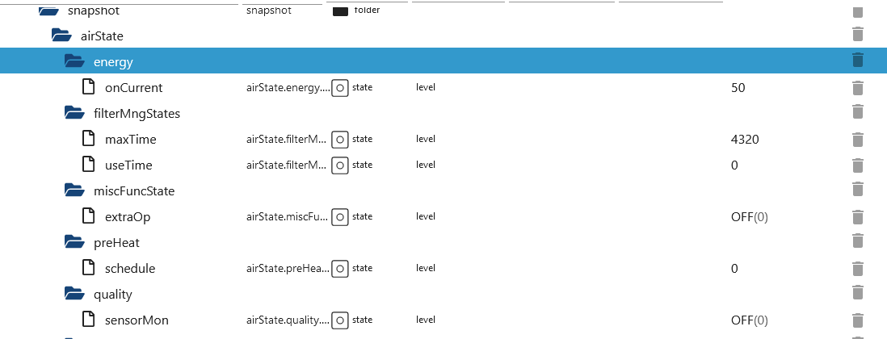
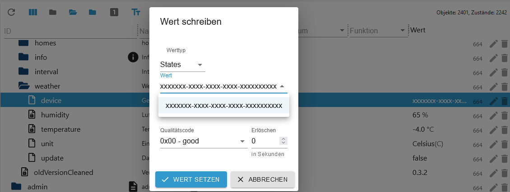

# IoBroker.lg-thinq
[Вернуться к README](/README.md)

# Введение
Адаптер создает все точки данных с шаблоном из точки данных `modelJsonUri` (отклонение для устройств) и использует перевод с шаблоном из точки данных `langPackModelUri` (отклонение для устройств). Поэтому возможно, что точки данных создаются в REMOTE, которые не имеют функции или недоступны для устройства.

# Краткое содержание
- [Настройки экземпляра](#instance-settings)
- [Настройка LG-Thinq](#instance-setting-lg-thinq)
- [Интервал Thinq1](#interval-thinq1-lg-thinq)
- [Штаты](#штаты)
- [Состояние устройства 101 Холодильник/Морозильник](#device-101-refrigeratorfreezer-thinq1--thinq2)
- [Удаленная статистика](#101-remote-statistic-thinq2)
- [Базовые команды дистанционного управления](#101-remote-control-thinq1--thinq2)
- [Снимок](#101-snapshot-thinq1--thinq2)
- [Сигнатура государственного устройства 201](#device-201-washer-signature-thinq2)
- [Базовые команды дистанционного управления](#201-remote-control-signature-thinq2)
- [Устройство состояния 201 Стиральная машина](#device-201-washer-thinq1--thinq2)
- [Удаленная статистика](#201-remote-statistic-thinq2)
- [Базовые команды дистанционного управления](#201-remote-control-thinq1--thinq2)
- [Снимок](#201-snapshot-thinq1--thinq2)
- [Состояние устройства 202 Сушилка](#device-202-dryer-thinq1--thinq2)
- [Удаленная статистика](#202-remote-statistic-thinq2)
- [Базовые команды дистанционного управления](#202-remote-control-thinq1--thinq2)
- [Снимок](#202-snapshot-thinq1--thinq2)
- [Устройство состояния 401 кондиционер thinq2](#device-401-air-conditioner-thinq2)
- [Удаленная статистика](#401-remote-statistic-thinq2)
- [Базовые команды дистанционного управления](#401-remote-control-thinq2)
- [Удаленный отпуск](#401-remote-holiday-thinq2)
- [Снимок](#401-snapshot-thinq2)
- [Устройство состояния 401 кондиционер thinq1](#device-401-air-conditioner-thinq1)
- [Удаленная статистика](#401-remote-statistic-thinq1)
- [Базовые команды дистанционного управления](#401-remote-control-thinq1)
- [Снимок](#401-snapshot-thinq1)
- [Устройство состояния 406 Напорный насос](#device-406-heat-pump-thinq2)
- [Удаленная статистика](#406-remote-statistic-thinq2)
- [Базовые команды удаленного управления](#406-remote-basicctrl-thinq2)
- [Настройки удаленного расписания](#406-remote-reservationctrl-thinq2)
- [Снимок](#406-snapshot-thinq2)
- [Погода](#погода)

# Настройки экземпляра
### Настройка экземпляра LG-Thinq
[Краткое содержание](#summary)

- `LG ThinQ Email`: введите адрес электронной почты приложения
- `LG ThinQ Password`: введите пароль приложения
- `Интервал обновления в минутах`: Рекомендуется: 60 минут. Если интервал thinq1 установлен на 0, то здесь 0,5/1 минута
- `Интервал обновления в секундах для Thinq1 (на устройство 1 секунда)`: Интервал для пользователей thinq1
- `Страна`: Введите страну - по умолчанию DE
- `Язык`: Введите язык - по умолчанию de_DE
- `Платформа`: Введите платформу - по умолчанию LGThinQ
- `Выбор метода регистрации` Переключение между старым сторонним входом или входом через приложение (вы получите электронное письмо)
- `Удалить данные сеанса`: Если возникли проблемы со входом в систему, удалите данные сеанса (lg-thinq.0.session wird geleert)

 

### Интервал thinq1 LG-Thinq
[Краткое содержание](#summary)

- `interval.active` Сколько устройств в данный момент получают обновления
- `interval.inactive` Сколько устройств в настоящее время не получают обновления
- `interval.interval` Изменить интервал из настройки экземпляра. После перезапуска адаптера настройка экземпляра применяется.
- `interval.last_update` Последнее обновление
- `interval.status_devices`
- `OK` Интервал ОК
- `Fail - 0100` Запрос не выполнен - WorkID создан заново
- `Fail - 0106` Устройство не подключено - WorkID создан заново
- `Ошибка` Ошибка WorkID - WorkID создается заново
    - `Ошибка <code>` Unknown error - WorkID is recreated</code>
- `Result Error` Ошибка получения - WorkID создается заново
- `Ошибка анализа` Ошибка анализа - WorkID создается заново
- `Unknown` Неизвестная ошибка - WorkID создается заново
- `Request` Receive неизвестен - WorkID создан заново
- `{}` Неизвестно - WorkID создается заново

    

# Штаты


### Устройство 101 Холодильник/Морозильник thinq1 и thinq2
[Краткое содержание](#summary)

### 101 Все папки thinq1 и thinq2


### 101 Удаленная папка thinq1 и thinq2


### 101 Удаленная статистика thinq2
[Краткое содержание](#summary)

- `remote.Statistic.command` Какую историю следует загрузить
- почасовая
- `remote.Statistic.endDate` Введите дату для почасового периода, конец и начало должны быть одинаковыми. Формат: 2023.12.01
- `remote.Statistic.startDate` Введите дату для почасового отчета, начало и конец должны быть одинаковыми. Формат: 2023.12.01
- Или ежедневно
- `remote.Statistic.endDate` Введите дату ежедневно - Формат: 2023.12.06
- `remote.Statistic.startDate` Введите дату ежедневно - Формат: 2023.12.01
- Или ежемесячно
- `remote.Statistic.endDate` Введите дату ежемесячно - Формат: 2023.12.01
- `remote.Statistic.startDate` Введите дату ежемесячно - Формат: 2023.10.01
- `remote.Statistic.period` Выбрать период
- `remote.Statistic.sendRequest` Отправить выборку
- `remote.Statistic.jsonResult` Статистика в формате JSON. Если атрибуты пустые, то ваше устройство их не поддерживает или указана неверная дата.

  

Пример JSON Открытие двери

```json
{
  "item": [
    {
      "usedDate": "2023-11",
      "doorType": "DID_DOOR",
      "openCount": "0",
      "openTime": "0"
    },
    {
      "usedDate": "2023-12",
      "doorType": "DID_DOOR",
      "openCount": "0",
      "openTime": "0"
    },
    {
      "usedDate": "2023-11",
      "doorType": "FREEZER_DOOR",
      "openCount": "62",
      "openTime": "713937"
    },
    {
      "usedDate": "2023-12",
      "doorType": "FREEZER_DOOR",
      "openCount": "0",
      "openTime": "0"
    },
    {
      "usedDate": "2023-11",
      "doorType": "FRIDGE_DOOR",
      "openCount": "1037",
      "openTime": "12421700"
    },
    {
      "usedDate": "2023-12",
      "doorType": "FRIDGE_DOOR",
      "openCount": "27",
      "openTime": "304857"
    },
    {
      "usedDate": "2023-11",
      "doorType": "CONVERTIBLE_DOOR",
      "openCount": "0",
      "openTime": "0"
    },
    {
      "usedDate": "2023-12",
      "doorType": "CONVERTIBLE_DOOR",
      "openCount": "0",
      "openTime": "0"
    },
    {
      "usedDate": "2023-11",
      "doorType": "ONE_DOOR",
      "openCount": "0",
      "openTime": "0"
    },
    {
      "usedDate": "2023-12",
      "doorType": "ONE_DOOR",
      "openCount": "0",
      "openTime": "0"
    }
  ]
}
```

### 101 Пульт дистанционного управления thinq1 и thinq2
[Краткое содержание](#summary)

- `remote.expressMode` Экспресс-режим вкл/выкл/быстрое включение -> снимок состояния thinq1.IcePlus
- `remote.freezerTemp` Изменить температуру морозильной камеры (только по Цельсию)
- `remote.fridgeTemp` Изменить температуру холодильника (только по Цельсию)

    

### 101 Снимок thinq1 и thinq2
[Краткое содержание](#summary)

 

### Устройство 201 Стиральная машина Подпись thinq2
[Краткое содержание](#summary)

### 201 Подпись пульта дистанционного управления thinq2
- Может управляться как 201. Однако в папке `Course` необходимо установить следующие значения.
- В папке курса: initialBit на INITIAL_BIT_ON
- В папке курса: remoteStart на REMOTE_START_ON

### Устройство 201 Стиральная машина thinq1 и thinq2
[Краткое содержание](#summary)

### 201 Все папки thinq1 и thinq2


### 201 Удаленная папка thinq1 и thinq2


### 201 Удаленная статистика thinq2
[Краткое содержание](#summary)

- почасовая
- `remote.Statistic.endDate` Введите дату для почасового периода, конец и начало должны быть одинаковыми. Формат: 2023.12.01
- `remote.Statistic.startDate` Введите дату для почасового отчета, начало и конец должны быть одинаковыми. Формат: 2023.12.01
- Или ежедневно
- `remote.Statistic.endDate` Введите дату ежедневно - Формат: 2023.12.06
- `remote.Statistic.startDate` Введите дату ежедневно - Формат: 2023.12.01
- Или ежемесячно
- `remote.Statistic.endDate` Введите дату ежемесячно - Формат: 2023.12.01
- `remote.Statistic.startDate` Введите дату ежемесячно - Формат: 2023.10.01
- `remote.Statistic.period` Выбрать период
- `remote.Statistic.sendRequest` Отправить выборку
- `remote.Statistic.jsonResult` Статистика в формате JSON. Если атрибуты пустые, то ваше устройство их не поддерживает или указана неверная дата.

    

```json
{
  "count": 0,
  "power": 0,
  "energyWater": 0,
  "energyDetergent": 0,
  "energySoftener": 0,
  "powerWh": 0,
  "periodicEnergyData": 0,
  "item": [
    {
      "usedDate": "2023-12-04",
      "count": 0,
      "power": 0,
      "energyWater": 0,
      "energyDetergent": 0,
      "energySoftener": 0,
      "powerWh": 0,
      "periodicEnergyData": 0
    },
    {
      "usedDate": "2023-12-05",
      "count": 0,
      "power": 0,
      "energyWater": 0,
      "energyDetergent": 0,
      "energySoftener": 0,
      "powerWh": 0,
      "periodicEnergyData": 0
    },
    {
      "usedDate": "2023-12-06",
      "count": 2,
      "power": 2,
      "energyWater": 0,
      "energyDetergent": 0,
      "energySoftener": 0,
      "powerWh": 0,
      "periodicEnergyData": 2
    },
    {
      "usedDate": "2023-12-07",
      "count": 2,
      "power": 2,
      "energyWater": 0,
      "energyDetergent": 0,
      "energySoftener": 0,
      "powerWh": 0,
      "periodicEnergyData": 2
    },
    {
      "usedDate": "2023-12-08",
      "count": 5,
      "power": 5,
      "energyWater": 0,
      "energyDetergent": 0,
      "energySoftener": 0,
      "powerWh": 0,
      "periodicEnergyData": 5
    },
    {
      "usedDate": "2023-12-09",
      "count": 0,
      "power": 0,
      "energyWater": 0,
      "energyDetergent": 0,
      "energySoftener": 0,
      "powerWh": 0,
      "periodicEnergyData": 0
    },
    {
      "usedDate": "2023-12-10",
      "count": 0,
      "power": 0,
      "energyWater": 0,
      "energyDetergent": 0,
      "energySoftener": 0,
      "powerWh": 0,
      "periodicEnergyData": 0
    }
  ]
}
```

### 201 Пульт дистанционного управления thinq1 и thinq2
[Краткое содержание](#summary)

- `remote.Favorite` Работает только в том случае, если в приложении выбрано избранное и устройство включено.
- `remote.LastCourse` Можно выбрать последние 10 программ.
- `remote.WMDownload_Select` Выбор всех доступных программ (STD=Стандартные/DL=Загрузить программы)

Когда одна из 3 точек данных заполнена, выбранная программа записывается в папку Course. Затем вы можете внести здесь изменения. Однако не все точки данных в папке `Course` могут быть изменены. Пожалуйста, проверьте сами, какие данные принимает стиральная машина.

- `remote.WMDownload` При нажатии программа из папки «Course» переносится в стиральную машину и отображается на дисплее (стиральная машина должна быть включена).
- `remote.WMStart` Запустить стиральную машину
- `remote.WMStop` Остановить стиральную машину
- `remote.WMWakeup` Пробуждение стиральной машины

 

### 201 Снимок thinq1 и thinq2
[Краткое содержание](#summary)

  

### Устройство 202 Сушилка thinq1 и thinq2
[Краткое содержание](#summary)

### 202 Все папки thinq1 и thinq2


### 202 Удаленная папка thinq1 и thinq2


### 202 Удаленная статистика thinq2
[Краткое содержание](#summary)

- почасовая
- `remote.Statistic.endDate` Введите дату для почасового периода, конец и начало должны быть одинаковыми. Формат: 2023.12.01
- `remote.Statistic.startDate` Введите дату для почасового отчета, начало и конец должны быть одинаковыми. Формат: 2023.12.01
- Или ежедневно
- `remote.Statistic.endDate` Введите дату ежедневно - Формат: 2023.12.06
- `remote.Statistic.startDate` Введите дату ежедневно - Формат: 2023.12.01
- Или ежемесячно
- `remote.Statistic.endDate` Введите дату ежемесячно - Формат: 2023.12.01
- `remote.Statistic.startDate` Введите дату ежемесячно - Формат: 2023.10.01
- `remote.Statistic.period` Выбрать период
- `remote.Statistic.sendRequest` Отправить выборку
- `remote.Statistic.jsonResult` Статистика в формате JSON. Если атрибуты пустые, то ваше устройство их не поддерживает или указана неверная дата.

    

```json
{
  "count": 0,
  "power": 0,
  "energyWater": 0,
  "energyDetergent": 0,
  "energySoftener": 0,
  "powerWh": 0,
  "periodicEnergyData": 0,
  "item": [
    {
      "usedDate": "2023-12-08",
      "count": 5,
      "power": 2587, // 2587 / 1000 kwh
      "energyWater": 0,
      "energyDetergent": 0,
      "energySoftener": 0,
      "powerWh": 0,
      "periodicEnergyData": 2587
    }
  ]
}
```

### 202 Пульт дистанционного управления thinq1 и thinq2
[Краткое содержание](#summary)

- `remote.Favorite` Работает только в том случае, если в приложении выбрано избранное и устройство включено.
- `remote.LastCourse` Можно выбрать последние 10 программ.
- `remote.WMDownload_Select` Выбор всех доступных программ (STD=Стандартные/DL=Загрузить программы)

Когда одна из 3 точек данных заполнена, выбранная программа записывается в папку Course. Затем вы можете внести здесь изменения. Однако не все точки данных в папке `Course` могут быть изменены. Пожалуйста, проверьте сами, какие данные принимает сушилка.

- `remote.WMDownload` Нет функции
- `remote.WMStart` При нажатии программа из папки «Курс» переносится в сушилку и отображается на дисплее (сушилка должна быть включена).
- `remote.WMStop` Остановка сушилки
- `remote.WMWakeup` Пробуждение сушилки

 

### 202 Снимок thinq1 и thinq2
[Краткое содержание](#summary)

  

### Устройство 401 Кондиционер thinq2
[Краткое содержание](#summary)

### 401 Все папки thinq2


### 401 Удаленная папка thinq2


### 401 Удаленная статистика thinq2
[Краткое содержание](#summary)

- `remote.Statistic.command` Какую историю следует загрузить
- почасовая
- `remote.Statistic.endDate` Введите дату для почасового периода, конец и начало должны быть одинаковыми. Формат: 2023.12.01
- `remote.Statistic.startDate` Введите дату для почасового отчета, начало и конец должны быть одинаковыми. Формат: 2023.12.01
- Или ежедневно
- `remote.Statistic.endDate` Введите дату ежедневно - Формат: 2023.12.06
- `remote.Statistic.startDate` Введите дату ежедневно - Формат: 2023.12.01
- Или ежемесячно
- `remote.Statistic.endDate` Введите дату ежемесячно - Формат: 2023.12.01
- `remote.Statistic.startDate` Введите дату ежемесячно - Формат: 2023.10.01
- `remote.Statistic.period` Выбрать период
- `remote.Statistic.sendRequest` Отправить выборку
- `remote.Statistic.jsonResult` Статистика в формате JSON. Если атрибуты пустые, то ваше устройство их не поддерживает или указана неверная дата.

    

```json
[
  {
    "usedDate": "2023-04",
    "energyData": "0",
    "operationTime": "0"
  },
  {
    "usedDate": "2023-05",
    "energyData": "0",
    "operationTime": "0"
  },
  {
    "usedDate": "2023-06",
    "energyData": "3800",
    "operationTime": "13873"
  }
]
```

### 401 Пульт дистанционного управления thinq2
[Краткое содержание](#summary)

- `remote.basicCtrl.operation` 0 для выключения и 1 для включения
- `remote.basicCtrl.opMode` 0 для выключения и 4 для включения
- `remote.basicCtrl.hotWater` 0 для выключения и 1 для включения
- `remote.basicCtrl.hotWaterTarget` желаемая температура
- `remote.basicCtrl.powerHotWater` Увеличить 0 для выключения и 1 для включения
- `remote.basicCtrl.target` желаемая температура

- Если в журнале появляется сообщение об ошибке 400, то эта точка данных несовместима с устройством.

 

### 401 Удаленный отпуск thinq2
[Краткое содержание](#summary)

- `remote.break.holiday_silent_update` Текущие данные всегда должны быть сначала загружены из облака.
- `remote.break.holiday_silent_data` Текущее расписание из облака.
- `remote.break.holiday_startdate` Введите здесь дату начала режима отпуска. Дата не может быть в прошлом (формат ДД.ММ.ГГ ЧЧ:ММ)
- `remote.break.holiday_enddate` Введите здесь дату окончания режима отпуска. Дата не может быть в прошлом и должна быть больше даты начала (формат ДД.ММ.ГГ ЧЧ:ММ)
- `remote.break.holiday_heating` Включение/выключение отопления (как в приложении)
- `remote.break.holiday_water` Включение/выключение горячей воды (как в приложении)
- `remote.break.holiday_onoff` Только указанные выше заполните точки данных, а затем активируйте/деактивируйте режим отпуска здесь
- `remote.break.silent_mode_starttime` Введите здесь время начала режима низкого шума. (Формат ЧЧ:ММ)
- `remote.break.silent_mode_endtime` Введите здесь время окончания тихого режима. Конечно, оно должно быть больше даты начала. (Формат ЧЧ:ММ)
- `remote.break.silent_mode_onoff` Включить/выключить тихий режим
- `remote.break.holiday_sendJSON` Предназначено только для экспертов. JSON имеет массив, состоящий из JSON Type 1, 2 и 3. 1 обозначает время выполнения, 2 — режим отпуска, а тип 3 — тихий режим. Теперь вы можете добавить дополнительные JSON к Type 1 и, таким образом, сгенерировать больше времени переключения.


### 401 Снимок thinq2
[Краткое содержание](#summary)

    

### Устройство 401 Кондиционер thinq1
[Краткое содержание](#summary)

### 401 Удаленная статистика thinq1
[Краткое содержание](#summary)

- почасовая
- `remote.Statistic.endDate` Введите дату для почасового периода, конец и начало должны быть одинаковыми. Формат: 2023.12.01
- `remote.Statistic.startDate` Введите дату для почасового сбора данных, начало и конец должны быть одинаковыми. Формат: 2023.12.01
- Или ежедневно
- `remote.Statistic.endDate` Введите дату ежедневно - Формат: 2023.12.06
- `remote.Statistic.startDate` Введите дату ежедневно - Формат: 2023.12.01
- Или ежемесячно
- `remote.Statistic.endDate` Введите дату ежемесячно - Формат: 2023.12.01
- `remote.Statistic.startDate` Введите дату ежемесячно - Формат: 2023.10.01
- `remote.Statistic.period` Выбрать период
- `remote.Statistic.sendRequest` Отправить выборку
- `remote.Statistic.jsonResult` Статистика в формате JSON. Если атрибуты пустые, то ваше устройство их не поддерживает или указана неверная дата.
- `remote.Statistic.ownrequest` Собственный запрос данных. Откройте файл по ссылке `modelJsonUri` и примените cmd, cmdOpt и value.
- `remote.Statistic.ownresponse` Результат `remote.Statistic.ownrequest`

    

```json
[
  {
    "month": 0,
    "day": "03",
    "hour": 0,
    "min": "16",
    "kwh": 0.1
  },
  {
    "month": 0,
    "day": "04",
    "hour": 0,
    "min": "59",
    "kwh": 0.2
  },
  {
    "month": 0,
    "day": "06",
    "hour": 0,
    "min": "15",
    "kwh": 0.1
  },
  {
    "month": 0,
    "day": "07",
    "hour": 0,
    "min": "40",
    "kwh": 0.1
  },
  {
    "month": 0,
    "day": "09",
    "hour": 0,
    "min": "35",
    "kwh": 0.2
  },
  {
    "month": 0,
    "day": "10",
    "hour": 0,
    "min": "60",
    "kwh": 0.2
  },
  {
    "month": 0,
    "day": "11",
    "hour": 0,
    "min": "60",
    "kwh": 0.2
  },
  {
    "month": 0,
    "day": "12",
    "hour": 0,
    "min": "90",
    "kwh": 0.3
  }
]
```

# Собственный запрос JSON
```json
{
  "method": "POST", // POST or GET Axios Request
  "url": "rti/rtiControl", // URL
  "data": {
    "lgedmRoot": {
      "deviceId": null, // Adapter replaces null
      "workId": null, // Adapter replaces null
      "cmd": "Config", // Change possible
      "cmdOpt": "Get", // Change possible
      "value": "InOutInstantPower", // Change possible
      "isControlFree": "Y" // DO NOT change
    }
  }
}
```

### 401 Пульт дистанционного управления thinq1


[Краткое содержание](#summary)

Какие точки данных принадлежат набору... точек данных указано в названии точки данных.
lg-thinq.0.xxx.remote.SetWDirLeftRight -> {"`WDirLeftRight`":"{{WDirLeftRight}}","`WDirUpDown`":"0"}

- Пример включения:
- `remote.settings.Operation` установлено на 1
- `remote.SetOperation`, затем установите эту точку данных в значение true

- Пример выключения:
- `remote.settings.Operation` установлен на 0
- `remote.SetOperation`, затем установите эту точку данных в значение true

- Пример изменения температуры:
- `remote.settings.TempCfg` Введите температуру
- `remote.SetTempCfg`, затем установите эту точку данных в значение true

- Другой пример:
- `remote.settings.WDirUpDown` установлен на 0
- `remote.settings.WDirLeftRight` 0 или 1
- `remote.SetWDirLeftRight`, затем установите эту точку данных в значение true

    

### 401 Снимок thinq1
[Краткое содержание](#summary)

      

### Устройство 406 Тепловой насос thinq2
[Краткое содержание](#summary)

### 406 Все папки thinq2


### 406 Удаленная папка thinq2


### 406 Удаленная статистика thinq2
[Краткое содержание](#summary)

- `remote.Statistic.command` Какую историю следует загрузить
- почасовая
- `remote.Statistic.endDate` Введите дату для почасового периода, конец и начало должны быть одинаковыми. Формат: 2023.12.01
- `remote.Statistic.startDate` Введите дату для почасового отчета, начало и конец должны быть одинаковыми. Формат: 2023.12.01
- Или ежедневно
- `remote.Statistic.endDate` Введите дату ежедневно - Формат: 2023.12.06
- `remote.Statistic.startDate` Введите дату ежедневно - Формат: 2023.12.01
- Или ежемесячно
- `remote.Statistic.endDate` Введите дату ежемесячно - Формат: 2023.12.01
- `remote.Statistic.startDate` Введите дату ежемесячно - Формат: 2023.10.01
- `remote.Statistic.period` Выбрать период
- `remote.Statistic.sendRequest` Отправить выборку
- `remote.Statistic.jsonResult` Статистика в формате JSON. Если атрибуты пустые, то ваше устройство их не поддерживает или указана неверная дата.

    

### 406 Удаленный basicCtrl thinq2
[Краткое содержание](#summary)

- `remote.basicCtrl.hotWaterTarget` Установка температуры
- `remote.basicCtrl.opMode` Установить режим

    

### 406 Удалённое резервированиеCtrl thinq2
[Краткое содержание](#summary)

- `remote.reservationCtrl.add_new_schedule` Создайте новое расписание. Затем будут созданы 3 новые точки данных, которые необходимо заполнить. Затем нажмите `send_new_schedule`, чтобы сохранить новый слот. Если он не будет отправлен, эти новые точки данных будут удалены после перезапуска.
- `remote.reservationCtrl.del_new_schedule` Удалить слот еще раз. Затем снова нажать `send_new_schedule`, чтобы сохранить данные.
- `remote.reservationCtrl.send_new_schedule` Нажмите, чтобы сохранить изменения.
- `remote.reservationCtrl.01_end Enddatum` Пример 22:30.
- `remote.reservationCtrl.01_start Начальная дата` Пример 21:30.
- `remote.reservationCtrl.01_state` Включить/Отключить

    

### 406 Снимок thinq2
[Краткое содержание](#summary)

 

### Погода
[Краткое содержание](#summary)

lg-thinq.0.xxx.area должен быть заполнен!

- `weather.device` Выберите область. Если все устройства имеют одинаковую область, отображается только одно устройство.
- `weather.humidity` Влажность
- `погода.температура` Температура
- `weather.unit` Выберите градусы Цельсия или Фаренгейта
- `weather.update` Запросить отправку LG (устройство и устройство müssen gefüllt sein!)

    

## Changelog
### 1.0.7 (2024-12-08)

-   (Lucky-ESA) Fixed: Connection status does not turn green
-   (Lucky-ESA) Changed: Checkbox to dropdown for login procedure

### 1.0.6 (2024-12-07)

-   (Lucky-ESA) Save session data (prevents the login email)
-   (Lucky-ESA) Fixed invalid jsonConfig
-   (Lucky-ESA) Added choice between old and new login
-   (Lucky-ESA) Bugfixe

### 1.0.5 (2024-12-02)

-   (Lucky-ESA) Migration to ESLint9
-   (Lucky-ESA) Bugfixe

### 1.0.4 (2024-12-01)

-   (TA2k) Login fixed
-   (Lucky-ESA) Added hotwater for device 406 & 401
-   (Lucky-ESA) Dependencies updated

### 1.0.2 (2024-09-10)

-   (Lucky-ESA) Dependencies updated
-   (Lucky-ESA) Changed autoDryRemainTime max value
-   (Lucky-ESA) Added own request for 401 thinq1

## License

MIT License

Copyright (c) 2021-2024 TA2k <tombox2020@gmail.com>

Permission is hereby granted, free of charge, to any person obtaining a copy
of this software and associated documentation files (the "Software"), to deal
in the Software without restriction, including without limitation the rights
to use, copy, modify, merge, publish, distribute, sublicense, and/or sell
copies of the Software, and to permit persons to whom the Software is
furnished to do so, subject to the following conditions:

The above copyright notice and this permission notice shall be included in all
copies or substantial portions of the Software.

THE SOFTWARE IS PROVIDED "AS IS", WITHOUT WARRANTY OF ANY KIND, EXPRESS OR
IMPLIED, INCLUDING BUT NOT LIMITED TO THE WARRANTIES OF MERCHANTABILITY,
FITNESS FOR A PARTICULAR PURPOSE AND NONINFRINGEMENT. IN NO EVENT SHALL THE
AUTHORS OR COPYRIGHT HOLDERS BE LIABLE FOR ANY CLAIM, DAMAGES OR OTHER
LIABILITY, WHETHER IN AN ACTION OF CONTRACT, TORT OR OTHERWISE, ARISING FROM,
OUT OF OR IN CONNECTION WITH THE SOFTWARE OR THE USE OR OTHER DEALINGS IN THE
SOFTWARE.