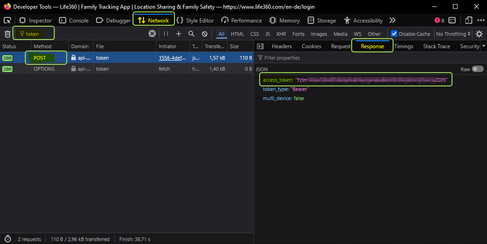

# Адаптер ioBroker для Life360 (нового поколения)

---

## Обновлено для пользователей из ЕС с современной аутентификацией на основе токенов.

> **Предупреждение:** Это неофициальный адаптер, разработанный сообществом. Он не связан с компанией Life360, Inc. и не поддерживается ею. Предоставляется бесплатно для личного, некоммерческого использования в системах домашней автоматизации. Используйте на свой страх и риск. Life360 может отключить или изменить свой API в любое время без предварительного уведомления.

> **Конфиденциальность:** Все данные, полученные от Life360, хранятся исключительно в вашей локальной системе ioBroker. Этот адаптер **не** передает никакие данные третьим лицам или внешним облачным сервисам, кроме самого API Life360.

## Описание

Этот адаптер подключается к облачным сервисам [Life360](https://www.life360.com) для отслеживания людей и определения их присутствия в заданных местах. Он получает данные о кругах, участниках и местах и сохраняет их в соответствии с настройками ioBroker, обновляя с настраиваемым интервалом.

## Документация

- 🇺🇸 [Документация](/#/docs/adapterref/iobroker.life360ng/docs/en/README.md)
- 🇩🇪 [Документация](https://github.com/inventwo/ioBroker.life360ng/blob/main/docs/de/README.md)

## Конфигурация

### Токен Bearer (необходим для пользователей из ЕС)

Компания Life360 отключила вход в систему с использованием пароля для пользователей из ЕС. Получите токен Bearer вручную:

1. Откройте <https://life360.com/login> в своем браузере.
2. Откройте инструменты разработчика в браузере ( **F12** ) и перейдите на вкладку **«Сеть»** .
3. Введите свой адрес электронной почты и нажмите **«Продолжить»** .
4. Введите одноразовый код, отправленный на вашу электронную почту.
5. Найдите **POST-** запрос с именем`token` (игнорируйте ПАРАМЕТРЫ).
6. В окне **«Предварительный просмотр»** / **«Ответ»** скопируйте значение`access_token` .
7. Вставьте его в поле **«Токен Bearer»** в конфигурации адаптера.

> **Примечание:** Введите токен БЕЗ слова «Bearer», БЕЗ пробелов и БЕЗ кавычек!

> **Примечание:** Срок действия токенов длительный (обычно несколько месяцев). По истечении срока действия в журнале адаптера отобразится ошибка подключения — повторите описанные выше шаги, чтобы получить новый токен.



### Мои места

Добавьте закрытые места, невидимые для облачных сервисов Life360. Адаптер проверяет наличие ваших пользовательских мест при каждом опросе.

- Придумайте **название** для этого места.
- Укажите географическое положение (широту и долготу).
- Укажите радиус в метрах.

### Интеграция

Выберите, какие данные Life360 обрабатывать: круги, места, люди.

### Отслеживание местоположения

Включите отслеживание местоположения, чтобы добавить данные о географическом положении (широта, долгота,`locationName` ) к данным о людях.

## Примечания по миграции/обновлению

### Обновление с версии 1.0.x до 1.1.0

Внутренняя иерархия объектов была реструктурирована в соответствии с правилами типов объектов ioBroker.

**После обновления выполните следующие действия:**

1. Остановите экземпляр адаптера.
2. Удалите все объекты адаптера (в административной панели ioBroker: Объекты → life360ng.0 → Удалить все).
3. Запустите экземпляр адаптера снова.
4. Все точки данных будут воссозданы автоматически.

> ⚠️ Ваши существующие скрипты и автоматизации **не** нужно изменять – все идентификаторы точек данных остаются прежними.

## Штаты

### круги

Life360 объединяет в круги информацию о связанных с ними местах и присутствии участников.

| Состояние                                            | Тип       | Описание                                                           |
| ---------------------------------------------------- | --------- | ------------------------------------------------------------------ |
| `circles.<id>.name`                                  | текст     | Название круга (например)`Family skvarel` )                        |
| `circles.<id>.id`                                    | текст     | UUID круга                                                         |
| `circles.<id>.memberCount`                           | ценить    | Количество членов круга _(может быть пустым)_                      |
| `circles.<id>.createdAt`                             | дата      | дата создания круга                                                |
| `circles.<id>.timestamp`                             | дата      | Последнее обновление данных                                        |
| `circles.<id>.places.<placeId>.<memberId>.isPresent` | индикатор | Участник присутствует в этом месте.                                |
| `circles.<id>.places.<placeId>.membersPresent`       | ценить    | Количество участников, в настоящее время находящихся в этом месте. |

### информация

| Состояние         | Тип        | Описание                                |
| ----------------- | ---------- | --------------------------------------- |
| `info.connection` | логический | `true` при подключении к облаку Life360 |

### мои места

Пользовательские места, определенные в конфигурации адаптера (не синхронизируются с облаком Life360). Структура:`myplaces.<placeName>.<memberName>.*`

| Состояние                                  | Тип                  | Описание                                               |
| ------------------------------------------ | -------------------- | ------------------------------------------------------ |
| `myplaces.<place>.<member>.distance`       | значение.расстояние  | Расстояние до центра точки в метрах                    |
| `myplaces.<place>.<member>.isPresent`      | индикатор            | Участник находится в пределах указанного радиуса.      |
| `myplaces.<place>.<member>.startTimestamp` | дата                 | Отметка времени, когда участник вошел в это место.     |
| `myplaces.<place>.<member>.timestamp`      | дата                 | Отметка времени последней проверки                     |
| `myplaces.<place>.gps-coordinates`         | значение.gps         | Разместите центр в формате JSON. `{"lat":..,"lng":..}` |
| `myplaces.<place>.latitude`                | значение.gps.широта  | Центральная широта места                               |
| `myplaces.<place>.longitude`               | значение.gps.долгота | Местоположение центр долгота                           |
| `myplaces.<place>.members`                 | список               | Все участники сравнили свои данные с этим местом.      |
| `myplaces.<place>.membersCount`            | ценить               | Общее количество отслеживаемых участников              |
| `myplaces.<place>.membersPresent`          | список               | Имена нынешних членов                                  |
| `myplaces.<place>.membersPresentCount`     | ценить               | Количество участников в настоящее время                |
| `myplaces.<place>.radius`                  | ценить               | Заданный радиус в метрах                               |
| `myplaces.<place>.timestamp`               | дата                 | Последнее обновление данных                            |
| `myplaces.<place>.urlMap`                  | текст.url            | Ссылка на место в OpenStreetMap                        |
| `myplaces.<place>.urlMapIframe`            | текст.url            | URL-адрес для встраивания Google Maps                  |

### люди

Каждый участник сообщества Life360 получает свой собственный канал.`people.<id>` , где`<id>` это UUID участника Life360.

| Состояние                       | Тип                  | Описание                                            |
| ------------------------------- | -------------------- | --------------------------------------------------- |
| `people.<id>.avatar`            | текст.url            | URL изображения профиля                             |
| `people.<id>.battery`           | значение.батарея     | Уровень заряда батареи в %                          |
| `people.<id>.createdAt`         | дата                 | Дата создания учетной записи                        |
| `people.<id>.disconnected`      | индикатор            | Приложение явно отключено.                          |
| `people.<id>.firstName`         | текст                | Имя                                                 |
| `people.<id>.gps-coordinates`   | значение.gps         | GPS-координаты в формате JSON `{"lat":..,"lng":..}` |
| `people.<id>.id`                | текст                | UUID участника Life360                              |
| `people.<id>.isConnected`       | индикатор.доступен   | Приложение подключено и доступно.                   |
| `people.<id>.isSharingLocation` | индикатор            | Функция обмена местоположением активна.             |
| `people.<id>.lastName`          | текст                | Фамилия                                             |
| `people.<id>.lastPositionAt`    | дата                 | Отметка времени последнего обновления позиции       |
| `people.<id>.latitude`          | значение.gps.широта  | Текущая широта                                      |
| `people.<id>.locationName`      | текст                | Текущее название места (например)`Home` )           |
| `people.<id>.longitude`         | значение.gps.долгота | Текущая долгота                                     |
| `people.<id>.status`            | текст                | статус подключения (например)`Ok` )                 |
| `people.<id>.timestamp`         | дата                 | Отметка времени последнего обновления данных        |
| `people.<id>.urlMap`            | текст.url            | Ссылка на текущее местоположение в OpenStreetMap    |
| `people.<id>.urlMapIframe`      | текст.url            | URL-адрес для встраивания Google Maps               |
| `people.<id>.urlMapOsmIframe`   | текст.url            | Встраиваемая ссылка на OpenStreetMap (iFrame)       |

> **Примечание:**`isConnected` показывает, доступно ли приложение Life360, а также`disconnected` указывает на явное состояние отключения. Оба варианта могут быть`false` одновременно при потере соединения.

### места

Данные Life360 синхронизируются напрямую из облака Life360 (настроенного в приложении Life360). Они доступны **только для чтения** и не могут быть настроены в адаптере.

| Состояние                     | Тип                  | Описание                                               |
| ----------------------------- | -------------------- | ------------------------------------------------------ |
| `places.<id>.name`            | текст                | Название места (например)`Refugium` )                  |
| `places.<id>.id`              | текст                | UUID места Life360                                     |
| `places.<id>.circleId`        | текст                | UUID круга, к которому принадлежит это место.          |
| `places.<id>.ownerId`         | текст                | UUID владельца места                                   |
| `places.<id>.gps-coordinates` | значение.gps         | Разместите центр в формате JSON. `{"lat":..,"lng":..}` |
| `places.<id>.latitude`        | значение.gps.широта  | Центральная широта места                               |
| `places.<id>.longitude`       | значение.gps.долгота | Местоположение центр долгота                           |
| `places.<id>.radius`          | ценить               | Радиус в метрах                                        |
| `places.<id>.timestamp`       | дата                 | Последнее обновление данных                            |
| `places.<id>.urlMap`          | текст.url            | Ссылка на место в OpenStreetMap                        |
| `places.<id>.urlMapIframe`    | текст.url            | URL-адрес для встраивания Google Maps                  |

> **Примечание:** Информацию о местах с возможностью определения присутствия можно найти в [разделе myplaces](#myplaces) .

> **Доступ к Life360 Places недоступен?** Life360 ограничил доступ к API Cloud Places для некоторых учетных записей (в частности, для бесплатных учетных записей в ЕС). Если в журнале адаптера отображается следующее:`All place sources returned 0 places` API Life360 больше не возвращает данные о местах для вашей учетной записи. **Решение:** определите свои места на вкладке [«Мои места»](#my-places) — они работают независимо от облака Life360 и обеспечивают такое же определение присутствия.

### трекер

В комплект адаптера входит дополнительный GPS-регистратор маршрутов, который записывает перемещения каждого участника Life360 и генерирует интерактивные карты Leaflet, доступные напрямую по URL-адресу в любом браузере, ioBroker Vis или панели управления Jarvis.

#### Как это работает

При каждом обновлении GPS-координат трекер проверяет, находится ли новая позиция на расстоянии не менее **minDistance** метров от последней зарегистрированной точки. Если да, то точка добавляется в объект GeoJSON LineString за текущий день. Полная история хранится в`allTime.geojson` и ежемесячные резервные копии записываются в`currentYear.MM.geojson` .

После каждого обновления автоматически (повторно) генерируется HTML-карта, которая записывается в файловую систему ioBroker. Она сразу же становится доступна по протоколу HTTP.

#### Включение трекера

1. Откройте конфигурацию адаптера.
2. В разделе **«Отслеживание / Регистрация маршрута»** включите отслеживание для каждого человека.
3. При желании можно включить функцию **«Карта семьи»** для каждого человека, чтобы включить их в общее семейное представление.
4. Установите **минимальное расстояние** (по умолчанию: 20 м) для фильтрации GPS-помех.
5. Сохраните изменения и перезапустите адаптер.

#### URL-адреса карт

Каждому человеку и семейной группе присваивается отдельный URL-адрес карты, который хранится в состоянии ioBroker:

| Состояние                 | Описание                                                              |
| ------------------------- | --------------------------------------------------------------------- |
| `tracker.<Name>.url`      | Относительный URL-адрес индивидуальной карты пользователя             |
| `tracker.<Name>.urlLocal` | Полный URL-адрес с IP-адресом сервера ioBroker и портом веб-адаптера. |
| `tracker.circle.url`      | Относительный URL-адрес объединенной круговой карты                   |
| `tracker.circle.urlLocal` | Полный URL-адрес с IP-адресом сервера ioBroker и портом веб-адаптера. |

Формат URL-адреса:

```
/<namespace>/tracker/<name>.html
```

Откройте этот URL-адрес в любом браузере. Карта автоматически обновляется с заданным интервалом опроса.

> **Примечание:** Карты трекеров предоставляются [веб-адаптером ioBroker](https://github.com/ioBroker/ioBroker.web) . Убедитесь, что он установлен и запущен.`urlLocal` Состояние автоматически формируется на основе IP-адреса сервера и порта веб-адаптера (по умолчанию: 8082).
>
> Сгенерированные HTML, CSS и JS файлы хранятся в файловой системе ioBroker и доступны для просмотра в разделе **Администрирование → Файлы →`life360ng.<instance>/tracker/`** .

#### Особенности карты

- **Интерактивная карта Leaflet** — панорамирование и масштабирование, основана на OpenStreetMap.
- **Выбор даты** — перемещение между всеми записанными днями (полная история, без ограничений)
- **Маршруты с цветовой кодировкой** — для каждого человека предусмотрен свой собственный, настраиваемый цвет маршрута.
- **Маркеры начала/конца** — четко обозначают первую и последнюю позицию за день.
- **Автоматическое обновление** — страница автоматически перезагружается (интервал опроса + 10 с).
- **Семейная карта** — все лица, имеющие право на участие, на одной объединенной карте с легендой.
- **Маркеры-флажки** — места Life360 и собственные пользовательские места (Мои места) могут отображаться на карте в виде маркеров-флажков, каждый из которых имеет настраиваемый цвет, размер и прозрачность (0,0 = невидим, 1,0 = полностью виден).

#### Особенности отдельной карты

- **Флажок «Маршрут»:** На каждой карте для одного человека есть флажок «Маршрут», позволяющий переключать отображение маршрута на выбранный период. Состояние сохраняется для каждого человека в браузере и не меняется при перезагрузке страницы.
- **Динамический выбор даты:** средства выбора диапазона дат отображаются только при включенном маршруте. Если маршрут отключен, отображается только последняя известная точка.
- **Индивидуальные цвета:** цвет флажка соответствует цвету человека.
- **Единообразный заголовок:** высота заголовка остается неизменной независимо от состояния флажка.

#### Штаты-отслеживатели

##### Конфигурация (`tracker.config.*` )

Все параметры цвета и поведения можно изменить во время выполнения — карты перерисовываются немедленно без перезапуска адаптера.

| Состояние                | Тип        | Описание                                 |
| ------------------------ | ---------- | ---------------------------------------- |
| `tracker.config.enabled` | логический | Включить/отключить регистратор маршрутов |

##### Данные на одного человека (`tracker.<Name>.*` )

| Состояние                               | Тип           | Описание                                                      |
| --------------------------------------- | ------------- | ------------------------------------------------------------- |
| `tracker.<Name>.allTime.geojson`        | строка (JSON) | Полная история GeoJSON (за все дни)                           |
| `tracker.<Name>.currentYear.MM.geojson` | строка (JSON) | Ежемесячное резервное копирование GeoJSON                     |
| `tracker.<Name>.mapSize`                | число (КБ)    | Размер файла сгенерированной HTML-карты                       |
| `tracker.<Name>.url`                    | текст.url     | HTTP-адрес карты пользователя                                 |
| `tracker.<Name>.urlLocal`               | текст.url     | HTTP-URL с IP-адресом сервера ioBroker и портом веб-адаптера. |

##### Круговая карта (`tracker.circle.*` )

| Состояние                               | Тип           | Описание                                                      |
| --------------------------------------- | ------------- | ------------------------------------------------------------- |
| `tracker.circle.allTime.geojson`        | строка (JSON) | Объединенный GeoJSON со всеми участниками круга.              |
| `tracker.circle.currentYear.MM.geojson` | строка (JSON) | Ежемесячное резервное копирование GeoJSON                     |
| `tracker.circle.mapSize`                | число (КБ)    | Размер файла сгенерированной HTML-карты                       |
| `tracker.circle.url`                    | текст.url     | HTTP-адрес объединенной круговой карты                        |
| `tracker.circle.urlLocal`               | текст.url     | HTTP-URL с IP-адресом сервера ioBroker и портом веб-адаптера. |

#### Встраивание в Vis / Jarvis

Используйте URL-адрес карты в **виджете iFrame** (Vis) или в **виде URL-блока** (Jarvis):

```
/life360ng.0/tracker/<name>.html
```

Карта обновляется автоматически — дополнительная настройка не требуется.

> **Примечание:**
>
> - Полная история маршрута (`allTime.geojson` Объем данных постоянно растет. При интервале опроса в 60 секунд и минимальном расстоянии в 20 метров ожидайте примерно **1 МБ на человека в год** — что вполне укладывается в ограничения хранилища файлов ioBroker.
> - Используйте **параметр «Срок хранения (дни)»** в конфигурации адаптера, чтобы автоматически удалять данные старше заданного количества дней (0 = хранить вечно). Очистка выполняется при каждом запуске адаптера и один раз в день.
> - Чтобы вручную удалить записанные данные маршрута пользователя, установите флажок **«Очистить запись» в таблице пользователей и сохраните конфигурацию. Данные о маршруте пользователя будут удалены.**`allTime.geojson` сводится к последней известной точке. Поскольку карта семьи строится на основе данных об отдельных людях, она также автоматически обновляется. Ежемесячные файлы GeoJSON (`currentYear.MM` ) никогда не подвергаются воздействию.
> - Цвета маршрута для каждого человека настраиваются в параметрах адаптера (вкладка «Трекер»).

## Поддерживать

Если вам нравится наша работа и вы хотели бы нас поддержать, мы будем благодарны за любое пожертвование. (Эта ссылка ведет на наш счет PayPal и не связана с ioBroker.)

[](https://www.paypal.com/donate?hosted_button_id=7W6M3TFZ4W9LW)

## Кредиты

Данный адаптер создан на основе оригинальной работы [МиГоллера](https://github.com/MiGoller) .<br> Большое спасибо за первоначальную реализацию и идею! Этот репозиторий содержит оптимизации и дальнейшую разработку.<br> Примечание: Оригинальный [репозиторий](https://github.com/MiGoller/ioBroker.life360) заархивирован и больше не поддерживается.

## Более ранние изменения

- [CHANGELOG\_OLD.md](https://github.com/inventwo/ioBroker.life360ng/blob/main/CHANGELOG_OLD.md)

## Changelog

<!--
    ### **WORK IN PROGRESS**
-->
### 1.11.4 (2026-07-02)
- (skvarel) Fixed issue detected by repository checker #31

### 1.11.3 (2026-06-10)
- (skvarel) Added meta object types for adapter and instance namespace

### 1.11.2 (2026-06-05)
- (skvarel) Updated @alcalzone/release-script to minimum required version 5.2.1
- (skvarel) Replaced plain setTimeout/clearTimeout with adapter.setTimeout/clearTimeout in life360DbConnector

### 1.11.1 (2026-06-03)
- (skvarel) Migrated project rules from GitHub Copilot to Cursor rules

### 1.11.0 (2026-05-28)
- (skvarel) Added "Enable datapoint notifications" checkbox in the Notifications tab; when enabled, the general notification settings panel is shown even without Telegram or Alexa configured
- (skvarel) Updated geolocation-utils dependency from 1.2.5 to 1.2.6

## License

MIT License

Copyright (c) 2026 skvarel <sk@inventwo.com>

Permission is hereby granted, free of charge, to any person obtaining a copy
of this software and associated documentation files (the "Software"), to deal
in the Software without restriction, including without limitation the rights
to use, copy, modify, merge, publish, distribute, sublicense, and/or sell
copies of the Software, and to permit persons to whom the Software is
furnished to do so, subject to the following conditions:

The above copyright notice and this permission notice shall be included in all
copies or substantial portions of the Software.

THE SOFTWARE IS PROVIDED "AS IS", WITHOUT WARRANTY OF ANY KIND, EXPRESS OR
IMPLIED, INCLUDING BUT NOT LIMITED TO THE WARRANTIES OF MERCHANTABILITY,
FITNESS FOR A PARTICULAR PURPOSE AND NONINFRINGEMENT. IN NO EVENT SHALL THE
AUTHORS OR COPYRIGHT HOLDERS BE LIABLE FOR ANY CLAIM, DAMAGES OR OTHER
LIABILITY, WHETHER IN AN ACTION OF CONTRACT, TORT OR OTHERWISE, ARISING FROM,
OUT OF OR IN CONNECTION WITH THE SOFTWARE OR THE USE OR OTHER DEALINGS IN THE
SOFTWARE.