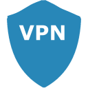

# IoBroker.link
Этот адаптер обеспечивает безопасное подключение через [ioBroker.link](https://iobroker.link/) облако.

## ЧАСТО ЗАДАВАЕМЫЕ ВОПРОСЫ
### Что я могу делать с помощью этого адаптера?
Этот адаптер позволяет безопасно подключаться к локальной установке ioBroker и другим серверам/устройствам в вашей локальной сети за DSL-модемом/маршрутизатором/брандмауэром. Подключение осуществляется через общедоступное облако `ioBroker.link` (link-cloud). Можно настроить даже несколько локальных установок ioBroker и получить к ним доступ через облако ссылок.

### В чем разница с переадресацией портов, которую я могу настроить на своем маршрутизаторе?
Хотя вы можете настроить переадресацию портов на своем маршрутизаторе и, таким образом, получить доступ к локальной установке ioBroker из любого места, облако ссылок предоставляет следующие основные преимущества:

- на роутере не нужно открывать порты для выхода в интернет
- для локальной установки ioBroker не требуется общедоступный IP-адрес или (динамическое) DNS-имя.
- link-cloud позаботится об аутентификации и авторизации
- link-cloud защищает соединение с помощью SSL/TLS
- link-cloud предоставляет журнал аудита
- доступ к нескольким локальным установкам ioBroker можно получить через один и тот же пользовательский интерфейс сервера link-cloud
- Адаптер ioBroker.link работает как обратный прокси и позволяет получить доступ к другим серверам/устройствам в вашей локальной сети, которые поддерживают протоколы HTTP/TCP/UDP.
- вы можете предоставить временный или постоянный доступ к вашей локальной установке ioBroker третьему лицу, например, для устранения сбоев в работе устройства, без необходимости раскрывать свой пароль или управлять учетными данными

### Как можно установить соединение с моей локальной установкой ioBroker, если у меня нет общедоступного IP-адреса и открытых портов?
Облако ссылок никогда не подключается к вашей локальной установке, это адаптер `ioBroker.link`, который работает локально и инициирует подключение к облаку ссылок в случае запроса на подключение.

### Что такое _запрос на подключение_?
Запрос на подключение — это намерение установить подключение к локальной установке ioBroker, сделанное аутентифицированным и авторизованным лицом через облако ссылок.

### Как адаптер `ioBroker.link` распознает наличие запроса на подключение?
Адаптер `ioBroker.link` периодически проверяет ожидающие запросы на подключение, опрашивая облако ссылок. Интервал опроса можно настроить в настройках адаптера `ioBroker.link`.

### Как убедиться, что адаптер `ioBroker.link` устанавливает соединение с облаком ссылок, а не с посредником?
Адаптер ioBroker.link может подключаться только к серверу, который представляет действительный сертификат SSL, выданный ioBroker.link.

### Как облако ссылок идентифицирует и авторизует все адаптеры `ioBroker.link`, опрашивающие ожидающие запросы на подключение или устанавливающие подключение?
Каждый адаптер `ioBroker.link` генерирует собственную уникальную пару ключей длиной 2048 бит. При регистрации в link-cloud адаптер передает свой публичный ключ. При каждом последующем запросе к облаку ссылок (проверка ожидающих запросов на подключение, принятие или отклонение ожидающего подключения, закрытие открытого подключения и т. д.) адаптер авторизует себя, предоставляя JSON Web Token (JWT), подписанный закрытым ключом адаптера. . Облако ссылок проверяет подпись JWT, используя сохраненный открытый ключ, и принимает или отклоняет соединение.

### Может ли один адаптер подключиться к облаку ссылок, используя JWT другого адаптера?
Нет. Адаптер подписывает JWT, используя свой собственный уникальный закрытый ключ, который никогда не покидает локальную установку. Облако ссылок использует соответствующий открытый ключ для проверки подписи.

### Могу ли я повысить безопасность, чередуя ключи, используемые для авторизации моего адаптера?
Да. Ключи хранятся в папке /keys установки вашего адаптера. Удалите все файлы в этой папке и перезапустите адаптер. Адаптер создаст новую пару ключей при запуске и обновит регистрацию в облаке ссылок, отправив новый открытый ключ.

### Как защищено само установленное соединение?
Если имеется ожидающий запрос на подключение, адаптер `ioBroker.link` сначала устанавливает туннель SSH к облаку ссылок и принимает входящее подключение. Обе стороны авторизуют себя посредством сертификатов. После настройки туннеля SSH начинается само общение. Как только соединение закрывается, например, пользователем через пользовательский интерфейс облачного сервера, туннель SSH закрывается, и связь больше невозможна.

### Возможно ли также подключиться к моим локальным устройствам через облако ссылок?
Да. Если ваши устройства поддерживают протокол HTTP, вы можете получить к ним доступ через облако ссылок. Каждое устройство, к которому вы хотите подключиться через облако ссылок, должно быть явно настроено в настройках адаптера `ioBroker.link`. По умолчанию ни к одному устройству нельзя подключиться. Даже веб-интерфейс ioBroker.admin должен быть сначала настроен, чтобы иметь возможность подключиться.

### Что мне нужно установить для подключения к моим локальным устройствам через облако ссылок?
Подключение к локальным устройствам, поддерживающим протокол HTTP, осуществляется через выбранный вами браузер. Никакого дополнительного программного обеспечения не требуется.

### Мое локальное устройство поддерживает только протокол TCP/UDP. Возможно ли подключение к устройствам TCP/UDP?
Да. Для подключения к локальным устройствам TCP/UDP используйте ioBroker.link-box: https://www.npmjs.com/package/iobroker.link-box.

### Как предоставить доступ к моей локальной установке ioBroker?
Любой, кому должен быть предоставлен доступ к локальной установке ioBroker, должен быть явно настроен в настройках адаптера `ioBroker.link`. По умолчанию никто не имеет доступа. Это означает, что вы также должны настроить себя, чтобы иметь возможность подключиться к вашей собственной локальной установке ioBroker.

### Как и где создать пользователя, которому я хочу предоставить доступ к моей локальной установке?
Сначала вам нужно создать бесплатную учетную запись на https://iobroker.pro. После создания зарегистрированный адрес электронной почты можно настроить в настройках адаптера `ioBroker.link` _Разрешенные пользователи_. В конфигурации адаптера пароль указывать не нужно.

### У меня уже есть аккаунт на https://iobroker.pro. Могу ли я использовать его для облака ссылок?
Да. Вы можете использовать уже существующую учетную запись https://iobroker.pro.

### Можно ли одновременно использовать https://iobroker.pro и сервисы link-cloud?
Да. Между этими двумя службами нет никаких зависимостей. Вы можете использовать их по отдельности или параллельно.

### Почему link-cloud использует учетные записи https://iobroker.pro?
Облако ссылок не использует учетные записи https://iobroker.pro. Никакая информация, связанная с учетными записями https://iobroker.pro, не передается/недоступна в облаке ссылок. Облако ссылок просто объединяет аутентификацию с https://iobroker.pro. Авторизация, в свою очередь, полностью выполняется облаком ссылок.

### Как я могу отозвать доступ к своей локальной установке?
Вы можете отозвать права доступа, предоставленные отдельным лицам, удалив их адреса электронной почты из настройки _Allowed user_ адаптера `ioBroker.link`. В качестве альтернативы вы можете полностью запретить доступ к вашей локальной установке, оставив параметр _Allowed users_ пустым. Кроме того, остановка или удаление адаптера `ioBroker.link` предотвратит любой доступ через облако ссылок.

### Взимаются ли с меня какие-либо сборы при использовании облака ссылок?
На данный момент плата не взимается, и облако ссылок можно использовать совершенно бесплатно. Также не зависит, используете ли вы бесплатную или платную учетную запись https://iobroker.pro. Имейте в виду, что это может быть изменено в будущем.

### Почему вы планируете взимать плату за эту простую услугу?
Даже эта простая услуга требует круглосуточной работы инфраструктуры и требует затрат. Обеспечение высокой доступности этой службы, устранение сбоев и улучшение или добавление новых функций отнимает значительное количество нашего времени. Чтобы посвятить себя дальнейшему развитию, нам нужны чипы. Это позволило бы нашим женам ходить по магазинам и дало бы нам больше времени, чтобы уделить внимание этому проекту.

### Каковы ограничения облака ссылок?
На данный момент можно открыть только одно соединение с локальной установкой ioBroker. Это означает, что если нескольким пользователям предоставлены разрешения на доступ к локальной установке, только один пользователь может подключиться в каждый момент времени. Кроме того, разрешено только одно соединение для каждого пользователя. Это означает, что один и тот же пользователь, получивший разрешение на доступ к нескольким локальным установкам, может получить доступ только к одной установке за раз.

### Как я могу отслеживать, кто и когда получил доступ к моей локальной установке?
Метаданные всех запрошенных подключений сохраняются, и их можно просмотреть по адресу https://iobroker.link.

### Какие порты должны быть доступны в брандмауэре?
Следующие порты на сервере `ioBroker.link` должны быть доступны: 5000–5100 (исходящий)

## Конфигурация адаптера :: Основные настройки
### Имя клиента
Это имя вашей локальной установки ioBroker. Вы можете выбрать его свободно. Это поможет вам различать разные установки ioBroker при отправке запроса на подключение через облако ссылок.

### URI сервера
Это доменное имя облака ссылок. Этот параметр предварительно настроен с помощью https://iobroker.link и должен быть изменен.

### URI прокси-сервера
Если ваша установка ioBroker находится за прокси-сервером, вы можете настроить прокси-сервер здесь. Прокси может быть определен здесь как: *http://proxy:8080* или через переменную окружения **HTTPS_PROXY**.

### Интервал опроса (сек)
Определяет, как часто ваш адаптер опрашивает облако ссылок на наличие ожидающих запросов на подключение.
Рекомендуемое значение: 10

### Разрешенные пользователи
Определяет существующие учетные записи https://iobroker.pro, которым должны быть предоставлены права доступа к вашей локальной установке ioBroker.

Если вы хотите предоставить доступ себе и своей жене и предполагая, что вы указали адреса me@gmail.com и darling@gmail.com при создании учетных записей https://iobroker.pro, параметр _Разрешенные пользователи_ будет содержать эти оба электронных адреса. почтовые адреса.

## Конфигурация адаптера :: Устройства
Здесь вы определяете список устройств, которые будут доступны через облако ссылок.

### Включено
Определяет, должно ли настроенное устройство быть доступным.

### Имя
Свободно выбранное имя устройства. Это помогает различать разные устройства при подключении через облако ссылок.

### IP
IP-адрес устройства для подключения в вашей локальной сети. Вы можете указать имя хоста, например, _localhost_, вместо IP-адреса, но имейте в виду, что это имя должно быть разрешено на машине, на которой работает ваш адаптер ioBroker-link, а также что имена хостов нельзя использовать для UDP-устройств.

### Порт
Номер порта, через который ваше устройство прослушивает входящие соединения.

### Тип
- TCP - для устройств, поддерживающих протокол TCP и/или HTTP
- UDP - для устройств, поддерживающих протокол UDP

## Конфигурация адаптера :: Пример конфигурации устройства
Чтобы сделать ваш `ioBroker.admin` веб-интерфейс доступным через облако ссылок, вы должны настроить его в разделе _Конфигурация адаптера :: Устройства_ следующим образом:

- включено: проверено
- имя: ioBrokerAdminWebUI (или любое другое имя, которое вам нравится)
- IP: локальный (или 127.0.0.1)
- Порт: 8081 (если вы не изменили порт по умолчанию для ioBroker.admin)
- Тип: ПТС

Для доступа к веб-интерфейсу вашего маршрутизатора у вас может быть следующая конфигурация:

- включено: проверено
- имя: Маршрутизатор
- IP: 192.168.0.1 (или любой другой IP-адрес локальной сети вашего маршрутизатора)
- Порт: 80 (если вы не изменили порт по умолчанию веб-интерфейса маршрутизатора)
- Тип: ПТС

Чтобы получить доступ к моментальному снимку или прямой трансляции вашей IP-камеры, настройте устройство следующим образом:

- включено: проверено
- имя: Front-Door-Snapshot (или любое другое имя, которое вам нравится)
- IP: конечная точка HTTP вашей камеры, например: _http://192.168.0.178:8000/tmpfs/snap.jpg_
- Порт: игнорируется, предполагается, что он является частью конфигурации конечной точки HTTP.
- Тип: ПТС

**НЕ** вводите учетные данные вашей камеры в настроенную конечную точку HTTP в качестве параметров запроса: _http://192.168.0.178:8000/tmpfs/snap.jpg?usr=admin&pwd=admin_

Вместо этого предоставил их при появлении запроса при установлении соединения.

<!--

### **В РАБОТЕ** -->

## Changelog
### 0.5.12 (2022-10-27)
* (bluefox) Added warning if UUID is not unique

### 0.5.11 (2020-12-09)
* (bluefox) Fixed the type of `info.connection` state

### 0.5.10 (2020-12-09)
* (bluefox) Ignore errors at 4:00 because of the server restart

### 0.5.6 (2019-12-02)
* (gh-got) multi-factor connection approval
* (gh-got) Implemented the acknowledgment via telegram

### 0.5.2 (2019-11-26)
* (bluefox) Added user disable/enable

### 0.4.4 (2019-07-16)
* (gh-got) closing tunnels in case server considers an agent as offline
* (gh-got) fixed timeout to query active connection status

### 0.4.2 (2019-03-28)
* (gh-got) agents will report own version by registration

### 0.4.0 (2019-03-10)
* (bluefox) Made this adapter to be compatible with the new server

### 0.3.7 (2018-09-23)
* (bluefox) Do not connect to the cloud if no configuration defined

### 0.3.6 (2018-06-26)
* (bluefox) The download of SSF from GitHub depending on plattform was added

### 0.2.7 (2018-06-17)
* (bluefox) UDP communication is now supported

### 0.2.6 (2018-06-10)
* (bluefox) HTTP proxy support

### 0.1.3 (2018-04-25)
* (bluefox) Initial commit

## License
Creative Common Attribution-NonCommercial (CC BY-NC)

Copyright (c) 2018-2022 bluefox <dogafox@gmail.com>, gh-got

http://creativecommons.org/licenses/by-nc/4.0/

Short content:
Licensees may copy, distribute, display and perform the work and make derivative works based on it only if they give the author or licensor the credits in the manner specified by these.
Licensees may copy, distribute, display, and perform the work and make derivative works based on it only for noncommercial purposes.
(Free for non-commercial use).