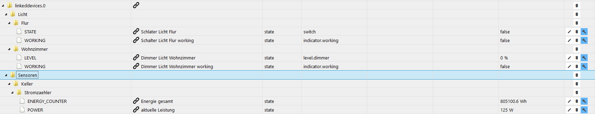

<h1>
	
	ioBroker.linkeddevices
</h1>

## адаптер linkeddevices для ioBroker

linkeddevices создает связанные объекты (точки данных) устройств с заданной самостоятельно структурой. Это позволяет создать в ioBroker структуру, в которой все объекты централизованы, например, для использования в представлениях визуализации или скриптах. Это дает, например, преимущество в том, что при замене оборудования необходимо заново создавать только связанные объекты, и все представления визуализации и скрипты снова будут работать.

С помощью адаптера также можно преобразовывать объекты или преобразовывать их в другие типы (пока не полностью реализовано).

Этот адаптер создан по образцу [скрипта виртуальных устройств от Pman](https://forum.iobroker.net/topic/7751/virtual-devices) .

## Конфигурация

- [Описание на английском языке](docs/en/README.md)
- [deutsche Beschreibung](docs/de/README.md)

## Changelog

<!--
    Placeholder for the next version (at the beginning of the line):
    ### __WORK IN PROGRESS__    
-->
### 1.5.5 (2022-06-06) 
* (Scrounger) Generate script: Bugfix if varibale starts with number

### 1.5.4 (2022-06-06) 
* (Scrounger) Generate script: Bugfix if varibale starts with number

### 1.5.3 (2022-06-06) 
* (Scrounger) Generate script: Bugfix if varibale starts with number
* (GermanBluefox) Corrected jsonCustom file
* (marc2016) Added color CIE to color HEX converter

### 1.5.2 (2022-05-03)
* (Scrounger) Admin 5 custom dialog layout optimization
* (Scrounger) Admin 5 custom dialog: sorted autocomplete entries

### 1.5.1 (2022-04-25)
* (Scrounger) Version number bug fix
* (Scrounger) Admin 5 custom dialog integration

### 1.5.0 (2022-04-25)
* (Scrounger) Admin 5 custom dialog integration

### 1.4.3 (2021-03-16)
* (Scrounger) added option to invert boolean
* (Scrounger) bug fix for translated object names
* (Scrounger) show error in settings

### 1.4.2 (2020-12-29)
* (Scrounger) bug fix for filtered custom dialog

### 1.4.1 (2020-12-19)
* (Scrounger) bug fix custom dialog incompatibilty with other adapters
* (Scrounger) bug fix for translation load
* (Scrounger) bug fix for id on custom dialog load

### 1.4.0 (2020-11-23)
* (Scrounger) custom settings: button added to generate prefixId from function and room
* (Scrounger) adapter settings: automatically generate prefixId from function and room
* (Scrounger) adapter settings: automatically use prefix and optional id as name
* (Scrounger) bug fixes

### 1.3.2 (2020-11-21)
* (Scrounger) moment-duration-format bug fix

### 1.3.1 (2020-11-21)
* (Scrounger) bug fix for change event of buttons to use prefix and / or id as name added
* (Scrounger) option to select javascript instance where script should be created

### 1.3.0 (2020-11-20)
* (Scrounger) show name of parent object in custom view
* (Scrounger) buttons to use prefix and / or id as name added
* (Scrounger) dependencies updated

### 1.2.2 (2020-08-23)
* (Scrounger) moment bug fix

### 1.2.1 (2020-08-23)
* (Scrounger) mathjs bug fix

### 1.2.0 (2020-08-23)
* (Scrounger) adapter configuration: auto generate globale script - function to get parent id added
* (Scrounger) dependencies updated

### 1.1.4
* (Scrounger) continuous loop after assign to new object bug fixed

### 1.1.3
* (Scrounger) bug fix for deleting objects via the setting

### 1.1.2
* (Scrounger) bug fix for values from type object

### 1.1.1
* (Scrounger) string to number bug fix

### 1.1.0
* (Scrounger) option to merge linkedObject on adapter restart added
* (Scrounger) string to number conversion added
* (algar42) russian translation corrected

### 1.0.1
* (Scrounger) adapter configuration: repair function added
* (Scrounger) receive system messages added

### 1.0.0
* (Scrounger) bug fixes

### 0.5.6
* (Scrounger) bug fixes

### 0.5.5
* (Scrounger) custom dialog: role change for linked object added
* (Scrounger) adapter configuration: auto generate globale script - check if object always linked added
* (SchumyHao, Scrounger) create channel objects for linked Objects
* (Scrounger) adapter configuration: layout revised, progressbar added
* (Scrounger) custom dialog: layout revised

### 0.5.0
* (Scrounger) custom dialog: suggestion dropdown list added to input fields
* (Scrounger) adapter configuration: button to remove links added
* (Scrounger) expert settings: Converter string (readonly) to duration, date and / or datetime added
* (Scrounger) adapter configuration: layout revised
* (Scrounger) expert settings number: allow negative values for min / max
* (Scrounger) adapter configuration: auto generate globale script - optional create setState funtion for readonly objects
* (Scrounger) adapter configuration: auto generate globale script - now optional recognize also manual created objects
* (Scrounger) bug fixes

### 0.4.1
* (Scrounger) Bug fix: auto generate globale script for [Javascript Script Engine](https://github.com/iobroker/ioBroker.javascript/blob/master/README.md) with variables for all linked Object

### 0.4.0
* (Scrounger) expertsettings for string: convert to boolean
* (Scrounger) custom settings of linked object: added button to open custom settings of parent object
* (Scrounger) adapter configuration: auto generate globale script for [Javascript Script Engine](https://github.com/iobroker/ioBroker.javascript/blob/master/README.md) with variables for all linked Object
* (Scrounger) Bug fix: native data stored in linked object if available
* (Scrounger) bug fixes

### 0.3.2
* (Scrounger) expertsettings for string: add prefix and suffix to string
* (Scrounger) expertsettings for number (readonly): convert to duration
* (Scrounger) expertsettings for number (readonly): convert to date, time or datetime
* (Scrounger) bug fixes

### 0.3.0
* (Scrounger) linked devices overview added to adapter configuration
* (Scrounger) bug fixes

### 0.2.1
* (Scrounger) boolean to string converter added
* (Scrounger) bug fixes

### 0.2.0
* (Scrounger) number to boolean converter added
* (Scrounger) number expert settings for min, max added
* (Scrounger) bug fixes

### 0.1.5
* (Scrounger) expert settings properties renamed -> you must recreate your expert settings for all parent objects !!!
* (Scrounger) custom dialog prepared for convert to other type
* (Scrounger) bug fixes

### 0.1.0
* (Scrounger) custom dialog layout changed
* (Scrounger) conversion bug fixes
* (Scrounger) change unit bug fixes

### 0.0.4
* (Scrounger) main function added
* (Scrounger) change unit for linked objects
* (Scrounger) set number of decimal places for linked objects
* (Scrounger) set conversion for read only linked objects

### 0.0.1
* (Scrounger) initial release

## License
MIT License

Copyright (c) 2020-2026 Scrounger

Permission is hereby granted, free of charge, to any person obtaining a copy
of this software and associated documentation files (the "Software"), to deal
in the Software without restriction, including without limitation the rights
to use, copy, modify, merge, publish, distribute, sublicense, and/or sell
copies of the Software, and to permit persons to whom the Software is
furnished to do so, subject to the following conditions:

The above copyright notice and this permission notice shall be included in all
copies or substantial portions of the Software.

THE SOFTWARE IS PROVIDED "AS IS", WITHOUT WARRANTY OF ANY KIND, EXPRESS OR
IMPLIED, INCLUDING BUT NOT LIMITED TO THE WARRANTIES OF MERCHANTABILITY,
FITNESS FOR A PARTICULAR PURPOSE AND NONINFRINGEMENT. IN NO EVENT SHALL THE
AUTHORS OR COPYRIGHT HOLDERS BE LIABLE FOR ANY CLAIM, DAMAGES OR OTHER
LIABILITY, WHETHER IN AN ACTION OF CONTRACT, TORT OR OTHERWISE, ARISING FROM,
OUT OF OR IN CONNECTION WITH THE SOFTWARE OR THE USE OR OTHER DEALINGS IN THE
SOFTWARE.