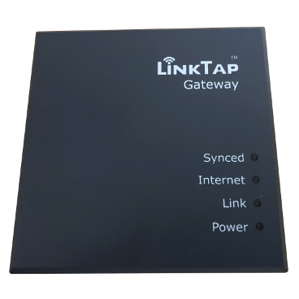

# IoBroker.LinkTap
## IoBroker.linktap
Управляйте поливом вашего сада с помощью беспроводного таймера для воды LinkTap. Производитель: https://www.link-tap.com/

## Установка
Пожалуйста, используйте Node.js версии 22 или выше.

## Настройки
Создайте ключ API на сайте https://www.link-tap.com/#!/api-for-developers, используя свои учетные данные LinkTap.

Пожалуйста, введите имя пользователя и ключ API в конфигурации.
Все подключенные шлюзы и устройства Taplinker будут получены после запуска адаптера. Производитель разрешает опрос всех шлюзов и устройств каждые 5 минут. Адаптер выполняет получение данных автоматически каждый час или при каждом перезапуске.

Время получения информации о состоянии полива можно настроить индивидуально в параметрах системы в минутах. Для предоставления обновленной информации о поливе веб-сервисом LinkTap может потребоваться до одной минуты.

Все функции орошения, предоставляемые API, реализованы.

Важно: Желаемые расписания необходимо настроить в приложении до начала использования. Затем их можно включать/отключать через адаптер. Для этого необходимо дополнительно установить соответствующие состояния роли "Аргумент в".

## Changelog

### 1.0.7
- (copilot) Adapter requires node.js >= 22 now / removed node-fetch

### 1.0.3
* (Smart-Gang) Update of various dependencies and update to Node 20.

### 1.0.1
* (Smart-Gang) Update of various dependencies and update to Node 18.

### 0.3.0
* (Smart-Gang) Added support for new devices (ValveLinker and multiple-outlet water timer) with 18-digit IDs.

### 0.2.1
* (Smart-Gang) Updated CI testing & dependencies.

### 0.2.0
* (Smart-Gang) Changed types of state 'signal' to number and of button 'StartEcoInstantMode' to boolean.

### 0.1.9
* (Smart-Gang) Community suggestion: The trigger data points (buttons) now have the status set to false by default.

### 0.1.8
* (Smart-Gang) Retrieve historical data (API update from manufacturer) and optimize data point settings.

### 0.1.7
* (Smart-Gang) First public release

[Older changelogs can be found there](CHANGELOG_OLD.md)

## License
MIT License

Copyright (c) 2025-2026 Author <gangrulez@gmail.com>

Permission is hereby granted, free of charge, to any person obtaining a copy
of this software and associated documentation files (the "Software"), to deal
in the Software without restriction, including without limitation the rights
to use, copy, modify, merge, publish, distribute, sublicense, and/or sell
copies of the Software, and to permit persons to whom the Software is
furnished to do so, subject to the following conditions:

The above copyright notice and this permission notice shall be included in all
copies or substantial portions of the Software.

THE SOFTWARE IS PROVIDED "AS IS", WITHOUT WARRANTY OF ANY KIND, EXPRESS OR
IMPLIED, INCLUDING BUT NOT LIMITED TO THE WARRANTIES OF MERCHANTABILITY,
FITNESS FOR A PARTICULAR PURPOSE AND NONINFRINGEMENT. IN NO EVENT SHALL THE
AUTHORS OR COPYRIGHT HOLDERS BE LIABLE FOR ANY CLAIM, DAMAGES OR OTHER
LIABILITY, WHETHER IN AN ACTION OF CONTRACT, TORT OR OTHERWISE, ARISING FROM,
OUT OF OR IN CONNECTION WITH THE SOFTWARE OR THE USE OR OTHER DEALINGS IN THE
SOFTWARE.