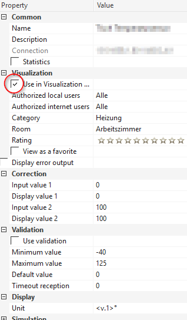
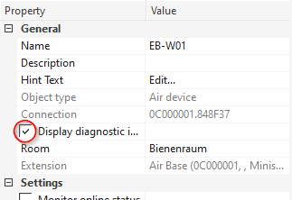
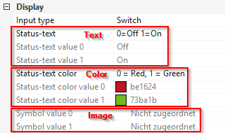
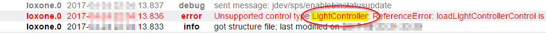
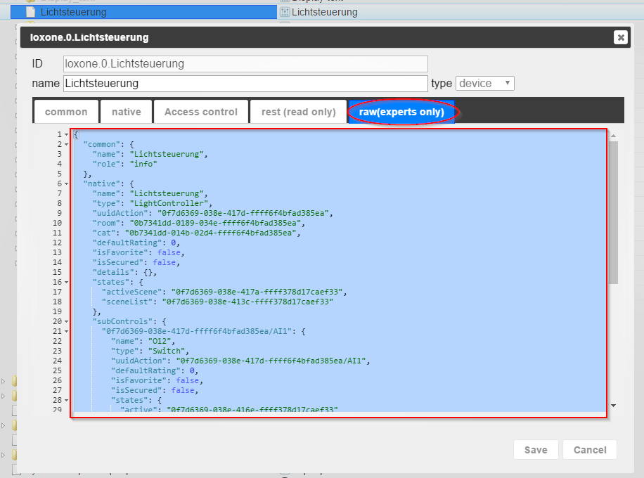

# ioBroker.loxone

## Адаптер Loxone для ioBroker

**_Для работы этого адаптера требуется как минимум Node.js версии 20.x!_**

Получает всю доступную информацию из Loxone Miniserver (и Loxone Miniserver Go) и отображает изменения в режиме реального времени.

**Этот адаптер использует библиотеки Sentry для автоматического сообщения разработчикам об исключениях и ошибках в коде.** Более подробную информацию, а также инструкции по отключению отправки сообщений об ошибках см. [в документации Sentry-Plugin](https://github.com/ioBroker/plugin-sentry#plugin-sentry) ! Система отчетности Sentry используется начиная с js-controller 3.0.

## Установить

Установите этот адаптер через административную панель ioBroker:

1. Откройте диалоговое окно конфигурации экземпляра.
2. Введите IP-адрес или имя хоста и HTTP-порт (по умолчанию 80) вашего мини-сервера Loxone.
3. Создайте нового пользователя на мини-сервере Loxone (используя приложение Loxone Config), которому вы предоставите только права на чтение и запись всех необходимых переменных.
4. Введите имя пользователя и его пароль в диалоговом окне настроек.
5. Сохраните конфигурацию
6. Запустите адаптер

## Конфигурация

### Имя хоста / IP-адрес мини-сервера

Это IP-адрес или имя хоста вашего Loxone Miniserver или Miniserver Go.

### Порт мини-сервера

Это HTTP-порт вашего мини-сервера Loxone.

По умолчанию Miniserver настроен на прослушивание порта 80, но вы могли изменить это значение.

### Имя пользователя мини-сервера

Для доступа к мини-серверу Loxone необходимо указать действительное имя пользователя.

В целях безопасности настоятельно рекомендуется использовать учетную запись, отличную от "admin".

Пользователю нужен только доступ на чтение к тем переменным, которые вы хотите использовать из ioBroker.

### Пароль мини-сервера

Укажите пароль для указанного имени пользователя (см. выше).

### Синхронизировать имена

Это позволит обновлять имена в ioBroker всякий раз, когда они изменяются в конфигурации Loxone. Если эта функция отключена, имена будут синхронизироваться только при первом обнаружении элемента управления.

### Синхронизация комнат

Это заполнит перечисление enum.rooms всеми комнатами, предоставленными мини-сервером Loxone, и свяжет все элементы управления.

### Синхронизация функций

Это заполнит перечисление enum.functions всеми категориями, предоставленными мини-сервером Loxone, и свяжет все элементы управления.

### Метеосервер

Выберите, какие данные о погоде вы хотите синхронизировать:

- Параметр «Не синхронизировать данные о погоде» не приведет к синхронизации каких-либо данных, связанных с сервером погоды.
- Функция «Синхронизировать только текущую погоду» синхронизирует данные в разделе «Фактические данные».
- Функция "Синхронизировать прогноз погоды на 24 часа" синхронизирует текущую погоду и прогноз погоды на 24 часа.
- Функция "Синхронизировать весь прогноз погоды" синхронизирует текущую погоду и весь прогноз погоды (на 96 часов).

## Штаты

Адаптер автоматически подключается к настроенному мини-серверу Loxone и создает состояния для каждого обнаруженного состояния управления.

Идентификаторы штатов имеют следующий формат:`loxone.<instance>.<control>.<state>`

- `<instance>` — это индекс экземпляра адаптера ioBroker (обычно "0")
- `<control>` UUID элемента управления
- `<state>` Это состояние элемента управления (подробнее см. в разделе [«Поддерживаемые типы элементов управления](#supported-control-types) »).

Имя, указанное при настройке элемента управления в Loxone Config, будет использоваться в качестве его отображаемого имени только в ioBroker. Это связано с тем, что пользователь может выбрать одно и то же имя для нескольких элементов управления.

Для получения более подробной информации об элементах управления и их состояниях, пожалуйста, также ознакомьтесь с API Loxone (особенно со структурным файлом): <https://www.loxone.com/enen/kb/api/>

## Контроль видимости

По умолчанию Loxone Miniserver скрывает многие элементы управления (и, следовательно, их состояния) от веб-интерфейса.

Это означает, что они также скрыты от этого адаптера ioBroker.

### Использование в пользовательском интерфейсе

Чтобы убедиться, что все ваши состояния корректно передаются в ioBroker, проверьте, отмечен ли для них пункт «Использовать» в разделе «Пользовательский интерфейс»:

### Отображение диагностических входов

Чтобы просмотреть диагностические данные (например, состояние батареи устройств Air), убедитесь, что для устройства включена опция "Отображать диагностические данные":

## Глобальные государства

В настоящее время данный адаптер предоставляет следующие глобальные состояния:

- `operatingMode` : номер текущего режима работы мини-сервера Loxone
- `operatingMode-text` : текущий режим работы мини-сервера Loxone в текстовом виде
- `sunrise` : количество минут после полуночи, когда сегодня восходит солнце.
- `sunset` : количество минут после полуночи, когда сегодня заходит солнце.
- `notifications` : количество уведомлений
- `modifications` : количество модификаций
- Все остальные глобальные состояния просто представлены в виде текстов.

## Поддерживаемые типы элементов управления

В настоящее время данный адаптер поддерживает следующие типы элементов управления.

За названием штата можно увидеть его тип:

- `(rw)` Доступно для чтения и записи: это состояние можно изменить в ioBroker.
- `(ro)` : только для чтения: это состояние нельзя изменить через ioBroker
- `(wo)` : только для записи: значение этого состояния не сообщается данным адаптером, но его можно изменить, что вызовет определенные действия на мини-сервере Loxone.

### AalSmartAlarm

Предоставляется системой управления интеллектуальной сигнализацией AAL.

- `alarmLevel` (ro) идентификатор текущего уровня тревоги
  - 0 = Нет тревоги
  - 1 = Немедленная тревога
  - 2 = Отложенный сигнал тревоги
- `alarmCause` (ro) Строка, представляющая последнюю причину срабатывания сигнализации.
- `isLocked` (ro) Сброс активен, входные сигналы будут игнорироваться, и, следовательно, сигналы тревоги выполняться не будут.
- `isLeaveActive` (ro) Если входной сигнал "Оставить" установлен, сигналы тревоги выполняться не будут.
- `disableEndTime` (ro) Время окончания отключения элемента управления
- `confirm` (wo) Подтвердите ожидающий сигнал тревоги
- `disable` (wo) Отключите управление на определенный период времени, сигналы тревоги выполняться не будут. Установка значения 0 повторно включит интеллектуальную сигнализацию.
- `startDrill`(wo) Выполнить тестовый сигнал тревоги

### AalEmergency

Обеспечивается управлением с помощью интеллектуальной кнопки экстренного вызова AAL.

- `status` (ro) идентификатор текущего статуса
  - 0 = работает, нормальный режим работы, ожидание нажатия кнопки аварийной остановки
  - 1 = сработала сигнализация
  - 2 = вход сброса в конфигурации активирован, управление отключено
  - 3 = приложение временно отключило управление
- `disableEndTime` (ro) Время окончания отключения элемента управления
- `resetActive` (ro) текстовое состояние с активным входом сброса (если управление находится в состоянии сброса)
- `trigger` (wo) запустить будильник из приложения
- `quit` (wo) отключить активную тревогу
- `disable` (wo) Отключить управление на заданное время в секундах. Установите значение 0, чтобы возобновить управление, если оно отключено.

### Тревога

Обеспечивается системой управления охранной сигнализацией.

- `armed` (rw) логическое состояние (истина/ложь) тревоги; запись`true` При достижении этого значения сигнализация включится немедленно (без заданной задержки).
- `nextLevel` (ro) идентификатор следующего уровня тревоги
  - 1 = Молчание
  - 2 = Акустический
  - 3 = Оптический
  - 4 = Внутренний
  - 5 = Внешний
  - 6 = Пульт дистанционного управления
- `nextLevelDelay` (ro) задержка следующего уровня в секундах
- `nextLevelDelayTotal` (ro) общая задержка следующего уровня в секундах
- `level` (ro) идентификатор текущего уровня тревоги
  - 1 = Молчание
  - 2 = Акустический
  - 3 = Оптический
  - 4 = Внутренний
  - 5 = Внешний
  - 6 = Пульт дистанционного управления
- `startTime` (ro) метка времени начала тревоги
- `armedDelay` (ro) задержка включения системы управления сигнализацией
- `armedDelayTotal` (ro) общая задержка активации системы управления сигнализацией
- `sensors` (ro) список датчиков
- `disabledMove` (rw) Движение отключено (истина) или нет (ложь)
- `delayedOn` (wo) Запись любого значения в это состояние активирует сигнализацию с заданной задержкой.
- `quit` (wo) запись любого значения в это состояние подтверждает тревогу

### Центральная сигнализация

Обеспечивается централизованной системой управления охранной сигнализацией.

- `armed` (rw) логическое состояние (истина/ложь) тревоги; запись`true` При достижении этого значения сигнализация включится немедленно (без заданной задержки).
- `delayedOn` (wo) Запись любого значения в это состояние активирует сигнализацию с заданной задержкой.
- `quit` (wo) запись любого значения в это состояние подтверждает тревогу

### Будильник

Обеспечивается управлением будильником.

- `isEnabled` (rw) логическое состояние (истина/ложь) будильника
- `isAlarmActive` (ro) логическое значение (true / false), указывающее, срабатывает ли в данный момент сигнализация.
- `confirmationNeeded` (ro) логическое значение (true/false), указывающее, нужно ли пользователю подтвердить оповещение.
- `ringingTime` (ro) Обратный отсчет в секундах: как долго будет звонить будильник, прежде чем он снова начнет звенеть.
- `ringDuration` (rw) длительность звонка будильника в секундах
- `prepareDuration` (rw) время подготовки в секундах
- `snoozeTime` (ро) секунд до окончания сна
- `snoozeDuration` (rw) продолжительность сна в секундах
- `snooze` (wo) запись любого значения в это состояние откладывает текущий будильник.
- `dismiss` (wo) запись любого значения в это состояние отключает текущий сигнал тревоги

### АудиоЗон

Предоставлено Music Server Zone.

- `serverState` (ro) состояние музыкального сервера:
  - -3 = неизвестная/недействительная зона
  - -2 = недостижимо
  - -1 = неизвестно
  - 0 = офлайн
  - 1 = инициализация (загрузка, попытка доступа)
  - 2 = онлайн
- `playState` (rw) состояние воспроизведения:
  - -1 = неизвестно (это значение нельзя установить)
  - 0 = остановлено (установка этого значения приостановит воспроизведение)
  - 1 = пауза (установка этого значения приостановит воспроизведение)
  - 2 = воспроизведение (установка этого значения запустит/возобновит воспроизведение)
- `clientState` (ro) состояние клиента:
  - 0 = офлайн
  - 1 = инициализация (загрузка, попытка доступа)
  - 2 = онлайн
- `power` (rw) активен ли источник питания клиента или нет
- `volume` (rw) текущий объем
- `maxVolume` Зонам (RO) может быть назначен максимальный объем.
- `shuffle` (rw) включено ли перемешивание плейлиста
- `sourceList` (ro) список, содержащий все избранные зоны
- `repeat` (rw) режим повтора:
  - -1 = неизвестно
  - 0 = выключено
  - 1 = повторить все
  - 2 = -не используется-
  - 3 = повторить текущий элемент
- `songName` (ро) название песни
- `duration` (ro) какова общая длина трассы, -1, если неизвестна (stream)
- `progress` (rw) текущее положение на трассе
- `album` (ро) название альбома
- `artist` (ро) имя исполнителя
- `station` (ро) название станции
- `genre` (ро) название жанра
- `cover` (ro) URL изображения обложки песни/альбома
- `source` (rw) текущий выбранный идентификатор источника (см.`sourceList` выше)
- `prev` (wo) запись любого значения в это состояние перемещает его на предыдущую дорожку
- `next` (wo) запись любого значения в это состояние перемещает его на следующую дорожку

### Центральное аудио

Предоставляется центральным музыкальным сервером.

- `control` (wo) устанавливает игровое состояние всех игроков (`true` = играть,`false` = пауза)

### Выбор цвета

Это устройство отображается только внутри контроллера освещения (LightController).

- `red`(rw) значение красного цвета в палитре цветов
- `green` (rw) значение зеленого цвета в палитре выбора цвета
- `blue` (rw) значение синего цвета в палитре цветов

Установка одного или нескольких из вышеперечисленных состояний через ioBroker приведет к отправке команды на мини-сервер только примерно через 100 мс. Это сделано для предотвращения многократного изменения цвета при одном и том же вводе пользователя.

### Выбор цвета V2

Это устройство отображается только внутри контроллера освещения Light Controller V2 в программном обеспечении Loxone версии 9 и выше.

- `red` (rw) значение красного цвета в палитре цветов
- `green` (rw) значение зеленого цвета в палитре выбора цвета
- `blue` (rw) значение синего цвета в палитре цветов

Установка одного или нескольких из вышеперечисленных состояний через ioBroker приведет к отправке команды на мини-сервер только примерно через 100 мс. Это сделано для предотвращения многократного изменения цвета при одном и том же вводе пользователя.

### Дневные часы / IRC Daytimer

Предоставляется таймером/расписанием.

- `mode` (ro) текущий режим работы дневного таймера
- `mode-text` (ro) название текущего режима работы дневного таймера
- `override` (ro) оставшееся время таймера
- `value` (ро) текущая стоимость,`true` или`false` для цифровых и значение для аналоговых
- `value-formatted` (ro) текущее отформатированное значение в виде текста
- `needsActivation` (ro) доступно только в том случае, если необходимо активировать элемент управления.
- `resetActive` (ro) остается активным до тех пор, пока активен вход сброса дневного таймера.
- `pulse` (wo) активирует новое значение, если запись нуждается в активации.

### Диммер

Обеспечивается диммерами.

- `position` (rw) текущее положение диммера
- `min` (ro) текущее минимальное значение
- `max` (ro) текущее максимальное значение
- `step` (ro) текущее значение шага
- `on` (wo) Запись любого значения в это состояние устанавливает диммер в последнее известное положение.
- `off` (wo) Запись любого значения в это состояние отключает диммер, устанавливает положение на 0, но запоминает последнее положение.

### EIBDimmer

Предоставляется диммерами EIB/KNX.

- `position` (rw) текущее положение диммера
- `on` (wo) Запись любого значения в это состояние устанавливает диммер в последнее известное положение.
- `off` (wo) Запись любого значения в это состояние отключает диммер, устанавливает положение на 0, но запоминает последнее положение.

### Фрониус

Данные получены с помощью энергомонитора.

- `prodCurr` (ro) текущая производственная мощность
- `prodCurrDay` (ro) производство энергии в течение текущего дня
- `prodCurrMonth` (ro) производство энергии за текущий месяц
- `prodCurrYear` (ro) производство энергии за весь текущий год
- `prodTotal` (ro) производство энергии с момента создания
- `consCurr` (ro) потребляемая мощность в режиме реального времени
- `consCurrDay` (ro) энергия, потребленная в течение текущего дня
- `consTotal` (ro) энергия, потребленная с момента установки
- `deliveryDay` (ро) неизвестно
- `earningsDay` (ro) сколько денег было заработано за текущий период либо за счет потребления произведенной электроэнергии самостоятельно, а не из сети, либо за счет экспорта неиспользованной произведенной электроэнергии в сеть
- `earningsMonth` (ro) сколько денег было заработано за текущий месяц
- `earningsYear` (ro) сколько денег было заработано за текущий год
- `earningsTotal` (ro) сколько денег было заработано с момента создания
- `gridCurr` (ro) Текущая потребляемая/поставляемая в сеть мощность. Если значение отрицательное, значит, в сеть подается электроэнергия.
- `batteryCurr` (ro) Текущая мощность зарядки/потребления батареи. Если отрицательное значение, батарея заряжается.
- `stateOfCharge` (ro) обозначает состояние заряда батареи. 100 = полностью заряжена.
- `co2Factor` (ro) Сколько CO2 требуется для производства одного кВт·ч, чтобы рассчитать экономию CO2?
- `online` (ro) true: онлайн, false: офлайн

### Ворота

Обеспечивается средствами управления воротами.

- `position` (ro) положение от 1 = вверх до 0 = вниз
- `active` (rw) текущее направление движения ворот
  - -1 = закрыть
  - 0 = не движется
  - 1 = открыто
- `preventOpen` (ro) препятствует ли это открытию двери
- `preventClose` (ro) препятствует ли это закрытию двери

### Центральные ворота

Обеспечивается центральным управлением воротами.

- `open` (wo) открывает все врата
- `close` (wo) закрывает все ворота
- `stop` (wo) останавливает все двигатели ворот

### Счетчик часов

Предоставлено

- `total` (ro) общее количество секунд, в течение которых счетчик активен на данный момент
- `remaining` (ro) Сколько секунд осталось до следующего технического обслуживания?
- `lastActivation` (ro) метка времени последнего срабатывания счетчика
- `overdue` (ро)`false` Если срок не истек, в противном случае требуется техническое обслуживание.
- `maintenanceInterval` (ро) секунд до следующего технического обслуживания
- `active` (ro) активен ли в данный момент счетчик
- `overdueSince` (ro) секунд с момента превышения интервала обслуживания
- `reset` (wo) приведет к сбросу следующих значений.
  - Осталось до проведения технического обслуживания.
  - просрочено до 0
  - просроченоС момента до 0
- `resetAll` (во) как`reset` но также и наборы
  - сумма равна 0
  - lastActivation to 0

### InfoOnlyAnalog

Обеспечивается виртуальными состояниями, а также переключателем Loxone Touch.

- `value` (ro) значение состояния (число) элемента управления
- `value-formatted` (ro) если настроено, отформатированное значение состояния (с использованием формата "Unit" из конфигурации Loxone)

### InfoOnlyDigital

Обеспечивается виртуальными состояниями, а также переключателем Loxone Touch.

- `active` (ro) логическое состояние (истина/ложь) элемента управления
- `active-text` (ro) если настроено, текстовый эквивалент состояния
- `active-image` (ro) если настроено, эквивалентное изображение состояния
- `active-color` (ro) если задано, цветовой эквивалент состояния

### InfoOnlyText

Предоставляется виртуальными текстовыми состояниями.

- `text` (ro) значение состояния элемента управления
- `text-formatted` (ro) если настроено, отформатированное значение состояния

### Домофон

Обеспечивается контроллерами дверей.

- `bell` (ro) звонит ли колокол
- `lastBellEvents` (ro) массив, содержащий временные метки для каждого события, на которое не был дан ответ
- `version` (ro) Только для домофонов Loxone - текст, содержащий текущие установленные версии прошивки
- `answer` (wo) Запись любого значения в это состояние деактивирует звонок.

В этом типе канала могут использоваться и другие устройства. Дополнительную информацию см. в соответствующей главе.

### Интеллектуальный комнатный контроллер V2

Обеспечивается интеллектуальным контроллером помещения версии 2, начиная с Miniserver 10.0.

TODO: Документация в настоящее время отсутствует.

### Жалюзи

Предлагаются различные виды жалюзи (автоматические и ручные).

- `up` (rw) поднимается ли Жалоузи наверх
- `down` (rw) переезжает ли Жалузи вниз
- `position` (ro) положение жалюзи, число от 0 до 1
  - Верхнее положение жалюзи = 0
  - Нижнее положение жалюзи = 1
- `shadePosition` (ro) положение жалюзи (шторки), число от 0 до 1.
  - Жалюзи не затенены = 0
  - Жалюзи затенены = 1
- `safetyActive` (ro) используется только устройствами с автопилотом, это означает аварийное отключение.
- `autoAllowed` (ro) используется только теми, у кого есть автопилот
- `autoActive` (rw) используется только устройствами с автопилотом
- `locked` (ro) только для устройств с автопилотом, это представляет собой выходной QI в конфигурации Loxone.
- `infoText` (ro) сообщает, например, о том, что вызвало заблокированное состояние или что привело к активации системы безопасности.
- `fullUp` (wo) запись любого значения в это состояние запускает полное движение вверх.
- `fullDown` (wo) запись любого значения в это состояние запускает полное движение вниз.
- `shade` (wo) написание любого значения этому состоянию приводит к тому, что жалюзи занимают идеальное положение.

### Центральная жалюзи

Обеспечивается центральным управлением жалюзи.

- `autoActive` (rw) используется только устройствами с автопилотом
- `fullUp` (wo) запись любого значения в это состояние запускает полное движение вверх.
- `fullDown` (wo) запись любого значения в это состояние запускает полное движение вниз.
- `shade` (wo) записывая любое значение для этого состояния, все жалюзи для идеального положения

### Контроллер освещения

Предоставляется контроллерами освещения (отеля). Сцены можно изменять только в приложениях Loxone, но их можно выбирать в ioBroker.

- `activeScene` (rw) текущий номер активной сцены
  - 0: все выключено
  - 1..8: сцена, определяемая пользователем (определение/обучение сцен должно выполняться с помощью инструментов Loxone).
  - 9: все включено
- `sceneList` (ro) список всех сцен
- `plus` (wo) переходит к следующей сцене
- `minus` (wo) изменения по сравнению с предыдущей сценой

В этом типе канала могут использоваться и другие устройства. Дополнительную информацию см. в соответствующей главе.

### Контроллер освещения V2

Предоставляется контроллерами освещения (отеля) в программном обеспечении Loxone версии 9 и выше. Настроения можно изменять только в приложениях Loxone, но их можно выбирать и комбинировать в ioBroker.

- `moodList` (ro) список всех настроенных названий настроения
- `activeMoods` (rw) текущий активный список названий настроений
- `favoriteMoods` (ro) список любимых названий настроений
- `additionalMoods` (ro) список нелюбимых названий настроений
- `plus` (wo) переходит в следующее настроение
- `minus` (wo) изменения предыдущего настроения

В этом типе канала могут использоваться и другие устройства. Дополнительную информацию см. в соответствующей главе.

### Центральный контроллер освещения

Обеспечивается центральным контроллером освещения.

- `control` (wo) включает или выключает все лампы

### Почтовый ящик

Предоставлено компанией Paketsafe Air / Tree.

- `notificationsDisabledInput` (ro) Состояние ввода отключенных уведомлений
- `packetReceived` (ro) Сообщите, получен ли пакет.
- `mailReceived` (ro) Сообщите, получено ли письмо.
- `disableEndTime` (ro) метка времени до отключения уведомлений
- `confirmPacket` (wo) Подтверждение получения пакета
- `confirmMail` (wo) Подтвердите получение почты
- `disableNotifications` (wo) Отключить уведомления на x секунд; 0 секунд для отмены таймера

### Счетчик

Информация поступает со счетчиков коммунальных услуг.

- `actual` (ro) фактическое значение (число)
- `actual-formatted`(ro) если настроено, отформатированное фактическое значение состояния (с использованием формата "Unit" из конфигурации Loxone)
- `total` (ro) общая стоимость (число)
- `total-formatted` (ro) если настроено, отформатированное общее значение состояния (с использованием формата "Unit" из конфигурации Loxone)
- `reset` (wo) запись любого значения в это состояние сбрасывает общее значение

### Детектор присутствия

Обеспечивается датчиком присутствия.

- `active` (ro) состояние присутствия
- `locked` (ro) заблокированное состояние
- `events` (ro) количество событий
- `infoText` (ro) причина, по которой датчик присутствия заблокирован

### Кнопка

Обеспечивается с помощью виртуальных кнопочных входов.

- `active` (rw) текущее состояние кнопки
- `pulse` (wo) Запись любого значения в это состояние будет имитировать нажатие кнопки лишь на очень короткое время.

### Радио

Предусмотрено с помощью радиокнопок (8x и 16x).

- `activeOutput` (rw) Идентификатор текущего активного выхода или 0, если ни один из выходов не активен ("Все выключены")

### Удаленный

Предоставляется медиаконтроллером. Базовая функциональность только для чтения.

- `active` (ro) true, если мини-сервер отправляет команды для переключения режимов или включения питания.
- `mode` (ro) клавиша для текущего режима или 0, если режим не выбран ("Все выключено")
- `timeout` (ro) время ожидания в миллисекундах

### Ползунок

Обеспечивается аналоговыми виртуальными входами.

- `value` (rw) текущее значение ползунка
- `value-formatted` (ro) если настроено, отформатированное значение состояния (с использованием формата "Unit" из конфигурации Loxone)
- `error` (ro) указывает на недопустимое значение ползунка

### Дымовая сигнализация

Информация предоставляется счетчиками коммунальных услуг.

- `nextLevel` (ro) идентификатор следующего уровня тревоги
  - 1 = Молчание
  - 2 = Акустический
  - 3 = Оптический
  - 4 = Внутренний
  - 5 = Внешний
  - 6 = Пульт дистанционного управления
- `nextLevelDelay` (ro) задержка следующего уровня в секундах
- `nextLevelDelayTotal` (ro) общая задержка следующего уровня в секундах
- `level` (ro) идентификатор текущего уровня тревоги
  - 1 = Молчание
  - 2 = Акустический
  - 3 = Оптический
  - 4 = Внутренний
  - 5 = Внешний
  - 6 = Пульт дистанционного управления
- `sensors` (ro) список датчиков
- `acousticAlarm` (ro) состояние акустической сигнализации: false — неактивна, true — активна
- `testAlarm` (ro) активен ли тест тревоги
- `alarmCause` (ro) причина тревоги:
  - 1 = только датчик дыма
  - 2 = только вода
  - 3 = дым и вода
  - 4 = только температура
  - 5 = огонь и температура
  - 6 = температура и вода
  - 7 = огонь, температура и вода
- `startTime` (ro) метка времени начала тревоги
- `timeServiceMode` (rw) задержка до отключения сервисного режима
- `mute` (wo) запись любого значения в это состояние заглушает сирену
- `quit` (wo) запись любого значения в это состояние подтверждает срабатывание дымовой сигнализации

### Выключатель

Обеспечивается виртуальными входными переключателями.

- `active` (rw) текущее состояние переключателя

### Текстовое государство

Предоставлено "государством".

- `textAndIcon` (ro) текущее значение состояния

### TimedSwitch

Обеспечивается переключателями на лестничной клетке и многофункциональными выключателями.

- `deactivationDelayTotal` (ro) секунд, как долго выходной сигнал будет активен, если используется таймер.
- `deactivationDelay` (ro) обратный отсчет до деактивации выхода
  - 0 = выход выключен
  - -1 = выход постоянно включен
  - В противном случае отсчет будет начинаться с deactivationDelayTotal.
- `on` (wo) Запись любого значения в это состояние включает переключатель навсегда без задержки деактивации.
- `off` (wo) Запись любого значения в это состояние отключает переключатель.
- `pulse` (wo) импульсы переключателя:
  - deactivationDelay = 0
    - Начнётся обратный отсчёт, от deactivationDelayTotal до 0.
  - если это выключатель на лестничной клетке:
    - deactivationDelay = -1
      - Никакого эффекта, останется включенным постоянно.
    - deactivationDelay > 0
      - Обратный отсчет перезапускается
  - если это многофункциональный переключатель
    - Отключает его (из режима обратного отсчета или в постоянно включенном состоянии).

### Трекер

Обеспечивается переключателями на лестничной клетке и многофункциональными выключателями.

- `entries` (ro) список записей, возвращенных мини-сервером

### ВверхВнизАналог

Обеспечивается виртуальным вводом (кнопки «Вверх-Вниз»).

- `value` (rw) текущее значение входного сигнала
- `value-formatted` (ro) если настроено, отформатированное значение состояния (с использованием формата "Unit" из конфигурации Loxone)
- `error` (ro) указывает на недопустимое значение ползунка

### ValueSelector

Выбор ценности.

- `value` (rw) текущее значение
- `min` (ro) текущее минимальное значение
- `max` (ro) текущее максимальное значение
- `step` (ro) текущее значение шага

### WindowMonitor

Информация поступает со счетчиков коммунальных услуг.

- `numOpen` (ro) количество открытых окон и дверей
- `numClosed` (ro) количество закрытых окон и дверей
- `numTilted` (ro) количество наклонных окон и дверей
- `numOffline` (ro) количество окон и дверей, которые недоступны
- `numLocked` (ro) количество запертых окон и дверей
- `numUnlocked` (ro) количество незапертых окон и дверей

Сумма значений из всех этих состояний равна количеству контролируемых окон и дверей. Окна/двери с двумя состояниями всегда будут учитываться в «наихудшем» состоянии.

Для каждого контролируемого окна/двери будет устройство с индексом в качестве идентификатора и заданным именем. Они имеют следующие состояния:

- `closed` (ro) окно/дверь закрыто
- `tilted` (ro) окно/дверь наклонены
- `open` (ro) окно / дверь открыты
- `locked` (ro) окно/дверь заперты
- `unlocked` (ro) окно/дверь не заперты

## Метеосервер

Информация с метеорологического сервера предоставляется в виде устройства с несколькими каналами. Это устройство называется`WeatherServer` В его состав входит:

- канал`Actual` с учетом текущих погодных условий
- один канал для каждого часа прогноза, называемый`HourXX` где`XX` это количество часов, которое пройдёт с настоящего момента.

Каждый канал содержит следующие состояния:

- `barometricPressure` : числовое значение барометрического давления
- `barometricPressure-formatted` : отформатированное значение барометрического давления с указанием единицы измерения
- `dewPoint` : числовое значение точки росы
- `dewPoint-formatted` : отформатированное значение точки росы с указанием единицы измерения
- `perceivedTemperature` : числовое значение воспринимаемой температуры
- `perceivedTemperature-formatted` : отформатированное значение воспринимаемой температуры с указанием единицы измерения
- `precipitation` : числовое значение осадков
- `precipitation-formatted` : отформатированное значение осадков с указанием единицы измерения
- `relativeHumidity` : числовое значение относительной влажности
- `relativeHumidity-formatted` : отформатированное значение относительной влажности с указанием единицы измерения
- `solarRadiation` : значение солнечной радиации
- `temperature` : числовое значение температуры
- `temperature-formatted` : отформатированное значение температуры с указанием единицы измерения
- `timestamp` : временная метка данных в виде`value.time` (Время JavaScript)
- `weatherType` : числовое значение перечисления типов погоды
- `weatherType-text` : текстовое представление типа погоды
- `windDirection` : значение направления ветра
- `windSpeed` : значение скорости ветра
- `windSpeed-formatted` : отформатированное значение скорости ветра с указанием единицы измерения

## Неподдерживаемые типы элементов управления

Когда Loxone добавляет новые типы элементов управления, чаще всего этот адаптер не сразу начинает их поддерживать.

В этом случае перед именем элемента управления будет стоять "Unknown:". Например:`Unknown: Wallbox`

Эти элементы управления будут содержать все состояния, сообщаемые мини-сервером, но все они будут представлять собой строки только для чтения.

Если вам требуется улучшенная поддержка нового типа элементов управления, выполните действия, описанные в следующем разделе, чтобы запросить добавление новой функции.

**Sentry:** разработчики будут получать уведомления о неподдерживаемых типах элементов управления с помощью Sentry. Таким образом, вы сможете получить новые элементы управления в следующем релизе, не запрашивая их самостоятельно.

## Сообщения об ошибках и предложения по улучшению функционала

Пожалуйста, используйте репозиторий GitHub для сообщения об ошибках или запроса новых функций.

Если вам требуется неподдерживаемый тип управления, укажите его имя так, как оно отображается в журнале ошибок ioBroker, а также полное содержимое устройства в дереве объектов ioBroker:

Пример файла журнала для "LightController":

Исходное значение из ioBroker > Объекты

## Юридические

Данный проект не имеет прямой или косвенной связи с компанией Loxone Electronics GmbH.

Loxone и Miniserver являются зарегистрированными товарными знаками компании Loxone Electronics GmbH.

## Changelog

<!--
    Placeholder for the next version (at the beginning of the line):
    ### **WORK IN PROGRESS**
-->

### 4.0.2 (2026-03-25)

- (raintonr) Better handling of ack timeouts from Loxone (#751)
- (raintonr) Default ackTimeoutMs is now configurable (#522)
- (UncleSamSwiss) Updated icon to match the latest Loxone logo

### 4.0.1 (2026-01-07)

- (UncleSamSwiss) Remove all special Sentry handling

### 4.0.0 (2025-12-11)

- (raintonr) Set correct min/max target on IRCv2 when in override (#528)
- (raintonr) Fix compatibility with js-controller 7.1 (fixes #730)
- (UncleSamSwiss) Recreate project structure using latest create-adapter
- (mpaulustsx) Basic AudioZoneV2 implementation (#430)

### 3.0.1 (2023-03-30)

- (raintonr) Added info statistics (#364)
- (raintonr) Added missing states from IRCv2 (#365)
- (raintonr) Added basic functionality for Remote (Media Controller)
- (raintonr) Fixed ack overwrites of fast changing states (#399) and general ack improvements
- (raintonr) Fix crash when state changes occur during Miniserver reboot or otherwise unavailable (#298)
- (raintonr) Release script and other dependency updates

### 3.0.0 (2021-12-29)

- (tdesmet) Changed to lxcommunicator (fixes #210)
- (UncleSamSwiss) Updated all dependencies

### 2.2.3 (2021-07-06)

- (UncleSamSwiss) Reduced number of Sentry reports for unsupported controls.

### 2.2.2 (2021-06-23)

- (UncleSamSwiss) Explicitly setting adapter tier to 2.
- (UncleSamSwiss) Added support for Daytimer (IOBROKER-LOXONE-1Z)
- (UncleSamSwiss) Added support for Radio (IOBROKER-LOXONE-21)
- (UncleSamSwiss) Added support for Fronius (IOBROKER-LOXONE-1Y)
- (UncleSamSwiss) Added support for IRCDaytimer (IOBROKER-LOXONE-27)
- (UncleSamSwiss) Added support for Hourcounter (IOBROKER-LOXONE-23)
- (UncleSamSwiss) Added support for InfoOnlyText (IOBROKER-LOXONE-29)
- (UncleSamSwiss) Fixed issues with Lumitech color pickers (#150)

### 2.2.1 (2021-05-18)

- (UncleSamSwiss) Fixed typo causing "Cannot read property 'off' of undefined" (IOBROKER-LOXONE-2R, #72)
- (UncleSamSwiss) Improved Sentry reporting for structure file

### 2.2.0 (2021-05-17)

- (UncleSamSwiss) Unknown/unsupported controls are now shown with their states as read-only strings
- (raintonr) Fixes for auto-position based on percentage (#76)
- (raintonr) Added support for IRoomControllerV2 (#22)
- (UncleSamSwiss) Added experimental support for EIBDimmer (#15)
- (UncleSamSwiss) Added support for ValueSelector (#36)
- (UncleSamSwiss) Added support for TextState (#73)
- (UncleSamSwiss) Added support for UpDownAnalog (#57)
- (UncleSamSwiss) Fixed some "State has wrong type" warnings (#99, #128)
- (UncleSamSwiss) Added support for Lumitech color picker (#44)
- (UncleSamSwiss) Weather server data can now be filtered (#131)
- (UncleSamSwiss) Added support for PresenceDetector (IOBROKER-LOXONE-1R)
- (UncleSamSwiss) Added support for AAL Smart Alarm (IOBROKER-LOXONE-1X)
- (UncleSamSwiss) Added support for AAL Emergency Button (IOBROKER-LOXONE-1W)
- (UncleSamSwiss) Added support for Paketsafe (IOBROKER-LOXONE-1P)

### 2.1.0 (2020-12-21)

- (raintonr) Fixed: activeMoods can get stuck/not sync properly; all events is now handled with a queue (#58, #61, #62)
- (raintonr) Added open/close buttons to Garage/Gate Control (#59, #60)
- (pinkit) Added support for virtual text inputs (#48)
- (UncleSamSwiss) Updated to the latest adapter template
- (UncleSamSwiss) Changed log level of "Currently unsupported control type" message to "info" (#65)

### 2.0.2 (2020-10-26)

- (UncleSamSwiss) Fixed color picker updates (#52)
- (UncleSamSwiss) TimedSwitch to have `on`/`off` instead of `active` (#53)
- (UncleSamSwiss) Cleaning illegal characters for room and function names (#54)

### 2.0.1 (2020-09-24)

- (UncleSamSwiss) Fixed percentage states always showing 0% (#49)
- (UncleSamSwiss) Fixed analog virtual inputs wouldn't set the value 0 from ioBroker (#47)
- (UncleSamSwiss) Added translations to package information.

### 2.0.0

- **BREAKING:** Since the password is now encrypted, you will need to enter the password again after an update to this version!
- (UncleSamSwiss) Updated to the latest development tools and changed to the TypeScript language

### 1.1.0

- (UncleSamSwiss) Added support for Miniserver Gen 2
- (sstroot) RGB for LightControllerV2
- (Apollon77) Updated CI Testing

### 1.0.0

- (UncleSamSwiss) Fixed issue that was resetting the custom settings and cloud smartName
- (alladdin) Fixed connection issues with Loxone Miniserver 10
- (UncleSamSwiss) Changed all write-only "switch"es to "button"s
- (UncleSamSwiss) Added support for AlarmClock control
- (Apollon77) Updated CI Testing

### 0.4.0

- (UncleSamSwiss) Improved support for Loxone Config 9
- (UncleSamSwiss) Changed all color choosers (i.e. color lights) to use RGB (previously HSV/HSL was completely wrong)

### 0.3.0

- (UncleSamSwiss) Control names only synchronized on the first time by default (configurable); users can change control names the way they want

### 0.2.1

- (UncleSamSwiss) Added support for Slider control

### 0.2.0

- (UncleSamSwiss) Added proper support for Alexa for the following controls: Alarm, AudioZone, Gate, Jalousie and LightController

### 0.1.1

- (UncleSamSwiss) Added support for synchronizing rooms and functions (categories) from Loxone Miniserver

### 0.1.0

- (UncleSamSwiss) Added support for many more controls including commands from ioBroker to Loxone Miniserver

### 0.0.3

- (Bluefox) Formatting, refactoring and Russian translations

### 0.0.2

- (UncleSamSwiss) Added creation of an empty device for all unsupported controls (helps figure out its configuration)

### 0.0.1

- (UncleSamSwiss) Initial version

## License

Copyright 2026 UncleSamSwiss

Licensed under the Apache License, Version 2.0 (the "License");
you may not use this file except in compliance with the License.
You may obtain a copy of the License at

http://www.apache.org/licenses/LICENSE-2.0

Unless required by applicable law or agreed to in writing, software
distributed under the License is distributed on an "AS IS" BASIS,
WITHOUT WARRANTIES OR CONDITIONS OF ANY KIND, either express or implied.
See the License for the specific language governing permissions and
limitations under the License.