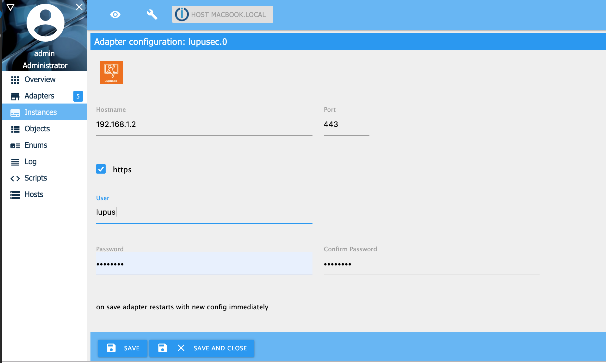
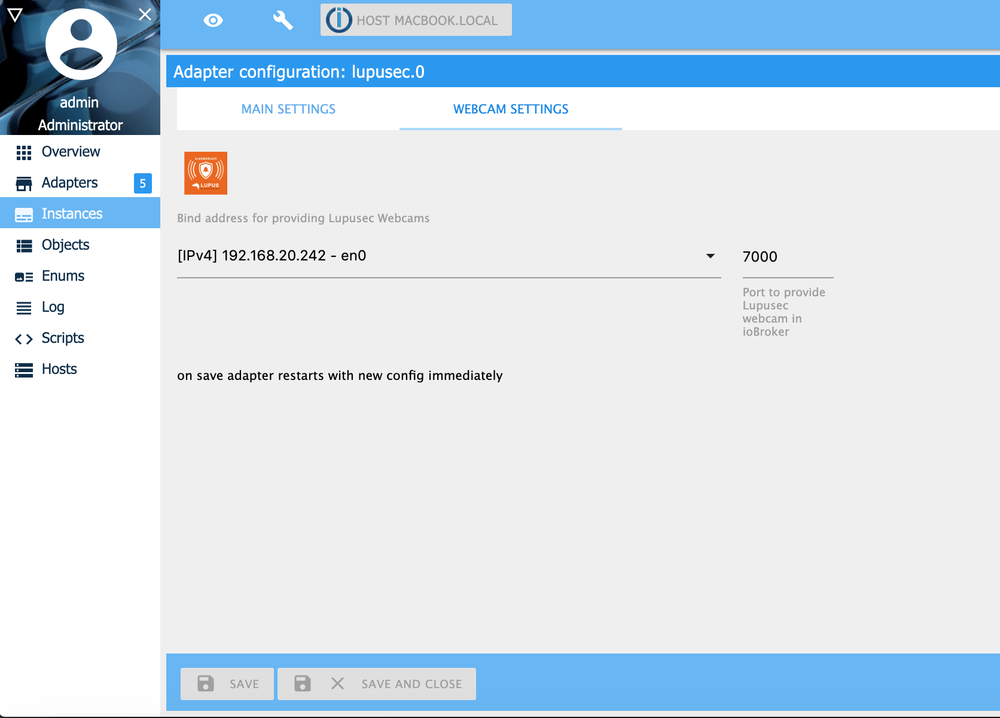

# ioBroker.lupusec

**Требуется Node.js версии 20.0 или выше и административная панель версии 5!**

Этот адаптер подключает охранные системы Lupusec XT1 Plus, XT2, XT2 Plus и XT3 к ioBroker. XT1 (без Plus) не поддерживается. Вы можете считывать состояние датчиков Lupusec, таких как датчики дверей, окон, воды, дыма, а также состояние охранной системы. Например, вы можете включать выключатели, управлять жалюзи и ставить/снимать охрану с охраны. Поскольку адаптеру приходится несколько раз обращаться к охранной системе для получения всей информации о состоянии и устройствах, нагрузка на процессор и использование памяти высоки. Для снижения нагрузки на процессор можно увеличить время опроса.

Подробную информацию можно найти здесь: [Волчанка](https://www.lupus-electronics.de/en)

## Установка

1. Установка адаптера. Самый простой способ — настроить адаптер lupusec.iobroker через функцию обнаружения в ioBroker. Адаптер обнаружения ищет правильный IP-адрес системы сигнализации Lupusec. Другой способ — настроить его вручную.

2. Ручная настройка адаптера. Выберите IP-адрес или имя хоста и порт из системы сигнализации Lupusec. Если вы используете HTTPS, активируйте флаг HTTPS. Загрузка ЦП выше при использовании HTTPS, чем без HTTP. Для чтения только статуса выберите пользователя без прав на запись. Если вы хотите изменить статус (например, включить/выключить свет или поставить/снять сигнализацию с охраны), выберите пользователя с правами на запись. С помощью параметра polltime вы можете настроить частоту вызова системы сигнализации. Высокое значение polltime снижает нагрузку на ЦП.

    Если к вашей системе сигнализации Lupusec подключены камеры видеонаблюдения, вы можете указать их в ioBroker. Адаптер Lupusec самостоятельно найдет все камеры Lupusec. Вам нужно будет ввести адрес (ваш IP-адрес в ioBroker или 0.0.0.0) и порт для последующего подключения к камерам. Если ваш дверной привод Nuki подключен к системе сигнализации Lupusec, вы также можете использовать его через ioBroker. В административном меню экземпляра ioBroker вы можете ввести данные о вашем дверном датчике Lupusec, установленном на двери Nuki. Если вы теперь откроете дверь, на которой установлен Nuki, вы увидите дополнительное состояние «дверь открыта» вместо просто «разблокирована». Если у вас нет дверного датчика Lupusec на двери Nuki, вы увидите только состояния «заблокирована» или «заблокирована».

По умолчанию все устройства Lupusec будут отображаться на вкладке объектов ioBroker. Полностью поддерживаются и индивидуально адаптированы следующие устройства:

- Дверной/оконный контакт (тип 4)
- Датчик воды (тип 5)
- Кнопка экстренного вызова (тип 7)
- Датчик движения / Датчик движения с углом обзора 360 градусов (Тип 9)
- Датчик CO (тип 13)
- Детектор дыма/тепла (тип 14)
- Датчик температуры V2 (тип 20)
- Сирена внутри (Тип 21)
- Индикатор состояния / Миниатюрная комнатная сирена (тип 22)
- Выключатель питания (тип 24)
- Одноканальное реле с ретранслятором ZigBee (тип 24)
- Двухканальное реле с ретранслятором ZigBee (тип 24)
- Репатер V2 (тип 26)
- Клавиатура (тип 37)
- Стеклянный датчик (тип 39)
- Сирена внутри (Тип 45)
- Снаружи сирена (тип 48)
- Измерительный прибор с выключателем питания (тип 48)
- Электросчетчик (тип 50)
- Универсальный ИК-контроллер (тип 52)
- Комнатный датчик V1 (тип 54)
- Датчик температуры с ЖК-дисплеем (тип 54)
- Мини-температурный датчик (тип 54)
- Дверной привод Nuki (тип 57)
- Тепловой извещатель (тип 58)
- Диммер (тип 66)
- Выключатель света V2 (тип 66)
- Оттенок (Тип 74)
- Реле рольставней V1 (тип 76)
- Термостат радиатора (тип 79)
- Термостат радиатора V2 (тип 79)
- Датчик освещенности (тип 78)
- Переключение сценариев V2 (Тип 81)
- Датчик удара (тип 93)
- Детектор дыма V2 (тип 14)
- Встраиваемое реле с диммером V3 (тип 66)
- Уличная клавиатура V2 (тип 17)

Для адаптера Apple Homekit yahka поддерживаются два состояния: apple\_home\_a1 и lupusec.0.status.apple\_home\_a2. Помимо состояния lupusec, можно включать и выключать систему сигнализации для зон 1 и 2.

Если у вас есть устройство, не указанное в списке выше, пожалуйста, свяжитесь со мной по адресу Thorsten Stueben <thorsten@stueben.de> .

## Переход с версии адаптера 1.xx на 2.xx

Если у вас установлена ​​версия 1.xx, и вы хотите перейти на версию 2.0.0 или выше, вам, к сожалению, придется заново настраивать экземпляр Lupusec. Старые значения конфигурации из версии 1.xx не будут использованы.

Это связано с тем, что интерфейс настройки был полностью переработан.

Для настройки блокировки Nuki сначала необходимо ввести имя хоста, имя пользователя и пароль, а затем сохранить изменения. После этого экземпляр перезапустится. Как только он запустится без ошибок, снова откройте конфигурацию экземпляра. Теперь вы можете настроить блокировку Nuki на вкладке Nuki.

## Объекты

### Статус Lupusec

ioBroker предоставляет вам те же объекты статуса, что и в приложении Lupusec.

### Устройства Lupusec

Все поддерживаемые датчики и устройства Lupsec вы найдете в разделе «Устройства». Если какое-либо устройство отсутствует в списке, пожалуйста, свяжитесь со мной. Подробное изображение датчика или устройства. В этом примере показан датчик угарного газа (CO). При срабатывании сигнализации об угарном газе состояние 'alarm\_status\_ex' изменяется на true, а 'alarm\_status' — на 'CO'.

### Веб-камеры Lupusec

Все подключенные камеры видеонаблюдения вы найдете в разделе «Веб-камеры». Вы можете скопировать ссылку, предоставленную в разделах «изображение» и «поток», в свой веб-браузер для открытия.

### Лупусек Нуки

Вы найдете свой дверной привод Nuki в разделе «Устройства», как и устройства Lupusec. Nuki имеет 2 состояния. Состояние nuki\_state показывает фактическое состояние дверного привода Nuki, например, дверь заблокирована или разблокирована. Состояние nuki\_action позволяет открыть, заблокировать или разблокировать дверь.\


### Lupusec SMS

Если вы используете Lupusec XT1+, XT2+ или XT3 с SMS-SIM-картой, вы можете отправлять SMS со следующими состояниями:

В качестве альтернативы вы можете отправлять SMS из своего JavaScript-кода с помощью следующей команды:

```
sendTo('lupusec.0', 'sms', { number: '+4917247114711', text: 'Test message' });
```

Если вы используете SMS-шлюз, вы можете добавить следующую команду в свой скрипт:

```
sendTo('lupusec.0', 'smsgw', { number: '+4917247114711', text: 'Test message' });
```

## Поиск неисправностей

Если при запуске адаптера Lupusec вы получаете ошибку о недоступности системы сигнализации, попробуйте выполнить команду ping до этой системы из окна терминала вашей системы ioBroker.

```
ssh <user>@<iobroker-ip-address>
sudo -u iobroker ping <lupsec-ip-address>
```

Если вы получили ошибку _ping: icmp open socket: Operation not permitted_ , выполните следующие действия и после этого снова запустите адаптер Lupusec.

```
ls -l `which ping`
sudo chmod u+s `which ping`
```

## Запланировано

В будущем запланированы следующие мероприятия:

- поддержка большего количества датчиков/устройств
- написание [документации](/#/docs/adapterref/iobroker.lupusec/docs/en/info.md) для каждого датчика/устройства

## Changelog

### **WORK IN PROGRESS**

- (Stübi) Checks actual_humidity value if it less 0% or greater 100%
- (Stübi) fixing issues detected by repository checker (Issue #126)
- (Stübi) node.js 24 will be supported (Issue #128)
- (Stübi) add IKEA poser supply

### 2.0.8 (2025-04-19)

- (Stübi) Performance optimization by pplling Lupusec alarm system (Issue #123)
- (Stübi) Add actual_temperature to type 20 Sensor (Issue #124)

### 2.0.7 (2025-02-23)

- (Stübi) Fixing @iobroker/adapter-dev 1.0.1 specified. 1.3.0 is required as minimum, 1.3.0 is recommended (Issue #115)
- (Stübi) Fixiing problem, that state value jumps back to old value (Issue #116)
- (Stübi) Delete status switch and add 3 butteons (shutter_up, shutter_down, shutter_stop) for shutter (Issue #116)
- (Stübi) Fixing dependency (Issue #117)

### 2.0.6 (2025-02-10)

- (Stübi) Minus temperature degrees will be shown now (Issue #113)
- (Stübi) Deletes unnecessary device objects (Issue #114)

### 2.0.5 (2025-02-01)

- (Stübi) Adjust datapoints hue, sat with step 1
- (Stübi) Fixed, that unused states will be not be shwon.

### 2.0.4 (2025-01-05)

- (Stübi) Adjustments of test and release yml
- (Stübi) Readme expanded to include migration instructions (Issue #97)
- (Stübi) Fixed error with HUE lights (Issue #104)
- (Stübi) Added the following values ​​for type 54: air pressure, wind strength, wind angle, wind gust, co2, wind speed
- (Stübi) Added for HUE the values mode (hue or temperature) and tempererature
- (Stübi) Added not used states will be not be shwon.
- (Stübi) Fixed value range for HUE to 0 to 360 degree, saturation from 0% to 100% and temperature from 2200 to 6500 kelvin

### 2.0.3 (2024-12-29)

- (Stübi) Adjustments due to migration from ESLint 8x≤ to 9.x.x (Issue #91)
- (Stübi) Redesign - changed everything from JavaScript to TypeScript
- (Stübi) Using axios for http requests
- (Stübi) the configuration changed. You have to edit the configuration
- (Stübi) js-controller in version 6 and 7 will be supported (Issue #83, #84, #95)
- (Stübi) nodejs 20 and nodejs 22 will be suported (Issue #87)

## License

The MIT License (MIT)

Copyright (c) 2025 Thorsten Stueben <thorsten@stueben.de>

Permission is hereby granted, free of charge, to any person obtaining a copy
of this software and associated documentation files (the "Software"), to deal
in the Software without restriction, including without limitation the rights
to use, copy, modify, merge, publish, distribute, sublicense, and/or sell
copies of the Software, and to permit persons to whom the Software is
furnished to do so, subject to the following conditions:

The above copyright notice and this permission notice shall be included in
all copies or substantial portions of the Software.

THE SOFTWARE IS PROVIDED "AS IS", WITHOUT WARRANTY OF ANY KIND, EXPRESS OR
IMPLIED, INCLUDING BUT NOT LIMITED TO THE WARRANTIES OF MERCHANTABILITY,
FITNESS FOR A PARTICULAR PURPOSE AND NONINFRINGEMENT. IN NO EVENT SHALL THE
AUTHORS OR COPYRIGHT HOLDERS BE LIABLE FOR ANY CLAIM, DAMAGES OR OTHER
LIABILITY, WHETHER IN AN ACTION OF CONTRACT, TORT OR OTHERWISE, ARISING FROM,
OUT OF OR IN CONNECTION WITH THE SOFTWARE OR THE USE OR OTHER DEALINGS IN
THE SOFTWARE.