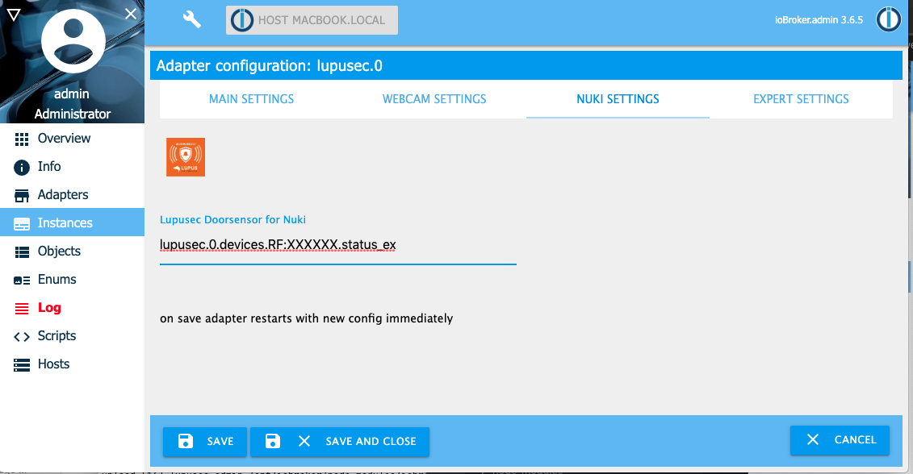

# IoBroker.lupusec
**Требуется node.js 20.0 или выше и Admin v5!**

Этот адаптер подключает систему сигнализации Lupusec XT1 Plus, XT2, XT2 Plus и XT3 к ioBroker.
XT1 (без Plus) не будет поддерживаться. Вы можете считывать состояние датчиков Lupusec, таких как датчики дверей, окон, воды, дыма, а также состояние системы сигнализации.
Например, вы можете включать выключатели, управлять ставнями и включать/выключать систему сигнализации.
Поскольку адаптер должен вызывать систему сигнализации несколько раз, чтобы получить всю информацию о состоянии и устройстве, загрузка ЦП и использование памяти высоки. Чтобы снизить нагрузку на ЦП, вы можете увеличить время опроса.

Подробную информацию вы можете найти здесь: [Волчанка](https://www.lupus-electronics.de/en)

## Установка
1. Установите адаптер.

Самый простой способ — настроить адаптер lupusec.iobroker через адаптер обнаружения в ioBroker. Адаптер обнаружения ищет правильный IP-адрес системы сигнализации Lupusec. Другой способ — настроить вручную

2. Ручная настройка адаптера

Выберите IP-адрес или имя хоста и порт из системы сигнализации Lupusec. Если вы используете https, активируйте флаг https. Загрузка ЦП выше при использовании https, а не без http.
Чтобы только читать статус, выберите пользователя без прав записи. Если вы хотите изменить статус (например, включить/выключить свет или включить/выключить сигнализацию), выберите пользователя с правами записи.
С помощью polltime вы можете настроить, как часто будет вызываться система сигнализации. Высокое polltime снижает нагрузку на ЦП.

 Если у вас есть камеры наблюдения, подключенные к вашей системе сигнализации Lupusec, вы можете предоставить их в ioBroker. Адаптер Lupusec сам находит все камеры Lupusec. Вам нужно ввести адрес (IP-адрес вашего ioBroker или 0.0.0.0) и порт для последующего подключения к камерам.
 Если у вас есть открыватель двери Nuki, подключенный к вашей системе сигнализации Lupusec, вы также можете использовать его из ioBroker. В меню администратора экземпляра ioBroker вы можете ввести ваш датчик двери Lupusec, который установлен на двери Nuki. Если вы теперь откроете дверь, на которой установлен Nuki, у вас будет дополнительное состояние «дверь открыта» вместо только «разблокирована». Если у вас нет датчика двери Lupusec на двери Nuki, вы увидите только состояния «заблокировано» или «заблокировано». 

По умолчанию все устройства Lupusec будут отображаться на вкладке объекта ioBroker.
Полностью поддерживаются и индивидуально адаптированы следующие устройства:

- Дверной контакт/оконный контакт (Тип 4)
- Датчик воды (Тип 5)
- Кнопка тревоги (Тип 7)
- Детектор движения / Детектор движения на 360 градусов (Тип 9)
- Датчик CO (Тип 13)
- Дымовой/тепловой извещатель (тип 14)
- Датчик температуры V2 (Тип 20)
- Сирена внутренняя (Тип 21)
- Индикатор состояния / Мини-сирена для помещений (Тип 22)
- Выключатель питания (тип 24)
- 1-канальное реле с повторителем ZigBee (Тип 24)
- 2-канальное реле с повторителем ZigBee (Тип 24)
- Репатер V2 (Тип 26)
- Клавиатура (тип 37)
- Датчик стекла (Тип 39)
- Сирена внутренняя (Тип 45)
- Сирена наружная (Тип 48)
- Измеритель выключателя питания (тип 48)
- Электросчетчик (Тип 50)
- Универсальный ИК-контроллер (тип 52)
- Датчик температуры в помещении V1 (Тип 54)
- ЖК-датчик температуры (тип 54)
- Минимальная температура (Тип 54)
- Открыватель дверей Nuki (Тип 57)
- Тепловой извещатель (Тип 58)
- Диммер (Тип 66)
- Выключатель света V2 (Тип 66)
- Оттенок (Тип 74)
- Реле рольставней V1 (Тип 76)
- Радиаторный термостат (Тип 79)
- Радиаторный термостат V2 (Тип 79)
- Датчик освещенности (Тип 78)
- Сценарный переключатель V2 (тип 81)
- Датчик удара (Тип 93)
- Дымовой извещатель V2 (Тип 14)
- Встраиваемое реле с диммером V3 (Тип 66)
- Клавиатура наружная V2 (тип 17)

Поддерживаются два состояния apple_home_a1 и lupusec.0.status.apple_home_a2 для адаптера Apple Homekit yahka. В дополнение к состояниям lupusec можно включить и выключить систему сигнализации для области 1 и 2.

Если у вас есть устройство, которого нет в списке выше, свяжитесь со мной по адресу Thorsten Stueben <thorsten@stueben.de>.

## Миграция с версии адаптера 1.x.x на 2.x.x
Если у вас установлена ​​версия 1.x.x и вы хотите перейти на версию 2.0.0 или выше, вам, к сожалению, придется снова настроить экземпляр Lupusec.
Старые значения конфигурации из версии 1.x.x не принимаются.

Это связано с тем, что интерфейс конфигурации был полностью переработан.

Чтобы настроить Nuki lock, сначала нужно ввести имя хоста, имя пользователя и пароль, а затем сохранить. Экземпляр перезапустится. Как только он запустится без ошибок, снова откройте конфигурацию экземпляра. Теперь вы можете настроить свой Nuki lock на вкладке Nuki.

## Объекты
### Статус Lupusec
ioBroker предлагает вам те же объекты статуса, что и в приложении Lupusec.


### Устройства Lupusec
Все поддерживаемые датчики и устройства Lupsec вы найдете в разделе «устройства». Если устройство отсутствует, свяжитесь со мной.
 Подробный вид датчика или устройства. В этом примере вы видите датчик CO. При тревоге CO состояние «alarm_status_ex» меняется на «true», а «alarm_status» меняется на «CO».


### Веб-камеры Lupusec
Все подключенные камеры наблюдения вы найдете в разделе «веб-камеры». Вы можете скопировать ссылку, указанную в состоянии «изображение» и «поток», в свой веб-браузер для открытия.


### Люпусек Нуки
Вы найдете свой открыватель двери Nuki в разделе «устройства», например, устройства Lupusec. Nuki обеспечивает 2 состояния. Состояние nuki_state показывает вам фактическое состояние открывателя двери Nuki, например, дверь заблокирована или разблокирована. С состоянием nuki_action вы можете открыть, заблокировать или разблокировать свою дверь.


### Люпусек СМС
Если вы используете Lupusec XT1+, XT2+ или XT3 с SIM-картой SMS, вы можете отправлять SMS со следующими статусами: 

В качестве альтернативы вы можете отправить SMS из JavaScript с помощью следующей команды:

```
sendTo('lupusec.0', 'sms', { number: '+4917247114711', text: 'Test message' });
```

Если вы используете SMS-шлюз, вы можете использовать следующую команду в своем скрипте:

```
sendTo('lupusec.0', 'smsgw', { number: '+4917247114711', text: 'Test message' });
```

## Поиск неисправностей
Если вы запустили адаптер Lupusec и получили сообщение об ошибке, что система сигнализации недоступна, попробуйте выполнить команду ping из окна терминала вашей системы ioBroker.

```
ssh <user>@<iobroker-ip-address>
sudo -u iobroker ping <lupsec-ip-address>
```

Если вы получили сообщение об ошибке _ping: icmp open socket: Operation not allowed_, выполните следующие действия, а затем снова запустите адаптер Lupusec.

```
ls -l `which ping`
sudo chmod u+s `which ping`
```

## Строганный
В будущем планируется следующее:

- поддержка большего количества датчиков/устройств
- написание [документации](docs/en/info.md) для каждого датчика/устройства

## Changelog
### 2.0.4 (2025-01-05)

- (Stübi) Adjustments of test and release yml
- (Stübi) Readme expanded to include migration instructions (Issue #97)
- (Stübi) Fixed error with HUE lights (Issue #104)
- (Stübi) Added the following values ​​for type 54: air pressure, wind strength, wind angle, wind gust, co2, wind speed
- (Stübi) Added for HUE the values mode (hue or temperature) and tempererature
- (Stübi) Added not used states will be not be shwon.
- (Stübi) Fixed value range for HUE to 0 to 360 degree, saturation from 0% to 100% and temperature from 2200 to 6500 kelvin

### 2.0.3 (2024-12-29)

- (Stübi) Adjustments due to migration from ESLint 8x≤ to 9.x.x (Issue #91)
- (Stübi) Redesign - changed everything from JavaScript to TypeScript
- (Stübi) Using axios for http requests
- (Stübi) the configuration changed. You have to edit the configuration
- (Stübi) js-controller in version 6 and 7 will be supported (Issue #83, #84, #95)
- (Stübi) nodejs 20 and nodejs 22 will be suported (Issue #87)

## License

The MIT License (MIT)

Copyright (c) 2025 Thorsten Stueben <thorsten@stueben.de>

Permission is hereby granted, free of charge, to any person obtaining a copy
of this software and associated documentation files (the "Software"), to deal
in the Software without restriction, including without limitation the rights
to use, copy, modify, merge, publish, distribute, sublicense, and/or sell
copies of the Software, and to permit persons to whom the Software is
furnished to do so, subject to the following conditions:

The above copyright notice and this permission notice shall be included in
all copies or substantial portions of the Software.

THE SOFTWARE IS PROVIDED "AS IS", WITHOUT WARRANTY OF ANY KIND, EXPRESS OR
IMPLIED, INCLUDING BUT NOT LIMITED TO THE WARRANTIES OF MERCHANTABILITY,
FITNESS FOR A PARTICULAR PURPOSE AND NONINFRINGEMENT. IN NO EVENT SHALL THE
AUTHORS OR COPYRIGHT HOLDERS BE LIABLE FOR ANY CLAIM, DAMAGES OR OTHER
LIABILITY, WHETHER IN AN ACTION OF CONTRACT, TORT OR OTHERWISE, ARISING FROM,
OUT OF OR IN CONNECTION WITH THE SOFTWARE OR THE USE OR OTHER DEALINGS IN
THE SOFTWARE.