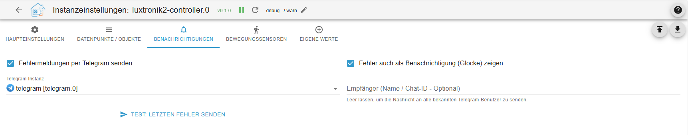
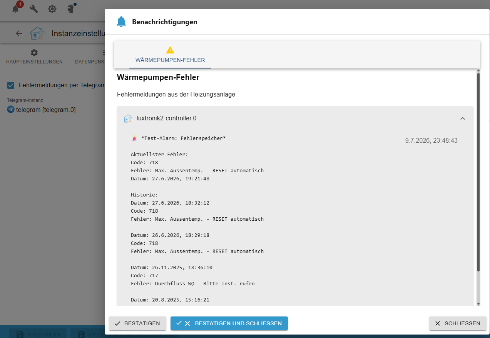
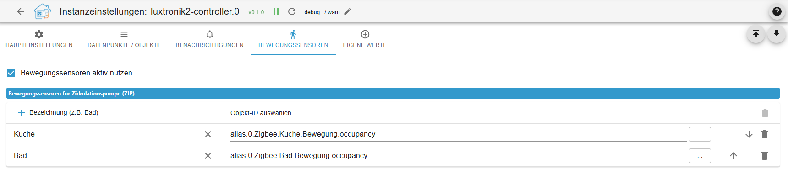

# ioBroker.luxtronik2-controller

## адаптер luxtronik2-controller для ioBroker

Этот адаптер ioBroker позволяет осуществлять локальное управление и мониторинг тепловых насосов с [контроллерами Luxtronik 2.x](https://www.alpha-innotec.com/en/products/accessories/control/luxtronik) (например, Alpha Innotec, Novelan). Адаптер полностью написан на TypeScript.

## Благодарности и история

Этот проект основан на предварительной работе существующих проектов с открытым исходным кодом. Особая благодарность выражается:

[Буни](https://github.com/bouni/luxtronik-2) , чья новаторская работа и разработка кода составляют важнейшую основу для взаимодействия с контроллерами Luxtronik.

[Coolchip:](https://github.com/coolchip/luxtronik2) Для фундаментального обратного проектирования сетевого протокола Luxtronik.

[UncleSamSwiss:](https://github.com/UncleSamSwiss/ioBroker.luxtronik2) Для оригинального адаптера ioBroker.

Инновации в этой версии: контроллер luxtronik2 изначально интегрирует TCP-связь (порты 8888/8889) и не зависит от внешних библиотек. Кроме того, реализованы управляющие макросы, логика защиты компрессора и автоматическое управление точками данных.

### Функции

- **Встроенная связь по протоколу TCP:** прямое подключение к тепловому насосу без каких-либо дополнительных затрат.
- **Защита компрессора (оптимизация цикла):** интеллектуальное объединение циклов отопления и горячего водоснабжения для значительного сокращения количества запусков компрессора.
- **Динамическое управление циркуляционным насосом отопления (ЦНХО):** автоматическая регулировка напряжения циркуляционного насоса отопления (ЦНХО) в зависимости от разброса температур напора и отводимой жидкости для достижения максимальной эффективности.
- **Интегрированные действия (макросы):** Предварительно заданная логика управления для принудительного отопления, запросов на горячее водоснабжение и циркуляционного насоса (ZIP), включая автоматическое переключение на безопасные значения по умолчанию.
- **Циркуляция по требованию (ZIP):** управляйте циркуляционным насосом с помощью существующих датчиков движения ioBroker или напрямую с помощью внешних исполнительных механизмов (например, Shelly) — без каких-либо аппаратных модификаций теплового насоса.
- **Пользовательские точки данных:** Измеренные значения (индекс 3004) и параметры (индекс 3003) можно гибко добавлять через конфигурацию адаптера. Временные метки Unix автоматически преобразуются в удобочитаемый формат.
- **Расширенные текстовые сообщения о состоянии и расчеты:** Расчет разброса температур, тепловой энергии в режиме реального времени и подробные текстовые сообщения о текущем состоянии системы (включая смещения, защиту от замерзания и состояние охлаждения).
- **Интеллектуальная система уведомлений:** отправляйте коды ошибок и критические сбои (например, проблемы со скоростью потока) напрямую в Telegram или систему уведомлений ioBroker — с защитой от спама в период ожидания.
- **Автоматическое резервное копирование DTA:** запланированная загрузка диагностических журналов DTA непосредственно с теплового насоса в хранилище ioBroker для удобного анализа (например, в OpenDTA).
- **Автоматическое управление объектами:** Отменённые выборки или удалённые точки данных, а также пустые структуры папок автоматически и корректно удаляются из ioBroker при перезапуске адаптера.
- **Широкая совместимость:** Полная поддержка более старых (V2.x) и более новых (V3.x) поколений прошивки (например, Alpha Innotec, Novelan), использующих динамические коэффициенты масштабирования.

## ⚠️ Предупреждение

Некоторые настройки, предоставляемые этой интеграцией, могут влиять на производительность вашего теплового насоса. Неправильная настройка может привести к переходу контроллера в состояние неисправности, что потребует ручной перезагрузки на месте.

Цель этого проекта — защитить ваш тепловой насос, ограничив параметры конфигурации безопасными значениями. Однако никаких гарантий дать нельзя. Будьте осторожны, ознакомьтесь с руководством пользователя Luxtronik и не изменяйте настройки, которые вы не до конца понимаете.

## 🔧 Совместимость

Интеграция позволяет отслеживать и управлять тепловыми насосами с помощью контроллера Luxtronik2. Она работает локально, без доступа в интернет. Интеграция тестировалась и продолжает тестироваться с контроллером LWD50A (LD5) от Alpha Innotec. Используется такими производителями, как:

- Альфа Иннотек,
- Сименс,
- Новелан,
- Рот,
- Элко,
- Будерус,
- Нибе,
- Wolf Heiztechnik.

## ⚠️ Предупреждение ⚠️

_Данный проект не связан с компаниями Alpha Innotec, Novelan, ait-deutschland GmbH или какой-либо другой компанией. Это личный проект, который поддерживается в свободное время. Использование на свой страх и риск._

## Сообщения об ошибках и вклад в разработку

Сообщения об ошибках, примечания о совместимости с конкретными версиями прошивки или запросы на добавление новых функций можно отправлять через систему отслеживания ошибок в [репозитории GitHub](https://github.com/TbsJah/ioBroker.luxtronik2-controller/issues) .

## Информация

[Info Deutsch](/#/docs/adapterref/iobroker.luxtronik2-controller/documentation/readme_de.md)

[Информация на английском языке](/#/docs/adapterref/iobroker.luxtronik2-controller/documentation/readme_en.md)

## Changelog

// ### **WORK IN PROGRESS**
### 0.13.1 (2026-10-02)

- **Fix (Circulation/ZIP):** Fixed a bug where the `Virtual_ZIP_Status` datapoint would remain stuck on `true` when using external relays (e.g., Shelly), even though the hardware relay was correctly turned off. The state reset logic has been decoupled and is now guaranteed to execute, ensuring the ioBroker interface stays perfectly synchronized with the actual hardware state.

### 0.13.0 (2026-10-02)

- **Bugfixes:**
    - **Critical DHW Target Fix:** Fixed an issue where the hot water target temperature was incorrectly written to parameter 2 instead of 105. This resolves unexpected temperature jumps (e.g., to 65°C) and socket timeouts on various heat pump models.
    - **Write Queue Timeout:** Added a maximum wait timeout to the write queue lock for legacy V1.x firmware to prevent potential infinite loops during read-write collisions.
    - **Backup Manager Multi-Instance Fix:** The automated DTA backup cron job is now safely scoped to the specific adapter instance, preventing conflicts when running multiple heat pumps on the same ioBroker host.
- **Under the Hood / Refactoring:**
    - **Centralized Typings:** Completely refactored the TypeScript architecture by introducing a centralized `LuxtronikAdapter` interface (`types.ts`). Replaced all fragmented, local interfaces across sub-modules to ensure strict, project-wide type safety and better maintainability.

### 0.12.1 (2026-09-30)

- **Bugfixes:**
    - **Fixed Null-Values on Startup:** Virtual states for the circulation pump logic (`Actions.Activate_Zip` and `03_Outputs.Virtual_ZIP_Status`) are now explicitly initialized to `false` during adapter startup. This prevents undefined `null` values in the object tree, ensuring immediate compatibility with visualizations and logic scripts (like Blockly) right from the first second.

### 0.12.0 (2026-09-30)

- **⚠️ BREAKING CHANGE:**
    - The datapoint to manually trigger the circulation pump macro (`Activate_Zip`) has been moved from the `Settings` folder to the `Actions` folder for better UX. If you use this state in your scripts or visualizations, please update the datapoint path!

- **Features & Improvements:**
    - **Virtual Circulation Pump (ZIP) Status:** Added a new read-only indicator datapoint (`Virtual_ZIP_Status`) in the `03_Outputs` folder. This datapoint mirrors the true state of the adapter's intelligent circulation pump macro in real-time. This is highly beneficial for users controlling the ZIP via external smart relays (e.g., Shelly) to avoid controller flash-wear, as it provides an accurate status even when the heat pump's internal display is bypassed.

### 0.11.2 (2026-09-30)

- **Features & Improvements:**
    - **Smart Parameter Filtering:** Added full support for the Luxtronik visibility registry (Network Command 3005). The adapter now automatically hides parameters in the ioBroker object tree that are physically not supported by your specific heat pump model (e.g., hiding defrost valves on brine-to-water pumps). This dramatically declutters the system.
    - Added an "Expert Mode" toggle in the adapter configuration to optionally disable the visibility filter and force-show all parameters.
    - Extended the "Dump Raw to Log" feature to include the visibility matrix (Command 3005).
    - **Legacy Write-Mode (V1.x):** Added a new connection setting for older heat pumps (Firmware V1.x). This "Fire-and-Forget" mode prevents `Timeout writing TCP parameter` errors on controllers that do not send network acknowledgments after receiving a write command.
    - **Dynamic Hardware Protection:** The adapter now automatically detects your firmware version and adjusts network write delays dynamically (500ms for V1.x vs. 100ms for modern firmwares) to ensure maximum responsiveness without sacrificing stability.
    - **Safe Payload Rounding:** Enforced strict integer rounding (`Math.round`) for all numeric write payloads to prevent memory faults and crashes on older Luxtronik controllers.
    - **Visibility Filter UX:** Added a warning to the visibility filter configuration (Command 3005) to clarify that this feature requires Firmware V3.x and should be disabled on older systems to avoid startup timeouts.

- **Bugfixes:**
    - **Fixed Heat Pump Crashes / Reboots:** Implemented a global mutex lock between the polling cycle (`updateData`) and the write queue. This guarantees that read and write operations never overlap, preventing fatal network socket collisions that caused V1.x controllers to freeze and reboot.
    - **Fixed Object Cleanup:** Changed the mass deletion of orphaned objects and empty folders during adapter startup from parallel to sequential execution. This prevents the ioBroker database from being overloaded and silently dropping delete commands.

## License

MIT License

Copyright (c) 2026 TbsJah <github.tbsjah@googlemail.com>

Permission is hereby granted, free of charge, to any person obtaining a copy
of this software and associated documentation files (the "Software"), to deal
in the Software without restriction, including without limitation the rights
to use, copy, modify, merge, publish, distribute, sublicense, and/or sell
copies of the Software, and to permit persons to whom the Software is
furnished to do so, subject to the following conditions:

The above copyright notice and this permission notice shall be included in all
copies or substantial portions of the Software.

THE SOFTWARE IS PROVIDED "AS IS", WITHOUT WARRANTY OF ANY KIND, EXPRESS OR
IMPLIED, INCLUDING BUT NOT LIMITED TO THE WARRANTIES OF MERCHANTABILITY,
FITNESS FOR A PARTICULAR PURPOSE AND NONINFRINGEMENT. IN NO EVENT SHALL THE
AUTHORS OR COPYRIGHT HOLDERS BE LIABLE FOR ANY CLAIM, DAMAGES OR OTHER
LIABILITY, WHETHER IN AN ACTION OF CONTRACT, TORT OR OTHERWISE, ARISING FROM,
OUT OF OR IN CONNECTION WITH THE SOFTWARE OR THE USE OR OTHER DEALINGS IN THE
SOFTWARE.