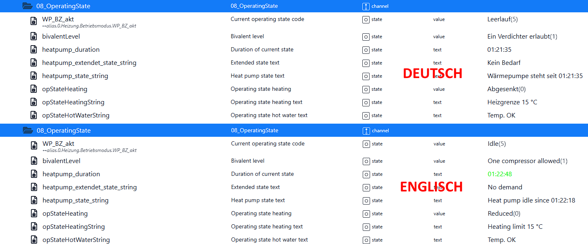
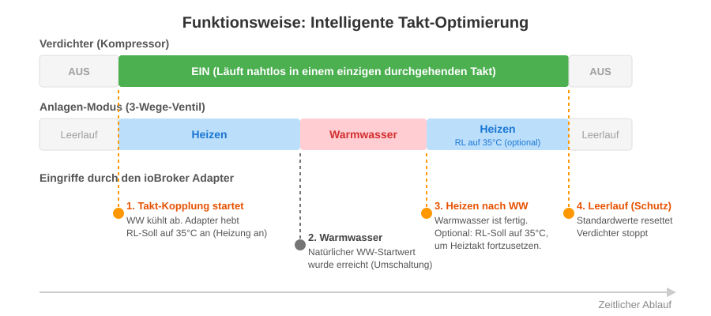
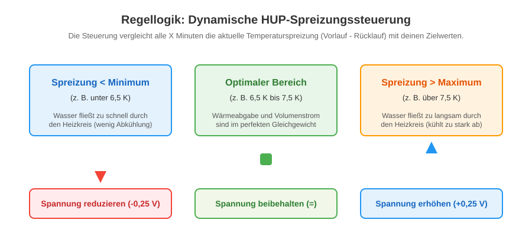

## Конфигурация мгновенного адаптера

При установке адаптеров необходимо изменить конфигурацию. Diese ist in verschiedene Reiter (Tabs) unterteilt, um die Einrichtung so übersichtlich wie möglich zu gestalten.

### 1. Reiter: Verbindung

Auf dieser Seite werden die grundlegenden Netzwerkeinstellungen für die Kommunikation mit der Luxtronik-Steuerung vorgenommen sowie die Anzeigesprache des Adaptes festgelegt.

#### Verbindungseinstellungen

- **IP-адрес (хост):** выберите локальный IP-адрес, указанный в локальной сети Netzwerk ein (z. B. `192.168.178.12`).
- **Порт Вермепумпен:** Der Kommunikationsport der Steuerung.
  - `8889` = Стандартный порт для классической TCP-связи (часто в прошивке версии 2.x).
  - `8214` = WebSocket-Port (подключение к новой версии прошивки V3.81x).
- **Abfrageintervall (Sekunden):** Немедленно откажитесь от адаптера нового сообщения и параметра теплового насоса (стандартно: 45 секунд).

> 💡 **WICHTIGER TIPP ZUM ABFRAGEINTERVALL:** Wähle diesen Wert **nicht zu gering** ! Ein zu schnelles Polling (z. B. alle 10 Sekunden) флейта ден внутренний процессор дер Luxtronik-Steuerung постоянный mit Anfragen. Когда процессор работает в режиме теплового насоса, он начинает работать и управлять устройством (тач-дисплей также доступен в сети Netzwerk) в крайнем случае. Empfohlen sind Werte zwischen 45 и 60 секунд.

---

#### Опионен

- **Sprache für Texte und Werte:** Diese Einstellung legt fest, в welcher Sprache die textbasierten Zustände und Betriebsmodi in die ioBroker-Datenpunkte geschrieben werden. Адаптер автоматически активирует коды английского языка в лесбийском тексте.

_Примечание: Если вы используете Wärmepumpe Wasser aufheizt, schreibt der Adaptor je nach Auswahl entweder `Warmwasser` (Deutsch) oder `Hot water` (English) in den Objektbaum._

### 2. Reiter: Takt-Optimierung

Стандартные требования к Luxtronik-Steuerung Heiz- und Warmwassertakte strikt getrennt. Dies führt dazu, dass der Verdichter nach der Warmwasserbereitung stoppt, nur um kurz darauf für einen Heiztakt wieder anzulaufen (erhöhter Verschleiß). Dieser Adaptor koppelt die Vorgänge интеллектуальный, надежный и эффективный в работе.

- **Интеллектуальная активация такта оптимизации:** Schaltet die übergreifende Logik zur Vermeidung von unnötigen Verdichter-Stopps ein.
  - **Auslöser-Regel (Vorzündung):** Wenn das Warmwasser abkühlt `(WW Soll - WW Ist ≥ WW Hysterese - 1,5 K)` **UND** gleichzeitig Heizbedarf besteht `(Rücklauf Ist ≤ Rücklauf Soll)` sowie die Summer-Heizgrenze nicht aktiv ist, получить адаптер ein.
  - **Действие:** Адаптер запускается непосредственно в процессе нагрева и устанавливается в режиме Rücklauf-Sollwert при температуре 35°C, а затем в режиме мягкого нагревания. Когда Anlage kurz darauf auf Warmwasser umschaltet, läuft der Verdichter einfach weiter.
- **Чтобы включить теплый режим:** Если он активен, выберите адаптер системы и _начните_ теплый контакт. При температуре 35°C при температуре 35°C температура нагрева должна быть равна нулю.

> **⚠️ Рекомендации:** если этот такт-оптимизация отсутствует, **вы должны** нажать _«Leerlauf»_ , чтобы активировать опцию _«Standardwerte im Leerlauf erzwingen»_ . Кроме того, гарантируется, что температура манипулирования при температуре 35°C должна быть выполнена в конце такта, когда вы будете видеть нормальные условия хранения!

### 3. Райтер: Леерлауф (Hardware-Schutz)

Die Luxtronik-Steuerung speichert geänderte Параметр во внутреннем Flash-Speicher, der nur eine begrenzte Anzahl an Schreibzyklen verträgt (EEPROM Flash Wear). Когда адаптер будет включен, включите его, когда активируется режим (Heizen или Warmwasser).

Когда режим «Wärmepumpe» в режиме **«Leerlauf» (режим ожидания)** будет заменен, это будет оптимизация. Если вам необходимо выполнить настройку с временными (проверенными) параметрами во время оптимизации, выберите адаптер, который должен быть установлен в правильном порядке.

> **💡 Dringende Empfehlung:** Wenn du die **интеллектуальный Takt-Optimierung** (Kopplung von Warmwasser und Heizung) и/или **динамическое HUP-Steuerung** Nutzt, solltest du das Setzen der Standardwerte im Leerlauf unbedingt aktivieren! Кроме того, это гарантия того, что выбор адаптеров будет точным с оригинальным Wunschwerten weiterarbeitet.

- **Vorgabewerte:** Trage hier zwingend die exakten Original-Vorgabewerte deiner Heizung ein (z. B. Standard-Hysterese für Heizen/Warmwasser, Fußpunkt, Endpunkt und Pumpenspannungen).
- **Visuelle Heizkurve:** Zur besseren Orientierung Generiert der Adaptor live eine grafische Vorschau deiner Heizkurve (Rücklauf-Soll), sobald du Fuß- und Endpunkt einträgst. _(Ein großes Dankeschön an [mnemotron.de](https://www.mnemotron.de/lux/heatcurve.html) für die Inspiration zu dieser Darstellung!)_

### 4. Рейтер: Heizumwälzpumpe (HUP)

Die Heizumwälzpumpe (HUP) перед теплым Вассером фон дер Wärmepumpe в deinen Heizkreis. Eine feste Pumpenleistung - это неэффективно: Ist sie zu hoch, rauscht das Wasser zu schnell durch die Rohre und kann die Wärme nicht Optimum an den Raum abgeben. Это sie zu niedrig, kühlt das Wasser zu stark ab und die Wärmepumpe verliert an Effizienz.

Дизер-адаптер устраняет проблему, связанную с **динамической настройкой и температурой** (Разница в температуре и температуре). Die Steuerspannung der Pumpe wird während eines Heiztaktes in regelmäßigen Abständen in winzigen Schritten erhöht or verringert, um immer genau im perfekten Zielbereich zu bleiben.

> **⚠️ Wichtige Voraussetzungen (Bitte vor Aktivierung prüfen!)**
>
> 1. **Совместимость аппаратного обеспечения:** Если у вас есть какие-либо функции, при подключении насоса к Steuerkabel (0–10 В или PWM) и к плате Luxtronik-Platine! Если вы используете свой насос, вы должны настроить собственный объем (например, _Grundfos ALPHA2 AutoAdapt_ auf Stellung «Auto»), чтобы функция **не** была активирована. Andernfalls würden der Adaptor und die Pumpe постоянно обновляется.
> 2. **Spannungsfaktor (Прошивка):** Альтернативные прошивки V2.x можно использовать в другом формате в новых прошивках V3.x (например, LWCV 82). Выбор конфигурации для выбора аппаратного обеспечения для вашего устройства (`100` для V2.x vs. `10` (для версии V3.x).
> 3. **Sicherheits-Reset (Leerlauf):** активация функции _«Standardwerte im Leerlauf erzwingen»_ в Reiter «Leerlauf». Дадурч упал на «Конец Heiztaktes», видя на своем празднике Standardspannung zurück, anstatt auf dem manipulierten Wert stehen zu bleiben.

#### Konfiguration deiner Anlage

Оптимальная температура для индивидуального дома и системы отопления:

- **Fußbodenheizung (FBH):** Arbeitet mit viel Wasser und niedrigen tempern. От **3 до 5 градусов по Кельвину** температура часто оптимальна.
- **Heizkörper (Radiatoren):** Benötigen höhere Vorlaufttemperaturen und kühlen im Raum stärker ab. Hier rechnet man meist mit **7 bis 10 Kelvin** Spreizung.

Трагедия при _минимальном/максимальном расходе_ для прохода через систему. Адаптер будет готов в течение _X минут_ (интервального интервала) и будет готов к использованию ночью в Zielkorridor. Ist die Spreizung zu gering (Wasser fließt zu schnell), wird die Pumpenspannung um die eingestellte _Schrittgröße_ (z. B. 0,25 В) verringert. Ist die Spreizung zu hoch, wird sie sanft erhöht.

### 5. Рейтер: Zirkulationspumpe (ZIP)

Die Zirkulationspumpe (ZIP) sorgt dafür, dass an den Zapfstellen im Haus (z. B. Dusche, Waschbecken) для согрева Вассера. Läuft sie jedoch dauerhaft или zeitgesteuert zu часто, kühlt sie den Warmwasserspeicher speicher aus (Energieverlust) и verbraucht unnötig Strom.

Этот адаптер должен быть умным и автоматическим, а ZIP-архив может быть использован только в том случае, если он используется в других местах.

- **Интеллектуальная оптимизация ZIP:** если включена, активируется адаптер теплового насоса. Циркуляция может быть осуществлена синхронно с теплым потоком воздуха.
- **Laufzeit bei Aktivierung:** Definiert, wie lange (в секундах) die Pumpe laufen soll, wenn sie durch den Adaptor order manuell (über den Schalter `Activate_Zip` im Objektbaum) ausgelöst wird. Если вы используете интервал между 120 и 180 секундами, система Rohrsystem работает с теплыми водами.
- **Bewegungsmelder (по запросу):** это абсолютный потенциал Spar! Вы можете использовать ioBroker-Datenpunkte deiner Smart-Home-Bewegungsmelder (z. B. Zigbee-Sensoren im Badezimmer или in der Küche) eintragen. Прежде чем начать работу, начните с адаптера для обеспечения циркуляции воздуха. Das Wasser — это теплый, угрюмый человек, am Waschbecken steht, und es wird keine Energie verschwendet.
- **Внешние актеры (z.B. smarte Steckdosen):** Если вы не используете циркуляционный насос напрямую и дер Luxtronik-Platine angeklemmt, это, в свою очередь, и Einem Smarten Relais (z.B. Shelly, Osram Smart Plug и т. д.), это может привести к тому, что вы получите указание от Steckdosen подсказки. Адаптер должен использовать WLAN-/Zigbee-Steckdosen для автоматического подключения к внутренней логике и другим устройствам. _(Перенос: Dies verursacht 0 Flash-Schreibvorgänge auf dem Speicher der Wärmepumpe!)_

**💡 Типп! Hardware-Schutz (EEPROM Flash-Wear - dringend beachten!)** Когда вы будете использовать стандартный регулятор для минимизации, сохраните стандартные ZIP-файлы, которые можно использовать на таблице Mo-So и переносить их с 00:00 до 00:00. Время ожидания: 60 минут и время: 0 минут.

**Um die Schreibvorgänge auf dem Regler zu reduzieren, ist es empfehlenswert, die ZIP(s) über einen externen Aktor zu steuern ➔ 0 Schreibvorgänge im Regler! Дополнительная информация: Активация для Luxtronik2 Regler benötigt für das Entlüftungsprogramm 4 Schreibvorgänge. Über die ZIP-Steuertabelle, который лучше всего подходит для осени 4 и для осени 14. Schreibvorgänge im Flash-Speicher pro Zip Durchlauf.**

## 🛠️️ Фелеранализ/Устранение неполадок

### Исходный тестовый скрипт TCP (`Test_Script.ts`)

В некоторых случаях (в зависимости от версии встроенного ПО с версией V1.x) может быть задано значение Verbindungsabbrüchen или Timeouts beim Schreiben von Werten kommen (zB `Timeout writing TCP parameter 105`).

Когда вы обнаружите, что проблема связана с адаптером или с теплым насосом, который находится в изолированном тестовом сценарии (`Test_Script.ts` им Орднер `Scripte`) Бэй. Коммуникационный сценарий полностью укомплектован адаптером, предназначенным для использования непосредственно с TCP-сокетами с помощью Luxtronik-Steuerung. Es testet den Schreib- und Lesezugriff, indem es den Warmwasser-Sollwert ausliest, ihn testweise minerhöht und soft wieder den Originalwert herstellt.

#### Ausführung im ioBroker:

1. 🛑 **ВНИМАНИЕ:** Stoppe zwingend **alle** laufenden Luxtronik-Adapter-Instanzen im ioBroker (auf "Rot" stellen)! Alte Luxtronik-Steuerungen lassen nur einzige gleichzeitige Netzwerkverbindung zu. При использовании адаптера во внутреннем пространстве порт блокируется, а сценарий не работает в течение тайм-аута.
2. Kopiere den Inhalt der Filei `Test_Script.ts` в новом скрипте в ioBroker **JavaScript-адаптере** (тип: _TypeScript_ auswählen).
3. Passe ganz oben im Skript die Konstante `HOST` IP-адрес, указанный в Wärmepumpe.
4. Запустите скрипт и получите журнал регистрации ioBrokers.

#### Ergebnis-Auswertung:

- **✅ ERFOLG:** Скрипт läuft zügig durch und die Wärmepumpe bestätigt den Schreibbefehl. Для этого необходимо выбрать установку (и прошивку) и получить необходимые настройки.
- **❌ TIMEOUT / FEHLER:** Das Skript bleibt beim Lesen/Schreiben hängen order wird abgewiesen. Dies bedeutet, dass die Anlage die TCP-Kommunikation physch verweigert. Также часто блокируются порты (например, Loxone, FHEM, другие системы Smart-Home), встроенное ПО или дополнительные сетевые карты в тепловом насосе (здесь часто используется Strom-Reset der Anlage). С адаптером могут возникнуть проблемы с подключением сети.