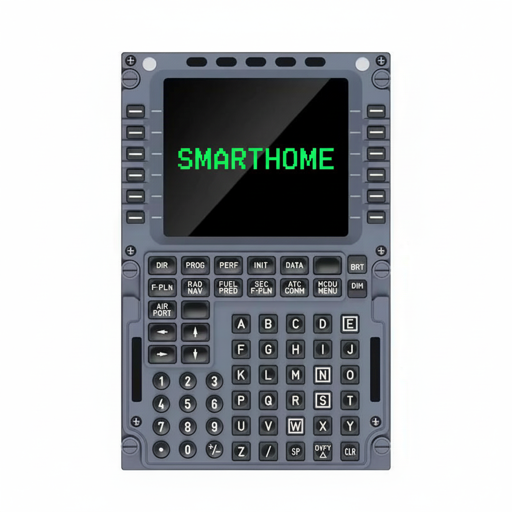

# ioBroker.mcdu

## Адаптер MCDU для умного дома для ioBroker

Управляйте своим умным домом с помощью авиационного дисплея WINWING MCDU-32-CAPTAIN через MQTT. Этот проект выводит ваш умный дом на новый уровень, предлагая аутентичный интерфейс в стиле авиалайнера с вводом данных в блокнот, навигацией по страницам, диалоговыми окнами подтверждения и дисплеем 14x24 символа с 8 цветами.

Все мы через это проходили: крепили планшеты на стены для управления умным домом, возились с громоздкими визуализациями, тратили целую вечность, чтобы найти нужный выключатель для управления лампочкой. Поскольку в моей семье есть пилот, меня сразу заинтересовала панель управления MCDU: простая концепция ввода данных, быстрый выбор нужной точки данных. А потом я нашел фантастический продукт от Winwing <https://eu.winctrl.com/view/goods-details.html?id=945> и начал обратное проектирование. Отдельное спасибо <https://github.com/alha847> за предоставленную информацию об устройстве.

Поскольку я не разработчик, а просто технарь, я использовал код Claude структурированным образом. Сначала для сбора информации об устройстве и обратного проектирования, затем для структурирования правильной архитектуры для контекста умного дома, а затем для разработки адаптера для iobroker и клиента для Raspberry Pi. Спасибо и привет замечательному сообществу открытого исходного кода, особенно <https://github.com/klein0r> и его отличным видеороликам о разработке адаптеров и приложениях iobroker для умного дома всех видов.

Это первая версия адаптера и клиента. Мне ещё предстоит её как следует протестировать и внести некоторые улучшения. Не стесняйтесь вносить свой вклад.

### Статус проекта: приветствуются участники.

По состоянию на август 2026 года автор перенёс свой собственный умный дом на Home Assistant и поддерживает там аналогичную интеграцию: **[homeassistant-mcdu](https://github.com/Flixhummel/homeassistant-mcdu)** . Этот адаптер ioBroker **не заброшен** — он работает и остаётся доступным — но активная разработка переместилась в другое место. Вклад и соавторы приветствуются.

Оба проекта используют один и тот же клиент для Raspberry Pi и один и тот же протокол MQTT, который теперь зафиксирован и задокументирован в виде версионированного контракта в **[файле docs/PROTOCOL.md](/#/docs/adapterref/iobroker.mcdu/docs/PROTOCOL.md)** . Пожалуйста, реализуйте его в соответствии с этой спецификацией, чтобы клиент продолжал работать в обоих проектах. Причины разделения описаны в [файле docs/HOME-ASSISTANT-CONCEPT.md](/#/docs/adapterref/iobroker.mcdu/docs/HOME-ASSISTANT-CONCEPT.md) .

> **Примечание:** одновременно управлять данным MCDU может только один «мозг». Темы отображения сохраняются — если этот адаптер и интеграция с Home Assistant одновременно передают данные на одно и то же устройство, изображение на экране будет мерцать.

**Известная открытая ошибка:**`lib/mqtt/ButtonSubscriber.js` ручки`PREV_PAGE` /`NEXT_PAGE` но клиент отправляет только`SLEW_LEFT` /`SLEW_RIGHT` /`SLEW_UP` /`SLEW_DOWN` (видеть`mcdu-client/lib/button-map.json` Таким образом, навигация SLEW, по всей видимости, не работает в этом адаптере. Хороший первый вклад.

### Архитектура

```
ioBroker Adapter (main.js)  <-->  MQTT Broker  <-->  RasPi Client (mcdu-client/)  <-->  USB HID Hardware
```

Адаптер ioBroker выполняет всю бизнес-логику (рендеринг страниц, обработка ввода, валидация). Клиент для Raspberry Pi представляет собой «простой терминал», который передает сообщения MQTT на USB HID-оборудование — он не содержит никакой бизнес-логики.

### Функции

- **14x24-символьный дисплей** с 8 цветами (белый, янтарный, голубой, зеленый, пурпурный, красный, желтый, серый).
- **73 кнопки,** включая 12 клавиш выбора строки, 12 функциональных клавиш, полнофункциональная буквенно-цифровая клавиатура.
- **11 светодиодов** (9 индикаторов + 2 подсветки с регулировкой яркости BRT/DIM)
- **Построчное управление цветом** : независимые цвета для colLabel и colData, цвет строки состояния для каждой страницы.
- **Ввод данных в авиационном стиле** : черновик на строке 14, выбор поля на основе LSK, подтверждение OVFY.
- **Система страниц** : настраиваемые страницы с подзаголовками, автоматическая пагинация, типы макета (меню/данные/список).
- **Функциональные клавиши** : 11 настраиваемых клавиш (MENU, INIT, DIR, FPLN, PERF и т. д.) с возможностью сопоставления с настройками каждого устройства.
- **Навигация** : иерархия родительских элементов, строка состояния в виде навигационной цепочки, круговая перестановка строк (SLEW), переход из CLR к родительскому элементу.
- **Механизм проверки** : уровни проверки нажатия клавиш, формата, диапазона и бизнес-логики.
- **Диалоги подтверждения** : мягкие (LSK или OVFY) и жесткие (только OVFY) для критически важных действий.
- **Поддержка нескольких устройств** : несколько MCDU через пространства имен тем MQTT для каждого устройства.
- **32 состояния автоматизации** : управление светодиодами, блокнот, уведомления, запуск кнопок из скриптов ioBroker.

### Статус разработки

| Фаза                                                                     | Статус      |
| ------------------------------------------------------------------------ | ----------- |
| Adapter Foundation (MQTT, дерево состояний, дисплей)                     | Сделанный   |
| Система ввода (черновик, проверка, подтверждение)                        | Сделанный   |
| Бизнес-логика (рендеринг, пагинация, функциональные клавиши)             | Сделанный   |
| Редизайн административного интерфейса + модель левых/правых линий        | Сделанный   |
| Этап A пользовательского интерфейса: Настройка функциональных клавиш     | Сделанный   |
| Этап B UX: Иерархия навигации и «хлебные крошки»                         | Сделанный   |
| Этап C UX: Типы макета страницы (меню/данные/список)                     | Сделанный   |
| Улучшение отображения (разделение цветов, яркость, состояния устройства) | Сделанный   |
| Этап D UX: Страница быстрого доступа                                     | Не началось |
| Этап UX E: Настройка назначения светодиодов                              | Не началось |
| Этап F UX: Профили конфигурации                                          | Не началось |
| Этап G UX: Доработка и интеграция административного интерфейса.          | Не началось |
| Тестирование развертывания оборудования                                  | Не началось |

199 тестов пройдено успешно (188 модульных + 11 интеграционных).

### Рекомендуемое оборудование (mcdu-client)

mcdu-client — это легковесный процесс Node.js (\~50-100 МБ ОЗУ), который обеспечивает связь MQTT с USB HID. Для его работы необходимы Wi-Fi, порт USB Host и достаточное питание USB для MCDU (\~500 мА).

| Доска                       | Цена   | Wi-Fi           | USB-хост               | Вердикт                                                                          |
| --------------------------- | ------ | --------------- | ---------------------- | -------------------------------------------------------------------------------- |
| **Raspberry Pi 4 (1-2 ГБ)** | $35-45 | Двухдиапазонный | 4 разъема USB-A        | **Рекомендуется** — оптимальное сочетание цены, мощности и простоты.             |
| Raspberry Pi 3B+            | \~$35  | Двухдиапазонный | 4 разъема USB-A        | Проверено (текущая конфигурация для разработчиков), немного медленнее.           |
| Raspberry Pi 5              | $50-80 | Двухдиапазонный | 4 разъема USB-A        | Хороший, но для полной мощности USB требуется официальный блок питания на 27 Вт. |
| Raspberry Pi Zero 2 Вт      | \~$15  | 2,4 ГГц         | Необходим OTG-адаптер. | Дешевая, но сложная в использовании однопортовая система OTG.                    |
| ESP32-S3                    | $5-15  | Да              | USB OTG                | Не удается запустить Node.js — потребуется полная переработка кода на C++.       |

**Ключевое ограничение** : прошивка WinWing MCDU требует передачи управляющих сигналов SET\_REPORT (а не прерывания OUT). mcdu-client использует`node-hid` который обрабатывает это автоматически на всех платформах (IOHIDManager на macOS, hidraw на Linux).

### Быстрый старт (разработка)

```bash
npm install
npm test          # Run all tests
npm run lint      # ESLint
npm run check     # Lint + test combined
```

Подробную документацию см. в папке [docs/](/#/docs/adapterref/iobroker.mcdu/docs/README.md) .

### Сценарии

| Сценарий                   | Описание                                             |
| -------------------------- | ---------------------------------------------------- |
| `npm test`                 | Запустите все тесты                                  |
| `npm run test:unit`        | только модульные тесты                               |
| `npm run test:integration` | Только интеграционные тесты                          |
| `npm run test:watch`       | Режим просмотра для модульных тестов                 |
| `npm run lint`             | ESLint                                               |
| `npm run lint:fix`         | ESLint с функцией автоматического исправления ошибок |
| `npm run check`            | Lint + тест в совокупности                           |

## Changelog
<!--
    Placeholder for the next version (at the beginning of the line):
    ### **WORK IN PROGRESS**
-->

### **WORK IN PROGRESS**
* (Flixhummel) Address ioBroker adapter review feedback (reviewer McM1957)
* (Flixhummel) Migrate to ESLint 9 flat config with @iobroker/eslint-config v2.2.0
* (Flixhummel) MQTT password now stored encrypted -- users must re-enter password once after updating
* (Flixhummel) Fix object hierarchy: `devices` container changed from channel to folder
* (Flixhummel) Fix 12+ state roles to match ioBroker standards
* (Flixhummel) Replace native setTimeout/setInterval with adapter equivalents
* (Flixhummel) Consolidate i18n translations to flat JSON files, move i18n.js to scripts/
* (Flixhummel) Remove unused admin/jsonConfig-complexversion.json

### 0.2.0 (2026-02-28)
* (Flixhummel) Fix error display for read-only datapoints, improve save config handling

### 0.1.9 (2026-02-27)
* (Flixhummel) Unify MCDU driver to node-hid on all platforms, clean up mcdu-client setup

### 0.1.8 (2026-02-26)
* (Flixhummel) Remove unpublished news entries and add missing jsonConfig size attributes

### 0.1.7 (2026-02-25)
* (Flixhummel) Fix ioBroker repository checker errors and warnings

### 0.1.4 (2026-02-25)
* (Flixhummel) Switch to npm trusted publishing (OIDC) for automated releases

### 0.1.3 (2026-02-25)
* (Flixhummel) Initial npm release with MQTT bridge, page system, admin UI, and automation states

For detailed changelog see [CHANGELOG.md](https://github.com/Flixhummel/ioBroker.mcdu/blob/main/CHANGELOG.md).

## License
MIT License

Copyright (c) 2026 Flixhummel <hummelimages@googlemail.com>

Permission is hereby granted, free of charge, to any person obtaining a copy
of this software and associated documentation files (the "Software"), to deal
in the Software without restriction, including without limitation the rights
to use, copy, modify, merge, publish, distribute, sublicense, and/or sell
copies of the Software, and to permit persons to whom the Software is
furnished to do so, subject to the following conditions:

The above copyright notice and this permission notice shall be included in all
copies or substantial portions of the Software.

THE SOFTWARE IS PROVIDED "AS IS", WITHOUT WARRANTY OF ANY KIND, EXPRESS OR
IMPLIED, INCLUDING BUT NOT LIMITED TO THE WARRANTIES OF MERCHANTABILITY,
FITNESS FOR A PARTICULAR PURPOSE AND NONINFRINGEMENT. IN NO EVENT SHALL THE
AUTHORS OR COPYRIGHT HOLDERS BE LIABLE FOR ANY CLAIM, DAMAGES OR OTHER
LIABILITY, WHETHER IN AN ACTION OF CONTRACT, TORT OR OTHERWISE, ARISING FROM,
OUT OF OR IN CONNECTION WITH THE SOFTWARE OR THE USE OR OTHER DEALINGS IN THE
SOFTWARE.