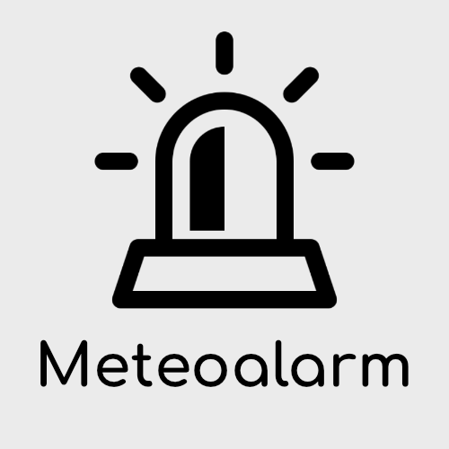

# IoBroker.meteoalarm
** Этот адаптер использует библиотеки Sentry для автоматического сообщения разработчикам об исключениях и ошибках кода. ** Дополнительные сведения и информацию о том, как отключить отчет об ошибках, см. В [Документация Sentry-Plugin](https://github.com/ioBroker/plugin-sentry#plugin-sentry)! Сторожевые отчеты используются начиная с js-controller 3.0.

Адаптер метео сигнализации для ioBroker ---------------------------------------------- -------------------------------- Этот адаптер получает сообщения о погоде с https://meteoalarm.org, включая информацию о ветре. , снег, дождь, высокая и низкая температура и т. д. Эта информация доступна на местном языке и для подробных регионов.

Отказ от ответственности: возможны задержки между этим веб-сайтом и веб-сайтом www.meteoalarm.org, для получения самой последней информации об уровнях предупреждений, публикуемой участвующими национальными метеорологическими службами, используйте https://www.meteoalarm.org.

## Как это использовать
Выберите свою страну, а затем регион, для которого вы хотите получать предупреждения. Если вы не знаете, как называется ваш регион, перейдите на https://meteoalarm.org и попробуйте найти его на карте.

## Добавьте его к своей визе
Самый простой способ добавить его к вашему vis - использовать базовую строку виджета и выбрать там datapoint htmlToday. Это дает вам предварительно разработанный виджет HTML, который вы можете настроить в настройке.

## Типы сигналов тревоги
| Тип сигнала тревоги | Описание |
|:---:|:---:|
| 1 | Ветер |
| 2 | Снег / Лед |
| 3 | Гром и молния |
| 4 | Туман |
| 5 | Высокая температура |
| 6 | Низкая температура |
| 7 | Побережье |
| 8 | Лесной пожар |
| 9 | Лавина |
| 10 | Дождь |
| 11 | Неизвестно |
| 12 | Наводнение |
| 13 | Дождь-наводнение |

## Настраивать
«Без цвета фона в виджете HTML»: возможность использовать виджет HTML без цвета фона (например, если вы хотите использовать цветной объект для заполнения всего виджета, а не только виджета html).

«Определить цвета предупреждений»: возможность определять цвета для различных уровней сигналов тревоги в HEX-коде. Используется для виджета HTML, а также для объекта цвета, чтобы вручную назначить его другому виджету

"Использовать белые значки": используйте белые значки вместо черных.

«Значки»: определение размера значка в виджете HTML.

«В виджете нет символов»: не используйте символ в виджете HTML. Вы все еще можете получить к нему доступ в объектах. Это полезно, если вы хотите, чтобы значок отображался отдельно от виджета - например, в большем размере.

## Уровни срабатывания сигнализации
| Уровень тревоги | Описание |
|:---:|:---:|
| Зеленый | На данный момент нет доступных предупреждений. |
| Желтый | Погода потенциально опасна. Прогнозируемые погодные явления не являются чем-то необычным, но следует уделять повышенное внимание деятельности, подверженной метеорологическим рискам. Будьте в курсе ожидаемых метеорологических условий и не принимайте на себя никаких рисков. |
| Апельсин | Погода опасная. Предсказаны необычные метеорологические явления. Вероятны повреждения и аварии. Будьте очень внимательны и осторожны и будьте в курсе ожидаемых метеорологических условий. |
| Красный | Погода очень опасная. Были предсказаны необычно интенсивные метеорологические явления. Чрезвычайные повреждения и аварии, часто на больших территориях, угрожают жизни и имуществу. |

## Поддерживаемые страны
* Австрия
* Германия
* Бельгия
* Босния и Герцеговина
* Хорватия
* Кипр
* Чехия
* Дания
* Эстония
* Финляндия
* Франция
* Греция
* Венгрия
* Исландия
* Израиль
* Италия
* Латвия
* Литва
* Люксембург
* Мальта
* Нидерланды
* Норвегия
* Польша
* Румыния
* Сербия
* Словакия
* Словения
* Испания
* Швеция
* ВЕЛИКОБРИТАНИЯ

Если вы не можете найти свою страну, создайте проблему на github, и я с радостью добавлю ее.

## Невозможные страны
* Швейцария (файл геокода с сайта meteoalarm.org, вероятно, неверен)
* Португалия (файл геокода с сайта meteoalarm.org, вероятно, неверен)
* Болгария (файл геокода с сайта meteoalarm.org, вероятно, неверен)

## 2.0.1 (2021-07-08)
* (jack-blackson) Имя папки с сигналами тревоги изменено на Alarm_X
* (jack-blackson) Определите в настройке, какие будильники вы хотите видеть
* (Джек-Блэксон) Сортировка сигналов тревоги по дате вступления в силу

## 2.0.0 (06.07.2021)
* (jack-blackson) Перейти на Meteoalarm.org, полностью перестроить

## 1.2.1 (05.06.2021)
* (jack-blackson) Исправление ошибки для обработки некорректного XML (если используется страна вместо региона)
* (jack-blackson) Добавлен Люксембург

## 1.2.0 (2021-05-16)
* (jack-blackson) Новая настройка: «Без цвета фона в виджете HTML», «Определить цвета предупреждений» и «Использовать белые значки»
* (Джек-Блэксон) Новые Иконки

## 1.1.11 (2021-05-09)
* (jack-blackson) Обновления пакетов

## 1.1.9 (2021-05-07)
* (jack-blackson) Обновления пакетов

## 1.1.5 (2021-05-02)
* (jack-blackson) Исправление ошибок JS-Controller 3.3.1, обработка ошибок не определен язык

## 1.1.4 (2021-04-05)
* (jack-blackson) Обработка сообщения об ошибке ENOTFOUND, добавлено Sentry

## 1.1.3 (29.03.2021)
* (jack-blackson) Исправлены ошибки проверки адаптера

## 1.1.2 (29.03.2021)
* (jack-blackson) Исправление неработающего обновления данных, убрана автогенерация ссылок из-за ошибок CORS

## 1.1.1 (2020-10-28)
* (jack-blackson) Исправление ошибок в данных HTML

## 1.1.0 (29.03.2020)
* (jack-blackson) Исправление ошибок Германия

## 1.0.9 (06.02.2020)
* (jack-blackson) Исправление ошибок Германия

## 1.0.8 (15.11.2019)
* (jack-blackson) Добавлены Польша, Молдова, Греция, Румыния
* (jack-blackson) Добавлена новая точка данных для получения ссылки на карту погоды

## 1.0.7 (13.11.2019)
* (jack-blackson) Добавлены Чехия, Ирландия, Израиль, Литва, Латвия, Черногория, Мальта, Сербия, Швеция

## 1.0.6 (19.10.2019)
* (jack-blackson) Добавлены Швейцария и Словакия.

## 1.0.5 (22.09.2019)
* (Джек-Блэксон) Небольшие корректировки при регистрации.

## 1.0.4 (11.09.2019)
* (Джек-Блэксон) Ошибка Трэвиса

## 1.0.3 (09.09.2019)
* (jack-blackson) Небольшие исправления, изменение типа "deamon" на "schedule"

## 1.0.2 (25.08.2019)
* (Джек-Блэксон) Информация о выпуске переупорядочена

### 1.0.1 (18.08.2019)
* (jack-blackson) Исправление ошибки без значка будильника

### 1.0.0 (12.08.2019)
* (jack-blackson) Релизная версия

### 0.6.0 (05.08.2019)
* (jack-blackson) Сохранять значки погоды локально в адаптере

### 0.5.0 (21.07.2019)
* (jack-blackson) Обработка таймаутов
* (jack-blackson) Перевод на все языки
* (jack-blackson) проверка URL

### 0.4.0 (20.07.2019)
* (jack-blackson) Добавлены данные для NL, NO, HR, FI, ES
* (jack-blackson) Добавлен текст типа, тип теперь пуст, если уровень 1 (без предупреждения)
* (Джек-Блэксон) Скорректированные цвета

### 0.3.0 (13.07.2019)
* (jack-blackson) Добавлен HTML-виджет
* (jack-blackson) Значок исправления ошибки

### 0.2.0 (12.07.2019)
* (jack-blackson) Добавлены данные "Завтра"

### 0.1.0 (11.07.2019)
* (Джек-Блэксон) начальная версия

## Кредиты
Колокольчик в иконке, разработанной Freepik с сайта www.flaticon.com

## Changelog

## License
The MIT License (MIT)

Copyright (c) 2019-2021 jack-blackson <blacksonj7@gmail.com>

Permission is hereby granted, free of charge, to any person obtaining a copy
of this software and associated documentation files (the "Software"), to deal
in the Software without restriction, including without limitation the rights
to use, copy, modify, merge, publish, distribute, sublicense, and/or sell
copies of the Software, and to permit persons to whom the Software is
furnished to do so, subject to the following conditions:

The above copyright notice and this permission notice shall be included in
all copies or substantial portions of the Software.

THE SOFTWARE IS PROVIDED "AS IS", WITHOUT WARRANTY OF ANY KIND, EXPRESS OR
IMPLIED, INCLUDING BUT NOT LIMITED TO THE WARRANTIES OF MERCHANTABILITY,
FITNESS FOR A PARTICULAR PURPOSE AND NONINFRINGEMENT. IN NO EVENT SHALL THE
AUTHORS OR COPYRIGHT HOLDERS BE LIABLE FOR ANY CLAIM, DAMAGES OR OTHER
LIABILITY, WHETHER IN AN ACTION OF CONTRACT, TORT OR OTHERWISE, ARISING FROM,
OUT OF OR IN CONNECTION WITH THE SOFTWARE OR THE USE OR OTHER DEALINGS IN
THE SOFTWARE.