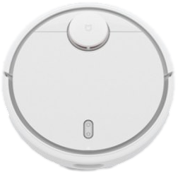
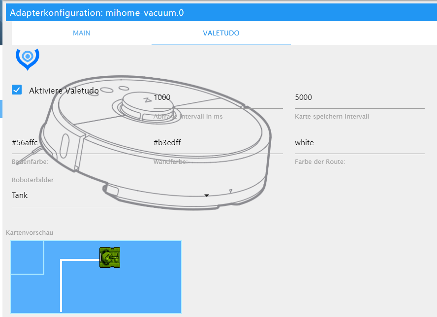

# Адаптер ioBroker mihome-vacuum
 [](https://weblate.iobroker.net/engage/adapters/?utm_source=widget)

[Deutsche beschreibung Hier](README_de.md)

Этот адаптер позволяет управлять пылесосом Xiaomi.

**Этот адаптер использует библиотеки Sentry для автоматического сообщения об исключениях и ошибках кода разработчикам.** Дополнительные сведения и информацию о том, как отключить отчеты об ошибках, см. в [Документация по плагину Sentry](https://github.com/ioBroker/plugin-sentry#plugin-sentry)! Отчеты Sentry используются, начиная с js-controller 3.0.

## Содержание
 - [Известные ошибки](#known_errors)
    - [Ошибка при установке (холст)](#error_at_installation)
    - [Ошибка HTTP при получении токена cookie{}](#http_error_when_getting_token_cookie{})
- [Настройка](#configuration)
    - [Настроить адаптер](#adapter-configuration)
        - [Управление через Alexa](#control-over-alexa)
        - [Второй робот](#second-robot)
    - [Настроить Валетудо](#valetudo-config)
- [Функции](#функции)
    - [Команды S50] (#команды-из-s50)
    - [Перейти](#goto)
- [Очистка зоны](#zoneclean)
    - [комнаты](#комнаты)
    - [таймер](#таймер)
    - [Собственные команды](#отправить-свои-собственные-команды)
    - [sendTo hook](#send-custom-commands-with-sendto)
- [виджет](#виджет)
- [ошибки](#ошибки)
- [Журнал изменений](#changelog)

## Поддерживаемые устройства и функции
| Устройство | Базовый контроль | история | номера | карта |
|:------------------    |:-------------------:      |:-------------------:  |:-------------------:|:-------------------:|
| виоми.вакуум.v6 | :heavy_check_mark: | :х: |:х: | :х: |
| виоми.вакуум.v7 | :heavy_check_mark: | :х: |:х: | :х: |
| виоми.вакуум.v8 | :heavy_check_mark: | :х: |:х: | :х: |
| рокробо.вакуум.v1 | :heavy_check_mark: | :heavy_check_mark: |:x: |:heavy_check_mark: |
| роборок.вакуум.s4 | :heavy_check_mark: | :heavy_check_mark: |:heavy_check_mark: |:heavy_check_mark: |
| роборок.вакуум.s5 | :heavy_check_mark: | :heavy_check_mark: |:heavy_check_mark: |:heavy_check_mark: |
| роборок.вакуум.s5e | :heavy_check_mark: | :heavy_check_mark: |:heavy_check_mark: |:heavy_check_mark: |
| роборок.вакуум.м1с | :heavy_check_mark: | :heavy_check_mark: |:heavy_check_mark: |:heavy_check_mark: |
| роборок.вакуум.а10 | :heavy_check_mark: | :heavy_check_mark: |:heavy_check_mark: |:heavy_check_mark: |
| роборок.вакуум.а15 | :heavy_check_mark: | :heavy_check_mark: |:heavy_check_mark: |:heavy_check_mark: |

## Известные ошибки
### Ошибка при установке
если ваша установка выполняется с ошибкой. Не удалось установить пакет холста

``npm ОШИБКА! canvas@2.6.1 установить: node-pre-gyp install --fallback-to-build npm ОШИБКА! Выход из состояния 1``

Пожалуйста, установите холст и библиотеки вручную с помощью: `` sudo apt-get install build-essential libcairo2-dev libpango1.0-dev libjpeg-dev libgif-dev librsvg2-dev ``

переключитесь на: `cd /opt/iobroker/node_modules/iobroker.mihome-vacuum` затем `npm install canvas`

### Ошибка HTTP при получении токена cookie{}
Иногда вы не можете подключиться к облаку xiaomi.
Откройте браузер, перейдите в Mihome и войдите в систему. Введите код, который вы получили по почте. После этого соединение должно работать.

### Получает только сообщение Helo Timeout
ПОЖАЛУЙСТА, убедитесь, что ваш робот подключен к приложению Mihome, а НЕ к приложению Roborock.

### Нет связи с S7
В настоящее время существует проблема, если робот и ioBroker не используют одну и ту же подсеть.

## Конфигурация
В настоящее время найти токен — самая большая проблема.
Одним из вариантов извлечения токена является использование этой утилиты: https://github.com/PiotrMachowski/Xiaomi-cloud-tokens-extractor.

В противном случае следуйте инструкциям по ссылке:

[Учебник по токену](https://www.smarthomeassistent.de/token-auslesen-roborock-s6-roborock-s5-xiaomi-mi-robot-xiaowa/).

### Конфигурация адаптера
- Для IP-адреса IP-адрес робота должен быть введен в формате «192.168.178.XX».
- Порт робота по умолчанию установлен на "54321", его менять не надо
- Собственный порт, следует менять только вторым роботом
- Интервал запроса Время в мс, в течение которого извлекаются значения статуса робота (не должно быть <10000)

#### Контроль над Alexa
Для Alexa будет создано особое состояние управления `clean_home`.
Это коммутатор, который начинается с `true` присоски, а в `false` возвращается домой.
Он автоматически становится интеллектуальным устройством в облачном адаптере, созданном с именем «пылесос», которое можно изменить в облачном адаптере.

#### Возобновить приостановленную очистку зоны с помощью кнопки запуска
Если этот параметр включен, пылесос возобновит очистку зоны при установке состояния «старт» в значение «истина», если он был приостановлен во время выполнения очистки зоны.
Если этот параметр отключен, пылесос начнет новую «нормальную уборку» при отправке команды запуска, даже если он был приостановлен во время выполнения очистки зоны.

- Экспериментальный: С помощью флажка «Отправить собственные команды» создаются объекты, с помощью которых вы можете отправлять и получать собственные команды роботу.

#### Второй робот
Если два робота должны управляться через ioBroker, необходимо создать два экземпляра. Для второго робота необходимо изменить собственный порт (по умолчанию: 53421) для ioBroker, чтобы оба робота могли архивировать ioBroker через разные порты.

## Конфигурация карты
Есть два способа получить карту. Первый получить карту из облака. Поэтому вам необходимо авторизоваться и выбрать нужного робота из списка.

Второй способ — карта от valetudo (только локальное подключение).
Поэтому вам необходимо получить root-права и установить valetudo на свое устройство.
Вы можете использовать [Valetudo RE](https://github.com/rand256/valetudo) или обычный [Valetudo](https://github.com/Hypfer/Valetudo).



- Чтобы использовать карту, вы должны выбрать valetudo или оригинальную карту в конфигурации.
- Интервал запроса должен быть больше 1000 мс, это интервал для обновления html-карты.
- Интервал карты должен быть более 5000 мс, этот интервал обновляет файл карты png (вы можете использовать это для Telegram, vis или чего-либо еще)
- Цвет здесь вы можете выбрать цвета для примера карты:

```
- #2211FF
- rbg(255,200,190)
- rgba(255,100,100,0.5) //for Transparent
- green
```

- Роботы здесь вы можете выбрать разных роботов или другие транспортные средства для карты

### Использование карты
Карта хранится либо в формате base64-raw, либо в формате PNG.

Вы можете найти изображение карты в следующих точках данных:

- base64: `mihome-vacuum.0.cleanmap.map64`
- PNG: `mihome-vacuum.0.cleanmap.mapURL`

Вы можете использовать оба изображения в качестве источника изображения в желаемой ВИС. В стиле HTML вы можете использовать изображение следующим образом:

``

С помощью дополнительных тегов стилей вы можете изменять размер и/или форматировать стиль карты.

Чтобы использовать карту в `jarvis`, просто используйте одну из точек данных в качестве URL-адреса DisplayImage-Widget.
Там вы можете изменить размер изображения или всего виджета. В случае адаптивного дизайна jarvis размер карты будет изменяться в зависимости от размера экрана.

Чтобы отобразить карту в `ioBroker VIS`, вы можете использовать обычный HTML-виджет, например:

```
[{"tpl":"tplHtml","data":{"g_fixed":false,"g_visibility":false,"g_css_font_text":false,"g_css_background":false,"g_css_shadow_padding":false,"g_css_border":false,"g_gestures":false,"g_signals":false,"g_last_change":false,"visibility-cond":"==","visibility-val":1,"visibility-groups-action":"hide","refreshInterval":"0","signals-cond-0":"==","signals-val-0":true,"signals-icon-0":"/vis/signals/lowbattery.png","signals-icon-size-0":0,"signals-blink-0":false,"signals-horz-0":0,"signals-vert-0":0,"signals-hide-edit-0":false,"signals-cond-1":"==","signals-val-1":true,"signals-icon-1":"/vis/signals/lowbattery.png","signals-icon-size-1":0,"signals-blink-1":false,"signals-horz-1":0,"signals-vert-1":0,"signals-hide-edit-1":false,"signals-cond-2":"==","signals-val-2":true,"signals-icon-2":"/vis/signals/lowbattery.png","signals-icon-size-2":0,"signals-blink-2":false,"signals-horz-2":0,"signals-vert-2":0,"signals-hide-edit-2":false,"lc-type":"last-change","lc-is-interval":true,"lc-is-moment":false,"lc-format":"","lc-position-vert":"top","lc-position-horz":"right","lc-offset-vert":0,"lc-offset-horz":0,"lc-font-size":"12px","lc-font-family":"","lc-font-style":"","lc-bkg-color":"","lc-color":"","lc-border-width":"0","lc-border-style":"","lc-border-color":"","lc-border-radius":10,"lc-zindex":0,"html":"{mihome-vacuum.0.map.map64}"},"style":{"left":"0","top":"0","width":"100%","height":"100%"},"widgetSet":"basic"}]
```

Использование base64-карты быстрее и будет отображать положение робота поблизости в реальном времени.

## Функции
### Команды S50 (второе поколение)
Размер карты всегда составляет 52000 мм x 52000 мм, поэтому возможны значения от 0 до 51999 мм.
К сожалению, положение и расположение карты не может быть запрошено, это может меняться от всасывания к всасыванию. За основу всегда берется последняя всасывающая карта, так же как и в приложении.
Если робот захватывает только одну область и всегда строит карту одинаково, вы можете надежно отправить его в нужное место или очистить область.

#### Перейти к
Для того, чтобы довести пылесос до точки, объект «goTo» должен быть заполнен следующим образом:

```
xVal, yval
```

Значения должны удовлетворять указанным выше требованиям и указывать координаты x и y на карте.

Пример:

```
24,850.26500
```

#### Очистка зоны
Чтобы очистить зону, необходимо заполнить ZoneClean следующим образом:

```
[X1, y1, x2, x2, count]
```

Где x и y — координаты прямоугольной области и «счетчик» операций очистки.
Вы также можете позволить сосать сразу нескольким областям:

```
[X1, y1, x2, x2, count], [x3, y3, x4, x4, count2]
```

Пример:

```
[24117,26005,25767,27205,1], [24320,24693,25970,25843,1]
```

#### Номера
более новый пылесос с последним приложением Home App поддерживает определение комнат, см. [видео](https://www.youtube.com/watch?v=vEiUZzoXfPg)

У каждой комнаты на текущей карте есть индекс, который затем назначается комнате из приложения. От робота мы получаем только карту с номером комнаты и индексом. Адаптер запрашивает эти комнаты при каждом запуске адаптера и создает канал для каждой комнаты, который затем знает текущий индекс комнаты. То же самое происходит вручную с помощью кнопки loadRooms. Затем этот канал можно назначить комнатам ioBroker. Если нажата кнопка roomClean, то определяется индекс карты и отправляется роботу, чтобы он потом мог пропылесосить эту комнату. До этого мощность ВЕНТИЛЯТОРА устанавливается на всасывание в одном помещении. Если у вас еще нет возможности давать названия комнатам в приложении, также есть возможность создать такой канал вручную, указав индекс карты. Также возможно добавить координаты зоны вместо mapIndex.
Если вы хотите спонтанно очистить несколько комнат, вы можете сделать это с помощью multiRoomClean, назначив комнаты ioBroker этой точке данных, а затем нажав кнопку.

#### Таймер
Поскольку пылесос поддерживает функцию комнаты (см. выше), также можно создавать таймеры, которые затем запускают соответствующие комнатные каналы или определяют их mapIndex.
Таймер может запускаться через комнаты и/или каналы комнаты напрямую.
Сами таймеры создаются через область конфигурации, но затем становятся точкой данных. Там каждый таймер можно активировать/деактивировать или пропустить один раз. Также возможен прямой пуск. Преимущество таймеров ioBroker в том, что их можно отображать и использовать в ВИС, а также можно отключить робота от интернета, потому что таймеры приложения запускаются из Китая.

### Отправляйте свои собственные команды
ПРИМЕЧАНИЕ. Эту функцию должны использовать только специалисты, так как присоска может быть повреждена неправильными командами.

Робот различает команды в методах (methods) и параметрах (params), которые служат для указания методов.
Под объектом `mihome-vacuum.X.control.X_send_command` вы можете отправлять роботу собственные команды.
Структура объекта должна выглядеть следующим образом: метод; [параметры], например ``` app_segment_clean;[18,20] ```

Под объектом `mihome-vacuum.X.control.X_get_response` ответ вводится роботом после отправки.
Если параметры были запрошены, они отображаются здесь в формате JSON. Если была отправлена только одна команда, робот отвечает только «0».

Поддерживаются следующие методы и параметры:

| метод | параметры | Описание |
|-----------      |-------                                                              |-------------------                                                                       |
| получить_таймер | | Возвращает установленное значение таймера Установка времени всасывания BSp. 12 часов 30 через 5 дней |
| установить_таймер | `[["TIME_IN_MS",["30 12 * * 1,2,3,4,5",["start_clean",""]]]]` | Включить / отключить таймер |
| upd_timer | `["1481997713308","вкл/выкл"]` | |
| | | Спасает времена режима «Не беспокоить» |
| get_dnd_timer | | Удалить время «Не беспокоить» |
| set_dnd_timer | `[22,0,8,0]` | |
| set_dnd_timer | `[22,0,8,0]` | |
|                 |                                                                     |                                                                                          |
| приложение_rc_start | | Запустить удаленное управление |
| приложение_rc_move | `[{"seqnum":'0-1000',"velocity":VALUE1,"omega":VALUE2,"duration":VALUE3}]`| Шаг. Порядковый номер должен быть непрерывным, VALUE1 (скорость) = -0,3–0,3, VALUE2 (вращение) = -3,1–3,1, VALUE3 (длительность)|
| приложение_rc_move | `[{"seqnum":'0-1000',"скорость":VALUE1,"omega":VALUE2,"duration":VALUE3}]`| Шаг. Порядковый номер должен быть непрерывным, VALUE1 (скорость) = -0,3–0,3, VALUE2 (вращение) = -3,1–3,1, VALUE3 (длительность)|
| app_segment_clean | `[12,15]` | чистая комната с индексами 12 и 15 |
| app_segment_clean | `[12,15]` | чистая комната с индексами 12 и 15 |

больше методов и параметров вы можете найти здесь ([Ссылка на сайт](https://github.com/MeisterTR/XiaomiRobotVacuumProtocol)).

### Отправка пользовательских команд с помощью sendTo
Вы также можете отправлять эти пользовательские команды с других адаптеров с помощью `sendTo`. Использование с `method_id` и `params`, как определено выше:

```
sendTo("mihome-vacuum.0", "sendCustomCommand",
    {method: "method_id", params: [...] /* optional*/},
    function (response) { /* do something with the result */}
);
```

Объект `response` имеет два свойства: `error` и (если ошибки не было) `result`.

Пара предопределенных команд также может быть выполнена таким образом:

```
sendTo("mihome-vacuum.0",
    commandName,
    param,
    function (response) { /* do something with the result */}
);
sendTo("mihome-vacuum.0",
    commandName,
    {param1: value1, param2: value2, ...},
    function (response) { /* do something with the result */}
);

```

если возможен только один параметр, вы можете отправить только строку, иначе вам придется использовать объект с ожидаемыми параметрами, например:

```
sendTo("mihome-vacuum.0",
    "setFanSpeed",
    "105",
    function (response) { /* do something with the result */}
);
sendTo("mihome-vacuum.0",
    "setFanSpeed",
    {"fanSpeed" : 105},
    function (response) { /* do something with the result */}
);

```

Поддерживаемые команды:

| Описание | `commandName` | Обязательные параметры | Примечания |
| Начать процесс очистки | `startVacuuming` | - нет - | |
| Остановить процесс очистки | `stopVacuuming` | - нет - | |
| Приостановить процесс очистки | `pause` | - нет - | |
| Очистить ожидающие задания | `clearQueue` | - нет - | |
| Очистите небольшую площадь вокруг робота | `cleanSpot` | - нет - | |
| Вернуться на базу | `charge` | - нет - | |
| Скажите "Привет, я здесь!" | `findMe` | - нет - | |
| Проверить состояние расходных материалов (щетки и т. д.) | `getConsumableStatus` | - нет - | |
| Сброс состояния расходных материалов (щетки и т.п.) | `resetConsumables` | `consumable` | Строка: filter_work_time, filter_element_work_time, sensor_dirty_time, main_brush_work_time, side_brush_work_time |
| Получите сводку всех предыдущих процессов очистки | `getCleaningSummary` | - нет - | |
| Получите подробный отчет о предыдущем процессе очистки | `getCleaningRecord` | `recordId` | |
| Получить карту | `getMap` | - нет - | Неизвестно, что делать с результатом |
| Получить текущий статус робота | `getStatus` | - нет - | |
| Получить серийный номер робота | `getSerialNumber` | - нет - | |
| Получить подробную информацию об устройстве | `getDeviceDetails` | - нет - | |
| Получить таймер *не беспокоить* | `getDNDTimer` | - нет - | |
| Установите новый таймер *не беспокоить* | `setDNDTimer` | `startHour`, `startMinute`, `endHour`, `endMinute` | |
| Удалить таймер *не беспокоить* | `deleteDNDTimer` | - нет - | |
| Получить текущую скорость вентилятора | `getFanSpeed` | - нет - | |
| Установить новую скорость вентилятора | `setFanSpeed` | `fanSpeed` | `fanSpeed` — число от 1 до 100 |
| Получить текущий режим водяной камеры | `getWaterBoxMode` | - нет - | |
| Установите режим швабры | `setMopMode` | `mopMode` | `mopMode` — число от 300 до 303 |
| Получить текущий режим швабры | `getMopMode` | - нет - | |
| Установить режим водяной камеры | `setWaterBoxMode` | `waterBoxMode` | `waterBoxMode` — число от 200 до 204 |
| Запустите функцию дистанционного управления | `startRemoteControl` | - нет - | |
| Выдать команду перемещения для удаленного управления | `move` | `velocity`, `angularVelocity`, `duration`, `sequenceNumber` | Порядковый номер должен быть последовательным, продолжительность указана в мс |
| Завершить функцию дистанционного управления | `stopRemoteControl` | - нет - | |
| чистая комната/комнаты | `cleanRooms` | `rooms` | `rooms` — это строка, разделенная запятыми, с перечислением enum.rooms.XXX |
| чистый сегмент | `cleanSegments` | `rooms` \| {комнаты:`rooms`,waterBoxMode:`waterBoxMode`,mopMode:`mopMode`,fanSpeed:`fanSpeed`} | `rooms` — это число или массив с индексом карты или разделенная запятой строка с индексом карты |
| чистая зона | `cleanZone` | `coordinates` \| {координаты:`coordinates`,waterBoxMode:`waterBoxMode`,mopMode:`mopMode`,fanSpeed:`fanSpeed`} | `coordinates` — это строка с координатами и количеством, см. [зонаЧистота](#zonecleaning) |
| начать сбор пыли | `startDustCollect` | - нет - | |
| остановить сбор пыли | `stopDustCollect` | - нет - | |
| остановить сбор пыли | `остановить сбор пыли` | - нет - | |

## Виджет


## Ошибки
- Периодические отключения, однако это не из-за адаптера, а в основном из-за собственных сетей
- Виджет на время без функции

<!-- Заполнитель для следующей версии (в начале строки):

### **В РАБОТЕ** -->
### 3.8.6 (2022-11-12)
* (deher) Тип фикса для roomMopMode

### 3.8.5 (10.11.2022)
* (Дирхе) перевести parseErrors на уровень отладки
* (Dirkhe) избегайте новых моментов при повторном подключении

### 3.8.4 (2022-11-07)
* (Дирхе) журнал изменений для sendMessage для отладки

### 3.8.3 (2022-11-01)
* (Дирхе) логирование изменений по таймаутам
* (Дирхе) скрыть части токена в логе

### 3.8.2 (2022-10-31)
* (Дирхе) Поднять холст до 2.10.2
* (Дирхе) отключить карту, если не установлен CANVAS #681

### 3.8.1 (2022-10-30)
* (Дирхе) удалить устаревшую версию node 12.x для рабочего процесса

### 3.8.0 (30.10.2022)
* (Dirkhe) исправлена отсутствующая стандартная команда для mop_mode
* (Дирхе) добавить режим швабры также для cleanSegments и cleanZone
* (Дирхе) добавить режим швабры также для комнат
* (MeisterTR) масштабирование карты и показ ковра

### 3.7.0 (28.10.2022)
* (Dirkhe) принимать пользовательские команды с одним параметром
* (Дирхе) необязательный параметр waterboxMode и fanSpeed для cleanSegments и cleanZone
* (Дирхе) исправлен сбой при отправке сообщения (#652)
* (Дирхе) добавить режим швабры (#670)
* (Дирхе) адаптировал fan_power для S7 Ultra(#677)

### 3.6.0 (07.07.2022)
* (Дирхе) добавить сбор пыли

### 3.5.0 (29 июня 2022 г.)
* (Дирхе) добавить модель Roborock S6 Pure
* (Дирхе) добавить/расширить некоторые подсказки в файле readme
* (Dirkhe) добавить дополнительную информацию в журнал для cleanRooms
* (Дирхе) исправлена ошибка для неправильного map-dp

### 3.4.2 (2022-06-24)
* (Apollon77) Обновлены зависимости для лучшей автоматической пересборки.

### 3.4.1 (31 мая 2022 г.)
* (Дирхе) добавлены пропущенные состояния вакуума
* (Дирхе) добавить состояние дока Бак для сточных вод полный

### 3.4.0 (28 мая 2022 г.)
* (Apollon77) Исправлено несколько потенциальных случаев сбоя, о которых сообщил Sentry.

### 3.3.6 (2022-05-03)
* (Дирхе) фикс точечной очистки

### 3.3.5 (2022-02-07)
* (Дирхе) исправлены некоторые ошибки
* (lasthead0) исправить проблему с кириллицей RC4 lib#

### 3.3.3 (20 января 2022 г.)
* (Дирхе) исправлены некоторые ошибки
* (Дирхе) добавить RC4

### 3.3.1 (2021-10-02)
* (MeisterTR) фикс IOBROKER-MIHOME-VACUUM-Z
* (MeisterTR) исправить некоторые ошибки

### 3.3.0 (2021-10-01)
* (MeisterTR) исправлено отсутствие комнат для S5
* (MeisterTR) исправлено закрытие БД IOBROKER-MIHOME-VACUUM-4
* (MeisterTR) исправить ошибку подключения

### 3.2.2 (2021-07-16)
* (bluefox) связь исправлена
* (bluefox) Добавлены роли, определяемые детектором типов

### 3.2.1 (2021-07-02)
* (Apollon77) Скорректировано несколько аварийных случаев (IOBROKER-MIHOME-VACUUM-K, IOBROKER-MIHOME-VACUUM-J, IOBROKER-MIHOME-VACUUM-F, IOBROKER-MIHOME-VACUUM-7, IOBROKER-MIHOME-VACUUM-A, IOBROKER -MIHOME-VACUUM-4, IOBROKER-MIHOME-VACUUM-G, IOBROKER-MIHOME-VACUUM-C, IOBROKER-MIHOME-VACUUM-B, IOBROKER-MIHOME-VACUUM-Q, IOBROKER-MIHOME-VACUUM-M)

### 3.2.0 (06.02.2021)
* (MeisterTR) релиз-кандидат
* (MeisterTR) получить расходник после сброса

### 3.1.10 (23.05.2021)
* ошибка исправлена
* добавить часового

### 3.1.6 (05.05.2021)
* минимизировать запись на диск
* свернутые сообщения
* изменены предупреждающие сообщения на отладочные
* расширить Debuglog, чтобы найти ошибку для вакуума e2
* добавлены getStates при смене карты

### 3.1.5 (03.05.2021)
* попробуйте исправить ошибку карты
* Map64 изменен. теперь без тегов img
* добавлена поддержка Multimap (получение номеров и карты при смене карты)
* выберите Мультикарты
* исправлена ошибка с координатами зоны
* добавить Wi-Fi
* исправить проблемы с подключением
* исправить карту Валетудо
* добавить состояние швабры
* исправить некоторые объекты

### 3.1.1 (18.4.2021)
 * Полный рерайт
 * Исправлена ошибка карты с несколькими пылесосами
 * исправить проблемы с производительностью
 * лучшее подключение к вакууму
 * исправлена ошибка в кнопке ReloadMap
 * Показать состояния Goto и Zone, чтобы найти места
 * и многое другое...

### 2.2.5 (2021-04-02)
* добавлена поддержка S7
* исправления для S5 Max и других

### 2.2.4 (2020-09-15)
* (дирхе) добавить конфиг для отправки Pause Before Home

### 2.2.3 (20.08.2020)
* (дирхе) ДП комнаты не удаляются, при смене карты

### 2.2.0 (2020-08-13)
* (MeisterTR) добавить тест для Viomi и Dreame Api

### 2.1.1 (2020-07-10)
* (синий лис) Рефакторинг
* (bluefox) Добавлена поддержка компактного режима

### 2.0.10 (05.07.2020)
* попробуйте запустить очистку 3 раза, если робот не отвечает и некоторые исправления

### 2.0.9 (2020-03-05)
* (dirkhe) добавить информацию о состоянии для каналов комнаты и изменить информацию об очереди с номера на JSON

### 2.0.8 (26 февраля 2020 г.)
* (дирхе) уменьшено общение с роботом

### 2.0.7 (2020-02-25)
* (дирхе) добавить Возобновление после паузы для комнат

### 2.0.6 (2020-02-17)
* (MeisterTR) добавить комнаты за s50 с картой (необходимо облако или Valetudo)

### 2.0.4 (13 февраля 2020 г.)
* (MeisterTR) добавить облачный логин для получения токена
* (MeisterTR) добавить облачную карту
* (MeisterTR) добавить новый и старый формат карты
* (MeisterTR) перестроить страницу конфигурации

### 1.10.5 (11 февраля 2020 г.)
* отправлять Ping только если нет подключения, иначе get_status
* установить состояния кнопок в true, если они нажаты
* переместить менеджера таймера и менеджера комнаты в собственные библиотеки

### 1.10.4 (2020-02-06)
* (MeiserTR) добавлена поддержка карт valetudo для gen3 и gen2 2XXX.

### 1.10.1 (20.01.2020)
* (дирхе) добавлена зона для обработки помещения
* (дирхе) таймер может напрямую переключаться между каналами

### 1.10.0 (2020-01-17)
* (дирхе) добавлена обработка комнаты
* (дирхе) добавлен Таймер
* (дирхе) изменена обработка функций

### 1.1.6 (2018-12-06)
* (JoJ123) Добавлена скорость вентилятора для MOP (S50+).

### 1.1.5 (2018-09-02)
* (BuZZy1337) Добавлено описание для Статусов 16 и 17 (переход и очистка зоны).
* (BuZZy1337) Добавлена настройка автоматического возобновления очистки приостановленной зоны.

### 1.1.4 (2018-08-24)
* (BuZZy1337) Добавлена возможность возобновить очистку приостановленной зоны (состояние: mihome-vacuum.X.control.resumeZoneClean)

### 1.1.3 (2018-07-11)
* (BuZZy1337) исправлено состояние ZoneCleanup, которое не работало (пылесос только выходил из док-станции, говоря «Готово ZoneCleanup», и немедленно возвращался обратно в док)

### 1.1.2 (2018-07-05)
* (BuZZy1337) исправлено обнаружение новых прошивок/пылесоса второго поколения

### 1.1.1 (2018-04-17)
* (MeisterTR) обнаружена ошибка, добавлены состояния для новых прошивок

### 1.1.0 (2018-04-10)
* (mswiege) Закончил виджет

### 1.0.1 (2018-01-26)
* (MeisterTR) готов для admin3
* (MeisterTR) поддержка SpotClean и уровня голоса (v1)
* (MeisterTR) поддержка второго поколения (S50)
* (MeisterTR) Ускорение запросов данных

### 0.6.0 (17.11.2017)
* (MeisterTR) использовать 96-символьный токен из Ios Backup
* (MeisterTR) более быстрое соединение при первом использовании

### 0.5.9 (03.11.2017)
* (MeisterTR) исправить ошибку связи без i-net
* (AlCalzone) добавить выбор предопределенных уровней мощности

### 0.5.7 (17 августа 2017 г.)
* (MeisterTR) сравнить системное время и время робота (исправить отсутствие связи, если системное время отличается)
* (MeisterTR) обновить значения, если робот запускается из облака

### 0.5.6 (23 июля 2017 г.)
* (MeisterTR) добавить опцию для переключателя ящиков для управления Alexa

### 0.5.5 (30.06.2017)
* (MeisterTR) добавить состояния, функции, исправить ошибки связи

### 0.3.2 (2017-06-07)
* (MeisterTR) исправлено отсутствие связи после обновления программного обеспечения (версия 3.3.9)

### 0.3.1 (10 апреля 2017 г.)
* (MeisterTR) фикс установки мощности вентилятора
* (bluefox) ошибка перехвата, если порт занят

### 0.3.0 (2017-04-08)
* (MeisterTR) добавить больше состояний

### 0.0.2 (2017-04-02)
* (steinwedel) реализовать лучшее декодирование пакетов

### 0.0.1 (16 января 2017 г.)
* (bluefox) начальная фиксация

## License
The MIT License (MIT)

Copyright (c) 2017-2022 bluefox <dogafox@gmail.com>

Permission is hereby granted, free of charge, to any person obtaining a copy
of this software and associated documentation files (the "Software"), to deal
in the Software without restriction, including without limitation the rights
to use, copy, modify, merge, publish, distribute, sublicense, and/or sell
copies of the Software, and to permit persons to whom the Software is
furnished to do so, subject to the following conditions:

The above copyright notice and this permission notice shall be included in all
copies or substantial portions of the Software.

THE SOFTWARE IS PROVIDED "AS IS", WITHOUT WARRANTY OF ANY KIND, EXPRESS OR
IMPLIED, INCLUDING BUT NOT LIMITED TO THE WARRANTIES OF MERCHANTABILITY,
FITNESS FOR A PARTICULAR PURPOSE AND NONINFRINGEMENT. IN NO EVENT SHALL THE
AUTHORS OR COPYRIGHT HOLDERS BE LIABLE FOR ANY CLAIM, DAMAGES OR OTHER
LIABILITY, WHETHER IN AN ACTION OF CONTRACT, TORT OR OTHERWISE, ARISING FROM,
OUT OF OR IN CONNECTION WITH THE SOFTWARE OR THE USE OR OTHER DEALINGS IN THE
SOFTWARE.