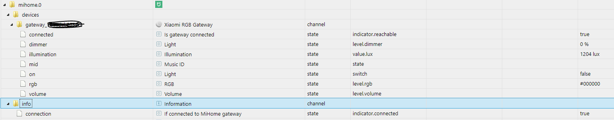

# Адаптер ioBroker Mi Home Адаптер Mi Home позволяет интегрировать Mi Control Hub (шлюз) в систему ioBroker и, таким образом, позволяет различным датчикам, переключателям и т. д. Xiaomi взаимодействовать с ioBroker.
Например, освещением и громкоговорителем шлюза можно управлять через ioBroker.

## Требования
* Приложение Mi Home на устройстве Android или iOS и активированная функция локальной сети.
* Подключенный домашний шлюз Mi
* Оперативная система ioBroker

### Установите приложение Mi Home и активируйте функцию локальной сети.
#### Андроид
* Загрузите, установите, откройте и загрузите [Приложение для Android](https://play.google.com/store/apps/details?id=com.xiaomi.smarthome) на устройство Android.

согласиться с условиями.

* В качестве страны выберите *Материковый Китай*.
* Создайте учетную запись через *Войти*
* Добавить устройство после успешного входа в систему через `+`
* В разделе *Домашняя безопасность* выберите «MI Control Hub» и следуйте инструкциям.

последствия

* После успешной интеграции шлюза в правом верхнем углу экрана появятся 3 точки.

а затем нажмите *О программе*

* Нажмите на текст *Версия плагина* ниже 10 раз.
* Теперь режим разработчика включен и должен появиться через определенное время

Появятся еще 2 пункта меню > Если нет, попробуйте еще раз

* Выберите пункт меню `Протокол беспроводной связи`
* Включите ползунок вверху, запишите пароль и подтвердите его, нажав «ОК».

> Пароль потребуется позже во время установки ioBroker.

Дополнительные устройства теперь можно обучать с помощью символа `+`.

#### IOS
* Загрузите, установите, откройте и загрузите [приложение iOS](https://itunes.apple.com/de/app/mi-home-xiaomi-smarthome/id957323480?mt=8) на устройстве iOS.

Согласен с политикой конфиденциальности

* Выберите страну *Mainland* в разделе «Профиль/Настройки/Настройки страны».
* Создайте учетную запись через *Войти*
* Добавить устройство после успешного входа в систему через `+`
* В разделе *Домашняя безопасность* выберите «MI Control Hub» и следуйте инструкциям.

последствия

* После успешной интеграции шлюза в правом верхнем углу экрана появятся 3 точки.

нажмите и нажмите *О программе*

* Нажмите несколько раз в пустой нижней области.
* Теперь режим разработчика включен и должен появиться через определенное время

появляются дальнейшие пункты меню > Если сразу не работает, повторите шаги

* Выберите 4-й пункт меню
* Включите ползунок вверху, запишите пароль и подтвердите его, нажав «ОК».

> Пароль потребуется позже во время установки ioBroker.

Дополнительные устройства теперь можно обучать с помощью символа `+`.

### Настройка на роутере
В разделе «Информация об устройстве/концентраторе» IP-адрес шлюза, используемый шлюзом, можно найти в тексте после _localip_. В используемом маршрутизаторе этот IP-адрес должен быть постоянно закреплен за шлюзом.
Если вы больше не хотите управлять обученными устройствами через приложение, доступ шлюза в Интернет также можно отключить после того, как все устройства в маршрутизаторе будут обучены.

### Поддерживаемые устройства
Следующий список не претендует на полноту:

- шлюз - шлюз Xiaomi RGB
- Sensor_ht - Температура/Влажность Xiaomi
- Weather.v1 - Температура/Влажность/Давление Xiaomi
- переключатель - беспроводной переключатель Xiaomi
- Sensor_switch.aq2 - Датчик беспроводного переключателя Xiaomi Aqara
- Sensor_switch.aq3 - Датчик беспроводного переключателя Xiaomi Aqara
- вилка - умная вилка Xiaomi
- 86plug - Умная настенная розетка Xiaomi
- 86sw2 - Беспроводной двойной настенный переключатель Xiaomi
- 86sw1 - Беспроводной одностенный переключатель Xiaomi
- natgas - Детектор газовой сигнализации Xiaomi Mijia Honeywell
- дым - детектор пожарной сигнализации Xiaomi Mijia Honeywell
- ctrl_ln1 - Переключатель пожарной стены Xiaomi Aqara 86 с одной кнопкой
- ctrl_ln1.aq1 - Настенный выключатель Xiaomi Aqara LN
- ctrl_ln2 - переключатель нулевой пожарной стены Xiaomi 86 с двойным ключом
- ctrl_ln2.aq1 - Настенный выключатель Xiaomi Aqara LN с двойным ключом
- ctrl_neutral2 - Проводной двойной настенный переключатель Xiaomi
- ctrl_neutral1 - Проводной одностенный переключатель Xiaomi
- куб - Xiaomi Cube
- Sensor_cube.aqgl01 - Xiaomi Cube
- магнит - датчик двери Xiaomi
- Sensor_magnet.aq2 - Датчик двери Xiaomi Aqara
- штора - Xiaomi Aqara Smart Curtain
- движение - Датчик движения Xiaomi
- Sensor_motion.aq2 - Датчик движения Xiaomi Aqara
- Sensor_wleak.aq1 - Датчик воды Xiaomi Aqara
- ctrl_ln2.aq1 - Настенный выключатель Xiaomi Aqara LN (двойной)
- Remote.b286acn01 - Беспроводной дистанционный переключатель Xiaomi Aqara (двойной переключатель)
- Remote.b1acn01 - Беспроводной дистанционный переключатель Xiaomi Aqara
- вибрация - датчик вибрации Xiaomi
- wleak1 - Датчик воды Xiaomi Aqara
- lock_aq1 - Блокировка Xiaomi

## Установка адаптера ioBroker Mi Home
Дальнейшие настройки производятся только через интерфейс администратора ioBroker.
Найдите адаптер в области *Адаптер* и установите его, используя знак `+`.

Откроется следующее окно конфигурации:

Введите пароль, указанный выше, в разделе `Default Gateway Key` и закройте окно, нажав *save* *and close*. Работающий адаптер должен отображаться зеленым цветом в разделе *Экземпляры*:

Шлюз и его обученные устройства теперь отображаются в разделе *Объекты*:

Инструкции были созданы в меру наших знаний и убеждений.

## Changelog
### 1.4.0 (2022-03-10)
* (drtsb) Added two new aqara devices and some missing icons
* (VLGorskij) fixed the error messages for some states
* (Apollon77) Catch some errors reported by Sentry and users

### 1.3.7 (2021-01-22)
* (Apollon77) Prevent crash case (Sentry IOBROKER-MIHOME-A)

### 1.3.6 (2020-09-25)
* (VLGorskij) Added new device QBKG24LM

### 1.3.5 (2020-09-17)
* (Apollon77) Fix crash cases (Sentry IOBROKER-MIHOME-1..4)

### 1.3.4 (2020-08-31)
* (Alan) Fixed the crash for non existing attributes

### 1.3.3 (2020-08-26)
* (bluefox) Sentry is activated

### 1.3.2 (2020-08-25)
* (VLGorskij) Added ac-partner.v3 support
* (bluefox) Added compact mode

### 1.3.1 (2020-08-19)
* (Diginix) Fixed calculation for sensor's battery percentage

### 1.3.0 (2020-01-16)
* (algar42) Ability to add devices with missing model by their SID ([e.g. for Aqara two-channel relay](https://github.com/algar42/ioBroker.mihome#usage))

### 1.2.9 (2019-11-15)
* (Diginix) Fixed pressure range and values of Aqara weather sensor

### 1.2.8 (2019-07-18)
* (SchumyHao) Change curtain and gateway light role that making them can be detected by type-detector

### 1.2.7 (2019-06-25)
* (SchumyHao) Add several devices support for protocol 2.0.x

### 1.2.6 (2019-03-04)
* (Diginix) Improved calculation for sensor's battery percentage

### 1.2.5 (2019-01-24)
* (Vanwards) Added long click for Aquara wall switch

### 1.2.4 (2019-01-15)
* (SchumyHao) Add Chinese support

### 1.2.3 (2018-10-23)
* (goohnie) New wall switch was added

### 1.2.0 (2018-10-12)
* (bluefox) refactoring

### 1.1.2 (2018-10-08)
* (bluefox) New button switch was added

### 1.1.1 (2018-09-23)
* (bluefox) Fixed the creation of new devices

### 1.1.0 (2018-09-13)
* (bluefox) New devices added:  sensor_switch.aq3, ctrl_ln1.aq1, ctrl_ln2.aq1, sensor_cube.aqgl01, remote.b286acn01, vibration, wleak1, lock_aq1
* (bluefox) Names will be taken from gateway

### 1.0.7 (2018-06-25)
* (bluefox) The heartbeat timeout and the re-connection interval settings were added

### 1.0.6 (2018-05-26)
* (bluefox) Added new Aqara cube sensor

### 1.0.5 (2018-03-05)
* (bluefox) Xiaomi Aqara Wall Switch LN Double was added

### 1.0.4 (2018-01-21)
* (bluefox) The alarm state was fixed.

### 1.0.3 (2018-01-21)
* (bluefox) Invalid temperature values will be ignored

### 1.0.2 (2018-01-14)
* (bluefox) Ignore unknown state of sensors

### 1.0.0 (2018-01-05)
* (bluefox) Do not overwrite the names
* (bluefox) Ready for Admin3

### 0.3.3 (2017-11-26)
* (bluefox) Allow multiple mihome gateways

### 0.2.4 (2017-11-04)
* (bluefox) Add aqara water sensor

### 0.2.3 (2017-09-22)
* (bluefox) Remove "." from id of the device

### 0.2.2 (2017-08-01)
* (bluefox) Set after 300ms doublePress to false by Temperature Sensor\nAllow control of Plug

### 0.2.1 (2017-07-29)
* (bluefox) Implement double click on temperature sensor

### 0.2.0 (2017-07-18)
* (bluefox) fix battery level

### 0.1.4 (2017-06-09)
* (bluefox) add cube
* (bluefox) remove voltage by gateway

### 0.1.1 (2017-06-06)
* (bluefox) Initial commit

## License
The MIT License (MIT)

Copyright (c) 2017-2022 bluefox <dogafox@gmail.com>

Permission is hereby granted, free of charge, to any person obtaining a copy of this software and associated documentation files (the "Software"), to deal in the Software without restriction, including without limitation the rights to use, copy, modify, merge, publish, distribute, sublicense, and/or sell copies of the Software, and to permit persons to whom the Software is furnished to do so, subject to the following conditions:

The above copyright notice and this permission notice shall be included in all copies or substantial portions of the Software.

THE SOFTWARE IS PROVIDED "AS IS", WITHOUT WARRANTY OF ANY KIND, EXPRESS OR IMPLIED, INCLUDING BUT NOT LIMITED TO THE WARRANTIES OF MERCHANTABILITY, FITNESS FOR A PARTICULAR PURPOSE AND NONINFRINGEMENT. IN NO EVENT SHALL THE AUTHORS OR COPYRIGHT HOLDERS BE LIABLE FOR ANY CLAIM, DAMAGES OR OTHER LIABILITY, WHETHER IN AN ACTION OF CONTRACT, TORT OR OTHERWISE, ARISING FROM, OUT OF OR IN CONNECTION WITH THE SOFTWARE OR THE USE OR OTHER DEALINGS IN THE SOFTWARE.