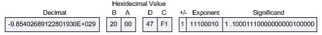
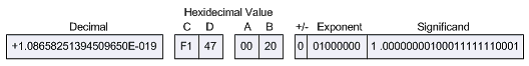
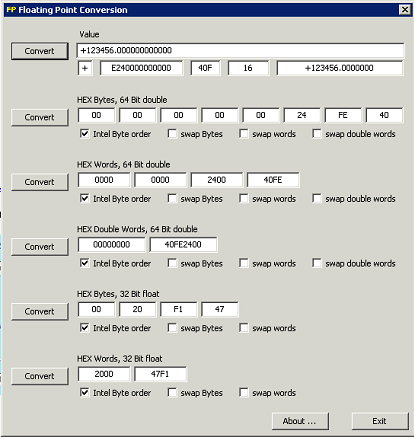

# Iobroker.modbus
 

**Этот адаптер использует библиотеки Sentry для автоматического сообщения разработчикам об исключениях и ошибках в коде.** Для получения более подробной информации и сведений о том, как отключить отправку сообщений об ошибках, см. [Документация по плагину Sentry](https://github.com/ioBroker/plugin-sentry#plugin-sentry)! Отправка сообщений Sentry используется начиная с js-controller 3.0.

Реализация ModBus Slave и Master для ioBroker. Поддерживаются следующие типы:

- Modbus RTU через последовательный порт (ведущий сервер)
- Modbus RTU по TCP (ведущий сервер)
- Modbus TCP (ведомый, ведущий)
- Modbus TCP с SSL/TLS (ведущий сервер)

## Поддержка SSL/TLS
Для безопасного подключения к устройствам, требующим шифрования SSL/TLS (например, к интеллектуальному счетчику электроэнергии Kostal KSEM на порту 802), можно выбрать тип подключения «TCP с SSL/TLS». Это предоставляет следующие параметры конфигурации:

- **Путь к файлу SSL-сертификата**: Путь к файлу вашего SSL-сертификата в формате PEM.
- **Путь к файлу закрытого ключа SSL**: Путь к файлу закрытого ключа SSL в формате PEM.
- **Путь к файлу сертификата центра сертификации SSL**: Путь к файлу сертификата центра сертификации в формате PEM (необязательно)
- **Отклонять несанкционированные сертификаты**: Снимите флажок, чтобы разрешить использование самоподписанных сертификатов.

Примечание: Файлы сертификатов должны быть доступны для процесса ioBroker и иметь формат PEM.

## Настройки
### IP-адрес партнера
IP-адрес партнера по протоколу Modbus.

### Порт
TCP-порт партнера Modbus, если он настроен как ведущий (клиент), или собственный порт, если он настроен как ведомый (сервер).

### Идентификатор устройства
Идентификатор устройства Modbus. Важно, если используется мост TCP/Modbus.

### Тип
Раб (сервер) или Мастер (клиент).

### Используйте псевдонимы в качестве адреса
Обычно все регистры могут иметь адреса от 0 до 65535. Используя псевдонимы, можно определить поля виртуальных адресов для каждого типа регистров. Обычно:

- дискретные входные значения находятся в диапазоне от 10001 до 20000
- Катушки имеют количество от 1 до 1000
- Входные регистры находятся в диапазоне от 30001 до 40000.
- Номера регистрационных книг варьируются от 40001 до 60000.

Каждый псевдоним будет внутренне сопоставлен с адресом, например, 30011 будет сопоставлен с входным регистром 10 и так далее.

### Прямые адреса
Используется для двоичных входных сигналов и катушек.
Без этого флага биты будут адресоваться следующим образом: `0 => 15, 1 => 14, 2 => 13, ..., 15 => 0`.
С активированным этим флагом биты будут адресоваться следующим образом: `0 => 0, 1 => 1, 2 => 2, ..., 15 => 15`.

### Не выравнивайте адреса по 16 битам (словам)
Обычно адреса катушек и дискретных входов выравниваются по 16 битам.
Адреса от 3 до 20 будут выравниваться по 0 до 32.
Если эта опция активна, адреса не будут выравниваться.

### Не используйте несколько регистров
Если ведомое устройство не поддерживает команду "запись в несколько регистров", вы можете активировать её, чтобы получать предупреждения о предстоящей записи в несколько регистров.

### Используйте только несколько регистров записи
Если ведомое устройство поддерживает только команду "запись в несколько регистров", вы можете активировать эту функцию, чтобы запись в регистры всегда выполнялась с помощью команды FC15/FC16.

### Округлить реальное до
Сколько цифр после запятой для чисел с плавающей запятой и чисел двойной точности?

### Интервал опроса данных
Циклический интервал опроса (актуально только для основного сервера)

### Задержка переподключения
Интервал переподключения (актуально только для основного устройства)

### Таймаут чтения
Время ожидания для запросов на чтение измеряется в миллисекундах. Если в течение этого времени от подчиненного узла не будет получен ответ, соединение будет разорвано.

### Время импульса
Если для катушек используется импульсный режим, это определяет интервал в миллисекундах, то есть длительность импульса.

### Время ожидания
Время ожидания между опросом двух разных идентификаторов устройств измеряется в миллисекундах.

### Максимальная длина запроса на чтение
Максимальная длина команды READ_MULTIPLE_REGISTERS определяется количеством регистров для чтения.

В некоторых системах для передачи данных при запросе на чтение требуется сначала выполнить «запрос на запись».
Вы можете принудительно включить этот режим, установив параметр «Максимальная длина запроса на чтение» равным 1.

**Примечание:** Некоторые решения USB Modbus (например, основанные на `socat`) могут испытывать проблемы с работой с модулем npm `serialport`.

Существует программный шлюз [**Modbus RTU <-> Modbus RTU через TCP**](http://mbus.sourceforge.net/index.html), позволяющий использовать последовательный RTU по протоколу TCP.

Оба решения — **RTU поверх TCP** и **TCP** — работают хорошо.

### Интервал чтения
Задержка между двумя запросами на чтение в миллисекундах. По умолчанию 0.

### Интервал записи
Задержка между двумя запросами на запись в миллисекундах. По умолчанию 0.

### Обновление неизмененных состояний
Обычно, если значение не изменилось, оно не будет записано в ioBroker.
Этот флаг позволяет обновлять метку времени значения в каждом цикле.

### Очистка ценностей
Включите автоматическую очистку недопустимых значений регистров (NaN, бесконечность, экстремальные значения с плавающей запятой, например ±3,4e38).
Эта функция помогает предотвратить распространение поврежденных значений Modbus с плавающей запятой в состояния ioBroker, что особенно полезно для таких устройств, как инверторы SolarEdge, которые иногда возвращают недопустимые значения из-за тайм-аутов или внутренних ошибок масштабирования.

При включении этой функции можно настроить параметры проверки данных для каждого регистра:

- **Очистка**: Включите очистку для этой конкретной кассы.
- **Действие по очистке**: Выберите способ обработки недопустимых значений
- *Сохранять последнее допустимое значение*: Сохраняет последнее известное допустимое значение при обнаружении недопустимого значения.
- *Заменить на 0*: Заменяет недопустимые значения на 0
- **Минимальное допустимое значение**: необязательный порог минимального допустимого значения
- **Максимально допустимое значение**: необязательный пороговый уровень максимального допустимого значения

Обнаружены недопустимые значения:

- `NaN` (Не число)
- «Бесконечность» или «-Бесконечность»
- Экстремальные значения с плавающей запятой (≥3,4e38 или ≤-3,4e38) - типичные значения ошибок Modbus.
- Значения, выходящие за пределы заданного минимального/максимального диапазона.

### Не включайте адреса в идентификаторы
Не добавляйте адрес в сгенерированный ioBroker iD. `10_Input10` против `_Input10`.

### Сохранение точек в ID
С этим флагом имя будет `Inputs.Input10`. Без него => `Inputs_Input10`.

## Параметры для одной адресной строки в конфигурации
### Адрес
Адрес Modbus для чтения.

### Идентификатор раба
В случае наличия нескольких подчиненных устройств, то используется их идентификатор, если не идентификатор по умолчанию, указанный в глобальной конфигурации.

### Имя
Это название параметра.

### Описание
Описание параметра.

### Единица
Единица измерения параметра.

### Тип
Тип данных для чтения из шины. Подробную информацию о возможных типах данных см. в разделе «Типы данных».

### Длина
Длина параметра. Для большинства параметров она определяется типом данных, но для строк она задаётся в байтах/символах.

Фактор
Этот коэффициент используется для умножения считанного значения с шины для статического масштабирования. Таким образом, расчет выглядит следующим образом: `val = x * Factor + Offset`.

### Компенсировать
Это смещение добавляется к считанному значению после вышеуказанного умножения. Таким образом, вычисление выглядит следующим образом: `val = x * Factor + Offset`.

Формула
Это поле можно использовать для сложных вычислений, если полей «Фактор» и «Смещение» недостаточно. **Если это поле задано, поля «Фактор» и «Смещение» игнорируются.** Формула выполняется функцией eval(). Поэтому поддерживаются все распространенные функции, особенно математические. Формула должна соответствовать синтаксису JavaScript, поэтому учитывайте также регистр букв.

В формуле "x" необходимо использовать для обозначения считанного значения из Modbus. Например: `x * Math.pow(10, sf['40065'])`

Используя массив "sf" (см. пример выше), вы можете получить доступ к другим значениям Modbus, если они помечены как "Scale Factor" в конфигурации (см. информацию о флаге "SF" ниже).

Если формула не может быть вычислена во время выполнения, адаптер записывает предупреждение в журнал.

Ещё одним вариантом применения формул может быть предотвращение получения неправдоподобных данных с помощью формулы типа `x > 2000000 ? null : x`

Роль
Роль ioBroker для назначения.

### Комната
Комната ioBroker для назначения.

### Опрос
При активации значения опрашиваются с заданного интервала времени от подчиненного устройства.

### WP
Записать импульс

### CW
Циклическая запись

### SF
Используйте значение в качестве коэффициента масштабирования.
Это необходимо для использования динамических коэффициентов масштабирования, которые в некоторых системах предоставляются через значения в интерфейсе.
Если значение помечено этим флагом, то оно будет сохранено в переменной со следующим соглашением об именовании: `sf['Modbus_address']`.
Эта переменная может быть впоследствии использована в любой формуле для других параметров. Например, следующая формула может установить: `(x * sf['40065']) + 50;`

### Дезинфекция (Экспертный режим)
Включить проверку значений для этого кассового аппарата. Доступно только в том случае, если параметр «Проверка значений» включен глобально в настройках адаптера.

### Действие очистки (Экспертный режим)
Выберите действие, которое будет выполнено при обнаружении недопустимого значения:

- **Сохранить последнее известное действительное значение**: Сохраняет последнее известное действительное значение
- **Заменить на 0**: Заменяет недопустимое значение на 0

### Минимальное/максимальное допустимое значение (экспертный режим)
Необязательные минимальные и максимальные пороговые значения для проверки диапазона. Значения, выходящие за пределы этого диапазона, будут считаться недопустимыми и будут очищены в соответствии с действием «Очистка».

## Типы данных
- `uint16be` - `Беззнаковое 16-битное число (Big Endian): AABB => AABB`
- `uint16le` - `Беззнаковые 16 бит (Little Endian): AABB => BBAA`
- `int16be` - `16-битный знаковый (Big Endian): AABB => AABB`
- `int16le` - `16 бит со знаком (Little Endian): AABB => BBAA`
- `uint32be` - `Беззнаковое 32-битное число (Big Endian): AABBCCDD => AABBCCDD`
- `uint32le` - `Беззнаковое 32-битное число (Little Endian): AABBCCDD => DDCCBBAA`
- `uint32sw` - `Беззнаковое 32-битное число (обмен словами в порядке байтов Big Endian): AABBCCDD => CCDDAABB`
- `uint32sb` - `Беззнаковое 32-битное число (последовательность байтов Big Endian): AABBCCDD => DDCCBBAA`
- `int32be` - `32-битный знаковый (Big Endian): AABBCCDD => AABBCCDD`
- `int32le` - `32-битный знаковый (Little Endian): ABBCCDD => DDCCBBAA`
- `int32sw` - `32-битный знаковый (обмен словами в порядке байтов Big Endian): AABBCCDD => CCDDAABB`
- `int32sb` - `Подписанный 32-битный (последовательность байтов Big Endian): AABBCCDD => DDCCBBAA`
- `uint64be` - `Беззнаковые 64 бита (с прямым порядком байтов): AABBCCDDEEFFGGHH => AABBCCDDEEFFGGHH`
- `uint64le` - `Беззнаковое 64-битное число (Little Endian): AABBCCDDEEFFGGHH => HHGGFFEEDDCCBBAA`
- `uint8be` - `Беззнаковое 8-битное число (Big Endian): AABB => BB`
- `uint8le` - `8-битное беззнаковое число (Little Endian): AABB => AA`
- `int8be` - `8-битный знаковый (Big Endian): AABB => BB`
- `int8le` - `8-битный знаковый (Little Endian): AABB => AA`
- `floatbe` - `Float (Big Endian): AABBCCDD => AABBCCDD`
- `floatle` - `Float (Little Endian): AABBCCDD => DDCCBBAA`
- `floatsw` - `Float (Big Endian Word Swap): AABBCCDD => CCDDAABB`
- `floatsb` - `Float (Big Endian Byte Swap): AABBCCDD => DDCCBBAA`
- `doublebe` - `Double (Big Endian): AABBCCDDEEFFGGHH => AABBCCDDEEFFGGHH`
- `doublele` - `Double (Little Endian): AABBCCDDEEFFGGHH => HHGGFFEEDDCCBBAA`
- `string` - `String 8 bit (Zero-end): ABCDEF\0 => ABCDEF\0`
- `stringle` - `Строка 8 бит (Little Endian, нулевой конец): ABCDEF\0 => BADCFE\0`
- `string16` - `Строка 16 бит (с нулевым концом): \0A\0B\0C\0D\0E\0F\0\0 => ABCDEF\0`
- `string16le`- `Строка 16 бит (Little Endian, нулевой конец): A\0B\0C\0D\0E\0F\0\0\0 => ABCDEF\0`
- `rawhex` - `Строка со значением в шестнадцатеричном представлении AABBCCDD.... => AABBCCDD....`

Следующее описание скопировано из [здесь](http://www.chipkin.com/how-real-floating-point-and-32-bit-data-is-encoded-in-modbus-rtu-messages/)

Протокол Modbus «точка-точка» — популярный выбор для связи RTU, хотя бы из-за его простого удобства. Сам протокол управляет взаимодействием каждого устройства в сети Modbus, тем, как устройство устанавливает известный адрес, как каждое устройство распознает его сообщения и как извлекается основная информация из данных. По сути, протокол является основой всей сети Modbus.

Однако такое удобство не обходится без сложностей, и протокол сообщений Modbus RTU не является исключением.
Сам протокол был разработан на основе устройств с 16-битной длиной регистра.
Следовательно, при реализации 32-битных элементов данных потребовались особые меры.
В данной реализации было принято решение использовать два последовательных 16-битных регистра для представления 32 бит данных, или, по сути, 4 байтов данных.
Именно в этих четырех байтах данных данные с плавающей запятой одинарной точности могут быть закодированы в сообщение Modbus RTU.

### Важность порядка байтов
В самом протоколе Modbus не определен тип данных с плавающей запятой, но широко распространено мнение, что он реализует 32-битные данные с плавающей запятой, используя стандарт IEEE-754.
Однако стандарт IEEE не содержит четкого определения порядка байтов в полезной нагрузке данных.
Поэтому наиболее важным моментом при работе с 32-битными данными является правильная адресация данных.

Например, число 123/456.00, определенное в стандарте IEEE 754 для 32-битных чисел с плавающей запятой одинарной точности, выглядит следующим образом:

Влияние различных порядков байтов существенно. Например, упорядочивание 4 байтов данных, представляющих число 123456,00, в последовательности `B A D C` известно как «перестановка байтов». При интерпретации в качестве типа данных с плавающей запятой IEEE 744 результат будет совершенно иным:

Упорядочивание одинаковых байтов в последовательности «C D A B» называется «перестановкой слов». Результаты, опять же, резко отличаются от исходного значения 123456,00:

Кроме того, как `byte swap`, так и `word swap` по сути полностью изменят последовательность байтов на противоположную, что приведет к еще одному результату:

Очевидно, что при использовании сетевых протоколов, таких как Modbus, необходимо уделять пристальное внимание порядку байтов памяти при их передаче, также известному как «порядок байтов».

### Определение порядка байтов
Согласно спецификации протокола Modbus Application Protocol Specification, V1.1.b, сам протокол Modbus объявлен как протокол с порядком байтов «big-Endian»:

**В протоколе Modbus для адресов и данных используется представление в формате «big-Endian».

Это означает, что при передаче числового значения, превышающего один байт, старший байт отправляется первым.**

Формат Big-Endian является наиболее распространенным форматом для сетевых протоколов — настолько распространенным, что его также называют «сетевым порядком».

Учитывая, что протокол сообщений Modbus RTU использует порядок байтов big-Endian, для успешного обмена 32-битными данными через сообщение Modbus RTU необходимо учитывать порядок байтов как ведущего, так и ведомого устройства. Многие устройства RTU типа «ведущий-ведомый» позволяют выбирать определенный порядок байтов, особенно в случае программно-имитируемых устройств. Необходимо лишь убедиться, что оба устройства настроены на один и тот же порядок байтов.

Как правило, семейство микропроцессора устройства определяет порядок байтов (endian). Обычно порядок байтов big-Endian (старший байт хранится первым, за ним следует младший байт) встречается в процессорах Motorola. Порядок байтов little-Endian (младший байт хранится первым, за ним следует старший байт) обычно встречается в процессорах Intel. Вопрос о том, какой порядок байтов считается «обратным», является вопросом личного мнения.

Однако, если порядок байтов и порядок байтов не являются настраиваемыми параметрами, вам придется определить, как интерпретировать байт. Это можно сделать, запросив у подчиненного устройства известное значение с плавающей запятой. Если возвращается невозможное значение, то есть число с двузначным показателем степени или подобное, скорее всего, потребуется изменить порядок байтов.

### Практическая помощь
Драйверы FieldServer Modbus RTU предлагают несколько вариантов перемещения функций, обрабатывающих 32-битные целые числа и 32-битные значения с плавающей запятой. Что еще более важно, эти варианты перемещения функций учитывают все различные формы последовательности байтов. В следующей таблице показаны варианты перемещения функций FieldServer, которые копируют два смежных 16-битных регистра в 32-битное целочисленное значение.

| Ключевое слово функции | Режим подкачки | Исходные байты | Целевые байты |
|-------------------|--------------------|-----------------|--------------|
| 2.i16-1.i32 | Н/Д | [ a b ] [ c d ] | [ a b c d ] |
| 2.i16-1.i32-s | обмен байтами и словами | [ a b ] [ c d ] | [ d c b a ] |
| 2.i16-1.i32-sb | обмен байтами | [ a b ] [ c d ] | [ b a d c ] |
| 2.i16-1.i32-sw | обмен словами | [ a b ] [ c d ] | [ c d a b ] |

В следующей таблице показаны операции функции FieldServer, которые копируют два смежных 16-битных регистра в 32-битное значение с плавающей запятой:

| Ключевое слово функции | Режим подкачки | Исходные байты | Целевые байты |
|-------------------|--------------------|-----------------|--------------|
| 2.i16-1.ifloat | N/A | [ a b ] [ c d ] | [ a b c d ] |
| 2.i16-1.ifloat-s | обмен байтами и словами | [ a b ] [ c d ] | [ d c b a ] |
| 2.i16-1.ifloat-sb | обмен байтами | [ a b ] [ c d ] | [ b a d c ] |
| 2.i16-1.ifloat-sw | обмен словами | [ a b ] [ c d ] | [ c d a b ] |

В следующей таблице показаны операции функции FieldServer, которые копируют одно 32-битное значение с плавающей запятой в два смежных 16-битных регистра:

| Ключевое слово функции | Режим подкачки | Исходные байты | Целевые байты |
|------------------|--------------------|-----------------|----------------|
| 1.float-2.i16 | N/A | [ a b ] [ c d ] | [ a b ][ c d ] |
| 1.float-2.i16-s | обмен байтами и словами | [ a b ] [ c d ] | [ d c ][ b a ] |
| 1.float-2.i16-sb | обмен байтами | [ a b ] [ c d ] | [ b a ][ d c ] |
| 1.float-2.i16-sw | обмен словами | [ a b ] [ c d ] | [ c d ][ a b ] |

Учитывая различные варианты выполнения функций FieldServer, правильная обработка 32-битных данных зависит от выбора подходящего варианта. Обратите внимание на следующее поведение этих функций FieldServer при работе с известным десятичным числом с плавающей запятой одинарной точности, равным 123456,00:

| 16-битные значения | Перемещение функции | Результат | Перемещение функции | Результат |
|---------------|------------------|-----------|------------------|---------------|
| 0x2000 0x47F1 | 2.i16-1.float | 123456.00 | 1.float-2.i16 | 0x2000 0x47F1 |
| 0xF147 0x0020 | 2.i16-1.float-s | 123456.00 | 1.float-2.i16-s | 0xF147 0X0020 |
| 0x0020 0xF147 | 2.i16-1.float-sb | 123456.00 | 1.float-2.i16-sb | 0x0020 0xF147 |
| 0x47F1 0x2000 | 2.i16-1.float-sw | 123456.00 | 1.float-2.i16-sw | 0x47F1 0x2000 |

Обратите внимание, что для различных порядков байтов и слов требуется использование соответствующей функции перемещения FieldServer. После выбора подходящей функции перемещения данные можно преобразовывать в обоих направлениях.

Среди множества доступных в интернете конвертеров шестнадцатеричных чисел в числа с плавающей запятой и калькуляторов, лишь немногие позволяют манипулировать порядком байтов и слов.
Одна из таких утилит находится по адресу www.61131.com/download.htm, где можно загрузить версии для Linux и Windows.
После установки утилита запускается как исполняемый файл с одним диалоговым интерфейсом.
Утилита отображает десятичное значение с плавающей запятой 123456.00 следующим образом:

Затем можно поменять местами байты и/или слова, чтобы проанализировать, какие потенциальные проблемы с порядком байтов могут существовать между ведущим и ведомым устройствами Modbus RTU.

## Экспорт/импорт регистров
Благодаря функциям экспорта/импорта вы можете преобразовать все данные регистра (только одного типа) в файл TSV (значения, разделенные табуляцией) и обратно, чтобы легко копировать данные с одного устройства на другое или редактировать регистр в Excel.

Вы можете делиться своими схемами с другими пользователями в разделе [modbus-шаблоны,](https://github.com/ioBroker/modbus-templates) или найти там некоторые зарегистрированные схемы.

## Тест
В папке `test` находятся программы для проверки TCP-соединения:

- Ananas32/64 — это симулятор ведомого устройства (он хранит только регистры и входы, без катушек и цифровых входов).
- RMMS — это главный симулятор.
- mod_RSsim.exe — это симулятор подчиненного узла. Возможно, для его запуска вам потребуется [пакет распространения Microsoft Visual C++ 2008 SP1](https://www.microsoft.com/en-us/download/details.aspx?id=5582) (из-за ошибки параллельного выполнения).

<!--

### **РАБОТА В ПРОЦЕССЕ** -->

## Changelog
### 8.1.2 (2026-04-13)
* (@GermanBluefox) Added sanitizing of the values
* (@GermanBluefox) Added "ttyADM***" to the list of possible serial ports
* (@GermanBluefox) Write cyclic values even if they are not polled

### 8.0.5 (2026-04-11)
* (@GermanBluefox) Fixed possible errors

### 8.0.3 (2026-02-17)
* (@GermanBluefox) Set the default value of a slave to '0' and not to 0
* (@GermanBluefox) Showed address 0

### 8.0.1 (2026-02-16)
* (@GermanBluefox) Disable logging of request timeout if `disableLogging` parameter is set to true

### 8.0.0 (2026-02-15)
* (bluefox) Minimal Node.js version is 20
* (bluefox) Corrected `info.connected` type
* (bluefox) Fixed writing of registers

### 7.0.6 (2025-10-29)
* (bluefox) Updated packages

### 7.0.5 (2025-10-13)
* (bluefox) Prohibited installation from github

### 7.0.4 (2025-10-08)
* (bluefox) Added migration procedure from 6 to 7
* (bluefox) Corrected serial communication

### 7.0.1 (2025-10-07)
* (bluefox) Redesign of the configuration tabs
* (bluefox) Added an option to remove leading underscores in the object names

### 7.0.0 (2025-10-06)
* (copilot) Improved Modbus error handling and fault tolerance - continue polling working devices even when others fail
* (copilot) Fixes memory leak
* (copilot) Added an option to disable connection error logging to avoid log spam when devices are unavailable
* (bluefox) Show values directly in the configuration
* (bluefox) Implemented TLS connection (master)

### 6.4.0 (2024-11-22)
* (bluefox) Moved GUI compilation to vite
* (bluefox) Added an error message if the response length is invalid

### 6.3.2 (2024-08-29)
* (bluefox) Corrected the error with alignment of addresses

### 6.3.0 (2024-08-28)
* (Apollon77) Fix Timeout management to prevent leaking memory
* (bluefox) Added information about connected clients in the server mode
* (bluefox) Tried to fix the error with aligning addresses
* (bluefox) GUI was migrated to admin 7

### 6.2.3 (2024-05-25)
* (Q7Jensen) Fixed error at aligning addresses to word
* (Apollon77) Added device id to some errors

### 6.2.2 (2024-04-26)
* (Apollon77) Downgrade gulp to 4.0.2 to fix build

### 6.2.1 (2024-04-16)
* (PLCHome) Warning regarding scale factor due to incorrect check: "Calculation of a scaleFactor which is based on another scaleFactor seems strange."

### 6.2.0 (2024-04-12)
* (PLCHome) String based on 16-bit values big endian as well as little endian
* (PLCHome) Raw data as a hex string
* (PLCHome) Fix issue `stringle` was always converted to number for a slave
* (PLCHome) Enable formula for strings and hex strings

### 6.1.0 (2023-12-14)
* (nkleber78) Implement the connection keepAlive

### 6.0.1 (2023-10-30)
* (bluefox) Better tooltips in settings

### 6.0.0 (2023-10-27)
* (bluefox) GUI packages updated
* (bluefox) Added help for settings
* (bluefox) Minimal supported node.js version is 16

### 5.0.11 (2022-12-01)
* (clausmuus) fixed reconnect of serial communication

### 5.0.8 (2022-09-27)
* (bluefox) GUI packages updated

### 5.0.5 (2022-08-13)
* (Apollon77) Prevent some crash cases reported by Sentry

### 5.0.4 (2022-06-15)v
* (bluefox) Corrected the coils reading in slave mode
* (bluefox) Corrected type of connection indicator

### 5.0.3 (2022-05-13)
* (bluefox) Fixed error with multi-devices

### 5.0.0 (2022-05-11)
* BREAKING: All space characters will be replaced with underscores now in the Objects IDs, not only the first one.
* (Apollon77) Catch error reported by sentry when the invalid Master port is entered
* (bluefox) GUI migrated to mui-v5

### 4.0.4 (2022-03-25)
* (Apollon77/UncleSamSwiss) Prevent invalid state log

### 4.0.3 (2022-03-21)
* (bluefox) Updated serial port package
* (bluefox) A minimal node.js version is 12

### 3.4.17 (2021-11-11)
* (Apollon77) Catch errors in tasks processing to prevent crashes

### 3.4.15 (2021-11-09)
* (Apollon77) Catch errors in tasks processing to prevent crashes
* (Apollon77) make sure generated IDs do not end with "."

### 3.4.14 (2021-08-31)
* (nkleber78) Fixed issue with sorting
* (bluefox) Corrected the calculations with a scaling factor
* (bluefox) Read times were optimized

### 3.4.11 (2021-07-31)
* (bluefox) Corrected import of last line

### 3.4.10 (2021-07-30)
* (Apollon77) Make sure that slave reconnections at least wait 1000ms to allow old connectio to close properly
* (bluefox) Corrected the error with writing single registers

### 3.4.9 (2021-07-06)
* (bluefox) Changed edit behaviour

### 3.4.8 (2021-06-24)
* (Apollon77) Fix a crash case on writing floats (Sentry IOBROKER-MODBUS-2D)

### 3.4.7 (2021-06-22)
* (bluefox) Corrected addressing with aliases in GUI

### 3.4.6 (2021-06-21)
* (bluefox) Corrected addressing with aliases

### 3.4.5 (2021-06-19)
* (bluefox) Corrected the "write multiple registers" option

### 3.4.4 (2021-06-16)
* (bluefox) GUI bugs were corrected
* (bluefox) Added output of error codes

### 3.4.2 (2021-06-15)
* (nkleber78) Corrected issue with the scale factors
* (bluefox) New react GUI added
* (bluefox) Add a new option: Use only Write multiple registers, read interval

### 3.3.1 (2021-05-10)
* (bluefox) fixed the configuration dialog for "input registers" in slave mode

### 3.3.0 (2021-04-16)
* (Apollon77) Allowed usage of write-only (no poll) states
* (Apollon77/TmShaz) F Write multiple registers
* (prog42) create states of type string with the default value of type string

### 3.2.6 (2021-03-05)
* (Apollon77) Prevent a crash case (Sentry IOBROKER-MODBUS-20)
* (Apollon77) Better handle invalid responses

### 3.2.4 (2021-01-30)
* (Sierra83) also supports ttyXRUSB0 style devices

### 3.2.3 (2021-01-21)
* (Apollon77) Catch value encoding error and do not crash adapter (Sentry IOBROKER-MODBUS-1W)
* (Apollon77) add a meta-object as an instance object

### 3.2.2 (2020-12-15)
* (Apollon77) prevent a rash case (Sentry IOBROKER-MODBUS-1S)

### 3.2.1 (2020-12-12)
* (Apollon77) prevent a crash case (Sentry IOBROKER-MODBUS-1R)

### 3.2.0 (2020-12-09)
* (nkleber78) Fixed the formula where the return keyword was missing

### 3.1.13 (2020-12-07)
* (nkleber78) Added the possibility to use formulas for values

### 3.1.12 (2020-12-05)
* (Apollon77) fix admin serial port selection

### 3.1.10 (2020-09-25)
* (nkleber78) Corrected: the exported data cannot be imported without modification

### 3.1.9 (2020-09-17)
* (Apollon77) Prevent a crash case (Sentry IOBROKER-MODBUS-1C)

### 3.1.7 (2020-07-23)
* (Apollon77) Fix some Sentry crash reports (IOBROKER-MODBUS-N)

### 3.1.6 (2020-07-06)
* (bluefox) Fix some Sentry crash reports (IOBROKER-MODBUS-J)

### 3.1.5 (2020-06-29)
* (Apollon77) Fix some Sentry crash reports (IOBROKER-MODBUS-F)

### 3.1.4 (2020-06-24)
* (Apollon77) Fix some Sentry crash reports (IOBROKER-MODBUS-4, IOBROKER-MODBUS-7, IOBROKER-MODBUS-6)
* (Apollon77) Change the way the adapter restarts when reconnections do not help

### 3.1.3 (2020-06-12)
* (Apollon77) fix scheduled restart

### 3.1.2 (2020-06-12)
* (Apollon77) fix serialport list for Admin

### 3.1.1 (2020-06-11)
* (Apollon77) Add Sentry crash reporting when used with js-controller >=3.x

### 3.1.0 (2020-06-11)
* (Apollon77) Make sure that regular adapter stops do not terminate the process, so that scheduled restarts still work
* (Apollon77) update serialport, support nodejs 12/14

### 3.0.4 (2020-06-05)
* (bluefox) Added device ID by export/import
* (bluefox) Added the "write interval" parameter
* (bluefox) Added the disabling of write multiple registers

### 3.0.3 (2020-06-05)
* (bluefox) Corrected error after refactoring

### 3.0.2 (2020-06-01)
* (compton-git) Decodes 0xFF00 as coil ON

### 3.0.1 (2020-01-23)
* (BlackBird77) Fixes for Serial Timeouts done
* (bluefox) Refactoring

### 3.0.0 (2019-05-15)
* (Apollon77) Support for Node.js 12 added, Node.js 4 is no longer supported!

### 2.0.9 (2018-10-11)
* (Bjoern3003) Write registers were corrected

### 2.0.7 (2018-07-02)
* (bluefox) The server mode was fixed

### 2.0.6 (2018-06-26)
* (bluefox) rtu-tcp master mode was fixed

### 2.0.3 (2018-06-16)
* (bluefox) Fixed the rounding of numbers

### 2.0.2 (2018-06-12)
* (bluefox) The error with block reading was fixed
* (bluefox) The block reading for discrete values was implemented

### 2.0.1 (2018-05-06)
* (bluefox) Added the support of multiple device IDs

### 1.1.1 (2018-04-15)
* (Apollon77) Optimize reconnect handling

### 1.1.0 (2018-01-23)
* (bluefox) Little endian strings added
* (Apollon77) Upgrade Serialport Library

### 1.0.2 (2018-01-20)
* (bluefox) Fixed read of coils

### 0.5.4 (2017-09-27)
* (Apollon77) Several Fixes

### 0.5.0 (2017-02-11)
* (bluefox) Create all states each after other

### 0.4.10 (2017-02-10)
* (Apollon77) Do not recreate all data points at the start of the adapter
* (ykuendig) Multiple optimization and wording fixes

### 0.4.9 (2016-12-20)
* (bluefox) fix serial RTU

### 0.4.8 (2016-12-15)
* (Apollon77) update serialport library for node 6.x compatibility

### 0.4.7 (2016-11-27)
* (bluefox) Use old version of jsmodbus

### 0.4.6 (2016-11-08)
* (bluefox) backward compatibility with 0.3.x

### 0.4.5 (2016-10-25)
* (bluefox) better buffer handling on tcp and serial

### 0.4.4 (2016-10-21)
* (bluefox) Fix write of holding registers

### 0.4.1 (2016-10-19)
* (bluefox) Support of ModBus RTU over serial and over TCP (only slave)

### 0.3.11 (2016-08-18)
* (Apollon77) Fixed the wrong byte count in loop

### 0.3.10 (2016-02-01)
* (bluefox) fixed lost of history settings.

### 0.3.9 (2015-11-09)
* (bluefox) Used always write_multiple_registers by writing of holding registers.

### 0.3.7 (2015-11-02)
* (bluefox) added special read/write mode if "Max read request length" is 1.

### 0.3.6 (2015-11-01)
* (bluefox) added cyclic write for holding registers (fix)

### 0.3.5 (2015-10-31)
* (bluefox) added cyclic write for holding registers

### 0.3.4 (2015-10-28)
* (bluefox) added doubles and fix uint64

### 0.3.3 (2015-10-27)
* (bluefox) fixed holding registers

### 0.3.2 (2015-10-27)
* (bluefox) fixed import from text file

### 0.3.1 (2015-10-26)
* (bluefox) fixed the error with the length of read block (master)
* (bluefox) support of read blocks and maximal length of read request (master)
* (bluefox) can define fields by import

### 0.3.0 (2015-10-24)
* (bluefox) add round settings
* (bluefox) add deviceID
* (bluefox) slave supports floats, integers and strings

### 0.2.6 (2015-10-22)
* (bluefox) add different types for inputRegisters and for holding registers ONLY FOR MASTER

### 0.2.5 (2015-10-20)
* (bluefox) fix names of objects if aliases are used

### 0.2.4 (2015-10-19)
* (bluefox) fix error add new values

### 0.2.3 (2015-10-15)
* (bluefox) fix error with master

### 0.2.2 (2015-10-14)
* (bluefox) implement slave
* (bluefox) change addressing model

### 0.0.1
* (bluefox) initial commit

## License
The MIT License (MIT)

Copyright (c) 2015-2026 Bluefox <dogafox@gmail.com>

Permission is hereby granted, free of charge, to any person obtaining a copy
of this software and associated documentation files (the "Software"), to deal
in the Software without restriction, including without limitation the rights
to use, copy, modify, merge, publish, distribute, sublicense, and/or sell
copies of the Software, and to permit persons to whom the Software is
furnished to do so, subject to the following conditions:

The above copyright notice and this permission notice shall be included in
all copies or substantial portions of the Software.

THE SOFTWARE IS PROVIDED "AS IS", WITHOUT WARRANTY OF ANY KIND, EXPRESS OR
IMPLIED, INCLUDING BUT NOT LIMITED TO THE WARRANTIES OF MERCHANTABILITY,
FITNESS FOR A PARTICULAR PURPOSE AND NONINFRINGEMENT. IN NO EVENT SHALL THE
AUTHORS OR COPYRIGHT HOLDERS BE LIABLE FOR ANY CLAIM, DAMAGES OR OTHER
LIABILITY, WHETHER IN AN ACTION OF CONTRACT, TORT OR OTHERWISE, ARISING FROM,
OUT OF OR IN CONNECTION WITH THE SOFTWARE OR THE USE OR OTHER DEALINGS IN
THE SOFTWARE.