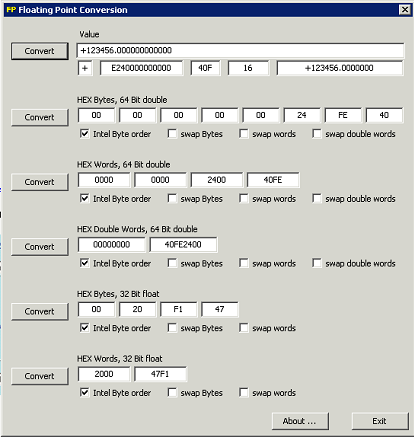

# Iobroker.modbus
 

**Этот адаптер использует библиотеки Sentry для автоматического сообщения разработчикам об исключениях и ошибках кода.** Подробнее об отключении сообщений об ошибках см. в разделе [Документация по плагину Sentry](https://github.com/ioBroker/plugin-sentry#plugin-sentry)! Сообщения Sentry используются, начиная с версии js-controller 3.0.

Реализация ModBus Slave и Master для ioBroker. Поддерживаются следующие типы устройств:

- Modbus RTU через последовательный порт (ведущий)
- Modbus RTU через TCP (ведущий)
- Modbus TCP (ведомый, ведущий)
- Modbus TCP с SSL/TLS (главный)

## Поддержка SSL/TLS
Для безопасного подключения к устройствам, требующим шифрования SSL/TLS (например, к интеллектуальному счётчику электроэнергии Kostal KSEM через порт 802), можно выбрать тип подключения «TCP с SSL/TLS». Это открывает следующие возможности настройки:

- **Путь к файлу сертификата SSL**: Путь к файлу вашего сертификата SSL в формате PEM
- **Путь к файлу закрытого ключа SSL**: Путь к файлу закрытого ключа SSL в формате PEM
- **Путь к файлу сертификата SSL CA**: путь к файлу сертификата CA в формате PEM (необязательно)
- **Отклонять неавторизованные сертификаты**: снимите флажок, чтобы разрешить самоподписанные сертификаты.

Примечание: файлы сертификатов должны быть доступны процессу ioBroker и иметь формат PEM.

## Настройки
### IP-адрес партнера
IP-адрес партнера Modbus.

### Порт
TCP-порт партнера Modbus, если он настроен как ведущий (клиент), или собственный порт, если он настроен как ведомый (сервер).

### Идентификатор устройства
Идентификатор устройства Modbus. Важно, если используется мост TCP/Modbus.

### Тип
Подчиненный (Сервер) или Главный (Клиент).

### Использовать псевдонимы в качестве адреса
Обычно все регистры могут иметь адрес от 0 до 65535. Используя псевдонимы, можно определить виртуальные адресные поля для каждого типа регистров. Обычно:

- дискретные входы от 10001 до 20000
- катушки от 1 до 1000
- входные регистры от 30001 до 40000
- регистры хранения от 40001 до 60000

Каждый псевдоним будет сопоставлен внутренне с адресом, например, 30011 будет сопоставлен с входным регистром 10 и т. д.

### Прямые адреса
Используется для двоичных входов и катушек.
Без этого флага биты будут адресоваться следующим образом: `0 => 15, 1 => 14, 2 => 13, ..., 15 => 0`.
С активацией этого флага биты будут адресоваться следующим образом: `0 => 0, 1 => 1, 2 => 2, ..., 15 => 15`.

### Не выравнивать адреса по 16 битам (слово)
Обычно адреса катушек и дискретных входов выравниваются по 16 битам.
Аналогичные адреса от 3 до 20 будут выравниваться по диапазонам от 0 до 32.
Если эта опция активна, адреса не будут выравниваться.

### Не используйте несколько регистров
Если ведомое устройство не поддерживает команду «запись нескольких регистров», вы можете активировать ее, чтобы получать предупреждения при записи нескольких регистров.

### Используйте только несколько регистров записи
Если ведомое устройство поддерживает только команду «запись нескольких регистров», можно активировать функцию, при которой запись в регистры будет выполняться всегда с помощью команды FC15/FC16.

### Округлить до
Сколько цифр после запятой для чисел с плавающей точкой и чисел двойной точности.

### Интервал опроса данных
Интервал циклического опроса (актуально только для главного устройства)

### Задержка повторного подключения
Интервал повторного подключения (актуально только для ведущего устройства)

### Тайм-аут чтения
Тайм-аут для запросов на чтение в миллисекундах. Если в этот момент ответ от подчинённого устройства не получен, соединение будет разорвано.

### Время импульса
Если импульс используется для катушек, это определяет интервал в миллисекундах, какова длительность импульса.

### Время ожидания
Время ожидания между опросом двух разных идентификаторов устройства в миллисекундах.

### Максимальная длина запроса на чтение
Максимальная длина команды READ_MULTIPLE_REGISTERS по количеству регистров для чтения.

В некоторых системах для доставки данных по запросу на чтение требуется сначала запрос на запись.
Вы можете принудительно включить этот режим, установив «Максимальную длину запроса на чтение» на 1.

**Примечание:** Некоторые решения USB Modbus (например, основанные на `socat`) могут испытывать трудности при работе с модулем npm `serialport`.

Имеется программный шлюз [**Modbus RTU <-> Modbus RTU через TCP**](http://mbus.sourceforge.net/index.html), позволяющий использовать последовательный RTU по протоколу TCP.

Оба решения **RTU over TCP** и **TCP** работают хорошо.

### Интервал чтения
Задержка между двумя запросами на чтение в мс. По умолчанию 0.

### Интервал записи
Задержка между двумя запросами записи в мс. По умолчанию 0.

### Обновить неизмененные состояния
Обычно, если значение не изменилось, оно не записывается в ioBroker.
Этот флаг позволяет обновлять временную метку значения в каждом цикле.

### Не включайте адреса в идентификатор
Не добавляйте адрес в сгенерированный ioBroker iD. `10_Input10` против `_Input10`.

### Сохранить точки в идентификаторе
С этим флагом имя будет `Inputs.Input10`. Без => `Inputs_Input10`.

## Параметры для одной адресной строки в конфигурации
### Адрес
Адрес Modbus для чтения.

### Идентификатор подчиненного устройства
В случае наличия нескольких подчиненных устройств это будет идентификатор, если не идентификатор по умолчанию, заданный в глобальной конфигурации.

### Имя
Это имя параметра.

### Описание
Описание параметров.

### Единица
Единица параметра.

### Тип
Тип данных для чтения из Bus. Подробнее о возможных типах данных см. в разделе Типы данных.

### Длина
Длина параметра. Для большинства параметров она определяется типом данных, но для строк она определяется в байтах/символах.

### Фактор
Этот коэффициент используется для умножения значения, считанного с шины, при статическом масштабировании. Таким образом, расчёт выглядит следующим образом: `val = x * Factor + Offset`.

### Компенсировать
Это смещение добавляется к считанному значению после указанного выше умножения. Таким образом, вычисление выглядит следующим образом: `val = x * Factor + Offset`.

### Формула
Это поле можно использовать для расширенных вычислений, если значений Factor и Offset недостаточно. **Если это поле задано, поля Factor и Offset игнорируются.** Формула выполняется функцией eval(). Поэтому поддерживаются все распространённые функции, особенно математические. Формула должна соответствовать синтаксису JavaScript, поэтому также следует учитывать регистр символов.

В формуле «x» необходимо использовать для считанного из Modbus значения. Например, `x * Math.pow(10, sf['40065'])`

Используя массив «sf» (см. пример выше), вы можете получить доступ к другим прочитанным значениям Modbus, если они помечены как «Масштабный коэффициент» в конфигурации (см. информацию о флаге «SF» ниже).

Если формулу невозможно оценить во время выполнения, то Адаптер записывает предупреждающее сообщение в журнал.

Другим вариантом использования формул может быть предотвращение неправдоподобных данных с помощью формулы типа `x > 2000000 ? null : x`

### Роль
Назначаемая роль ioBroker.

### Комната
Комната ioBroker для назначения.

### Опрос
Если активировано, значения опрашиваются с подчиненного устройства в заранее определенном интервале.

### ВП
Напишите пульс

### CW
Циклически писать

### СФ
Использовать значение в качестве коэффициента масштабирования.
Это необходимо для использования динамических коэффициентов масштабирования, которые в некоторых системах предоставляются через значения в интерфейсе.
Если значение отмечено этим флагом, оно будет сохранено в переменной со следующим соглашением об именовании: `sf['Modbus_address']`.
Эту переменную впоследствии можно использовать в любой формуле для других параметров. Например, следующая формула может задать: `(x * sf['40065']) + 50;`

## Типы данных
- `uint16be` - `Беззнаковые 16 бит (Big Endian): AABB => AABB`
- `uint16le` - `Беззнаковые 16 бит (Little Endian): AABB => BBAA`
- `int16be` - `Знаковый 16-битный (Big Endian): AABB => AABB`
- `int16le` - `16 бит со знаком (Little Endian): AABB => BBAA`
- `uint32be` - `Беззнаковый 32-битный (Big Endian): AABBCCDD => AABBCCDD`
- `uint32le` - `Беззнаковые 32 бита (Little Endian): AABBCCDD => DDCCBBAA`
- `uint32sw` - `Беззнаковый 32-битный (Big Endian Word Swap): AABBCCDD => CCDDAABB`
- `uint32sb` - `Беззнаковый 32-битный (Big Endian байт Swap): AABBCCDD => DDCCBBAA`
- `int32be` - `Знаковый 32-битный (Big Endian): AABBCCDD => AABBCCDD`
- `int32le` - `Знаковый 32-битный (Little Endian): ABBCCDD => DDCCBBAA`
- `int32sw` - `Знаковый 32-битный (Big Endian Word Swap): AABBCCDD => CCDDAABB`
- `int32sb` - `Знаковый 32-битный (Big Endian байт Swap): AABBCCDD => DDCCBBAA`
- `uint64be` - `Беззнаковые 64 бита (с прямым порядком байтов): AABBCCDDEEFFGGHH => AABBCCDDEEFFGGHH`
- `uint64le` - `Беззнаковый 64-битный (Little Endian): AABBCCDDEEFFGGHH => HHGGFFEEDDCCBBAA`
- `uint8be` - `Беззнаковые 8 бит (Big Endian): AABB => BB`
- `uint8le` - `Беззнаковые 8 бит (Little Endian): AABB => AA`
- `int8be` - `Знаковый 8-битный (Big Endian): AABB => BB`
- `int8le` - `Знаковый 8-битный (Little Endian): AABB => AA`
- `floatbe` - `Float (Big Endian): AABBCCDD => AABBCCDD`
- `floatle` - `Float (прямой порядок байтов): AABBCCDD => DDCCBBAA`
- `floatsw` - `Float (замена слов с прямым порядком байтов): AABBCCDD => CCDDAABB`
- `floatsb` - `Float (обмен байтами с прямым порядком байтов): AABBCCDD => DDCCBBAA`
- `doublebe` - `Double (Big Endian): AABBCCDDEEFFGGHH => AABBCCDDEEFFGGHH`
- `doublele` - `Двойной (прямой порядок байтов): AABBCCDDEEFFGGHH => HHGGFFEEDDCCBBAA`
- `string` - `Строка 8 бит (нулевой конец): ABCDEF\0 => ABCDEF\0`
- `stringle` - `Строка 8 бит (прямой порядок байтов, конец — ноль): ABCDEF\0 => BADCFE\0`
- `string16` - `Строка 16 бит (нулевой конец): \0A\0B\0C\0D\0E\0F\0\0 => ABCDEF\0`
- `string16le`- `Строка 16 бит (прямой порядок байтов, конец — ноль): A\0B\0C\0D\0E\0F\0\0\0 => ABCDEF\0`
- `rawhex` - `Строка со значением в шестнадцатеричном представлении AABBCCDD.... => AABBCCDD....`

Следующее описание было скопировано из [здесь](http://www.chipkin.com/how-real-floating-point-and-32-bit-data-is-encoded-in-modbus-rtu-messages/)

Протокол Modbus типа «точка-точка» популярен для связи RTU, хотя бы потому, что он удобен. Сам протокол управляет взаимодействием каждого устройства в сети Modbus, тем, как устройство устанавливает известный адрес, как каждое устройство распознаёт свои сообщения и как извлекается базовая информация из данных. По сути, протокол является основой всей сети Modbus.

Однако такое удобство не обходится без сложностей, и протокол сообщений Modbus RTU не является исключением.
Сам протокол был разработан на основе устройств с 16-битным регистром.
Следовательно, при реализации 32-битных элементов данных требовались особые меры.
В данной реализации было принято решение использовать два последовательных 16-битных регистра для представления 32 бит данных, или, по сути, 4 байтов данных.
Именно в этих четырёх байтах данных данные с плавающей запятой одинарной точности могут быть закодированы в сообщение Modbus RTU.

### Важность порядка байтов
Сам Modbus не определяет тип данных с плавающей запятой, но широко распространено мнение, что он реализует 32-битные данные с плавающей запятой, используя стандарт IEEE-754.
Однако стандарт IEEE не содержит четкого определения порядка байтов в полезной нагрузке данных.
Поэтому при работе с 32-битными данными наиболее важным моментом является правильный порядок адресации данных.

Например, число 123/456.00, определенное в стандарте IEEE 754 для 32-разрядных чисел с плавающей запятой одинарной точности, выглядит следующим образом:

Влияние различных порядков байтов весьма существенно. Например, упорядочивание 4 байтов данных, представляющих число 123456.00, в последовательность `B A D C` называется «перестановкой байтов». Если интерпретировать это как тип данных с плавающей запятой IEEE 744, результат будет совершенно иным:

Упорядочивание одинаковых байтов в последовательности «C D A B» называется «перестановкой слов». Результаты снова радикально отличаются от исходного значения 123456,00:

Более того, и `byte swap`, и `word swap` по сути полностью меняют последовательность байтов, создавая еще один результат:

Очевидно, что при использовании сетевых протоколов, таких как Modbus, необходимо уделять особое внимание порядку следования байтов памяти при их передаче, что также известно как «порядок байтов».

### Определение порядка байтов
Сам протокол Modbus декларируется как протокол «big-Endian» в соответствии со спецификацией протокола приложений Modbus V1.1.b:

**Modbus использует формат «big-endian» для адресов и элементов данных.
Это означает, что при передаче числового значения, превышающего один байт, первым отправляется старший байт.**

Big-Endian — наиболее часто используемый формат сетевых протоколов. Он настолько распространен, что его также называют «сетевым порядком».

Учитывая, что протокол обмена сообщениями Modbus RTU использует формат big-endian, для успешного обмена 32-битными данными посредством сообщения Modbus RTU необходимо учитывать порядок байтов как ведущего, так и ведомого устройства. Многие ведущие и ведомые устройства RTU позволяют выбирать порядок байтов, особенно в случае программно-моделируемых устройств. Необходимо лишь убедиться, что для обоих устройств задан одинаковый порядок байтов.

Как правило, порядок байтов определяется семейством микропроцессора устройства. Как правило, стиль big-endian (старший байт сохраняется первым, а затем младший) используется в процессорах Motorola. Стиль little-endian (младший байт сохраняется первым, а затем старший) обычно используется в процессорах с архитектурой Intel. Какой стиль считать «обратным» — вопрос личного восприятия.

Однако, если порядок байтов и порядок байтов не настраиваются, вам придётся определить, как интерпретировать байт. Это можно сделать, запросив известное значение с плавающей запятой у подчинённого устройства. Если возвращается недопустимое значение, например, число с двузначным показателем степени или что-то подобное, порядок байтов, скорее всего, потребуется изменить.

### Практическая помощь
Драйверы FieldServer Modbus RTU предлагают несколько функций для обработки 32-битных целых чисел и 32-битных чисел с плавающей точкой. Что ещё важнее, эти функции учитывают все различные формы последовательности байтов. В следующей таблице показаны функции FieldServer, которые копируют два соседних 16-битных регистра в 32-битное целое число.

| Ключевое слово функции | Режим обмена | Исходные байты | Целевые байты |
|-------------------|--------------------|-----------------|--------------|
| 2.i16-1.i32 | Н/Д | [ а б ] [ в г ] | [ а б в г ] |
| 2.i16-1.i32-s | обмен байтами и словами | [ a b ] [ c d ] | [ d c b a ] |
| 2.i16-1.i32-sb | обмен байтами | [ a b ] [ c d ] | [ b a d c ] |
| 2.i16-1.i32-sw | обмен словами | [ a b ] [ c d ] | [ c d a b ] |

В следующей таблице показаны ходы функции FieldServer, которые копируют два соседних 16-битных регистра в 32-битное значение с плавающей запятой:

| Ключевое слово функции | Режим обмена | Исходные байты | Целевые байты |
|-------------------|--------------------|-----------------|--------------|
| 2.i16-1.ifloat | Н/Д | [ а б ] [ в г ] | [ а б в г ] |
| 2.i16-1.ifloat-s | обмен байтами и словами | [ a b ] [ c d ] | [ d c b a ] |
| 2.i16-1.ifloat-sb | обмен байтами | [ a b ] [ c d ] | [ b a d c ] |
| 2.i16-1.ifloat-sw | обмен словами | [ a b ] [ c d ] | [ c d a b ] |

В следующей таблице показаны ходы функции FieldServer, которые копируют одно 32-битное значение с плавающей запятой в два смежных 16-битных регистра:

| Ключевое слово функции | Режим обмена | Исходные байты | Целевые байты |
|------------------|--------------------|-----------------|----------------|
| 1.float-2.i16 | Н/Д | [ а б ] [ в г ] | [ а б ][ в г ] |
| 1.float-2.i16-s | обмен байтами и словами | [ a b ] [ c d ] | [ d c ][ b a ] |
| 1.float-2.i16-sb | обмен байтами | [ a b ] [ c d ] | [ b a ][ d c ] |
| 1.float-2.i16-sw | обмен словами | [ a b ] [ c d ] | [ c d ][ a b ] |

Учитывая различные варианты выполнения функций FieldServer, корректная обработка 32-битных данных зависит от выбора подходящего варианта. Обратите внимание на следующее поведение этих вариантов выполнения функций FieldServer для известного десятичного числа с плавающей точкой одинарной точности 123456.00:

| 16-битные значения | Функция Перемещение | Результат | Функция Перемещение | Результат |
|---------------|------------------|-----------|------------------|---------------|
| 0x2000 0x47F1 | 2.i16-1.float | 123456.00 | 1.float-2.i16 | 0x2000 0x47F1 |
| 0xF147 0x0020 | 2.i16-1.float-s | 123456.00 | 1.float-2.i16-s | 0xF147 0X0020 |
| 0x0020 0xF147 | 2.i16-1.float-sb | 123456.00 | 1.float-2.i16-sb | 0x0020 0xF147 |
| 0x47F1 0x2000 | 2.i16-1.float-sw | 123456.00 | 1.float-2.i16-sw | 0x47F1 0x2000 |

Обратите внимание, что разный порядок байтов и слов требует использования соответствующей функции FieldServer Move. После выбора нужной функции Move данные можно преобразовывать в обоих направлениях.

Из множества конвертеров и калькуляторов шестнадцатеричного кода в формат с плавающей точкой, доступных в Интернете, лишь немногие позволяют изменять порядок байтов и слов.
Одна из таких утилит находится по адресу www.61131.com/download.htm, где можно скачать версии утилит как для Linux, так и для Windows.
После установки утилита запускается как исполняемый файл с единым диалоговым интерфейсом.
Утилита представляет десятичное значение с плавающей точкой 123456.00 следующим образом:

Затем можно поменять байты и/или слова, чтобы проанализировать, какие потенциальные проблемы с порядком байтов могут существовать между ведущими и ведомыми устройствами Modbus RTU.

## Экспорт/импорт регистров
Благодаря функции экспорта/импорта вы можете преобразовать все данные регистра (только одного типа) в файл TSV (значения, разделенные табуляцией) и обратно, чтобы легко копировать данные с одного устройства на другое или редактировать регистр в Excel.

Вы можете поделиться своими схемами с другими пользователями в [modbus-шаблоны,](https://github.com/ioBroker/modbus-templates) или найти некоторые схемы регистров там.

## Тест
В папке `test` находятся несколько программ для проверки TCP-связи:

- Ananas32/64 — это симулятор ведомого устройства (только хранение регистров и входов, без катушек и цифровых входов)
- RMMS — главный симулятор
- mod_RSsim.exe — это симулятор ведомого устройства. Возможно, для его запуска потребуется [Распространяемый пакет Microsoft Visual C++ 2008 SP1](https://www.microsoft.com/en-us/download/details.aspx?id=5582) (из-за ошибки Side-By-Side).

<!--

### **РАБОТА В ХОДЕ** -->

## Changelog
### 7.0.5 (2025-10-13)
* (bluefox) Prohibited installation from github

### 7.0.4 (2025-10-08)
* (bluefox) Added migration procedure from 6 to 7
* (bluefox) Corrected serial communication

### 7.0.1 (2025-10-07)
* (bluefox) Redesign of the configuration tabs
* (bluefox) Added option to remove leading underscores in the object names

### 7.0.0 (2025-10-06)
* (copilot) Improved Modbus error handling and fault tolerance - continue polling working devices even when others fail
* (copilot) Fixes memory leak
* (copilot) Added option to disable connection error logging to avoid log spam when devices are unavailable
* (bluefox) Show values directly in configuration
* (bluefox) Implemented TLS connection (master)

### 6.4.0 (2024-11-22)
* (bluefox) Moved GUI compilation to vite
* (bluefox) Added error message if the response length is invalid

### 6.3.2 (2024-08-29)
* (bluefox) Corrected the error with alignment of addresses

### 6.3.0 (2024-08-28)
* (Apollon77) Fix Timeout management to prevent leaking memory
* (bluefox) Added information about connected clients in the server mode
* (bluefox) Tried to fix error with aligning addresses
* (bluefox) GUI was migrated to admin 7

### 6.2.3 (2024-05-25)
* (Q7Jensen) Fixed error at aligning addresses to word
* (Apollon77) Added device id to some errors

### 6.2.2 (2024-04-26)
* (Apollon77) Downgrade gulp to 4.0.2 to fix build

### 6.2.1 (2024-04-16)
* (PLCHome) Warning regarding scale factor due to incorrect check: "Calculation of a scaleFactor which is based on another scaleFactor seems strange."

### 6.2.0 (2024-04-12)
* (PLCHome) String based on 16-bit values big endian as well as little endian
* (PLCHome) Raw data as a hex string
* (PLCHome) Fix issue `stringle` was always converted to number for slave
* (PLCHome) Enable formula for strings and hex strings

### 6.1.0 (2023-12-14)
* (nkleber78) Implement the connection keepAlive

### 6.0.1 (2023-10-30)
* (bluefox) Better tooltips in settings

### 6.0.0 (2023-10-27)
* (bluefox) GUI packages updated
* (bluefox) Added help for settings
* (bluefox) Minimal supported node.js version is 16

### 5.0.11 (2022-12-01)
* (clausmuus) fixed reconnect of serial communication

### 5.0.8 (2022-09-27)
* (bluefox) GUI packages updated

### 5.0.5 (2022-08-13)
* (Apollon77) Prevent some crash cases reported by Sentry

### 5.0.4 (2022-06-15)v
* (bluefox) Corrected the coils reading in slave mode
* (bluefox) Corrected type of connection indicator

### 5.0.3 (2022-05-13)
* (bluefox) Fixed error with multi-devices

### 5.0.0 (2022-05-11)
* BREAKING: All space characters will be replaced with underscores now in the Objects IDs, not only the first one.
* (Apollon77) Catch error reported by sentry when invalid Master port is entered
* (bluefox) GUI migrated to mui-v5

### 4.0.4 (2022-03-25)
* (Apollon77/UncleSamSwiss) Prevent invalid state log

### 4.0.3 (2022-03-21)
* (bluefox) Updated serial port package
* (bluefox) A minimal node.js version is 12

### 3.4.17 (2021-11-11)
* (Apollon77) Catch errors in tasks processing to prevent crashes

### 3.4.15 (2021-11-09)
* (Apollon77) Catch errors in tasks processing to prevent crashes
* (Apollon77) make sure generated IDs do not end with "."

### 3.4.14 (2021-08-31)
* (nkleber78) Fixed issue with sorting
* (bluefox) Corrected the calculations with scaling factor
* (bluefox) Read times were optimized

### 3.4.11 (2021-07-31)
* (bluefox) Corrected import of last line

### 3.4.10 (2021-07-30)
* (Apollon77) Make sure that slave reconnections at least wait 1000ms to allow old connectio to close properly
* (bluefox) Corrected the error with write single registers

### 3.4.9 (2021-07-06)
* (bluefox) Changed edit behaviour

### 3.4.8 (2021-06-24)
* (Apollon77) Fix crash case on writing floats (Sentry IOBROKER-MODBUS-2D)

### 3.4.7 (2021-06-22)
* (bluefox) Corrected addressing with aliases in GUI

### 3.4.6 (2021-06-21)
* (bluefox) Corrected addressing with aliases

### 3.4.5 (2021-06-19)
* (bluefox) Corrected the "write multiple registers" option

### 3.4.4 (2021-06-16)
* (bluefox) GUI bugs were corrected
* (bluefox) Added output of error codes

### 3.4.2 (2021-06-15)
* (nkleber78) Corrected issue with the scale factors
* (bluefox) New react GUI added
* (bluefox) Add new option: Use only Write multiple registers, read interval

### 3.3.1 (2021-05-10)
* (bluefox) fixed the configuration dialog for "input registers" in slave mode

### 3.3.0 (2021-04-16)
* (Apollon77) Allowed usage of write-only (no poll) states
* (Apollon77/TmShaz) F Write multiple registers
* (prog42) create states of type string with default value of type string

### 3.2.6 (2021-03-05)
* (Apollon77) Prevent a crash case (Sentry IOBROKER-MODBUS-20)
* (Apollon77) Better handle invalid responses

### 3.2.4 (2021-01-30)
* (Sierra83) also support ttyXRUSB0 style devices

### 3.2.3 (2021-01-21)
* (Apollon77) Catch value encoding error and do not crash adapter (Sentry IOBROKER-MODBUS-1W)
* (Apollon77) add a meta object as instance object

### 3.2.2 (2020-12-15)
* (Apollon77) prevent a rash case (Sentry IOBROKER-MODBUS-1S)

### 3.2.1 (2020-12-12)
* (Apollon77) prevent a crash case (Sentry IOBROKER-MODBUS-1R)

### 3.2.0 (2020-12-09)
* (nkleber78) Fixed formula where return keyword was missing

### 3.1.13 (2020-12-07)
* (nkleber78) Added the possibility to use formulas for values

### 3.1.12 (2020-12-05)
* (Apollon77) fix admin serial port selection

### 3.1.10 (2020-09-25)
* (nkleber78) Corrected: the exported data cannot be imported without modification

### 3.1.9 (2020-09-17)
* (Apollon77) Prevent crash case (Sentry IOBROKER-MODBUS-1C)

### 3.1.7 (2020-07-23)
* (Apollon77) Fix some Sentry crash reports (IOBROKER-MODBUS-N)

### 3.1.6 (2020-07-06)
* (bluefox) Fix some Sentry crash reports (IOBROKER-MODBUS-J)

### 3.1.5 (2020-06-29)
* (Apollon77) Fix some Sentry crash reports (IOBROKER-MODBUS-F)

### 3.1.4 (2020-06-24)
* (Apollon77) Fix some Sentry crash reports (IOBROKER-MODBUS-4, IOBROKER-MODBUS-7, IOBROKER-MODBUS-6)
* (Apollon77) Change the way adapter restarts when reconnections do not help

### 3.1.3 (2020-06-12)
* (Apollon77) fix scheduled restart

### 3.1.2 (2020-06-12)
* (Apollon77) fix serialport list for Admin

### 3.1.1 (2020-06-11)
* (Apollon77) Add Sentry crash reporting when used with js-controller >=3.x

### 3.1.0 (2020-06-11)
* (Apollon77) Make sure that regular adapter stops do not terminate the process, so that scheduled restarts still work
* (Apollon77) update serialport, support nodejs 12/14

### 3.0.4 (2020-06-05)
* (bluefox) Added device ID by export/import
* (bluefox) Added the "write interval" parameter
* (bluefox) Added the disabling of write multiple registers

### 3.0.3 (2020-06-05)
* (bluefox) Corrected error after refactoring

### 3.0.2 (2020-06-01)
* (compton-git) Decodes 0xFF00 as coil ON

### 3.0.1 (2020-01-23)
* (BlackBird77) Fixes for Serial Timeouts done
* (bluefox) Refactoring

### 3.0.0 (2019-05-15)
* (Apollon77) Support for Node.js 12 added, Node.js 4 is no longer supported!

### 2.0.9 (2018-10-11)
* (Bjoern3003) Write registers was corrected

### 2.0.7 (2018-07-02)
* (bluefox) The server mode was fixed

### 2.0.6 (2018-06-26)
* (bluefox) rtu-tcp master mode was fixed

### 2.0.3 (2018-06-16)
* (bluefox) Fixed the rounding of numbers

### 2.0.2 (2018-06-12)
* (bluefox) The error with blocks reading was fixed
* (bluefox) The block reading for discrete values was implemented

### 2.0.1 (2018-05-06)
* (bluefox) Added the support of multiple device IDs

### 1.1.1 (2018-04-15)
* (Apollon77) Optimize reconnect handling

### 1.1.0 (2018-01-23)
* (bluefox) Little endian strings added
* (Apollon77) Upgrade Serialport Library

### 1.0.2 (2018-01-20)
* (bluefox) Fixed read of coils

### 0.5.4 (2017-09-27)
* (Apollon77) Several Fixes

### 0.5.0 (2017-02-11)
* (bluefox) Create all states each after other

### 0.4.10 (2017-02-10)
* (Apollon77) Do not recreate all data points on start of adapter
* (ykuendig) Multiple optimization and wording fixes

### 0.4.9 (2016-12-20)
* (bluefox) fix serial RTU

### 0.4.8 (2016-12-15)
* (Apollon77) update serialport library for node 6.x compatibility

### 0.4.7 (2016-11-27)
* (bluefox) Use old version of jsmodbus

### 0.4.6 (2016-11-08)
* (bluefox) backward compatibility with 0.3.x

### 0.4.5 (2016-10-25)
* (bluefox) better buffer handling on tcp and serial

### 0.4.4 (2016-10-21)
* (bluefox) Fix write of holding registers

### 0.4.1 (2016-10-19)
* (bluefox) Support of ModBus RTU over serial and over TCP (only slave)

### 0.3.11 (2016-08-18)
* (Apollon77) Fix wrong byte count in loop

### 0.3.10 (2016-02-01)
* (bluefox) fix lost of history settings.

### 0.3.9 (2015-11-09)
* (bluefox) Use always write_multiple_registers by write of holding registers.

### 0.3.7 (2015-11-02)
* (bluefox) add special read/write mode if "Max read request length" is 1.

### 0.3.6 (2015-11-01)
* (bluefox) add cyclic write for holding registers (fix)

### 0.3.5 (2015-10-31)
* (bluefox) add cyclic write for holding registers

### 0.3.4 (2015-10-28)
* (bluefox) add doubles and fix uint64

### 0.3.3 (2015-10-27)
* (bluefox) fix holding registers

### 0.3.2 (2015-10-27)
* (bluefox) fix import from text file

### 0.3.1 (2015-10-26)
* (bluefox) fix error with length of read block (master)
* (bluefox) support of read blocks and maximal length of read request (master)
* (bluefox) can define fields by import

### 0.3.0 (2015-10-24)
* (bluefox) add round settings
* (bluefox) add deviceID
* (bluefox) slave supports floats, integers and strings

### 0.2.6 (2015-10-22)
* (bluefox) add different types for inputRegisters and for holding registers ONLY FOR MASTER

### 0.2.5 (2015-10-20)
* (bluefox) fix names of objects if aliases used

### 0.2.4 (2015-10-19)
* (bluefox) fix error add new values

### 0.2.3 (2015-10-15)
* (bluefox) fix error with master

### 0.2.2 (2015-10-14)
* (bluefox) implement slave
* (bluefox) change addressing model

### 0.0.1
* (bluefox) initial commit

## License
The MIT License (MIT)

Copyright (c) 2015-2025 Bluefox <dogafox@gmail.com>

Permission is hereby granted, free of charge, to any person obtaining a copy
of this software and associated documentation files (the "Software"), to deal
in the Software without restriction, including without limitation the rights
to use, copy, modify, merge, publish, distribute, sublicense, and/or sell
copies of the Software, and to permit persons to whom the Software is
furnished to do so, subject to the following conditions:

The above copyright notice and this permission notice shall be included in
all copies or substantial portions of the Software.

THE SOFTWARE IS PROVIDED "AS IS", WITHOUT WARRANTY OF ANY KIND, EXPRESS OR
IMPLIED, INCLUDING BUT NOT LIMITED TO THE WARRANTIES OF MERCHANTABILITY,
FITNESS FOR A PARTICULAR PURPOSE AND NONINFRINGEMENT. IN NO EVENT SHALL THE
AUTHORS OR COPYRIGHT HOLDERS BE LIABLE FOR ANY CLAIM, DAMAGES OR OTHER
LIABILITY, WHETHER IN AN ACTION OF CONTRACT, TORT OR OTHERWISE, ARISING FROM,
OUT OF OR IN CONNECTION WITH THE SOFTWARE OR THE USE OR OTHER DEALINGS IN
THE SOFTWARE.