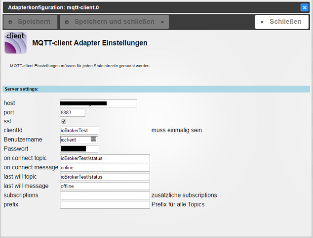
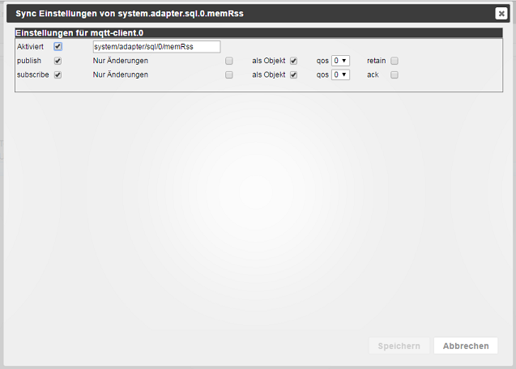

# ioBroker.mqtt-client

## Версии

Публикуйте и подписывайтесь на состояния ioBroker в MQTT-брокерах.

## Часовой

**Этот адаптер использует библиотеки Sentry для автоматического сообщения разработчикам об исключениях и ошибках в коде.** Более подробную информацию, а также инструкции по отключению отправки сообщений об ошибках см. [в документации Sentry-Plugin](https://github.com/ioBroker/plugin-sentry#plugin-sentry) ! Система отчетности Sentry используется начиная с js-controller 3.0.

## Настройки адаптера

### по теме и сообщению подключения

Он `on connect message` опубликовано для `on connect topic` Каждый раз, когда клиент подключается или переподключается к серверу.

### тема и сообщение об отключении

Он `on disconnect message` опубликовано для `on disconnect topic` когда адаптер корректно останавливается.

### тема и послание, касающиеся завещания

Он `last will message` опубликовано для `last will topic` Каждый раз, когда клиент подключается или переподключается к серверу. Сервер сохраняет это сообщение и отправляет его своим подписчикам, когда клиент неожиданно отключается.

### подписки

Разделённый запятыми список тем, не охваченных существующими состояниями. Полученные сообщения преобразуются в состояния в пространстве имён адаптера (например, mqtt.0) и подписываются на них. Вы можете удалить темы после создания всех состояний.

### Разделение JSON на состояния для тем

Список фильтров тем MQTT, разделенных запятыми (без префикса), `+` и `#` разрешены), например `zigbee2mqtt/+` Полученный в соответствующей теме JSON-объект не сохраняется как текст, а разделяется на канал, где на каждое значение приходится одно состояние. `zigbee2mqtt/sensor` =`{"battery":100,"occupancy":false,"color":{"x":0.3}}` создает канал `mqtt-client.0.zigbee2mqtt.sensor` со штатами `battery` (число), `occupancy` (логическое значение) и канал `color` с государством `x` (число).

- Вложенные объекты становятся каналами (до 5 уровней), массивы хранятся в виде JSON-текста.
- Точки, пробелы и символы, недопустимые в идентификаторах, заменяются на `_` в идентификаторах.
- Значения, записанные в ioBroker (`ack=false`) отправляются в формате JSON на `<topic>/set` например `{"color":{"x":0.5}}` — Это соглашение, принятое в zigbee2mqtt. Устройство подтверждает новое значение в своем следующем сообщении.
- Полезные данные, не являющиеся объектами JSON (массивы, числа, текст), обрабатываются как и прежде.

Для доступа к этим темам по-прежнему необходимо подписаться, например, с помощью `zigbee2mqtt/#` В разделе дополнительных подписок указано, что старые версии, созданные в текстовом формате для этих тем, не изменяются и могут быть удалены.

### префикс публикации

При публикации этот параметр будет добавлен в начало всех тем. По умолчанию значение пустое (префикс отсутствует).

### префикс подписки

При подписке этот параметр будет добавляться в начало всех тем. По умолчанию значение пустое (префикс отсутствует).

## Настройки состояния

### включено

Включает или отключает функциональность mqtt-клиента для данного состояния. Отключение приведет к удалению всех настроек mqtt-клиента из этого состояния.

### тема

Тема, в которую публикуется и от которой осуществляется подписка на данное состояние. По умолчанию: идентификатор состояния, преобразованный в тему MQTT.

Когда тема определяется по идентификатору состояния, точки преобразуются в разделители уровня темы. `/`) и следующие символы заменены на `_`:

- подстановочные знаки MQTT `+` и `#` - они не допускаются в названиях тем (используются, например, идентификаторами Shelly, такими как...). `shelly.0.SHSW-1#B96701#1`)
- Косые черты, содержащиеся в самом идентификаторе, — они создадут дополнительные уровни тем.
- Пробелы — они не должны попадать в идентификаторы объектов при обратном преобразовании темы.

Так `shelly.0.SHSW-1#B96701#1.Relay0.Switch` становится `shelly/0/SHSW-1_B96701_1/Relay0/Switch` Если два идентификатора состояния относятся к одной и той же теме (например, `a#b` и `a+b`), в журнал записывается предупреждение. В этом случае настройте отдельную тему для одного из них.

### публиковать

- `enable` штат будет опубликован
- `changes only` Состояние будет опубликовано только при изменении его значения.
- `as object` Весь штат будет опубликован как объект.
- `qos` См. <http://www.hivemq.com/blog/mqtt-essentials-part-6-mqtt-quality-of-service-levels>
- `retain` См. <http://www.hivemq.com/blog/mqtt-essentials-part-8-retained-messages>

### подписаться

- `enable` Тема будет подписана, и состояние будет обновлено соответствующим образом.
- `changes only` Состояние будет записано только при изменении значения.
- `as object` сообщения будут интерпретироваться как объекты
- `qos` См. <http://www.hivemq.com/blog/mqtt-essentials-part-6-mqtt-quality-of-service-levels>
- `ack` При обновлении состояния флаг подтверждения будет установлен соответствующим образом.

#### Примечание

- Если параметру ack установлено значение true, это приведет к перезаписи объектов ack, см. `as object`
- Чтобы предотвратить зацикливание сообщений, если включены как публикация, так и подписка. `changes only` Подписка всегда доступна

<!--
	Placeholder for the next version (at the beginning of the line):
	### **WORK IN PROGRESS**
-->

## Changelog
### 4.1.0 (2026-09-15)
* (@GermanBluefox) Adapter requires node.js >= 22.19 now
* (@Tarvion) Automatically derived topics no longer contain the mqtt wildcards `+` and `#` (as used by shelly IDs), slashes or whitespace taken from the state-ID. These characters are replaced by `_` now
* (@GermanBluefox) A warning is logged if two states derive to the same topic
* (@GermanBluefox) Adapter icon converted to SVG
* (@GermanBluefox) The adapter was refactored to TypeScript
* (@GermanBluefox) Fixed: stopping the adapter waited for the timeout when no broker was configured or after `stopInstance`
* (@GermanBluefox) Fixed: states created from received topics now have `common.role` instead of a `role` outside of `common`
* (@GermanBluefox) Fixed: with "subscribe as object", the loop protection and "changes only" skipped changed values instead of unchanged ones
* (@GermanBluefox) Fixed: deleting a state that was published with retain now also removes the retained message from the broker
* (@GermanBluefox) Fixed: MQTT version 3 connects with the protocol name `MQIsdp`, so MQTT 3.1 brokers accept the connection. The versions are labeled 3.1, 3.1.1 and 5.0 in the settings (#169)
* (@GermanBluefox) Fixed: special characters like `%` or `:` in the user name, password or client ID broke the connection (#200)
* (@GermanBluefox) New option "split JSON into states for topics": JSON objects, e.g. from zigbee2mqtt, become a channel with one state per value; written values are sent to `<topic>/set` (#322)
* (@GermanBluefox) Fixed: a subscribed state was not updated after a restart when an object of the adapter's namespace had the same topic. Changing the topic of a state now also unsubscribes the old topic, and no copy of a state is created for an old topic anymore (#418)
* (@GermanBluefox) Fixed: every change of an object (e.g. `extendObject` by another adapter) published the current value of the state again, which could overwrite a newer value on the same topic. The value is now published once only when publishing starts or the topic changes (#467)

### 4.0.0 (2026-05-05)
* (copilot) Adapter requires node.js >= 22 now
* (copilot) Adapter requires admin >= 7.7.22 now
* (copilot) Adapter requires js-controller >= 6.0.11 now
* (@klein0r) Updated dependencies

### 3.0.0 (2025-01-24)
* (@klein0r) Breaking change: Underscores are not replaced by spaces in the corresponding topic anymore

### 2.1.0 (2024-11-12)
* (mcm1957) Adapter requires node.js 20 now.
* (mcm1957) Adapter requires js-controller 5.0.19 and admin 6.17.14 now.
* (simatec) Adapter changed to meet Responsive Design rules.
* (mcm1957) Dependencies have been updated.

### 2.0.1 (2024-09-23)
* (@klein0r) Added missing information in configuration dialog
* (@klein0r) Fixed type of port configuration to avoid conflicts

## License
The MIT License (MIT)

Copyright (c) 2025-2026 iobroker-community-adapters <iobroker-community-adapters@gmx.de>  
Copyright (c) 2016-2023 Pmant

Permission is hereby granted, free of charge, to any person obtaining a copy
of this software and associated documentation files (the "Software"), to deal
in the Software without restriction, including without limitation the rights
to use, copy, modify, merge, publish, distribute, sublicense, and/or sell
copies of the Software, and to permit persons to whom the Software is
furnished to do so, subject to the following conditions:

The above copyright notice and this permission notice shall be included in
all copies or substantial portions of the Software.

THE SOFTWARE IS PROVIDED "AS IS", WITHOUT WARRANTY OF ANY KIND, EXPRESS OR
IMPLIED, INCLUDING BUT NOT LIMITED TO THE WARRANTIES OF MERCHANTABILITY,
FITNESS FOR A PARTICULAR PURPOSE AND NONINFRINGEMENT. IN NO EVENT SHALL THE
AUTHORS OR COPYRIGHT HOLDERS BE LIABLE FOR ANY CLAIM, DAMAGES OR OTHER
LIABILITY, WHETHER IN AN ACTION OF CONTRACT, TORT OR OTHERWISE, ARISING FROM,
OUT OF OR IN CONNECTION WITH THE SOFTWARE OR THE USE OR OTHER DEALINGS IN
THE SOFTWARE.