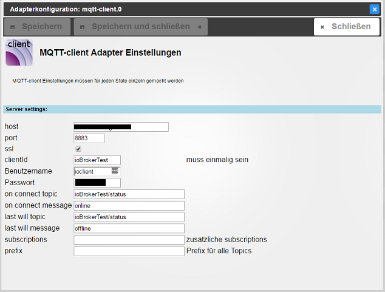

# IoBroker.mqtt-клиент
## Настройки адаптера


### При подключении темы и сообщения
```on connect message``` публикуется в ```on connect topic``` каждый раз, когда клиент подключается или повторно подключается к серверу.

### При отключении темы и сообщения
```on disconnect message``` публикуется в ```on disconnect topic```, когда адаптер корректно останавливается.

### Последней будет тема и сообщение
```last will message``` публикуется в ```last will topic``` каждый раз, когда клиент подключается или повторно подключается к серверу.
Сервер сохранит это сообщение и отправит его своим подписчикам, когда клиент неожиданно отключится.

### Подписки
Разделенный запятыми список тем, которые не охватываются существующими штатами.
Полученные сообщения преобразуются в состояния в пространстве имен адаптера (например, mqtt.0) и подписываются.
Вы можете удалять темы после создания всех состояний.

### Опубликовать префикс
При публикации это будет добавлено ко всем темам.
По умолчанию пусто (без префикса).

### Префикс подписки
При подписке это будет добавляться ко всем темам.
По умолчанию пусто (без префикса).

## Настройки состояния


### Включено
Включает или отключает функциональность mqtt-клиента для этого состояния.
Отключение удалит все настройки mqtt-клиента из этого состояния.

### Тема
Тема, в которой публикуется это состояние и на которую вы подписаны.
по умолчанию: идентификатор состояния преобразован в тему mqtt.

### Опубликовать
* Состояние ```enable``` будет опубликовано
* Состояние ```changes only``` будет опубликовано только при изменении его значения
* ``как объект``` все состояние будет опубликовано как объект
* ```qos``` см. <http://www.hivemq.com/blog/mqtt-essentials-part-6-mqtt-quality-of-service-levels>
* ```сохранить``` см. <http://www.hivemq.com/blog/mqtt-essentials-part-8-retained-messages>

### Подписываться
* Тема ```enable``` будет подписана, и состояние будет соответствующим образом обновлено.
* Состояние ```changes only``` будет записано только при изменении значения
* сообщения ```как объект``` будут интерпретироваться как объекты
* ```qos``` см. <http://www.hivemq.com/blog/mqtt-essentials-part-6-mqtt-quality-of-service-levels>
* ```ack``` при обновлении состояния флаг подтверждения будет установлен соответствующим образом

#### Примечание
* когда для ack установлено значение true, он будет перезаписывать объекты ack, см. ```как объект```
* для предотвращения зацикливания сообщений, если включены и публикация, и подписка, ```только изменения``` всегда включен для подписки

## СДЕЛАТЬ
* тестовые префиксы
* подключиться/переподключиться без очистки сеанса

<!-- Заполнитель для следующей версии (в начале строки):

### __РАБОТА ВЫПОЛНЯЕТСЯ__ -->

## Changelog
### __WORK IN PROGRESS__
* (Pmant) fix LWT documentation
* (Pmant) optionally publish a message when disconnecting gracefully

### 1.5.0 (2022-01-26)
* IMPORTANT: This adapter now required at least js-controller 3.3.x
* (Apollon77) Fix crash cases

### 1.4.1 (2022-01-26)
* (bluefox) js-controller 3.3 optimizations

### 1.4.0 (2021-07-16)
* IMPORTANT: This adapter now required at least js-controller 2.0.0
* (Apollon77) js-controller 3.3 optimizations
* (AlCalzone) Unpublished expired states
* (AlCalzone) Only handle stat values if state exists

### 1.3.2 (2021-04-19)
* (bluefox) Added support of admin5

### 1.3.1 (2020-03-17)
* (bluefox) mqtt package moved back to 2.x

### 1.3.0 (2020-03-11)
* (bluefox) mqtt package was updated
* (bluefox) Fixed the error with "custom" view

### 1.2.1 (2019-10-17)
* (algar42) Fix adapter restarting
* (algar42) Fix mqtt issues

### 1.2.0 (2019-10-14)
* (bluefox) Support of js-controller 2.0 was added

### 1.1.1 (2018-01-30)
* (bluefox) small fixes

### 1.1.0 (2017-12-30)
* (bluefox) Translations
* (bluefox) Update of MQTT module

### 1.0.1 (2017-11-16)

### 1.0.0 (2017-11-16)
* (bluefox) Update io-package.json

### 0.3.2 (2016-11-18)
* (Pmant) fix initial object parsing
* (Pmant) fix objects view

### 0.3.1 (2016-11-16)
* (Pmant) fix crash

### 0.3.0 (2016-09-08)
* (Pmant) add optional publish and subscribe prefixes

### 0.2.5 (2016-09-08)
* (Pmant) reduce logging -> debug

### 0.2.0 (2016-09-08)
* (Pmant) use new custom settings

### 0.1.1 (2016-06-09)
* (Pmant) fix possible loop

### 0.1.0 (2016-06-08)
* (Pmant) initial commit

## License
The MIT License (MIT)

Copyright (c) 2016-2022 Pmant

Permission is hereby granted, free of charge, to any person obtaining a copy
of this software and associated documentation files (the "Software"), to deal
in the Software without restriction, including without limitation the rights
to use, copy, modify, merge, publish, distribute, sublicense, and/or sell
copies of the Software, and to permit persons to whom the Software is
furnished to do so, subject to the following conditions:

The above copyright notice and this permission notice shall be included in
all copies or substantial portions of the Software.

THE SOFTWARE IS PROVIDED "AS IS", WITHOUT WARRANTY OF ANY KIND, EXPRESS OR
IMPLIED, INCLUDING BUT NOT LIMITED TO THE WARRANTIES OF MERCHANTABILITY,
FITNESS FOR A PARTICULAR PURPOSE AND NONINFRINGEMENT. IN NO EVENT SHALL THE
AUTHORS OR COPYRIGHT HOLDERS BE LIABLE FOR ANY CLAIM, DAMAGES OR OTHER
LIABILITY, WHETHER IN AN ACTION OF CONTRACT, TORT OR OTHERWISE, ARISING FROM,
OUT OF OR IN CONNECTION WITH THE SOFTWARE OR THE USE OR OTHER DEALINGS IN
THE SOFTWARE.