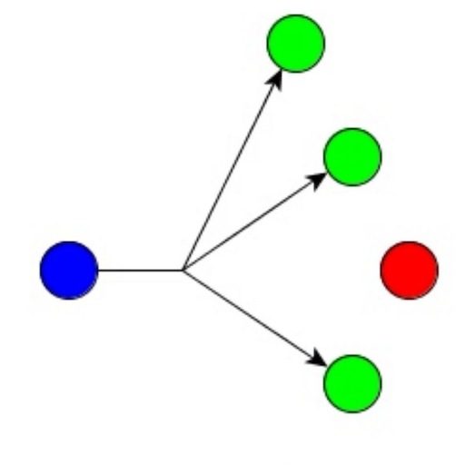

<h1>

ioBroker.multicast

</h1>

# Multicast-APi адаптер для ioBroker
Этот адаптер предоставляет API на основе протокола многоадресной передачи для отправки и получения состояний на устройства с пользовательской прошивкой.

Назначение этого адаптера было:

* предоставить альтернативу http post и протоколу MQTT
* Иметь доступный единый API на основе многоадресной связи и передачи данных в формате JSON.
* Подготовьте адаптер с нулевым касанием для интеграции любого устройства Ethernet (например, плата на основе ESP, например, Wemos D1 mini), например, смарт-разъемы Vansware/Gosound или другие средства автоматизации сборки.

### Нулевое касание?
APi построен таким образом, что не требует дополнительной настройки конечного пользователя с помощью самого адаптера или используемого устройства.
В случае использования перехода Wi-Fi необходимо предоставить только учетные данные Wi-Fi (устройства на основе локальной сети будут обрабатываться полностью автоматически).
Это требует усилий со стороны разработчика двоичного файла для прошивки на соответствующем наборе микросхем (например, наборах микросхем на основе ESP).

Когда прошивка соответствует всем правилам APi (см. далее ниже), связь обрабатывается следующим образом:

* Устройство отправляет значения состояния по многоадресной рассылке UDP
* Адаптер распознает это сообщение и проверяет наличие состояний для этого устройства в ioBroker.

#### Новое устройство
Из предыдущего сообщения адаптер указал, что устройство не найдено, будет обработана следующая процедура:

* ioBroker отправляет широковещательное сообщение для инициализации устройства
* Устройство отправляет все состояния и соответствующую структуру в ioBroker
* ioBroker создает новое устройство и все необходимые состояния
* Когда все состояния созданы, ioBroker отправляет рукопожатие на устройство «готово к приему данных»
* Устройство начинает отправлять свои состояния с интервалами или изменениями (в соответствии с конфигурацией прошивки)

#### Переподключение существующих устройств
Из предыдущего сообщения указанное адаптером устройство уже существует, будет обработана следующая процедура:

* ioBroker проверяет, установлено ли в конфигурации «восстановление»
* Когда восстановление активировано, ioBroker отправляет все состояния (кроме информационных состояний) на устройство
* Когда все состояния получены, устройство de отправляет рукопожатие ioBroker «готово к приему данных»
* ioBroker подтверждает
* Устройство начинает отправлять свои состояния с интервалами или изменениями (в соответствии с конфигурацией прошивки)

#### Изменения состояния
Адаптер предназначен для повторной отправки до 5 раз, чтобы гарантировать получение устройством всех изменений состояния. Эта процедура обрабатывается следующим образом:

* Состояние изменено в ioBroker
* Адаптер распознает изменение значения и отправит новое значение на устройство
* Устройство должно подтвердить сообщение в течение 500 мс
* Если сообщение не подтверждено, адаптер повторно отправит значение
* Это будет обрабатываться максимум до 5 повторных попыток, после чего сообщение об ошибке укажет на потерю связи

### Структура API и документация
{будет сделано/в процессе}

## Запланировано:
* [ ] Реализовать очередь, ждать 20 мс после изменения состояния устройства и отправлять массив со всеми обновлениями состояния
* [x] Реализовать значение срока действия с помощью API
* [x] Оптимизировать повторную попытку состояния, не запускать очередь каждые 500 мс
* [x] Отправлять данные для восстановления, если Harbert получен, а подключение к устройству FALSE
* [x] Реализовать состояния (возможность для списка значений)
* [x] Правильная обработка имени хоста и изменений имени хоста

## Changelog
<!--
    Placeholder for the next version (at the beginning of the line):
    ### __WORK IN PROGRESS__
-->

### __WORK IN PROGRESS__
* ([Andiling](https://github.com/andiling)) Expire value by API implemented
* (DutchmanNL) Rebuild retry functionality

### 0.1.6 (2021-03-23)
* (DutchmanNL) Dependency updates

### 0.1.5
* (Dutchman & Andiling) Stable-Release candidate

### 0.1.4
* (DutchmanNL) Fix Device Name
* (DutchmanNL) improved way of handling info channel values compatible with old firmware

### 0.1.3
* (Dutchman) Optimise state retry, don't fire every 500ms more queuing
* (Dutchman) Send recovery data if Harbeat is received and connection to device is FALSE
* (Dutchman) Implement states (capability for value list)

### 0.1.2
* (Dutchman) Optimise state retry, don't fire every 500ms more queuing
* (Dutchman) Correct handling of hostname and hostname changes

### 0.1.1
* (Dutchman) Send recovery data if Harbeat is received and connection to device is FALSE
* (Dutchman) Implement states (capability for value list)

### 0.1.0

* (Dutchman & Andiling) initial release

## License

MIT License

Copyright (c) 2021 Dutchman & Andiling

Permission is hereby granted, free of charge, to any person obtaining a copy
of this software and associated documentation files (the "Software"), to deal
in the Software without restriction, including without limitation the rights
to use, copy, modify, merge, publish, distribute, sublicense, and/or sell
copies of the Software, and to permit persons to whom the Software is
furnished to do so, subject to the following conditions:

The above copyright notice and this permission notice shall be included in all
copies or substantial portions of the Software.

THE SOFTWARE IS PROVIDED "AS IS", WITHOUT WARRANTY OF ANY KIND, EXPRESS OR
IMPLIED, INCLUDING BUT NOT LIMITED TO THE WARRANTIES OF MERCHANTABILITY,
FITNESS FOR A PARTICULAR PURPOSE AND NONINFRINGEMENT. IN NO EVENT SHALL THE
AUTHORS OR COPYRIGHT HOLDERS BE LIABLE FOR ANY CLAIM, DAMAGES OR OTHER
LIABILITY, WHETHER IN AN ACTION OF CONTRACT, TORT OR OTHERWISE, ARISING FROM,
OUT OF OR IN CONNECTION WITH THE SOFTWARE OR THE USE OR OTHER DEALINGS IN THE
SOFTWARE.