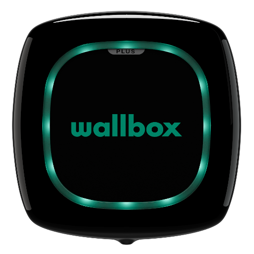

# IoBroker.mywallbox
**Тесты:** 

## Адаптер My-Wallbox для ioBroker
Подключите My-Wallbox (например, Pulsar Plus) к ioBroker через облачный сервис My Wallbox

## Установка
Установка через Github Symbol (находится в стадии тестирования и бета-тестирования)

## Контроль
Все состояния в "wallbox.[instance].SerialNumber.control" доступны для записи и могут использоваться для управления Wallbox.

## Поддерживать
Если вам понравился адаптер и вы хотите меня поддержать, вы можете сделать это здесь:

## Changelog
<!--
	Placeholder for the next version (at the beginning of the line):
	### **WORK IN PROGRESS**
-->
### 1.2.0 (2024-11-12)
- Added: Migration to jsonConfig in Adapter-settings
- Added: New state "car_connected", which indicates, that a car is connected
- Added: Resume, Pause check - less error messages (e.g. if Wallbox is in Pause Mode and should be set to pause, don't throw any error)
- Added: Option, to unlock the wallbox first if it should enter the resume mode (Default: wallbox will not resume, if locked)
- Added: Some minor improvements, updates dependencies and smal cosmetics

### 1.1.1 (2024-09-18)
- updated dependencies

### 1.1.0 (2024-02-08)
- Prepared Adapter to be added to ioBroker repotories

### 1.0.0 (2023-01-17)
- Changed some Adapter settings to be published to public repository
- Attention: Password needs to be re-entered as encryption function changed

### 0.0.19 (2022-08-23)
- fixed small crash bug

### 0.0.18 (2022-08-17)
- renamed Adapter to MyWallbox to get adapter added to iobroker repo

### 0.0.17 (2022-08-15)
- crash handler extended
- After some time, the charge value disappears. The value is now kept as long as the wallbox is in charge mode

### 0.0.16 (2022-07-19)
- added error handling for cost-data, if server did not respond properly
- changed some error-handling to prevent crashing if JSON is empty

### 0.0.14 (2022-07-19)
- changed state 'added_energy' to Wh instead of W

### 0.0.13 (2022-07-12)
- fixed crash, if token has different format

### 0.0.8 (2022-07-06)
- redefined password store (now password is saved securely)

### 0.0.6 (2022-07-04)
- added new states including price-calculation

### 0.0.5 (2022-07-01)
- Added extended Wallbox informations (like lock-status, charging-power and charging-time)

### 0.0.4 (2022-06-29)
- Login corrected

### 0.0.3 (2022-06-29)
- added some files

### 0.0.2 (2022-06-29)
* initial release

## License
MIT License

Copyright (c) 2024 SKB <info@skb-web.de>

Permission is hereby granted, free of charge, to any person obtaining a copy
of this software and associated documentation files (the "Software"), to deal
in the Software without restriction, including without limitation the rights
to use, copy, modify, merge, publish, distribute, sublicense, and/or sell
copies of the Software, and to permit persons to whom the Software is
furnished to do so, subject to the following conditions:

The above copyright notice and this permission notice shall be included in all
copies or substantial portions of the Software.

THE SOFTWARE IS PROVIDED "AS IS", WITHOUT WARRANTY OF ANY KIND, EXPRESS OR
IMPLIED, INCLUDING BUT NOT LIMITED TO THE WARRANTIES OF MERCHANTABILITY,
FITNESS FOR A PARTICULAR PURPOSE AND NONINFRINGEMENT. IN NO EVENT SHALL THE
AUTHORS OR COPYRIGHT HOLDERS BE LIABLE FOR ANY CLAIM, DAMAGES OR OTHER
LIABILITY, WHETHER IN AN ACTION OF CONTRACT, TORT OR OTHERWISE, ARISING FROM,
OUT OF OR IN CONNECTION WITH THE SOFTWARE OR THE USE OR OTHER DEALINGS IN THE
SOFTWARE.