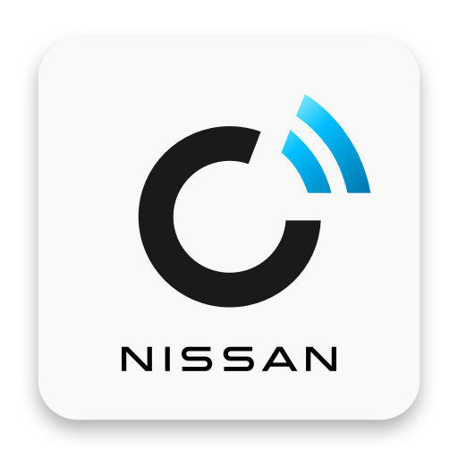

# ioBroker.nissan

**Этот адаптер использует библиотеки Sentry для автоматического сообщения разработчикам об исключениях и ошибках в коде.**\
&#x20;Для получения более подробной информации и сведений о том, как отключить отчеты об ошибках, см. [документацию по плагину Sentry](https://github.com/ioBroker/plugin-sentry#plugin-sentry) !

## Адаптер Nissan для ioBroker

С помощью адаптера Nissan вы можете запрашивать у своего автомобиля Nissan самые свежие данные, отображать текущее состояние батареи и зарядки, текущее состояние системы климат-контроля, запускать или останавливать климат-контроль и дистанционно запускать зарядку.

[Информация о приложении Nissan Connect](https://www.nissan.de/kunden/nissan-connect-apps.html)

## Форум

Приглашаем вас следить за обсуждениями на немецком [форуме iobroker.](https://forum.iobroker.net/topic/46700/test-adapter-nissan-v-0-0-x)

Обратите внимание, что этот адаптер предназначен только для автомобилей, использующих приложение NissanConnect Services, а не для NissanConnect EV или любого другого приложения.

## Поддерживаемые регионы

Европа

В настоящее время поддерживаются только автомобили Nissan, находящиеся в Европе.

## Аутентификация

Для входа в систему используются учетные данные приложения NissanConnect Services (MyNISSAN OneID).

Вход по протоколу SRP (Secure Remote Password) не поддерживается. В настоящее время отсутствуют общедоступные документированные или функциональные параметры SRP Nissan/Kamereon (N, g, алгоритм хеширования).

## Changelog

<!--
	Placeholder for the next version (at the beginning of the line):
	### **WORK IN PROGRESS**
-->
### 0.1.19 (2026-09-13)
- (iobroker-bot) Adapter requires node.js >= 22 now.
- (bolliy/claude) Implemented MyNISSAN OneID authentication

### 0.1.18 (2026-05-03)
- (bolliy) add NissanConnect EV app service end notice

### 0.1.17 (2026-03-14)
- (bolliy) dependency and configuration updates

### 0.1.17-alpha.0 (2025-11-22)
- (bolliy) dependency and configuration updates
- (bolliy) NPM: migration to trusted publishing

### 0.1.16 (2025-07-03)
- (bolliy) dependency and configuration updates
- (bolliy) ConnectEV: update API endpoint and enhance password encryption method

## License

MIT License

Copyright (c) 2021-2026 TA2k <tombox2020@gmail.com>

Permission is hereby granted, free of charge, to any person obtaining a copy
of this software and associated documentation files (the "Software"), to deal
in the Software without restriction, including without limitation the rights
to use, copy, modify, merge, publish, distribute, sublicense, and/or sell
copies of the Software, and to permit persons to whom the Software is
furnished to do so, subject to the following conditions:

The above copyright notice and this permission notice shall be included in all
copies or substantial portions of the Software.

THE SOFTWARE IS PROVIDED "AS IS", WITHOUT WARRANTY OF ANY KIND, EXPRESS OR
IMPLIED, INCLUDING BUT NOT LIMITED TO THE WARRANTIES OF MERCHANTABILITY,
FITNESS FOR A PARTICULAR PURPOSE AND NONINFRINGEMENT. IN NO EVENT SHALL THE
AUTHORS OR COPYRIGHT HOLDERS BE LIABLE FOR ANY CLAIM, DAMAGES OR OTHER
LIABILITY, WHETHER IN AN ACTION OF CONTRACT, TORT OR OTHERWISE, ARISING FROM,
OUT OF OR IN CONNECTION WITH THE SOFTWARE OR THE USE OR OTHER DEALINGS IN THE
SOFTWARE.