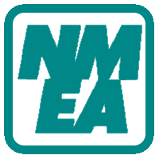
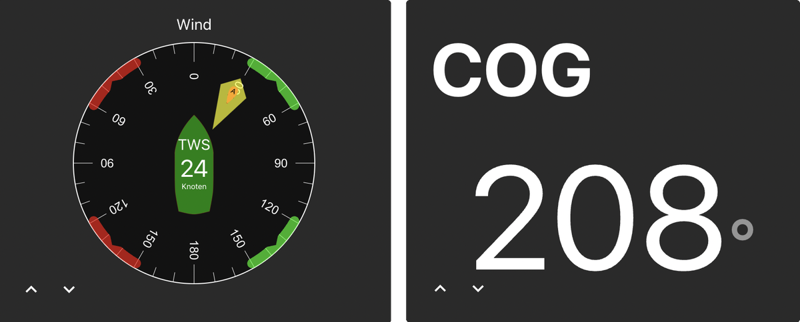
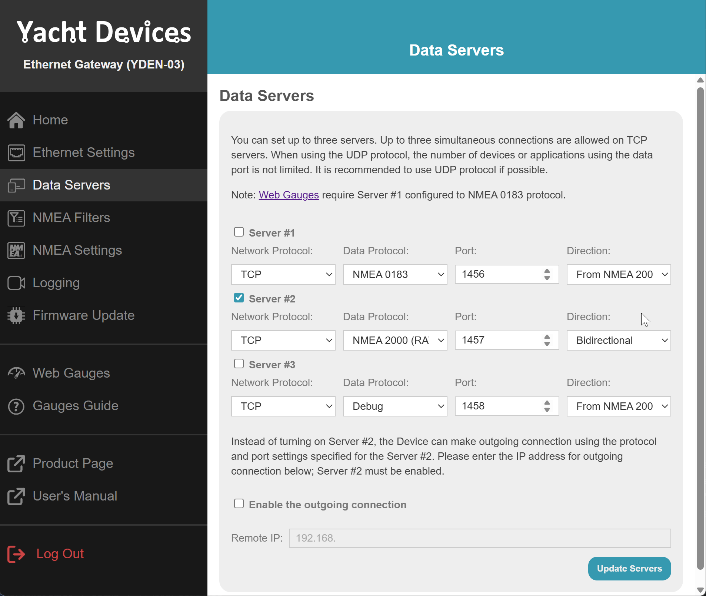

# ioBroker.nmea

Этот адаптер позволяет подключать ioBroker к яхтенной шине NMEA-2000.

**Этот адаптер использует библиотеки Sentry для автоматического сообщения разработчикам об исключениях и ошибках в коде.** Более подробную информацию, а также инструкции по отключению отправки сообщений об ошибках, см. [в документации Sentry-Plugin](https://github.com/ioBroker/plugin-sentry#plugin-sentry) ! Система отчетности Sentry используется начиная с js-controller 3.0.

Для использования этого адаптера вам потребуется оборудование, способное считывать данные с шины NMEA-2000 и преобразовывать их в последовательный порт:

- [Actisense NGT-1 (USB)](https://actisense.com/products/ngt-1-nmea-2000-to-pc-interface/)
- [Actisense NGX1-USB (USB)](https://actisense.com/products/nmea-2000-gateway-ngx-1/)
- или [Raspberry PI с PiCAN-M](https://www.skpang.co.uk/collections/hats/products/copy-of-pican-m-with-can-bus-micro-c-and-rs422-connector-no-smps)
- [Yacht Devices YDWG-02/03](https://www.yachtd.com/products/wifi_gateway.html)
- [Yacht Devices YDEN-02/03](https://www.yachtd.com/products/ethernet_gateway.html)

PiCAN-M может работать с Raspberry Pi 4 и [5](https://copperhilltech.com/blog/testing-pican-can-bus-hats-with-the-raspberry-pi-5/) .



[Объяснение на YouTube](https://youtu.be/flp_-mypbRU?si=k0lp95OukQ88LBxj)

## Как использовать его на Raspberry PI с PiCAN-M

PiCAN M — это компактная дополнительная плата, разработанная для Raspberry Pi 3/4. Она позволяет подключать к Raspberry Pi сети NMEA2000 и NMEA0183. Питание платы может осуществляться от внешнего источника 12 В. Кроме того, при использовании с платой PiCAN-M она предоставляет возможность питания Raspberry Pi напрямую через шину NMEA2000.

**В плате PiCAN-M отсутствует надлежащая защита от обратной полярности при напряжении питания 12 В. При работе от внешнего источника питания 12 В необходимо установить предохранитель на 1 А в линию питания.**

В связи с высокими требованиями Raspberry Pi к питанию, мы рекомендуем использовать внешний источник питания (не менее 3 А). Питание по протоколам NMEA2000 и USB может осуществляться параллельно без проблем.

### Установка

Более подробная информация содержится в главе 3 [Руководства пользователя PiCAN-M](https://github.com/ioBroker/ioBroker.nmea/blob/master/img/pican-m_UGB_10.pdf) , но вот краткое изложение:

Редактировать файл`/boot/config.txt` (с`sudo nano /boot/config.txt` ) и добавьте следующие строки в конец файла:

```
enable_uart=1
dtparam=i2c_arm=on
dtparam=spi=on
dtoverlay=mcp2515-can0,oscillator=16000000,interrupt=25 
```

Отключить вывод на консоль UART:

- начать в командной строке`sudo raspi-config`
- перейти к`3 Interface Options`
- идти`I5 Serial Port`
- Запрещать`shell accessible over serial` и`serial port hardware enabled`
- Выход из`raspi-config` и перезагрузить

Установите can-utils

```shell
sudo apt-get install can-utils
```

## Actisense NGT-1

Устройство Actisense NGT-1 отображается в Windows или Linux без каких-либо дополнительных драйверов. Оно отображается как последовательный порт 'COMn' (Windows) или ttyN (Linux).

## ЙДЕН, ЙДВГ

Включите сервер N2 с протоколом TCP и двунаправленным режимом.



Протокол UDP тоже мог бы подойти, но шлюз непрерывно отправляет данные в сеть, поэтому шина может быть перегружена.

## Все

- Закодировать код
- АИС
- Выясните, почему были отправлены данные с адреса 100.
- Интеграция [iKonvert NMEA 2000](https://digitalyachtamerica.com/product/ikonvert-usb/)
- Интеграция модуля [Shipmodul MiniPlex-3-N2K](https://www.shipmodul.com/products.html)

## Моделирование данных

Вы можете передавать данные с внешних датчиков на шину NMEA2000. Фактически, вы можете только имитировать данные об окружающей среде, такие как температура, влажность, давление.

С флагом`Combined environment` Вы можете указать номер PGN, который будет использоваться для измерения температуры, влажности и давления:

- Если вы снимете выделение с флага`Combined environment` Таким образом, для измерения температуры будет использоваться PGN 130314, для измерения влажности — PGN 130313, а для измерения давления — PGN 130314.
- Если вы выберете флаг`Combined environment` Таким образом, все три значения будут отправлены в формате PGN 130311 вместе с другими возможными значениями параметров окружающей среды.

## Часовой пояс

Существует возможность установить часовой пояс по GPS-координатам. Для этого необходимо включить соответствующую опцию в настройках адаптера и разрешить её использование.`iobroker` Пользователь может выполнить команду:`sudo visudo`

```
iobroker ALL=(ALL) timedatectl set-timezone
```

## Автопилот

На самом деле поддерживается только один автопилот: Raymarine.

Разработка Simrad/Navico/B\&G еще не завершена.

### Отображение уровня ветрового давления

Для устройств Raymarine, которые отображают "ориентир пилотного ветра" (PGN 65345), адаптер сохраняет исходный угол в радианах.`seatalkPilotWindDatum.windDatum` (Это каноническое значение, которое автопилот считывает при изменении угла ветра, поэтому оно должно оставаться в радианах).

Кроме того, предусмотрено удобное состояние только для чтения.`seatalkPilotWindDatum.windDatumDisplay` создано. Оно отображает угол точно так же, как и пилотный столик Raymarine:

- `0…180°` → правый борт,`180…360°` → порт,
- каждый как`≤180°` значение плюс дополнительная буква, зависящая от языка (например, значение`230°` показано как`130°P` на английском и`130°B` (на немецком языке).`0°` (прямо вперед) и`180°` (прямо за кормой) не имеют бортового письма.

Использовать`windDatumDisplay` для визуализации и`windDatum` для расчетов/автоматизации.

<!--
	### **WORK IN PROGRESS**
-->

## Changelog
### **WORK IN PROGRESS**
- (@GermanBluefox) Migrated widgets to React 19

### 2.0.0 (2026-08-04)
- (bluefox) Migrated to devices V3

### 1.0.3 (2026-07-08)
- (bluefox) Better decoding of motor PGNs

### 1.0.2 (2026-06-30)
- (copilot) Adapter requires node.js >= 22 now
- (bluefox) Added `seatalkPilotWindDatum.windDatumDisplay` state with the Raymarine-style port/starboard wind-angle display
- (bluefox) The autopilot device-manager widget now shows the wind datum the Raymarine way (e.g. `130°P`) with a language-dependent port/starboard letter
- (bluefox) Added the custom icon set

### 1.0.1 (2026-06-26)
* (bluefox) Implemented Raymarine autopilot support
* (bluefox) Corrected values simulation for yacht devices gateways
* (bluefox) Added support of Fusion player

### 0.4.2 (2026-01-05)
* (bluefox) Updated packages

[Older changelogs can be found there](https://github.com/ioBroker/ioBroker.nmea/blob/master/CHANGELOG_OLD.md)

## License
The MIT License (MIT)

Copyright (c) 2024-2026 bluefox <dogafox@gmail.com>

Permission is hereby granted, free of charge, to any person obtaining a copy
of this software and associated documentation files (the "Software"), to deal
in the Software without restriction, including without limitation the rights
to use, copy, modify, merge, publish, distribute, sublicense, and/or sell
copies of the Software, and to permit persons to whom the Software is
furnished to do so, subject to the following conditions:

The above copyright notice and this permission notice shall be included in
all copies or substantial portions of the Software.

THE SOFTWARE IS PROVIDED "AS IS", WITHOUT WARRANTY OF ANY KIND, EXPRESS OR
IMPLIED, INCLUDING BUT NOT LIMITED TO THE WARRANTIES OF MERCHANTABILITY,
FITNESS FOR A PARTICULAR PURPOSE AND NONINFRINGEMENT. IN NO EVENT SHALL THE
AUTHORS OR COPYRIGHT HOLDERS BE LIABLE FOR ANY CLAIM, DAMAGES OR OTHER
LIABILITY, WHETHER IN AN ACTION OF CONTRACT, TORT OR OTHERWISE, ARISING FROM,
OUT OF OR IN CONNECTION WITH THE SOFTWARE OR THE USE OR OTHER DEALINGS IN
THE SOFTWARE.