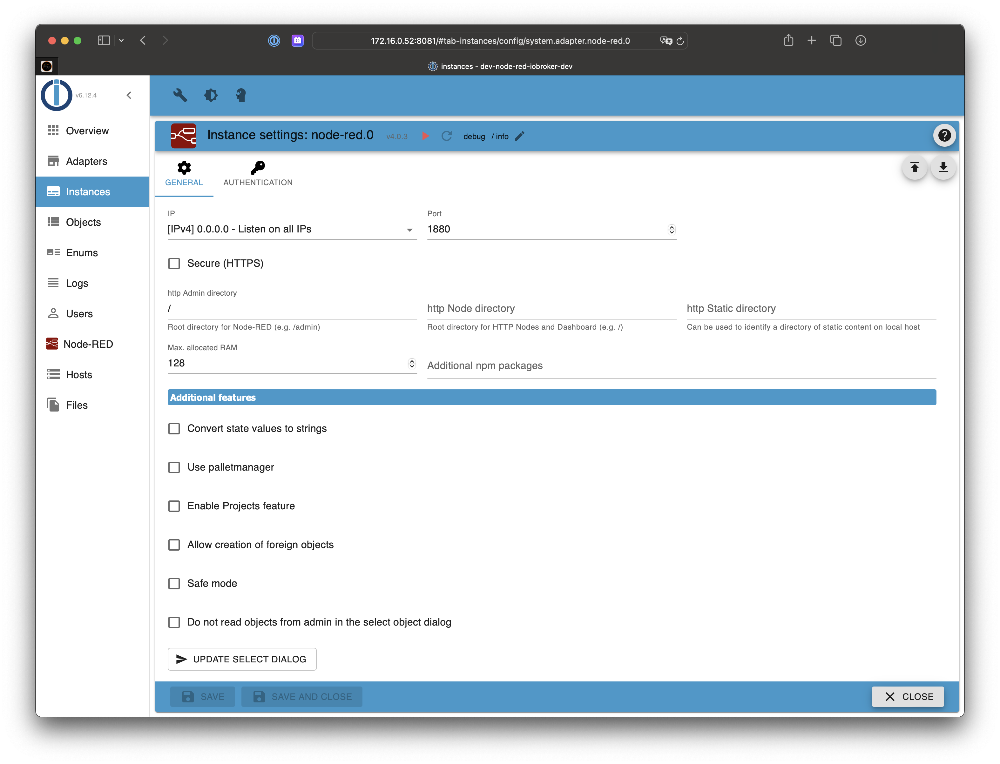

# IoBroker.node-red
**Примечание.** Если вы не можете найти свое состояние в диалоговом окне выбора идентификатора узлов ioBroker, нажмите кнопку обновления в настройках экземпляра или перезапустите экземпляр node-red. При перезапуске будет создан новый список объектов.

## Настройки

### Максимальный объем оперативной памяти
В конфигурации адаптера/экземпляра вы можете настроить максимальный объем ОЗУ/кучи для процесса node-red. Значения по умолчанию достаточно для небольших установок с красным узлом. Если у вас много узлов или вы испытываете проблемы с производительностью или сбои процесса node.red в журналах, обновите настройку максимального объема оперативной памяти! В зависимости от доступной оперативной памяти (см., например, использование `free -m` в поле «доступно») увеличьте ее до 1024 (= 1 ГБ) или даже выше.

### Безопасный режим
Потоки не будут запущены, и вы можете редактировать потоки, чтобы устранить некоторые проблемы с перегрузкой.

## Аутентификация
### Никто

### Простой

### Расширенный

## Узлы
### IoBroker в
### IoBroker вышел
### IoBroker получить
### IoBroker получает объект
### Список ioBroker
### IoBroker sendTo

## Changelog
### 5.0.0 (2023-11-26)

**NodeJS 16.4.x is required**
**Please check instance configuration and re-enter your passwords (encryption has changed).**

- (klein0r) Updated Node-RED to 3.1.0. Please check your nodes for compatibility!
- (klein0r) Admin 5/6 JSON config for instance configuration
- (klein0r) Added sendTo node with callback
- (klein0r) Allow custom attribute name for "ioBroker in" node
- (klein0r) Added option to select editor (monaco, ace)
- (klein0r) Added table for custom env vars to instance configuration

### 4.0.3 (2023-03-24)

- (Apollon77) Optimized path handling

### 4.0.2 (2023-03-24)

- (Apollon77) Fix broken data directory when using multiple instances

### 4.0.1 (2023-03-22)

- (Apollon77) Prepare for js-controller 5.0

### 4.0.0 (2022-08-14)

- IMPORTANT: Node.js 14.x now needed at least
- (Apollon77) Upgrade to node-red 3.0.2, enable runtime-state features and switch editor to monaco-editor
- (Apollon77) Correctly escape backslashes when writing setting file on Windows

## License

Copyright 2014-2023 bluefox <dogafox@gmail.com>.

Licensed under the Apache License, Version 2.0 (the "License");
you may not use this file except in compliance with the License.
You may obtain a copy of the License at

http://www.apache.org/licenses/LICENSE-2.0

Unless required by applicable law or agreed to in writing, software
distributed under the License is distributed on an "AS IS" BASIS,
WITHOUT WARRANTIES OR CONDITIONS OF ANY KIND, either express or implied.
See the License for the specific language governing permissions and
limitations under the License.
