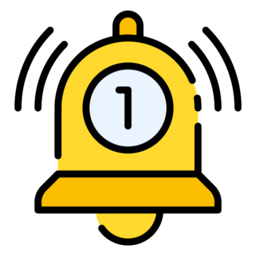

# ioBroker.notification-manager

## адаптер notification-manager для ioBroker

Управляйте уведомлениями ioBroker, например, отправляя их в виде сообщений.

### Общее описание

Этот адаптер позволяет перенаправлять внутренний интерфейс ioBroker.`Notifications` к адаптерам мессенджеров, которые поддерживают`Notification System` Если у вас отсутствует адаптер, пожалуйста, создайте заявку по соответствующему адаптеру.

### Конфигурация

Для каждого`category` Вы можете настроить, если`category` должна быть активной. Если категория неактивна, то`notification-manager` не будет заниматься этим конкретным вопросом`category` .

Кроме того, вы можете настроить, если`notification-manager` следует подавить определенные`categories` Если а`notification` для подавленного`category` Если он зарегистрирован, адаптер немедленно его очистит.`notification` не отправляя вам никаких сообщений.

Наконец, вы можете настроить поддерживаемые адаптеры обмена сообщениями. Каждый раз, когда появляется новый`notification` для`active` (и`non-suppressed` )`category` После генерации адаптер отправит`notification` через первый настроенный адаптер. Если отправка сообщения прошла успешно, то`notification-manager` очистит`notification` Если отправка не удалась, будет предпринята повторная попытка с использованием второго адаптера.

Всякий раз, когда категория`active` Если какие-либо конкретные параметры еще не настроены, то адаптер будет использовать настроенные резервные параметры. Новые категории всегда создаются.`active` По умолчанию это гарантирует получение уведомлений. Это означает, что уведомление будет отправлено всякий раз, когда появится новая информация.`category` реализуется с помощью какого-либо адаптера, резервные настройки для данного случая.`severity` будет применено.

Вы можете дополнительно определить это просто`suppress` категория.`notification-manager` Затем система просто подтвердит получение уведомления, и оно не отобразится в вашей системе.

Начиная с версии js-controller 7, адаптеры получили возможность добавлять дополнительные функции.`contextData` к уведомлениям. Это, например, используется для отображения определенных действий для пользователя в административном интерфейсе. По умолчанию,`notification-manager` Мы будем отправлять вам эти уведомления и **НЕ** будем их удалять, поэтому они останутся доступными для последующих взаимодействий с пользователем. Однако, если вы решите, что вам не нужны такие взаимодействия в определённых случаях,`category` Вы можете отключить их, поставив галочку в соответствующем поле.

### Регистрация уведомлений, ориентированных на пользователя.

Как пользователь, вы в лучшем случае знаете, когда хотите получать уведомления о конкретных ситуациях в вашей системе. Таким образом,`notification-manager` Предоставляет интерфейс для регистрации собственных уведомлений в системе уведомлений ioBroker. Поддерживаются три категории, по одной для каждого уровня серьезности.`notify` ,`info` и`alert` .

Уведомления можно зарегистрировать через`sendTo`

```ts
(async () => {
    try {
        await sendToAsync('notification-manager.0', 'registerUserNotification', { category: 'notify', message: 'Your delivery has arrived' });
    } catch (e) {
        log(`Could not register notification: ${e}`, 'error');
    }
})();
```

### Требования к адаптерам обмена сообщениями

Пожалуйста, установите`common.supportedMessages.notifications` флаг к`true` в вашем`io-package.json` .

Всякий раз, когда через адаптер обмена сообщениями необходимо доставить новое уведомление,`notification-manager` отправит сообщение настроенному экземпляру.

Сообщения состоят из команды.`sendNotification` и сообщение следующей структуры:

```json
{
  "host": "system.host.moritz-ThinkPad-P16-Gen-1",
  "scope": {
    "name": "System-Benachrichtigungen",
    "description": "Diese Benachrichtigungen werden vom ioBroker-System erfasst und weisen auf Probleme hin, die überprüft und behoben werden sollten."
  },
  "category": {
    "instances": {
      "system.adapter.backitup.0": {
        "messages": [
          {
            "message": "Restart loop detected",
            "ts": 1684074961226
          }
        ]
      },
      "system.adapter.notification-manager.0": {
        "messages": [
          {
            "message": "Restart loop detected",
            "ts": 1684075183094
          }
        ]
      }
    },
    "description": "Eine Adapterinstanz stürzt beim Start häufig ab und wurde aus diesem Grund gestoppt. Die Protokolldatei muss vor dem Neustart der Instanz überprüft werden.",
    "name": "Probleme mit häufig abstürzenden Adapterinstanzen",
    "severity": "alert"
  }
}
```

Где`category.instances` Отображает список затронутых экземпляров адаптеров для данного уведомления. Кроме того, категория имеет описание и имя i18n. Аналогичные свойства существуют и для области действия категории. Также указан затронутый хост.

После отправки уведомления,`notification-manager` ожидает ответа, содержащего свойство.`{ sent: true }` если адаптер обмена сообщениями смог доставить уведомление, в противном случае он должен ответить следующим образом:`{ sent: false }` .

## Changelog
<!--
    Placeholder for the next version (at the beginning of the line):
    ### **WORK IN PROGRESS**
-->
### 1.3.0 (2024-10-10)
* (@foxriver76) by default we do not delete notifications with `contextData`
* (@foxriver76) added checkbox to also delete notifications with `contextData` for specific categories

### 1.2.1 (2024-08-29)
* (@foxriver76) fixed issue if host name contains `.`

### 1.2.0 (2024-08-05)
* (@klein0r) Added Blockly blocks

### 1.1.2 (2024-05-02)
* (foxriver76) made logging a bit more silent

### 1.1.1 (2024-03-16)
* (foxriver76) added possibility to suppress messages
* (foxriver76) fixed issue that bottom of settings page is shown behind toolbar
* (foxriver76) fixed issue that all notifications are cleared instead of only the handled one

### 1.0.0 (2023-12-08)
* (foxriver76) added possibility to send custom messages
* (foxriver76) added UI indicators for each category

### 0.1.2 (2023-10-11)
* (foxriver76) also show notifications provided by adapters in the configuration

### 0.1.1 (2023-07-04)
* (foxriver76) added possibility to send test messages from web interface (closes #1)

### 0.1.0 (2023-06-02)
* (foxriver76) initial release

## License
MIT License

Copyright (c) 2024 foxriver76 <moritz.heusinger@gmail.com>

Permission is hereby granted, free of charge, to any person obtaining a copy
of this software and associated documentation files (the "Software"), to deal
in the Software without restriction, including without limitation the rights
to use, copy, modify, merge, publish, distribute, sublicense, and/or sell
copies of the Software, and to permit persons to whom the Software is
furnished to do so, subject to the following conditions:

The above copyright notice and this permission notice shall be included in all
copies or substantial portions of the Software.

THE SOFTWARE IS PROVIDED "AS IS", WITHOUT WARRANTY OF ANY KIND, EXPRESS OR
IMPLIED, INCLUDING BUT NOT LIMITED TO THE WARRANTIES OF MERCHANTABILITY,
FITNESS FOR A PARTICULAR PURPOSE AND NONINFRINGEMENT. IN NO EVENT SHALL THE
AUTHORS OR COPYRIGHT HOLDERS BE LIABLE FOR ANY CLAIM, DAMAGES OR OTHER
LIABILITY, WHETHER IN AN ACTION OF CONTRACT, TORT OR OTHERWISE, ARISING FROM,
OUT OF OR IN CONNECTION WITH THE SOFTWARE OR THE USE OR OTHER DEALINGS IN THE
SOFTWARE.

Icon made by "Good Ware" from www.flaticon.com