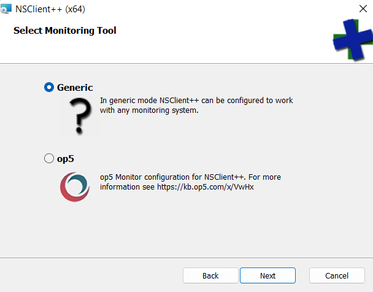
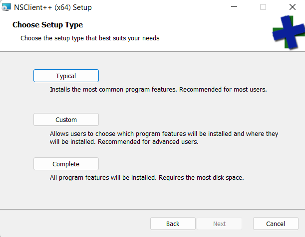
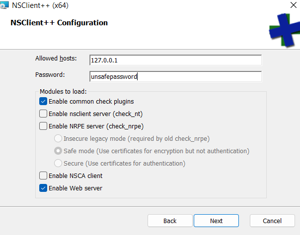
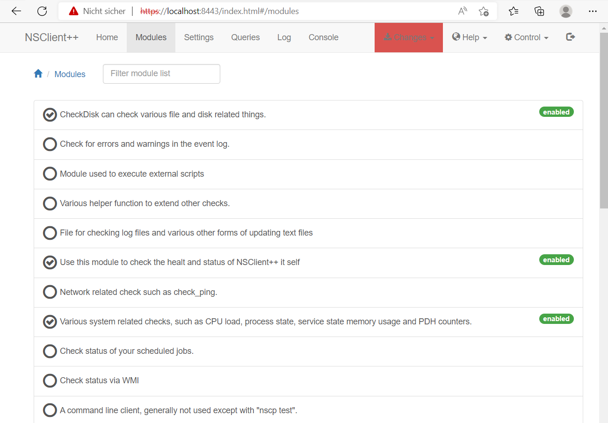
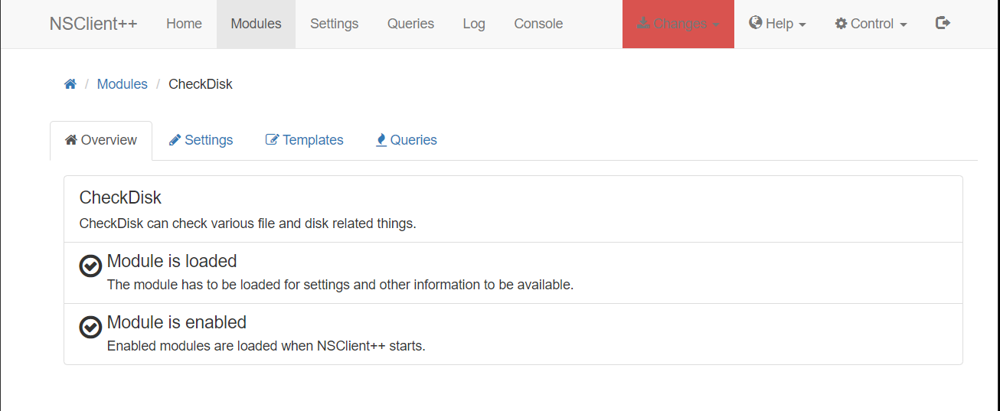
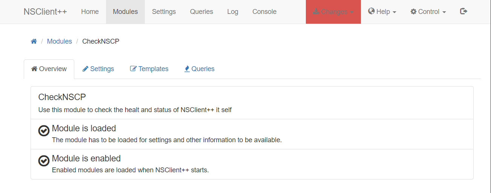
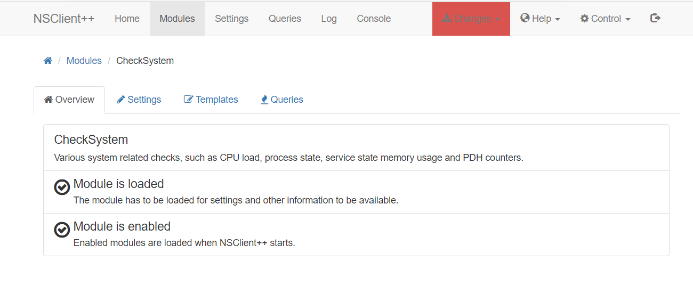
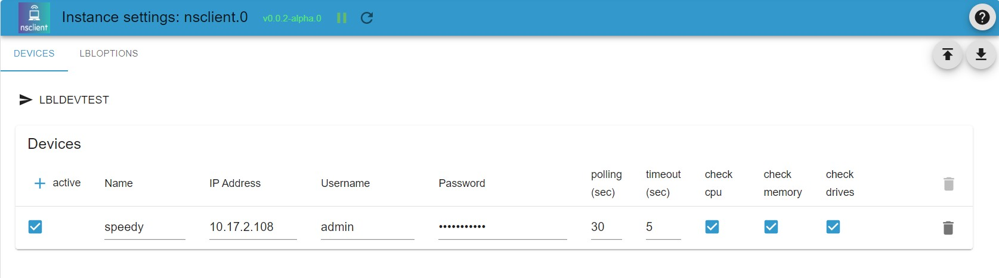

# Настроить и использовать адаптер NSCLIENT
## Общая информация и функции
Этот адаптер обеспечивает автоматический опрос клиентских систем, оснащенных агентом NsClient++, и сохраняет результаты в нескольких состояниях. Так (например) в ioBroker будут доступны следующие клиентские данные:

- Доступность системы
- Процент использования ЦП для нескольких временных диапазонов
- Загрузка памяти для нескольких временных диапазонов
- Дисковое пространство с абсолютными значениями и процентными значениями

Кроме того, каждая проверка возвращает двоичный статус и текстовое сообщение о статусе.

Этот адаптер поддерживает неограниченное количество устройств с настраиваемым интервалом опроса.

## Требования
Этот адаптер требует установки агента NsClient++ в целевой системе. Этот агент доступен для Windows (проверено с Windows 10 и Windows 11) и Linux. Программное обеспечение NsClient++ описано в [здесь](https://nsclient.org/) и доступно бесплатно.

__ВНИМАНИЕ:__ Требуемый агент nsclient активно не поддерживается, но стабильно работает на Win10/Win11 и используется в средах, основанных на мониторинге сети Nagios.

## Загрузите и установите агент NsClient++
### Загрузить программное обеспечение клиентского агента
__ВАЖНО:__ Обратите внимание, что программное обеспечение агента nsclient++ не разрабатывается и не поддерживается командой ioBroker. Команда разработчиков ioBroker не может нести никакой ответственности за любой ущерб или риски безопасности, вызванные программным обеспечением nslient++.

### Установка в системах Windows
Вы можете загрузить установочные комплекты nsclient [здесь](https://nsclient.org/download/). Выберите пакет, соответствующий вашей операционной системе.

* После загрузки программного обеспечения nsclient++ с [домашней страницы nsclient++](https://nsclient.org/) начните установку, запустив загруженный образ (например, NSCP-0.5.2.35-x64.msi).

* При появлении запроса выберите _универсальный инструмент мониторинга_

* Выберите _установка_ _тип_ _типичный_

* Добавьте IP-адреса хостов, которым должно быть разрешено подключение к агенту. Вы можете добавить список IP-адресов, разделенных запятыми. Подробности см. в [документации nsclient++](https://docs.nsclient.org/web/)

* Установите надежный пароль.

__ВАЖНО: nsclient сохраняет пароль в незашифрованном виде. Поэтому никогда не используйте пароль, используемый для любого другого доступа, кроме агента nsclient++.__

* Включите _common_ _check_ _plugins_ и _WEB_ _server_ (другие модули не требуются для доступа к ioBroker, но не стесняйтесь устанавливать их, если предполагается другое использование).

* Разрешите продолжить установку и введите пароль администратора при запросе Windows.

* Перезагрузите систему для завершения установки (да, это Windows).

### Установка в системах Linux
Дополнительную информацию можно найти в [домашняя страница nsclient++](https://nsclient.org).

## Конфигурация агента NsClient++
* Подключитесь к веб-интерфейсу nsclient++, открыв https://localhost:8443. Авторизуйтесь с помощью пароля, указанного при установке.

Вы можете найти описание веб-интерфейса в [в документации](https://docs.nsclient.org/web/)

* Убедитесь, что необходимые модули загружены и включены

См. список модулей на следующем изображении.

* Скорее всего вам нужно загрузить и активировать некоторые модули. Для этого нажмите на строку со списком модуля, чтобы открыть конфигурацию модуля. Проверьте кнопки _loaded_ и _activated_.

__Не забудьте сохранить изменения__

* Вы можете активировать другие модули, чтобы протестировать их

__ПРЕДУПРЕЖДЕНИЕ:__ Включение модулей, которые могут запускать сценарии, может привести к возникновению уязвимостей в системе безопасности целевой системы. Убедитесь, что вы понимаете, как работает nsclient++ и как избежать несанкционированного доступа, прежде чем включать такие модули. Адаптер ioBoker.nsclient не поддерживает действия, запускаемые в целевой системе.

## Настройка адаптера ioBroker.nsclient
Конфигурация адаптера ioBroker.nsclient структурирована на нескольких вкладках. (В настоящее время используется только вкладка _Devices_.)

### Вкладка _Устройства_

Все устройства, которые будут отслеживаться экземпляром, настроены в файле _Devices_. Вы можете добавить новую строку таблицы со следующими данными для каждого устройства:

| Параметры | тип | Описание | Комментарий |
|----------|-------------|----------------------|------------------------------------|
| активный | логический | если установлено значение true, используется устройство | Это можно использовать для отключения одного устройства |
| имя | Текст | Имя устройства | Параметр используется для создания имени точек данных. Имена должны быть уникальными и не могут заканчиваться точкой или последовательными точками. |
| IP-адрес | Текст | IP-адрес (IPv4 или IPv6) или доменное имя с дополнительным номером порта | |
| Имя пользователя | Текст | Имя пользователя для аутентификации | Примечание: nsclient требует, чтобы имя пользователя в настоящее время было _admin_ |
| пароль | Текст | Пароль для аутентификации | |
| Запрос (сек) | номер | Интервал опроса в секундах | |
| Время ожидания (сек) | номер | Время ожидания обработки в секундах | |
| Проверить ЦП | логический | Включить проверки, связанные с процессором | |
| Проверить память | логический | Включить проверки, связанные с памятью | |
| Проверить диски | логический | Включить проверки для каждого диска | |

Объекты состояния ioBroker создаются после успешного запроса целевого устройства.

## Changelog
<!--
    Placeholder for the next version (at the beginning of the line):
    ### **WORK IN PROGRESS**
-->
### 0.1.1 (2022-09-25)
* (mcm1957) initial release for testing

## License
MIT License

Copyright (c) 2022 mcm1957 <mcm57@gmx.at>

Permission is hereby granted, free of charge, to any person obtaining a copy
of this software and associated documentation files (the "Software"), to deal
in the Software without restriction, including without limitation the rights
to use, copy, modify, merge, publish, distribute, sublicense, and/or sell
copies of the Software, and to permit persons to whom the Software is
furnished to do so, subject to the following conditions:

The above copyright notice and this permission notice shall be included in all
copies or substantial portions of the Software.

THE SOFTWARE IS PROVIDED "AS IS", WITHOUT WARRANTY OF ANY KIND, EXPRESS OR
IMPLIED, INCLUDING BUT NOT LIMITED TO THE WARRANTIES OF MERCHANTABILITY,
FITNESS FOR A PARTICULAR PURPOSE AND NONINFRINGEMENT. IN NO EVENT SHALL THE
AUTHORS OR COPYRIGHT HOLDERS BE LIABLE FOR ANY CLAIM, DAMAGES OR OTHER
LIABILITY, WHETHER IN AN ACTION OF CONTRACT, TORT OR OTHERWISE, ARISING FROM,
OUT OF OR IN CONNECTION WITH THE SOFTWARE OR THE USE OR OTHER DEALINGS IN THE
SOFTWARE.
