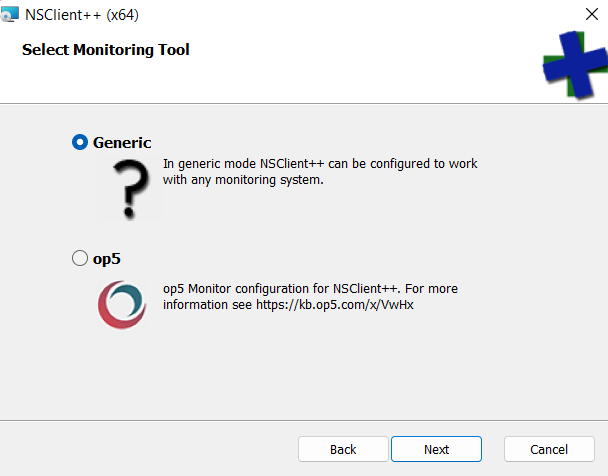
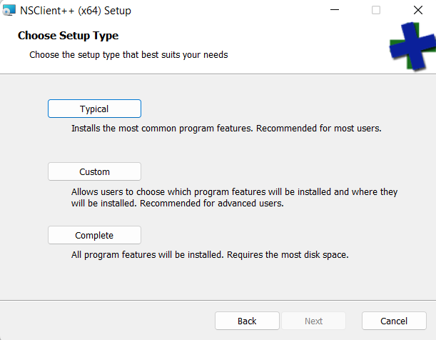
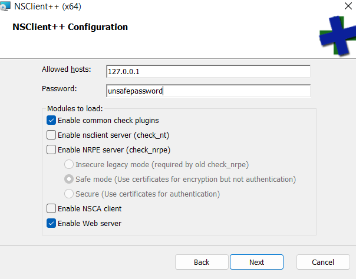
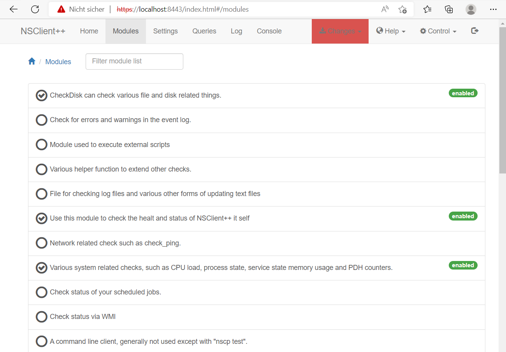
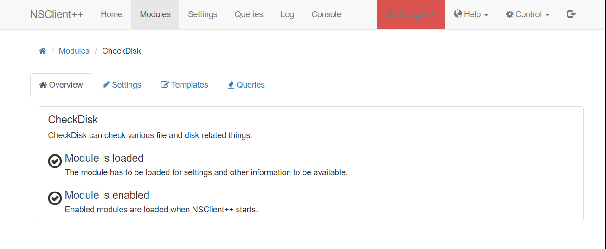
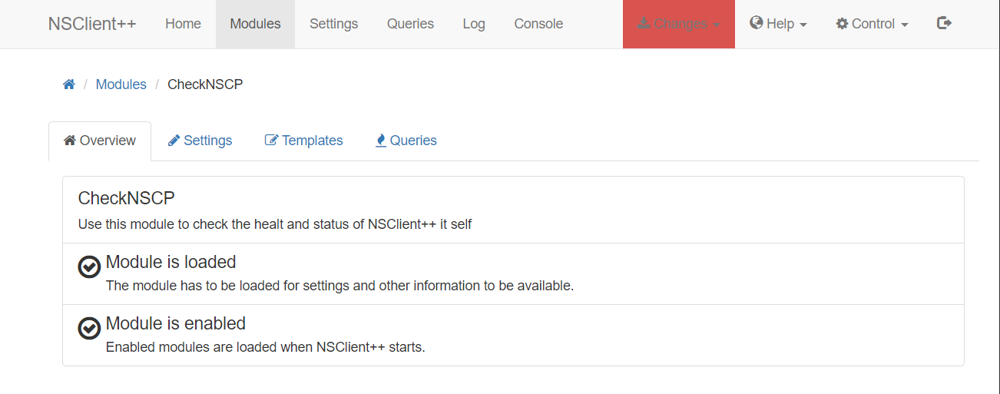
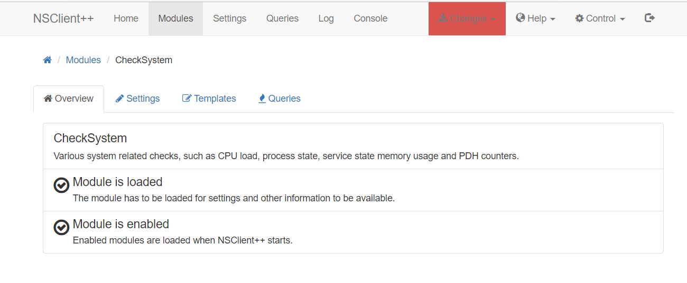
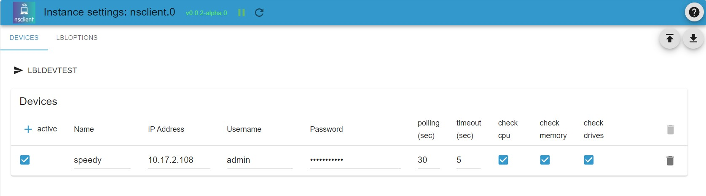

# Настройка и использование адаптера NSCLIENT

## Общая информация и функции

Этот адаптер позволяет автоматически запрашивать данные из клиентских систем, оснащенных агентом NsClient++, и сохранять результаты в нескольких состояниях. Например, в ioBroker будут доступны следующие данные о клиенте:

- Доступность системы
- Загрузка ЦП в процентах за несколько периодов времени
- Загрузка памяти в нескольких временных интервалах
- Объем памяти, указанный в абсолютных значениях и в процентах.

Кроме того, каждая проверка возвращает двоичный статус и текстовое сообщение о состоянии.

Этот адаптер поддерживает неограниченное количество устройств с настраиваемым интервалом опроса.

## Требования

Для работы этого адаптера требуется установка агента NsClient++ на целевую систему. Этот агент доступен для Windows (протестировано с Windows 10 и Windows 11) и Linux. Программное обеспечение NsClient++ описано и доступно бесплатно [здесь](https://nsclient.org/) .

**ВНИМАНИЕ:** Требуемый агент nsclient больше не поддерживается, но стабильно работает под Windows 10/Windows 11 и используется в средах, основанных на сетевом мониторинге Nagios.

## Загрузите и установите агент NsClient++

### Загрузите программное обеспечение клиент-агента.

**ВАЖНО:** Обратите внимание, что программное обеспечение агента nsclient++ не разрабатывается и не поддерживается командой ioBroker. Команда разработчиков ioBroker не несет ответственности за любой ущерб или риски безопасности, вызванные программным обеспечением nsclient++.

### Установка в системах Windows

Скачать установочные пакеты nsclient можно [здесь](https://nsclient.org/download/) . Пожалуйста, выберите пакет, соответствующий вашей операционной системе.

- После загрузки программного обеспечения nsclient++ с [домашней страницы nsclient++](https://nsclient.org/) начните установку, запустив загруженный образ (например, NSCP-0.5.2.35-x64.msi).

- При появлении запроса выберите _«универсальный инструмент мониторинга»_ .

- Выберите _типичный_ _тип_ _установки_

- Добавьте IP-адреса хостов, которым должно быть разрешено подключаться к агенту. Вы можете добавить список IP-адресов, разделенных запятыми. Подробности см. [в документации nsclient++](https://docs.nsclient.org/web/) .

- Установите надежный пароль.\
  &#x20;**ВАЖНО: nsclient хранит пароль в незашифрованном виде. Поэтому никогда не используйте пароль, который используется для доступа к чему-либо, кроме агента nsclient++.**

- Активируйте _плагины_ _для проверки_ _общего_ доступа и _веб-_ _сервер_ (другие модули не требуются для доступа к ioBroker, но вы можете установить их, если планируете использовать их для других целей).

- Разрешите продолжение установки и введите пароль администратора, когда Windows запросит это.

- Перезагрузите систему, чтобы завершить установку (да, это Windows).

### Установка в системах Linux

Дополнительную информацию можно найти на [домашней странице nsclient++](https://nsclient.org) .

## Конфигурация агента NsClient++

- Подключитесь к веб-интерфейсу nsclient++, открыв <https://localhost:8443> . Авторизуйтесь, используя пароль, предоставленный во время установки. Описание веб-интерфейса можно найти [в документации](https://docs.nsclient.org/web/) .

- Убедитесь, что необходимые модули загружены и активированы. Список модулей представлен на следующем изображении.

- Скорее всего, вам потребуется загрузить и активировать некоторые модули. Для этого щелкните по строке модуля, чтобы открыть его конфигурацию. Установите флажки _«Загружено»_ и _«Активировано»_ . **Не забудьте сохранить изменения.**

- Вы можете активировать и другие модули для их тестирования.\
  &#x20;**ВНИМАНИЕ:** Включение модулей, способных выполнять скрипты, может создать риски безопасности в целевой системе. Перед включением таких модулей убедитесь, что вы понимаете принцип работы nsclient++ и способы предотвращения несанкционированного доступа. Адаптер ioBoker.nsclient не поддерживает действия, запускаемые в целевой системе.

## Настройка адаптера ioBroker.nsclient

Конфигурация адаптера ioBroker.nsclient структурирована в нескольких вкладках. (В настоящее время используется только вкладка _«Устройства_ ».)

### вкладка _«Устройства»_

_Настройки устройств_ используются для конфигурации всех устройств, которые должен отслеживать данный экземпляр. Для каждого устройства можно добавить новую строку в таблицу со следующими данными:

| параметр              | тип        | Описание                                                                             | комментарий                                                                                                                                |
| --------------------- | ---------- | ------------------------------------------------------------------------------------ | ------------------------------------------------------------------------------------------------------------------------------------------ |
| активный              | логический | Если установлено значение true, устройство будет использоваться.                     | Это можно использовать для отключения отдельного устройства.                                                                               |
| имя                   | текст      | Название устройства                                                                  | Этот параметр используется для создания имен точек данных. Имена должны быть уникальными и не могут заканчиваться точкой или серией точек. |
| IP-адрес              | текст      | IP-адрес (IPv4 или IPv6) или доменное имя с необязательным добавлением номера порта. |                                                                                                                                            |
| имя пользователя      | текст      | Имя пользователя для аутентификации                                                  | Примечание: для работы nsclient требуется, чтобы имя пользователя в данный момент было _admin._                                            |
| пароль                | текст      | Пароль для аутентификации                                                            |                                                                                                                                            |
| запрос (сек.)         | число      | Интервал опроса в секундах                                                           |                                                                                                                                            |
| Время ожидания (сек.) | Число      | Время обработки истекло в секундах                                                   |                                                                                                                                            |
| Проверьте процессор   | логический | Включить проверки, связанные с процессором                                           |                                                                                                                                            |
| Проверка памяти       | логический | Активировать проверки, связанные с памятью.                                          |                                                                                                                                            |
| Проверьте диски       | логический | Включить проверки, связанные с диском.                                               |                                                                                                                                            |

Объекты состояния IoBroker создаются после успешного запроса к целевому устройству.

## Changelog
<!--
    Placeholder for the next version (at the beginning of the line):
    ### **WORK IN PROGRESS**
-->
### 0.3.0 (2025-05-02) 
* (mcm1957) Adapter requires node.js 20 or newer now
* (mcm1957) Adapter requires js-controller 6.0.11 and admin 7.4.10 now
* (mcm1957) Dependencies have been updated

### 0.2.3 (2024-03-12)
* (mcm1957) Dependencies have been updated

### 0.2.2 (2023-12-10)
* (mcm1957) Sentry has been activated.

### 0.2.1 (2023-12-10)
* (mcm1957) Adapter has been moved to mcm4iob organization.
* (mcm1957) Dependencies have been updated

### 0.2.0 (2023-09-11)
* (mcm1957) This adapter requires node 18 or newer now
* (mcm1957) Dependencies have been updated

### 0.1.2 (2022-12-03)
* (mcm1957) missing config data has been added to io-package.json (#15)
* (mcm1957) timer functions have been replaced with iob adapter versions (#22)
* (mcm1957) support for sentry has been added (#23)

### 0.1.1 (2022-09-25)
* (mcm1957) initial release for testing

## License
MIT License

Copyright (c) 2022-2025 mcm1957 <mcm57@gmx.at>

Permission is hereby granted, free of charge, to any person obtaining a copy
of this software and associated documentation files (the "Software"), to deal
in the Software without restriction, including without limitation the rights
to use, copy, modify, merge, publish, distribute, sublicense, and/or sell
copies of the Software, and to permit persons to whom the Software is
furnished to do so, subject to the following conditions:

The above copyright notice and this permission notice shall be included in all
copies or substantial portions of the Software.

THE SOFTWARE IS PROVIDED "AS IS", WITHOUT WARRANTY OF ANY KIND, EXPRESS OR
IMPLIED, INCLUDING BUT NOT LIMITED TO THE WARRANTIES OF MERCHANTABILITY,
FITNESS FOR A PARTICULAR PURPOSE AND NONINFRINGEMENT. IN NO EVENT SHALL THE
AUTHORS OR COPYRIGHT HOLDERS BE LIABLE FOR ANY CLAIM, DAMAGES OR OTHER
LIABILITY, WHETHER IN AN ACTION OF CONTRACT, TORT OR OTHERWISE, ARISING FROM,
OUT OF OR IN CONNECTION WITH THE SOFTWARE OR THE USE OR OTHER DEALINGS IN THE
SOFTWARE.