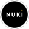

# IoBroker.nuki 
Этот адаптер ioBroker позволяет контролировать и отслеживать [Умный замок Nuki](https://nuki.io/de/) с помощью API Nuki Bridge.

## Требования
* Мост Nuki (аппаратный или программный).
* Умный замок Nuki и/или открывалка Nuki.
* Работающий экземпляр ioBroker.

## Использование
Каждый экземпляр адаптера Nuki представляет собой мост Nuki. При создании экземпляра просто введите IP-адрес, порт и токен вашего моста Nuki. Имя необязательно и будет сгенерировано автоматически, если оставить его пустым. Флажок «использовать обратный вызов» и значение «порт обратного вызова в ioBroker» необязательны и могут быть установлены для использования функции обратного вызова Nuki. После сохранения экземпляра будет создано устройство моста с каналом для каждого замка Nuki, подключенного к указанному мосту Nuki. Каналы предоставляют текущее состояние замка Nuki в качестве выходных параметров:

* batteryCritical: Индикатор низкого заряда батареи
* deviceType: Тип устройства Nuki (Smart Lock или Opener)
* режим: Режим работы устройства Nuki
* doorState: Текущее (числовое) состояние датчика двери (собственно Nuki)
* lockState: Индикатор того, заблокирован ли Nuki (только Nuki Smart Lock)
* состояние: Текущее (числовое) состояние блокировки (собственное Nuki)
* временная метка: Последнее обновление

Кроме того, каналы предоставляют входные параметры, которые обеспечивают базовое управление замком Nuki:

* действие: числовой код действия для установки состояния Nuki (собственно Nuki)

Допустимые входные значения для блокировок:

0 (бездействие) 1 (разблокировать) 2 (заблокировать) 3 (разблокировать) 4 (заблокировать и запустить) 5 (заблокировать и запустить с разблокировкой)

* lockAction: Переключатель для блокировки/разблокировки Nuki (true = разблокировать; false = заблокировать)
* openAction: Кнопка для разблокировки Nuki
* openLocknGoAction: Кнопка для разблокировки и блокировки Nuki через несколько секунд
* unlockLocknGoAction: Кнопка для разблокировки и блокировки Nuki через несколько секунд

Допустимые входные значения для открывателей:

0 (бездействие) 1 (активировать rto) 2 (деактивировать rto) 3 (активация электрозащелки) 4 (активировать непрерывный режим) 5 (деактивировать непрерывный режим)

* rtoAction: Переключатель для активации/деактивации функции «Звонок для открытия» (true = активировать; false = деактивировать)
* openAction: Кнопка для приведения в действие электрозащелки
* cmActiveAction: Кнопка для активации непрерывного режима
* cmDeactiveAction: Кнопка для отключения непрерывного режима

## Дополнительная информация
Как получить свой токен мостов:

* Вызовите http://< bridge_ip >:< bridge_port >/auth из любого браузера в вашей локальной сети -> светодиод моста включится
* Нажмите кнопку моста в течение 30 секунд.
* Результат вызова браузера должен быть примерно таким:

{ "token": “token123”, "success": true } Функция обратного вызова:

Если используется функция обратного вызова, адаптер попытается автоматически установить обратный вызов на мосту Nuki при сохранении экземпляра. Когда экземпляр выгружается, обратный вызов снова удаляется. Все состояния Nuki будут поддерживаться мостом Nuki в актуальном состоянии, пока активирован обратный вызов.
Обратные вызовы можно устанавливать и удалять из любого браузера с помощью следующих URL-адресов:

Набор:

* http://< bridge_ip >:< bridge_port >/callback/add?url=http%3A%2F%2F< host_ip >%3A< host_port >%2Fapi%2Fnuki&token=< bridgeToken >

Удалять:

* http://< bridge_ip >:< bridge_port >/callback/remove?id=< callback_id >&token=< bridgeToken >

## Обновлять
При обновлении с 1.0.x до 1.1.0 или выше рекомендуется удалить все экземпляры старой версии перед установкой новой версии. Обратите внимание, что изменения версии, большие, чем на уровне патча (-> изменение только последней цифры), всегда могут содержать изменения точек данных, например, с 1.1.2 до 1.1.4.
При обновлении до 2.x токен необходимо ввести снова.

## Changelog

### 2.0.1
* (smaragdschlange) update: dependencie updates

### 2.0.0
* (simatec) jsonConfig added
* (simatec) dependency updated
* (simatec) devdependency updated
* (simatec) translate added
* (simatec) test and release added
* (simatec) Release Script added
* (simatec) Remove Travis

### 1.7.0
* (smaragdschlange) update: implementation of latest bridge API changes (battery charge state)

### 1.6.0
* (smaragdschlange) improvement: support for Nuki Smart Door and Nuki Smart Lock 3.0 (Pro)

### 1.5.0
* (smaragdschlange) bug fix: compatibility with jscontroller 3.3.13

### 1.4.4
* (smaragdschlange) update: changes to comply with admin 5.x.x requirements

### 1.4.3
* (smaragdschlange) update: dependency axios to >=0.21.1

### 1.4.2
* (smaragdschlange) bug fix: common.dataSource type had an invalid type

### 1.4.1
* (smaragdschlange) bug fix: references fixed

### 1.4.0
* (smaragdschlange) improvement: support of keypad battery state 
* (smaragdschlange) improvement: support of ring action states for opener

### 1.3.1
* (smaragdschlange) bug fix: some objects did not get updated

### 1.3.0
* (smaragdschlange) improvement: support of doorsensor states

### 1.2.3
* (smaragdschlange) bug fix: convert to template strings

### 1.2.2
* (smaragdschlange) bug fix: get device type by state name when not provided by bridge (software bridge)

### 1.2.0
* (smaragdschlange) improvement: support of hashed token (set to standard)
* (smaragdschlange) improvement: better use of delay before requests in order to prevent null messages

### 1.1.5
* (smaragdschlange) bug fix: clear all timeouts on unload

### 1.1.4
* (smaragdschlange) bug fix: object was not defined

### 1.1.3
* (smaragdschlange) bug fix: deviceType was undefined in case of Opener
* (smaragdschlange) bug fix: Opener action was not set

### 1.1.2
* (smaragdschlange) improvement: added bridge type as object
* (smaragdschlange) bug fix: force reset deviceType on adapter restart

### 1.1.1
* (smaragdschlange) bug fix: default to Nuki Lock when deviceType unknown

### 1.1.0
* (smaragdschlange) improvement: support for Nuki Opener

### 1.0.7
* (smaragdschlange) bug fix: impact on other Nuki-connected gateways

### 1.0.6
* (smaragdschlange) dependencies update

### 1.0.5
* (ldittmar81) add gulp auto translation
* (smaragdschlange) add license

### 1.0.4
* (smaragdschlange) improvement: added Support for Compact mode (js-Controller 2.0 Feature)

### 1.0.3
* (smaragdschlange) bug fix: action buttons were not working properly

### 1.0.1
* (smaragdschlange) version synch

### 1.0.0
* (smaragdschlange) initial release on npm

### 0.2.0
* (smaragdschlange) periodic state updates added
* (smaragdschlange) restructure objects

### 0.1.3
* (smaragdschlange) timestamp bug fixed

### 0.1.2
* (smaragdschlange) minor bugfixes
* (smaragdschlange) added delay before each Nuki request to avoid null responses

### 0.1.1
* (smaragdschlange) callback will be removed when instance is unloading

### 0.1.0
* (smaragdschlange) callback finally working
* (smaragdschlange) added another State

### 0.0.6
* (smaragdschlange) additional states/actions and improved compatibility (callback still not completely working)

### 0.0.5
* (smaragdschlange) added support for nuki bridge callback (web server still to be added)

### 0.0.4
* (smaragdschlange) added input parameter for lock actions

### 0.0.3
* (smaragdschlange) bug fixes and restructure

### 0.0.2
* (smaragdschlange) added input parameters

### 0.0.1
* (smaragdschlange) initial release

## License
The MIT License (MIT)

Copyright (c) 2018-2024 Smaragdschlange <smaragdschlange@gmx.de>

Permission is hereby granted, free of charge, to any person obtaining a copy
of this software and associated documentation files (the "Software"), to deal
in the Software without restriction, including without limitation the rights
to use, copy, modify, merge, publish, distribute, sublicense, and/or sell
copies of the Software, and to permit persons to whom the Software is
furnished to do so, subject to the following conditions:

The above copyright notice and this permission notice shall be included in
all copies or substantial portions of the Software.

THE SOFTWARE IS PROVIDED "AS IS", WITHOUT WARRANTY OF ANY KIND, EXPRESS OR
IMPLIED, INCLUDING BUT NOT LIMITED TO THE WARRANTIES OF MERCHANTABILITY,
FITNESS FOR A PARTICULAR PURPOSE AND NONINFRINGEMENT. IN NO EVENT SHALL THE
AUTHORS OR COPYRIGHT HOLDERS BE LIABLE FOR ANY CLAIM, DAMAGES OR OTHER
LIABILITY, WHETHER IN AN ACTION OF CONTRACT, TORT OR OTHERWISE, ARISING FROM,
OUT OF OR IN CONNECTION WITH THE SOFTWARE OR THE USE OR OTHER DEALINGS IN
THE SOFTWARE.