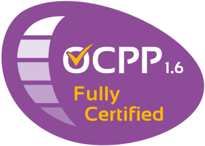

# IoBroker.ocpp
**Тесты:** 

## Отказ от ответственности
Разработчики этого модуля никоим образом не поддерживаются и не связаны с Open Charge Alliance или какими-либо связанными дочерними компаниями, логотипами или товарными знаками.

## Адаптер OCPP для ioBroker
Адаптер для подключения настенной коробки с поддержкой OCPP 1.6

## Changelog
<!--
	Placeholder for the next version (at the beginning of the line):
	### **WORK IN PROGRESS**
-->

### **WORK IN PROGRESS**
* (foxriver76) set charging profiles on stack level 0, because some chargers do not support higher levels

### 0.3.0 (2022-01-18)
* (foxriver76) if wallbox offers multiple meter values they will now alle be represented
* (foxriver76) admin is no longer needed on the same host (multihost)

### 0.2.0 (2022-01-09)
* (foxriver76) close server on unload for compact mode
* (foxriver76) fixed the message type
* (foxriver76) limit state is now in Ampere and should work now

### 0.1.1 (2022-01-09)
* (foxriver76) we are requesting config of new clients too
* (foxriver76) we fixed a bug with limitState not respected on `startTransaction`
* (foxriver76) make sure we use no outdated connection

### 0.1.0 (2022-01-08)
* (foxriver76) small optimizations
* (foxriver76) updated dependencies

### 0.0.10 (2022-01-08)
* (foxriver76) fixed error on sending commands if device name containts dots
* (foxriver76) we also log repsonse errors from now on

### 0.0.9 (2022-01-08)
* (foxriver76) switch to updated OCPP fork
* (foxriver76) minor optimizations

### 0.0.8 (2021-11-15)
* (foxriver76) we now replace dots in device names by underscores

### 0.0.7 (2021-10-30)
* (foxriver76) added possibility to limit the charging process to given Wh if supported by ChargePoint

### 0.0.6 (2021-10-28)
* (foxriver76) we fixed name of availability state
* (foxriver76) we fixed unnecessary comma in `info.connection` state

### 0.0.5 (2021-10-28)
* (foxriver76) we added the meterValue state
* (foxriver76) we added state to control availability

### 0.0.4 (2021-10-27)
* (foxriver76) we can now enable/disable a charger

### 0.0.3 (2021-10-27)
* (foxriver76) initial release

## License
MIT License

Copyright (c) 2022 Moritz Heusinger <moritz.heusinger@gmail.com>

Permission is hereby granted, free of charge, to any person obtaining a copy
of this software and associated documentation files (the "Software"), to deal
in the Software without restriction, including without limitation the rights
to use, copy, modify, merge, publish, distribute, sublicense, and/or sell
copies of the Software, and to permit persons to whom the Software is
furnished to do so, subject to the following conditions:

The above copyright notice and this permission notice shall be included in all
copies or substantial portions of the Software.

THE SOFTWARE IS PROVIDED "AS IS", WITHOUT WARRANTY OF ANY KIND, EXPRESS OR
IMPLIED, INCLUDING BUT NOT LIMITED TO THE WARRANTIES OF MERCHANTABILITY,
FITNESS FOR A PARTICULAR PURPOSE AND NONINFRINGEMENT. IN NO EVENT SHALL THE
AUTHORS OR COPYRIGHT HOLDERS BE LIABLE FOR ANY CLAIM, DAMAGES OR OTHER
LIABILITY, WHETHER IN AN ACTION OF CONTRACT, TORT OR OTHERWISE, ARISING FROM,
OUT OF OR IN CONNECTION WITH THE SOFTWARE OR THE USE OR OTHER DEALINGS IN THE
SOFTWARE.