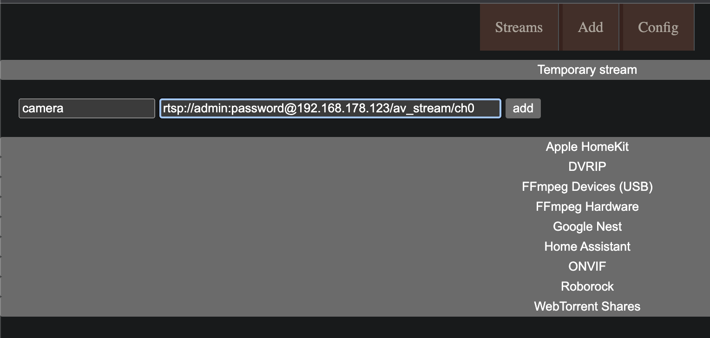
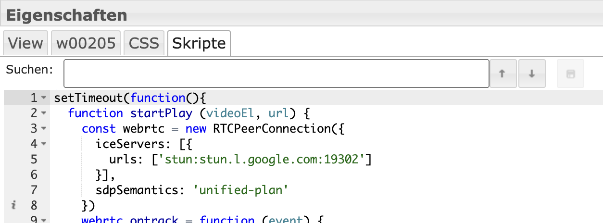

# IoBroker.onvif
**Тесты:** 

## Адаптер ONVIF для ioBroker
**Адаптер для камер ONVIF**

**Этот адаптер использует библиотеки Sentry для автоматического сообщения разработчикам об исключениях и ошибках кода.** Более подробную информацию и информацию о том, как отключить отчеты об ошибках, см. в [Документация плагина Sentry](https://github.com/ioBroker/plugin-sentry#plugin-sentry)! Отчеты Sentry используются начиная с js-controller 3.0.

## Видеокамеры
### Открытие:
В этом случае адаптер начнет работать с определенным именем и паролем для обнаружения, а также с другими настройками, установленными в камере. Falls die Kamera noch nicht unter Objekte hinzugefügt wurde.

В ден Einstellungen человек может умереть Discovery вручную. Falls die Kameras unterschiedliche Zugangsdaten haben müssen die weils eingegeben werden und eine Discovery durchgeführt werden. Im Log sieht man Подробности о процессе.

Эта камера не может быть использована в качестве объекта съемки.

### Мануэль Суш
Если камера не работает вручную, Discovery не работает. Вы должны указать диапазон IP-адресов и порты, а также вручную изменить настройки. Im Log sieht man Подробности о процессе.

## Датенпункте
onvif.0.IP_PORT.events События камеры wie z.b. Bewegungserkennung. Manchmal muss ein Event ausgelöst werden damit er angezeigt wird.

onvif.0.IP_PORT.general Общая информация о камерах

onvif.0.IP_PORT.info Информация о камере включена в адаптере, актуализирована или удалена.обновить

URL-адрес видео и снимка:

onvif.0.IP_PORT.infos.streamUris.MediaProfile_Channel1_MainStream.snapshotUrl.uri

onvif.0.IP_PORT.remote Управление камерой

onvif.0.IP_PORT.remote.refresh Актуализация информационных данных

onvif.0.IP_PORT.remote.gotoHomePosition PTZ-камера в настройках HomePosition

onvif.0.IP_PORT.remote.gotoPreset Номер предустановки PTZ-камеры

onvif.0.IP_PORT.remote.snapshot Выведите снимок экрана под onvif.0.IP_PORT.snapshot

## Сообщение
Адаптер nimmt Сообщение «снимок» entgegen und gibt ein Bild zurück

```javascript
sendTo("onvif.0", "snapshot", "192_168_178_100_80", (result) => {
  if (result) {
    sendTo("telegram.0", {
      text: result,
      type: "photo",
      caption: "Kamera 2",
    });
  }
});
```

## Изменения в Telegram
```javascript
on("onvif.0.192_168_178_100_80.events.RuleEngine/CellMotionDetector/Motion", (obj) => {
  if (obj.state.val === true) {
    sendTo("onvif.0", "snapshot", "192_168_178_100_80", (result) => {
      if (result) {
        sendTo("telegram.0", {
          text: result,
          type: "photo",
          caption: "Camera 2",
        });
      }
    });
  }
});
```

# Поток в vis einbinden
Включите потоковую передачу в Apple Homekit и убедитесь, что она будет прямо в вашей камере. Если эта функция не работает или hksv хорошо работает, если вы зашифровали ее в einem docker, установите и установите камеру с onvif и плагином Homekit.

## Go2rtsp Докер
Ein Stream работает нормально через поток rtsp. Умение с помощью движения глаз — это доступный ресурс и возможность просмотра. Ein Umwandlung в webrtc — это шнеллер и ресурсодержатель. Meine Empfehlung ist ein [go2rtsp](https://github.com/AlexxIT/go2rtc). Dazu должен использовать Docker от alexxit/go2rtc erstellt werden.
https://hub.docker.com/r/alexxit/go2rtc

Доступна любая версия с аппаратным обеспечением: https://github.com/AlexxIT/go2rtc/wiki/Hardware-acceleration

Для локальной установки go2rtc: https://forum.iobroker.net/post/1031526

```
 image: alexxit/go2rtc
    network_mode: host       # important for WebRTC, HomeKit, UDP cameras
    privileged: true         # only for FFmpeg hardware transcoding
    restart: unless-stopped  # autorestart on fail or config change from WebUI
    environment:
      - TZ=Europe/Berlin  # timezone in logs
    volumes:
      - "~/go2rtc:/config"   # folder for go2rtc.yaml file (edit from WebUI)
```

Это должен быть том для Pfad /config и сети, в которой находится хост.

Данн ist go2rtsp erreichbar über

```
http://IP:1984
```

Dann kann man ein Stream hinzufügen. URL-адрес Die Stream findet man z.B. до `onvif.0.IP_PORT.infos.streamUris.ProfileName.live_stream_tcp.uri`



### Потоковая передача как iFrame
Виджет `iFrame` для просмотра и других ссылок на потоковую передачу с сайта go2rtsp

`http://192.168.178.1:1984/stream.html?src=camera&mode=webrtc`

Unterlinks kann noch die Art des Players ausgewählt werden (Микрофон)

## Rtsp2Web Докер
Альтернатива — это [RTSPtoWeb](https://github.com/deepch/RTSPtoWeb) Docker. Dies ist aber von der Einrichtun komplizierter.
Dazu muss ein Docker von ghcr.io/deepch/rtsptoweb:latest erstellt werden.

<details>

```
docker run --name rtsp-to-web -v /YOURPATHFORCONFIG:/config --network host ghcr.io/deepch/rtsptoweb:latest
```

Это должен быть том для Pfad /config и сети, в которой находится хост.

Dann ist rtsptoweb erreichbar über

```
http://IP:8083
```

Dann kann man ein Stream hinzufügen. URL-адрес Die Stream findet man z.B. до `onvif.0.IP_PORT.infos.streamUris.ProfileName.live_stream_tcp.uri`


### Получение выгоды от идентификатора потока. Редактирование потока и добавление URL-адреса
`http://192.168.178.2:8083/pages/stream/edit/ddbdb583-9f80-4b61-bafa-613aa7a5daa5`

## Ручей Einzelnen в der Vis einfügen
Ознакомьтесь с вашим HTML-объектом. Данн в виджете в HTML на сервере rtsp2web с идентификатором потока внутри:


## **Wenn mehrere Stream hinzugefügt werden soll muss `webrtc-url` und `webrtc-video` в html и скрипт с новым идентификатором ersetzt werden z.B. `webrtc-url2` и `webrtc-video2`**
```html
<input
  type="hidden"
  name="webrtc-url"
  id="webrtc-url"
  value="http://192.168.0.2:8083/stream/ddbdb583-9f80-4b61-bafa-613aa7a5daa5/channel/0/webrtc"
/>

<video id="webrtc-video" autoplay muted playsinline controls style="max-width: 100%; max-height: 100%;"></video>
```

В этих виджетах для скриптов используются следующие скрипты:

```javascript
setTimeout(function () {
  function startPlay(videoEl, url) {
    const webrtc = new RTCPeerConnection({
      iceServers: [
        {
          urls: ["stun:stun.l.google.com:19302"],
        },
      ],
      sdpSemantics: "unified-plan",
    });
    webrtc.ontrack = function (event) {
      console.log(event.streams.length + " track is delivered");
      videoEl.srcObject = event.streams[0];
      videoEl.play();
    };
    webrtc.addTransceiver("video", { direction: "sendrecv" });
    webrtc.onnegotiationneeded = async function handleNegotiationNeeded() {
      const offer = await webrtc.createOffer();

      await webrtc.setLocalDescription(offer);

      fetch(url, {
        method: "POST",
        body: new URLSearchParams({ data: btoa(webrtc.localDescription.sdp) }),
      })
        .then((response) => response.text())
        .then((data) => {
          try {
            webrtc.setRemoteDescription(new RTCSessionDescription({ type: "answer", sdp: atob(data) }));
          } catch (e) {
            console.warn(e);
          }
        });
    };

    const webrtcSendChannel = webrtc.createDataChannel("rtsptowebSendChannel");
    webrtcSendChannel.onopen = (event) => {
      console.log(`${webrtcSendChannel.label} has opened`);
      webrtcSendChannel.send("ping");
    };
    webrtcSendChannel.onclose = (_event) => {
      console.log(`${webrtcSendChannel.label} has closed`);
      startPlay(videoEl, url);
    };
    webrtcSendChannel.onmessage = (event) => console.log(event.data);
  }

  const videoEl = document.querySelector("#webrtc-video");
  const webrtcUrl = document.querySelector("#webrtc-url").value;

  startPlay(videoEl, webrtcUrl);
}, 1000);
```



## Все потоки как iFrame
Альтернативно вы можете использовать обзор камеры в качестве Iframe: Виджет `iFrame` и другие элементы rtsp2web-сервера:

`http://192.168.0.2:8083/pages/multiview/full?controls`

</подробнее>

## FFMpeg Unterstützung
Когда камера будет сделана моментальный снимок, вы сможете сделать снимок с помощью ffmpeg или RTSP-потока.

## Сервер моментальных снимков в vis einbinden
Адаптер содержит сервер моментальных снимков без пароля и пароля. Сервер Dazu активируется в мгновенном режиме и может быть сделан моментальный снимок http://iobrokerIp:8095/CAMERAIP_PORT z.B. http://192.168.0.1:8095/192_168_0_1_80 abgerufen werden.

В виджете изображения можно найти и указать URL-адрес, который будет отображаться и обновляться автоматически

## Снимок в vis einbinden
Wenn möglich die snapshotUri verwenden z.B.
onvif.0.IP_PORT.infos.streamUris.MediaProfile_Channel1_MainStream.snapshotUrl.uri

### _Den Datenpunkt nicht als Stream verwenden, da sonst die Festplatte zu hohe Last Hat._
#### Den Datenpunkt актуализируется через onvif.0.IP_PORT.remote.snapshot
Den Datenpunkt onvif.0.IP_PORT.snapshot ein `String img src` элемент zuordnen

Если альтернатива не работает, `String img src` не работает.

Den Datenpunkt onvif.0.IP_PORT.snapshot как элемент `HTML` в поле зрения einfügen mit folgendem Inhalt

```javascript

```

Новый моментальный снимок события:

```javascript
on("onvif.0.192_168_178_100_80.events.RuleEngine/CellMotionDetector/Motion", (obj) => {
  if (obj.state.val === true) {
    setState("onvif.0.192_168_178_100_80.remote.snapshot", true, false);
  }
});
```

# Английский
## Добавить камеры
### Открытие:
При каждом запуске адаптера выполняется обнаружение с использованием имени пользователя и пароля, введенных в настройках, и предпринимается попытка входа в камеру. Если камера еще не добавлена в «Объекты».

Вы можете выполнить обнаружение вручную в настройках. Если камеры имеют разные учетные данные, вам необходимо ввести их и выполнить обнаружение. В журнале вы можете увидеть подробности процесса.

Чтобы камера снова обнаружилась, ее нужно просто удалить в разделе «Объекты».

### Ручной поиск
Камеры можно искать вручную, если Дискавери не работает. Для этого диапазон IP-адресов и порты необходимо ввести и выполнить вручную. В журнале вы можете увидеть подробную информацию о процессе.

## Точки данных
onvif.0.IP_PORT.events События камеры, например, обнаружение движения. Иногда вам нужно вызвать событие, чтобы увидеть его.

onvif.0.IP_PORT.general Общая информация о камерах

onvif.0.IP_PORT.infos Информация о камере обновляется только при запуске адаптера или при удаленном обновлении

URL-адрес видео и снимка:

onvif.0.IP_PORT.infos.streamUris.MediaProfile_Channel1_MainStream.snapshotUrl.uri

onvif.0.IP_PORT.remote Управление камерой

onvif.0.IP_PORT.remote.refresh Обновление информационных данных

onvif.0.IP_PORT.remote.gotoHomePosition Установить PTZ-камеру в исходное положение

onvif.0.IP_PORT.remote.gotoPreset Выбор номера предустановки PTZ-камеры.

onvif.0.IP_PORT.remote.snapshot Сохранить снимок в onvif.0.IP_PORT.snapshot

## Сообщение
Адаптер получает сообщение «снимок» и возвращает изображение.

```javascript
sendTo("onvif.0", "snapshot", "192_168_178_100_80", (result) => {
  if (result) {
    sendTo("telegram.0", {
      text: result,

      type: "photo",

      caption: "camera2",
    });
  }
});
```

## Сообщение о движении в Telegram
```javascript
on("onvif.0.192_168_178_100_80.events.RuleEngine/CellMotionDetector/Motion", (obj) => {
  if (obj.state.val === true) {
    sendTo("onvif.0", "snapshot", "192_168_178_100_80", (result) => {
      if (result) {
        sendTo("telegram.0", {
          text: result,

          type: "photo",

          caption: "Camera 2",
        });
      }
    });
  }
});
```

# Включаем поток в vis
Если поток должен отображаться в Apple Homekit, создайте камеру непосредственно в yahka. Если это не работает или требуется hksv, установите scrypted в докере и добавьте камеру с помощью плагина onvif и homekit.

## Go2rtsp Докер
Поток обычно предоставляется через поток rtsp. Преобразование с помощью Motion Eye очень ресурсозатратно и имеет задержку. Преобразование в webrtc происходит быстрее и экономит ресурсы. Моя рекомендация — [go2rtsp](https://github.com/AlexxIT/go2rtc). Для этого необходимо создать докер из alexxit/go2rtc.
https://hub.docker.com/r/alexxit/go2rtc

```
 image: alexxit/go2rtc
    network_mode: host # important for WebRTC, HomeKit, UDP cameras
    privileged: true # only for FFmpeg hardware transcoding
    restart: unless-stopped # autorestart on fail or config change from WebUI
    environment:
      - TZ=Europe/Berlin # timezone in logs
    volumes:
      - "~/go2rtc:/config" # folder for go2rtc.yaml file (edit from WebUI)
```

Том должен быть установлен для пути /config и сети в качестве хоста.

Тогда go2rtsp доступен через

```
http://IP:1984
```

Затем вы можете добавить поток. URL-адрес потока можно найти, например. под `onvif.0.IP_PORT.infos.streamUris.ProfileName.live_stream_tcp.uri`


### Вставить поток как iFrame
Добавьте виджет `iFrame` в Vis и используйте ссылку на поток из go2rtsp в качестве источника.

`http://192.168.178.1:1984/stream.html?src=camera&mode=webrtc`

## Rtsp2Web Докер
Альтернативой является Docker [RTSPtoWeb](https://github.com/deepch/RTSPtoWeb). Однако это сложнее настроить.
Docker необходимо создать из ghcr.io/deepch/rtsptoweb:latest.

<details>

```
docker run --name rtsp-to-web -v /YOURPATHFORCONFIG:/config --network host ghcr.io/deepch/rtsptoweb:latest
```

Том должен быть установлен для пути /config, а сеть должна быть установлена в качестве хоста.

Тогда с rtsptoweb можно связаться через

```
http://IP:8083
```

Затем вы можете добавить поток. URL-адрес потока можно найти, например. под `onvif.0.IP_PORT.infos.streamUris.ProfileName.live_stream_tcp.uri`


### Затем нам нужен идентификатор потока. Для этого отредактируйте поток и скопируйте идентификатор в URL-адресе.
`http://192.168.178.2:8083/pages/stream/edit/ddbdb583-9f80-4b61-bafa-613aa7a5daa5`

## Вставляем отдельный поток в визуализацию
Затем выберите объект HTML в визуализации. Затем введите сервер rtsp2web с идентификатором потока в виджете под HTML:


## **Если необходимо добавить несколько потоков, `webrtc-url` и `webrtc-video` в html и скрипте необходимо заменить новым идентификатором, например. `webrtc-url2` и `webrtc-video2`**
```html
<input
  type="hidden"
  name="webrtc-url"
  id="webrtc-url"
  value="http://192.168.0.2:8083/stream/ddbdb583-9f80-4b61-bafa-613aa7a5daa5/channel/0/webrtc"
/>

<video id="webrtc-video" autoplay muted playsinline controls style="max-width: 100%; max-height: 100%;"></video>
```

Добавьте этот скрипт в виджет в разделе «Скрипты»:

```javascript
setTimeout(function () {
  function startPlay(videoEl, url) {
    const webrtc = new RTCPeerConnection({
      iceServers: [
        {
          urls: ["stun:stun.l.google.com:19302"],
        },
      ],
      sdpSemantics: "unified-plan",
    });
    webrtc.ontrack = function (event) {
      console.log(event.streams.length + " track is delivered");
      videoEl.srcObject = event.streams[0];
      videoEl.play();
    };
    webrtc.addTransceiver("video", { direction: "sendrecv" });
    webrtc.onnegotiationneeded = async function handleNegotiationNeeded() {
      const offer = await webrtc.createOffer();

      await webrtc.setLocalDescription(offer);

      fetch(url, {
        method: "POST",
        body: new URLSearchParams({ data: btoa(webrtc.localDescription.sdp) }),
      })
        .then((response) => response.text())
        .then((data) => {
          try {
            webrtc.setRemoteDescription(new RTCSessionDescription({ type: "answer", sdp: atob(data) }));
          } catch (e) {
            console.warn(e);
          }
        });
    };

    const webrtcSendChannel = webrtc.createDataChannel("rtsptowebSendChannel");
    webrtcSendChannel.onopen = (event) => {
      console.log(`${webrtcSendChannel.label} has opened`);
      webrtcSendChannel.send("ping");
    };
    webrtcSendChannel.onclose = (_event) => {
      console.log(`${webrtcSendChannel.label} has closed`);
      startPlay(videoEl, url);
    };
    webrtcSendChannel.onmessage = (event) => console.log(event.data);
  }

  const videoEl = document.querySelector("#webrtc-video");
  const webrtcUrl = document.querySelector("#webrtc-url").value;

  startPlay(videoEl, webrtcUrl);
}, 1000);
```


## Все потоки в формате iFrame
Альтернативно вы также можете вставить обзор камеры в виде iframe: добавьте виджет `iFrame` и укажите сервер rtsp2web в качестве источника:

`http://192.168.0.2:8083/pages/multiview/full?controls`

</подробнее>

## Поддержка FFMpeg
Если камера не поддерживает снимки, ffmpeg создаст снимок из потока rtsp.

## Включить сервер снимков в vis
Адаптер предлагает сервер моментальных снимков без пароля. Активируйте сервер в настройках экземпляра, после чего вы сможете получить текущий снимок http://iobrokerIp:8095/CAMERAIP_PORT, например. http://192.168.0.1:8095/192_168_0_1_80.

Вставьте виджет изображения в визу, укажите URL-адрес в качестве источника и выберите время обновления.

## Включить снимок в Vis
Если возможно, используйте snapshotUri, например.

onvif.0.IP_PORT.infos.streamUris.MediaProfile_Channel1_MainStream.snapshotUrl.uri

### _Не используйте точку данных в качестве потока, иначе нагрузка на диск будет слишком высокой._
#### Обновите точку данных через onvif.0.IP_PORT.remote.snapshot
Назначьте элемент `String img src` точке данных onvif.0.IP_PORT.snapshot.

Или как альтернатива, если `String img src` не работает

Вставьте точку данных onvif.0.IP_PORT.snapshot как элемент `HTML` в визу со следующим содержимым.

```javascript

```

Создать новый снимок по событию:

```javascript
on("onvif.0.192_168_178_100_80.events.RuleEngine/CellMotionDetector/Motion", (obj) => {
  if (obj.state.val === true) {
    setState("onvif.0.192_168_178_100_80.remote.snapshot", true, false);
  }
});
```

## Обсуждения / Обсуждение и Fragen
<https://forum.iobroker.net/topic/63145/test-adapter-onvif-camera-v1-0-0>

## Changelog

<!--
    Placeholder for the next version (at the beginning of the line):
    ### **WORK IN PROGRESS**
-->

### 1.1.1 (2023-10-18)

- (mcm1957) Standard iobroker release environment has been added.
- (mcm1957) Some dependencies have been updated.

### 1.1.0

- (TA2k) Bugfixes

### 1.0.5

- Improve event handling

### 1.0.4

- (TA2k) Minor bugfixes and readme update for livestream in vis

### 1.0.3

- (TA2k) Minor bugfixes

### 1.0.2

- (TA2k) Fixed a reonnect and empty event bug

### 1.0.1

- (TA2k) initial new release

## License

MIT License

Copyright (c) 2023 TA2k <tombox2020@gmail.com>

Permission is hereby granted, free of charge, to any person obtaining a copy
of this software and associated documentation files (the "Software"), to deal
in the Software without restriction, including without limitation the rights
to use, copy, modify, merge, publish, distribute, sublicense, and/or sell
copies of the Software, and to permit persons to whom the Software is
furnished to do so, subject to the following conditions:

The above copyright notice and this permission notice shall be included in all
copies or substantial portions of the Software.

THE SOFTWARE IS PROVIDED "AS IS", WITHOUT WARRANTY OF ANY KIND, EXPRESS OR
IMPLIED, INCLUDING BUT NOT LIMITED TO THE WARRANTIES OF MERCHANTABILITY,
FITNESS FOR A PARTICULAR PURPOSE AND NONINFRINGEMENT. IN NO EVENT SHALL THE
AUTHORS OR COPYRIGHT HOLDERS BE LIABLE FOR ANY CLAIM, DAMAGES OR OTHER
LIABILITY, WHETHER IN AN ACTION OF CONTRACT, TORT OR OTHERWISE, ARISING FROM,
OUT OF OR IN CONNECTION WITH THE SOFTWARE OR THE USE OR OTHER DEALINGS IN THE
SOFTWARE.

```

```