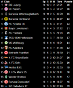
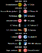
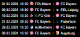
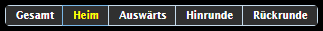

# Адаптер ioBroker для получения результатов футбольных матчей из OpenLigaDB
## Обзор
Адаптер для запроса данных об игре в футбол или других играх из `openligadb.de`

## Конфигурация
Добавьте экземпляр адаптера и щелкните по символу гаечного ключа. В форме вы можете добавить ярлык из лиги и сезона.
Пожалуйста, посетите `openligadb.de` для доступных лиг, сезонов и ярлыков. Если сезон распространяется на два года, пожалуйста, введите только год начала.

Пример данных для 1. Немецкая Бундлига — `shortcut = bl1 season = 2023`

Если вы сохранили и закрыли конфигурацию, через некоторое время после этого должны появиться новые точки данных для вашей лиги и сезона.

## Виджеты
На самом деле доступно 5 виджетов. Введите openligadb в фильтр виджетов

### Таблица 4


Das ist die klassische Tabellenansicht.\ Die Tabelle enthält verschiedene Spalten.

- Sp=Anzahl gespielter Spiele
- S=Осада
- U=Unentschieden
- N=Нидерлаген
- Tore=Торверхэлтнис
- Punkte=Punktestand

#### Таблица атрибутов
| Атрибут | Группа | Бесшрайбунг |
| ----------------------------------- | ------------------------ | ------------------------------------------------------------------------------------------------------------------------------------------------------------------------------------------------------------------------------------------------------------------------------------------------------------------------------------------------------------------------------------------------------------------------------------------ |
| все совпадения |                          | Hier muss ein Datenpunkt mit der Bezeichnung allmatches (Achtung im alten widget musste hier noch table ausgewählt werden) ausgewählt werden. Dieser Datenpunkt wird nach dem Anlegen der Liga/Season in der Konfiguration erzeugt, падает с конца Angaben gültig sind. Der Datenpunkt включает все матчи каждой лиги/сезона в формате JSON. Aus diesen Daten wird dann auf Basis des Modus die Tabellen die verschiedenen Modis berechnet. |
| текущий день |                          | Это действительно Datenpunk цу Wählen, der mit Currgameday benannt ist. Dieser Datenpunkt wird nach dem Anlegen der Liga/Season in der Konfiguration erzeugt, падает с конца Angaben gültig sind. Der Wert wird im Adaptor auf Basis des actuallen Datums berechnet. Der aktuelle Spieltag wechselt zur Hälfte der Zeit zwischen dem letzten Spiel des vorherigen Spieltags und dem ersten Spiel des folgenden Spieltages.                           |
| режим |                          | Listenauswahl в welchem Modus die Tabelle angezeigt werden soll zur Auswahl steht Gesamt (всего 1), Хайм (2 дома) или Аусвартс (3 на выезде), Хинрунде (4 раунда 1) или Рюкрунде (5 раунда 2).                                                                                                                                                                                                                                                        |
| режим_привязки |                          | Этот атрибут используется в режиме атрибута. Это недопустимо, поэтому модус таблицы может оказаться недопустимым для Binding gesteuert werden kann. В текстовых полях вы можете увидеть, как работает этот режим. Когда этот корректор будет выбран, если атрибуты не будут использоваться в режиме атрибутов. Ein Normalanwender sollte er nichts eintragen.                                       |
| максикон |                          | Maximale Größe des Manschaftsicons в x или y-Richtung.                                                                                                                                                                                                                                                                                                                                                                                   |
| короткое имя |                          | Anstatt des Manschaftsnamens wird der Kurzname angezeigt, падает в vorliegenden Daten gepflegt wurde.                                                                                                                                                                                                                                                                                                                           |
| тренд |                          | Auswahl, если Trendicons angezeigt werden sollen. Der Trend wird im Vergleich zum vorherigen Spieltag berechnet.                                                                                                                                                                                                                                                                                                                           |
| выделить |                          | Hier können ein oder mehrere Begriffe mit Semicolon (;) getrennt eingegeben werden die hervorgehoben werden sollen. Dieuche erfolgt nur in den Mannschaftsnamen. Имя ювелирного изделия можно использовать с HTML-тегами `<b>`. Подробное форматирование может быть выполнено в стиле CSS-класса «любимый». Вы можете выделить свой индивидуальный CSS-класс. Вгл. Глава дела |
| фильтр |                          | Hier können ein oder mehrere Begriffe mit с точкой с запятой (;) getrennt eingegeben werden anhand deren die Tabelle gefiltert dargestellt wird.                                                                                                                                                                                                                                                                                                    |
| iconup,icond,iconst | Иконки атрибутной группы | Hier können eigene Trendicons определенно верден.                                                                                                                                                                                                                                                                                                                                                                                            |
| showgameday в Attributgruppe | Erweiterte Einstellungen | Hier kann ein vom aktuellen Spieltag abweichender Tag zur Berechnung der Tablele eingegeben werden |
| число последних игр в группе атрибутов | Erweiterte Einstellungen | Wenn hier eine Zahl eingegeben wird, dann wird die Tabelle nur für die Anzahl von Spieltagen bis zum aktuell angezeigten Spieltag (в Abhängigkeit von currgameday und showgameday) berechnet Beispiel: Eingabe bei showgameday = 10 und Bei Lastgamecount=5: Die Tabelle wird nur für die Шпильтаж 6-10 бережнет (5 Шпилтаж) |

### Игры Gameday v2


Dieses Widget zeigt den Spieltag an. Je nach Einstellung cann immer der aktuelle, relativ zum aktuellen или ein bestimmter Spieltag angezeigt werden.
Darüber hinaus kann auch die Menge der angezeigten Spieltage festgelegt werden.
Лучший элемент оформления с **CSS-классом** также может быть верным:

| CSS-класс | Форматирование элементов обработки элементов | Анмеркунг |
| --------------- | ----------------------------------------------- | ------------------------------------------------------------------------------------------------------------------------------------------------------------------------- |
| любимый | im Anzeigekopf eines Spieltages (Datum/Uhrzeit) | Hier kann Datum und Uhrzeit formiert werden, когда умирает Lieblingsmannschaft am Spieltag spielt. ггфс. Это может быть связано с CSS-классом «todaygameheader». |
| любимый | Имя Манншафтса | Hier kann der Mannschaftsname entsprechend formiert werden.                                                                                                             |
| сегодняигра | Die komplette Zeile eines Spiels | Действительно, если вы играете на хойтигене, вы найдете статистику по тегам.                                                                                                               |
| сегоднязаголовок игры | im Anzeigekopf eines Spieltages (Datum/Uhrzeit) | Если вы хотите отметить, что данные Spieltagsdatum am heutigen Tag ist |

#### Описание CSS-классов
##### Beispiel Anzeigekopf eines Spieltages (Datum generell)
```css
.oldb-tt tr.favorite {
  color: yellow;
}
```

##### Beispiel Mannschaftsname
```css
.oldb-tt b.favorite {
  color: blue;
}
```

##### Beispiel Zeile eines Spiels
```css
.oldb-tt .todaygame {
  color: red;
}
```

##### Beispiel Anzeigekopf eines Spieltages (Datum heute)
```css
.oldb-tt .todaygameheader {
  color: lightgreen;
}
```

#### Атрибут игры Gamedays
| Атрибут | Группа | Бесшрайбунг |
| ---------------- | ------------------------ | -------------------------------------------------------------------------------------------------------------------------------------------------------------------------------------------------------------------------------------------------------------------------------------------------------------------------------------------------------------------------------------------------------------------------------------- |
| все совпадения |                          | Hier muss ein Datenpunkt mit der Bezeichnung allmatches ausgewählt werden. Dieser Datenpunkt wird nach dem Anlegen der Liga/Season in der Konfiguration erzeugt, падает с конца Angaben gültig sind. Der Datenpunkt enthält alle Spiele und Ergebnisse einer Liga/Season im JSON-Format Wenn der Spieltag am heutigen Tag statt findet, dann wird das Datum (todaygameheader) and das jeweilige Spiel (todaygame) с CSS-классом. |
| текущий день |                          | Это действительно Datenpunk цу Wählen, der mit Currgameday benannt is. Dieser Datenpunkt wird nach dem Anlegen der Liga/Season in der Konfiguration erzeugt, падает с конца Angaben gültig sind. Der Wert wird im Adaptor auf Basis des actuallen Datums berechnet. Der aktuelle Spieltag wechselt zur Hälfte der Zeit zwischen dem letzten Spielt der vorherigen Spieltags und dem ersten Spiel des folgenden Spieltages.                      |
| максикон |                          | Maximale Größe des Manschaftsicons в x или y-Richtung.                                                                                                                                                                                                                                                                                                                                                                               |
| короткое имя |                          | Anstatt des Manschaftsnamens wird der Kurzname angezeigt, падает в vorliegenden Daten gepflegt wurde.                                                                                                                                                                                                                                                                                                                       |
| шоуголы |                          | Информация о Торшютцене всегда актуальна.                                                                                                                                                                                                                                                                                                                                                                                       |
| выделить |                          | Hier können ein oder mehrere Begriffe mit с точкой с запятой (;) getrennt eingegeben werden, die hervorgehoben werden sollen. Dieuche erfolgt nur in den Mannschaftsnamen. Ювелирное имя будет доступно с HTML-тегами `<b>` eingefasst. Детальное форматирование может быть выполнено в стиле CSS-класса «любимый». Вы можете выделить свой индивидуальный CSS-класс. Вгл. Глава дела |
| шоу-день | Erweiterte Einstellungen | Wenn dieses Feld leer bleibt, wird immer der aktuelle Spieltag angezeigt.Trägt man eine позитивный Zahl ein, dann wird, Falls vorhanden, der ausgewählte Spieltag angezeigt.Trägt man eine negatial Zahl ein, dann wird relativ vom aktuellen Spieltag dieser angezeigt (bspw -1 entspricht dem vorherigen Spieltag) |
| показатьgamedaycount | Erweiterte Einstellungen | Üblicherweise bleibt dieses Feld leer orer enthält 1. Dadurch wird genau ein Spieltag angezeigt. Wird hier eine andere Zahl eingegeben, dann wird diese Anzahl von Spieltagen, ausgehend von der 'Einstellung в showgameday angezeigt.                                                                                                                                                                                                |
| шоу-будний день | Erweiterte Einstellungen | Zeigt vor dem Datum wahlweise den Wochentag an.                                                                                                                                                                                                                                                                                                                                                                                        |

##### Примеры
###### Добавление привязки в атрибуте showgameday
ггфс. kann dieses Feld auch über vis-binding berechnet und gefüllt werden.
Описание для относительных брехнетов Spieltag: |

```text
    Vorheriger Spieltag
    {a:openligadb.0.bl1.2019.currgameday;a-1} oder
    Nachfolgender Spieltag
    {a:openligadb.0.bl1.2019.currgameday;a+1}
```

Если привязка не отображается в режиме редактирования, вы можете получить Verwendung von Binding в режиме редактирования в реальном времени.

### Игры любимых клубов 2
 Diese Widget zeigt die nächsten Spiele deiner Lieblingsmannschaften aus ein oder mehrerer Ligen an. Во время Auswahl der Anzahl der anzuzeigenden Ligen, для каждой лиги есть отдельная группа конфигураций, в der die folgenden Einstellungen vorgenommen werden können.
Когда вы найдёте тег «Heutigen Tag», вы сможете найти драгоценности (сегодняшняя игра) с версией CSS-класса.

#### Пример
```css
.todaygame {
  color: red;
}

.todaygameheader {
  color: yellow;
}
```

#### Атрибут
| Атрибут | Группа | Бесшрайбунг |
| ---------------- | ---------- | -------------------------------------------------------------------------------------------------------------------------------------------------------------------------------------------------------------------------------------------------------------------------------------------------------------------------------------------------------------------------------------------------------------------------- |
| Анзал Лига | Всеобщий | Hier kann die Anzahl der abzufragenden Ligen eingetragen werden. Для игры в Лиге используется отдельная группа конфигураций.                                                                                                                                                                                                                                                                                           |
| максикон | Всеобщие | Maximale Größe des Manschaftsicons в x или y-Richtung.                                                                                                                                                                                                                                                                                                                                                                   |
| шоурезультат | Всеобщий | Auswahl, ob die Spielergebnisse, sofern bekannt, angezeigt werden sollen |
| показатьаббревиатура | Всеобщий | Um die Spiele der einzelnen Ligen unterscheiden zu können, kann man eine eigene Kürzung in der Jeweiligen Konfiguration eintragen. Hier kann ausgewählt werden, ob diese angezeigt werden soll.                                                                                                                                                                                                                            |
| шоу-будний день | Всеобщий | Zeigt vor dem Datum wahlweise den Wochentag an. Folgenden Attribute в Группе Лиги может быть использован в Abhängigkeit der Eingabe в **Anzahl Liga** mehrfach wiederholen.                                                                                                                                                                                                                                               |
| все совпадения | Лига | Hier muss ein Datenpunkt mit der Bezeichnung allmatches ausgewählt werden. Dieser Datenpunkt wird nach dem Anlegen der Liga/Season in der Konfiguration erzeugt, падает с конца Angaben gültig sind. Der Datenpunkt enthält alle Spiele und Ergebnisse einer Liga/Season in JSON-Format |
| текущий день | Лига | Hier muss ein Datenpunkt mit der Bezeichnung currgameday ausgewählt werden. Dieser Datenpunkt wird nach dem Anlegen der Liga/Season in der Konfiguration erzeugt, падает с конца Angaben gültig sind. Der Wert wird im Adaptor auf Basis des actuallen Datums berechnet. Der aktuelle Spieltag wechselt zur Hälfte der Zeit zwischen dem letzten Spielt der vorherigen Spieltags und dem ersten Spiel des folgenden Spieltages. |
| шоу-день | Лига | Когда он умирает, он смотрит на него, и он погружается в актуальную историю. Если вы считаете, что это позитивный шаг, то, возможно, вы упадете перед тем, как сделать это, чтобы получить дополнительную информацию. Если вы считаете, что это отрицательный результат, это может быть связано с актуальными событиями (bspw -1 entspricht dem vorherigen Spieltag) |
| показатьgamedaycount | Лига | Hier kann angegeben werden für wie viele Spieltage die Spiele angezeigt werden sollen. Когда вы просматриваете все остальные игры (макс. 9999 игр), вы можете увидеть все, что вам нужно, чтобы увидеть все игры, сделанные для игры в жанре Spieltagen, ausgehend von der 'Einstellung в showgameday angezeigt.                                                                             |
| короткое имя | Лига | Anstatt des Manschaftsnamens wird der Kurzname angezeigt, падает в vorliegenden Daten gepflegt wurde.                                                                                                                                                                                                                                                                                                           |
| аббревиатура | Лига | Abkürzung die für diese Liga angezeigt werden soll, sofern showabreviation ausgewählt wurde.                                                                                                                                                                                                                                                                                                                              |
| выделить | Лига | Hier können ein oder mehrere Begriffe mit с точкой с запятой (;) getrennt eingegeben werden, um die Lieblingsmanschaften zu finden. Dieuche erfolgt nur in den Mannschaftsnamen. Eine besondere Hervorhebung wie bei den anderen Widgets gibt es hier nicht.                                                                                                                                                                      |

#### Beispiele Игра любимых клубов
##### Beispiele für das Binding im Attribut showgameday Game of Favorite Clubs
ггфс. kann dieses Feld auch über vis-binding berechnet und gefüllt werden.
Beispiele für einen relativ berechneten Spieltag:

```css
    Vorheriger Spieltag
    {a:openligadb.0.bl1.2019.currgameday;a-1} oder
    Nachfolgender Spieltag
    {a:openligadb.0.bl1.2019.currgameday;a+1}
```

Если привязка не отображается в режиме редактирования, вы можете использовать функцию привязки в режиме редактирования в реальном времени.

### Сводная таблица 2
Этот виджет будет использоваться для всех игр и приложений в качестве Pivottabelle и

| CSS-класс | Форматирование элементов обработки элементов | Бейшпиль |
| ---------- | ---------------------------------------------- | -------- |
| любимый | Для того, чтобы подчеркнуть особое название Mannschaftsnamen |          |

#### Пример сводной таблицы
##### Для ярких моментов в Mannschaftsnamen
```css
.oldb-tt .favorite {
  color: yellow;
}
```

#### Сводная таблица атрибутов
| Атрибут | Группа | Бесшрайбунг |
| ------------------- | --------- | -------------------------------------------------------------------------------------------------------------------------------------------------------------------------------------------------------------------------------------------------------------------------------------------------------------------------------------------------------------------------------------------------------------------------- |
| все совпадения | Всеобщий | Hier muss ein Datenpunkt mit der Bezeichnung allmatches ausgewählt werden. Dieser Datenpunkt wird nach dem Anlegen der Liga/Season in der Konfiguration erzeugt, падает с конца Angaben gültig sind. Der Datenpunkt enthält alle Spiele und Ergebnisse einer Liga/Season in JSON-Format |
| текущий день | Всеобщий | Hier muss ein Datenpunkt mit der Bezeichnung currgameday ausgewählt werden. Dieser Datenpunkt wird nach dem Anlegen der Liga/Season in der Konfiguration erzeugt, падает с конца Angaben gültig sind. Der Wert wird im Adaptor auf Basis des actuallen Datums berechnet. Der aktuelle Spieltag wechselt zur Hälfte der Zeit zwischen dem letzten Spielt der vorherigen Spieltags und dem ersten Spiel des folgenden Spieltages. |
| максикон |           | Maximale Größe des Manschaftsicons в x или y-Richtung.                                                                                                                                                                                                                                                                                                                                                                   |
| сортировка4e |           | Einstellung nachdem sortiert werden soll.                                                                                                                                                                                                                                                                                                                                                                                  |
| короткое имя |           | Anstatt des Manschaftsnamens wird der Kurzname angezeigt, падает в vorliegenden Daten gepflegt wurde.                                                                                                                                                                                                                                                                                                           |
| выделить Аньфан |           | Это самое интересное было в Anfang der Tablele angezeigt.                                                                                                                                                                                                                                                                                                                                                                        |
| выделить |           | Hier können ein oder mehrere Begriffe mit с точкой с запятой (;) getrennt eingegeben werden, die hervorgehoben werden sollen. Dieuche erfolgt nur in den Mannschaftsnamen. Имя ювелирного изделия можно использовать с HTML-тегами `<b>`. Подробное форматирование может быть выполнено в стиле CSS-класса «любимый».                                                                                                                |

### Достигатели цели 2
Этот виджет доступен для всех пользователей

#### Атрибут Достижение цели
| Атрибут | Группа | Бесшрайбунг |
| --------------- | --------- | ------------------------------------------------------------------------------------------------------------------------------------------------------------------------------------------------------------------------------------------------------------------------------------------------------- |
| вратари | Всеобщий | Hier muss ein Datenpunkt mit der Bezeichnung ausgewählt werden. Dieser Datenpunkt wird nach dem Anlegen der Liga/Season in der Konfiguration erzeugt, падает с конца Angaben gültig sind. Der Datenpunkt включает в себя все события актуального сезона.                                             |
| максимум Анзал |           | Nur die angegebene Anzahl an Torjäger wird angezeigt.                                                                                                                                                                                                                                                   |
| сортировка |           | Auswahl der Sortierreihenfolge.                                                                                                                                                                                                                                                                         |
| Нур Основные моменты |           | Фильтр Einträge zum Higlightfilter всегда открыт.                                                                                                                                                                                                                                                   |
| выделить |           | Hier können ein oder mehrere Begriffe mit с точкой с запятой (;) getrennt eingegeben werden, die hervorgehoben werden sollen. Dieuche erfolgt nur in den Spielernamen. Ювелирное имя будет доступно с HTML-тегами `<b>` eingefasst. Детальное форматирование может быть выполнено в стиле CSS-класса «любимый». |

## Rezepte zur Wiederverwendung
### Steuerung des Tabellenmodus über Knöpfe
1. Таблица Ein Widgets v2 anlegen. и где он находится в der Hilfe, если он настроен
2. Bei Widgeteinstellungen в der Gruppe Sichtbarkeit bei Datenpunkt deinen

   erstellten Datenpunk eintragen

3. Виджеты копируются и не могут быть использованы, так что это включено

3 mal im view existiert

4. Bei Widgeteinstellungen в der Gruppe Sichtbarkeit den "Wert für die"

Bedingung dann bei jedem der 3 Widgets jeweils nur einen der folgenden Werte eintragen total,home,away

5. Дайте новый виджет: Список значений радиокнопок (находится в

   Стандартная установка von vis schon enthalten

6. В этом виджете в группе Allgemein deinen angelegten ObjectID auswählen
7. Bei Werte das folgende eintragen: всего;дома;в гостях (dies muss mit dem был

   du unter sichtbarkeit bei den widgets eingetragen hast zusammenpassen

8. Bei Texte das folgende eintragen: Gesamt;Heim;Auswärts
9. Будьте осторожны и проверяйте время выполнения
10. Когда все функции будут работать, вы можете использовать виджеты точно

    Леген, так что это wie eines aussieht

### Laufschrift einer Widgetzeile
Sieht nur schön aus, wenn nur eine oder wenige Zeilen angezeigt werden bspw bei dem FavGame-widget

`#w00000` — это идентификатор виджета, который можно использовать.

Расширять

```css
#w00000 .oldb-tt {
  max-width: 100vw; /* iOS braucht das */
  overflow: hidden;
}

#w00000 .oldb-tt tbody {
  display: inline-block;
  padding-left: 100%;
  animation: marquee 10s linear infinite;
}

/* Make it move */
@keyframes marquee {
  0% {
    transform: translateX(0);
  }
  100% {
    transform: translateX(-100%);
  }
}
```

### Нажмите +/- Кнопки управления, чтобы сразу перейти к списку
 Dazu ist für die Steuerung ein zusätzlicher Datenpunkt mit Typ Zahl/number anzulegen.
В этом случае используется javascript.0.bl1.spieltag.
Danke an bommel_030 Die 4 Steuerelemente zum importieren findet ihr здесь:

Расширять

```text
    [{"tpl":"_tplGroup","data":{"members":["w00065","w00066","g00001"],"visibility-cond":"==","visibility-val":1,"visibility-groups-action":"hide","attrCount":"1","signals-cond-0":"==","signals-val-0":true,"signals-icon-0":"/vis/signals/lowbattery.png","signals-icon-size-0":0,"signals-blink-0":false,"signals-horz-0":0,"signals-vert-0":0,"signals-hide-edit-0":false,"signals-cond-1":"==","signals-val-1":true,"signals-icon-1":"/vis/signals/lowbattery.png","signals-icon-size-1":0,"signals-blink-1":false,"signals-horz-1":0,"signals-vert-1":0,"signals-hide-edit-1":false,"signals-cond-2":"==","signals-val-2":true,"signals-icon-2":"/vis/signals/lowbattery.png","signals-icon-size-2":0,"signals-blink-2":false,"signals-horz-2":0,"signals-vert-2":0,"signals-hide-edit-2":false,"lc-type":"last-change","lc-is-interval":true,"lc-is-moment":false,"lc-format":"","lc-position-vert":"top","lc-position-horz":"right","lc-offset-vert":0,"lc-offset-horz":0,"lc-font-size":"12px","lc-font-family":"","lc-font-style":"","lc-bkg-color":"","lc-color":"","lc-border-width":"0","lc-border-style":"","lc-border-color":"","lc-border-radius":10,"lc-zindex":0},"widgetSet":null,"style":{"top":38.28125,"left":"663px","width":"141px","height":"37px"}},{"tpl":"tplIconInc","data":{"oid":"javascript.0.bl1.spieltag","repeat_delay":"800","repeat_interval":"800","src":"","step":"-1","minmax":"1","text":"-","g_last_change":false,"lc-type":"last-change","lc-is-interval":true,"lc-is-moment":false,"lc-format":"","lc-position-vert":"top","lc-position-horz":"right","lc-offset-vert":0,"lc-offset-horz":0,"lc-font-size":"12px","lc-font-family":"","lc-font-style":"","lc-bkg-color":"","lc-color":"","lc-border-width":"0","lc-border-style":"","lc-border-color":"","lc-border-radius":10,"lc-zindex":0,"name":"spieltag_minus","g_visibility":false,"visibility-cond":"==","visibility-val":1,"visibility-groups-action":"hide","g_gestures":false,"g_signals":false,"signals-cond-0":"==","signals-val-0":true,"signals-icon-0":"/vis/signals/lowbattery.png","signals-icon-size-0":0,"signals-blink-0":false,"signals-horz-0":0,"signals-vert-0":0,"signals-hide-edit-0":false,"signals-cond-1":"==","signals-val-1":true,"signals-icon-1":"/vis/signals/lowbattery.png","signals-icon-size-1":0,"signals-blink-1":false,"signals-horz-1":0,"signals-vert-1":0,"signals-hide-edit-1":false,"signals-cond-2":"==","signals-val-2":true,"signals-icon-2":"/vis/signals/lowbattery.png","signals-icon-size-2":0,"signals-blink-2":false,"signals-horz-2":0,"signals-vert-2":0,"signals-hide-edit-2":false},"style":{"left":"0%","top":"16.22%","background":"#303030","width":"17.73%","height":"67.57%","z-index":"50","font-family":"","background-color":"#303030","font-weight":"bolder","border-width":"2px","border-radius":"10px","box-shadow":"2px 2px 3px rgba(20, 20, 20, 50)","color":"white","border-style":"solid","border-color":"white","font-size":""},"widgetSet":"jqui","grouped":true,"groupName":"w00065"},{"tpl":"tplIconInc","data":{"oid":"javascript.0.bl1.spieltag","repeat_delay":"800","repeat_interval":"800","src":"","step":"+1","minmax":"34","text":"+","gestures-offsetX":0,"gestures-offsetY":"-1","signals-cond-0":"==","signals-val-0":true,"signals-icon-0":"/vis.0/VIS/lowbattery.png","signals-icon-size-0":0,"signals-blink-0":false,"signals-horz-0":0,"signals-vert-0":0,"signals-hide-edit-0":false,"signals-cond-1":"==","signals-val-1":true,"signals-icon-1":"/vis.0/VIS/lowbattery.png","signals-icon-size-1":0,"signals-blink-1":false,"signals-horz-1":0,"signals-vert-1":0,"signals-hide-edit-1":false,"signals-cond-2":"==","signals-val-2":true,"signals-icon-2":"/vis.0/VIS/lowbattery.png","signals-icon-size-2":0,"signals-blink-2":false,"signals-horz-2":0,"signals-vert-2":0,"signals-hide-edit-2":false,"g_last_change":false,"lc-type":"last-change","lc-is-interval":true,"lc-is-moment":false,"lc-format":"","lc-position-vert":"top","lc-position-horz":"right","lc-offset-vert":0,"lc-offset-horz":0,"lc-font-size":"12px","lc-font-family":"","lc-font-style":"","lc-bkg-color":"","lc-color":"","lc-border-width":"0","lc-border-style":"","lc-border-color":"","lc-border-radius":10,"lc-zindex":0,"name":"spieltag_plus","g_visibility":false,"visibility-cond":"==","visibility-val":1,"visibility-groups-action":"hide"},"style":{"left":"82.27%","top":"16.22%","background":"#303030","width":"17.73%","height":"67.57%","z-index":"50","font-family":"","background-color":"#303030","font-weight":"bolder","border-width":"2px","border-radius":"10px","box-shadow":"2px 2px 3px rgba(20, 20, 20, 50)","color":"white","border-style":"solid","border-color":"white"},"widgetSet":"jqui","grouped":true,"groupName":"w00066"},{"tpl":"_tplGroup","data":{"members":["w00064","w00059"],"visibility-cond":"==","visibility-val":1,"visibility-groups-action":"hide","attrCount":"1","signals-cond-0":"==","signals-val-0":true,"signals-icon-0":"/vis/signals/lowbattery.png","signals-icon-size-0":0,"signals-blink-0":false,"signals-horz-0":0,"signals-vert-0":0,"signals-hide-edit-0":false,"signals-cond-1":"==","signals-val-1":true,"signals-icon-1":"/vis/signals/lowbattery.png","signals-icon-size-1":0,"signals-blink-1":false,"signals-horz-1":0,"signals-vert-1":0,"signals-hide-edit-1":false,"signals-cond-2":"==","signals-val-2":true,"signals-icon-2":"/vis/signals/lowbattery.png","signals-icon-size-2":0,"signals-blink-2":false,"signals-horz-2":0,"signals-vert-2":0,"signals-hide-edit-2":false,"lc-type":"last-change","lc-is-interval":true,"lc-is-moment":false,"lc-format":"","lc-position-vert":"top","lc-position-horz":"right","lc-offset-vert":0,"lc-offset-horz":0,"lc-font-size":"12px","lc-font-family":"","lc-font-style":"","lc-bkg-color":"","lc-color":"","lc-border-width":"0","lc-border-style":"","lc-border-color":"","lc-border-radius":10,"lc-zindex":0},"widgetSet":null,"style":{"top":"0%","left":"21.99%","width":"56.74%","height":"100%"},"grouped":true,"groupName":"g00001"},{"tpl":"tplJquiSelectList","data":{"oid":"javascript.0.bl1.spieltag","g_fixed":true,"g_visibility":false,"g_css_font_text":true,"g_css_background":true,"g_css_shadow_padding":true,"g_css_border":true,"g_gestures":false,"g_signals":false,"values":"1;2;3;4;5;6;7;8;9;10;11;12;13;14;15;16;17;18;19;20;21;22;23;24;25;26;27;28;29;30;31;32;33;34","texts":"1. Spieltag;2. Spieltag;3. Spieltag;4. Spieltag;5. Spieltag;6. Spieltag;7. Spieltag;8. Spieltag;9. Spieltag;10. Spieltag;11. Spieltag;12. Spieltag;13. Spieltag;14. Spieltag;15. Spieltag;16. Spieltag;17. Spieltag;18. Spieltag;19. Spieltag;20. Spieltag;21. Spieltag;22. Spieltag;23. Spieltag;24. Spieltag;25. Spieltag;26. Spieltag;27. Spieltag;28. Spieltag;29. Spieltag;30. Spieltag;31. Spieltag;32. Spieltag;33. Spieltag;34. Spieltag","height":"150","signals-cond-0":"==","signals-val-0":true,"signals-icon-0":"/vis/signals/lowbattery.png","signals-icon-size-0":0,"signals-blink-0":false,"signals-horz-0":0,"signals-vert-0":0,"signals-hide-edit-0":false,"signals-cond-1":"==","signals-val-1":true,"signals-icon-1":"/vis/signals/lowbattery.png","signals-icon-size-1":0,"signals-blink-1":false,"signals-horz-1":0,"signals-vert-1":0,"signals-hide-edit-1":false,"signals-cond-2":"==","signals-val-2":true,"signals-icon-2":"/vis/signals/lowbattery.png","signals-icon-size-2":0,"signals-blink-2":false,"signals-horz-2":0,"signals-vert-2":0,"signals-hide-edit-2":false,"no_style":true,"class":"","lc-type":"last-change","lc-is-interval":true,"lc-is-moment":false,"lc-format":"","lc-position-vert":"top","lc-position-horz":"right","lc-offset-vert":0,"lc-offset-horz":0,"lc-font-size":"12px","lc-font-family":"","lc-font-style":"","lc-bkg-color":"","lc-color":"","lc-border-width":"0","lc-border-style":"","lc-border-color":"","lc-border-radius":10,"lc-zindex":0,"open":false,"name":"spieltag_liste","visibility-cond":"==","visibility-val":1,"visibility-groups-action":"hide"},"style":{"left":"0%","top":"54.77%","height":"45.95%","width":"100%","background":"","box-shadow":"","border-radius":"5px","padding-left":"","padding-right":"","margin-right":"","color":"","font-weight":"bolder","border-width":"2px","border-style":"solid","border-color":"white","background-color":""},"widgetSet":"jqui","grouped":true,"groupName":"w00064"},{"tpl":"tplIconState","data":{"oid":"javascript.0.bl1.spieltag","g_fixed":true,"g_visibility":false,"g_css_font_text":true,"g_css_background":true,"g_css_shadow_padding":false,"g_css_border":true,"g_gestures":false,"g_signals":false,"g_last_change":false,"visibility-cond":"==","visibility-val":1,"visibility-groups-action":"hide","signals-cond-0":"==","signals-val-0":true,"signals-icon-0":"/vis/signals/lowbattery.png","signals-icon-size-0":0,"signals-blink-0":false,"signals-horz-0":0,"signals-vert-0":0,"signals-hide-edit-0":false,"signals-cond-1":"==","signals-val-1":true,"signals-icon-1":"/vis/signals/lowbattery.png","signals-icon-size-1":0,"signals-blink-1":false,"signals-horz-1":0,"signals-vert-1":0,"signals-hide-edit-1":false,"signals-cond-2":"==","signals-val-2":true,"signals-icon-2":"/vis/signals/lowbattery.png","signals-icon-size-2":0,"signals-blink-2":false,"signals-horz-2":0,"signals-vert-2":0,"signals-hide-edit-2":false,"lc-type":"last-change","lc-is-interval":true,"lc-is-moment":false,"lc-format":"","lc-position-vert":"top","lc-position-horz":"right","lc-offset-vert":0,"lc-offset-horz":0,"lc-font-size":"12px","lc-font-family":"","lc-font-style":"","lc-bkg-color":"","lc-color":"","lc-border-width":"0","lc-border-style":"","lc-border-color":"","lc-border-radius":10,"lc-zindex":0,"text":"Heute","invert_icon":false,"value":"{openligadb.0.bl1.2019.currgameday}"},"style":{"left":"0%","top":"0%","color":"white","background":"#303030","font-size":"small","font-weight":"normal","height":"45.95%","border-width":"2px","border-style":"solid","border-color":"white","width":"100%"},"widgetSet":"jqui","grouped":true,"groupName":"w00059"}]
```

### Anzeige von bestimmten Eigenschaften, Falls eine der Lieblingsmannschaften am heutigen Tag spielen
**Beipiel 1** HTML-виджет может быть использован для установки в Hintergrund, если Bayern Heute Spielt.
Der Bindungsausdruck будет использоваться в фоновом цвете поля в Reiter CSS Hintergrund Gesetzt.

```text
    {a:openligadb.0.bl1.2019.currgameday;vis.binds["openligadb"].checkTodayFavorite('openligadb.0.bl1.2019.allmatches','bayern')?'red':'green'}
```

Расширять

```text
    [{"tpl":"tplHtml","data":{"g_fixed":false,"g_visibility":false,"g_css_font_text":false,"g_css_background":true,"g_css_shadow_padding":false,"g_css_border":true,"g_gestures":false,"g_signals":false,"g_last_change":false,"visibility-cond":"==","visibility-val":1,"visibility-groups-action":"hide","refreshInterval":"0","signals-cond-0":"==","signals-val-0":true,"signals-icon-0":"/vis/signals/lowbattery.png","signals-icon-size-0":0,"signals-blink-0":false,"signals-horz-0":0,"signals-vert-0":0,"signals-hide-edit-0":false,"signals-cond-1":"==","signals-val-1":true,"signals-icon-1":"/vis/signals/lowbattery.png","signals-icon-size-1":0,"signals-blink-1":false,"signals-horz-1":0,"signals-vert-1":0,"signals-hide-edit-1":false,"signals-cond-2":"==","signals-val-2":true,"signals-icon-2":"/vis/signals/lowbattery.png","signals-icon-size-2":0,"signals-blink-2":false,"signals-horz-2":0,"signals-vert-2":0,"signals-hide-edit-2":false,"lc-type":"last-change","lc-is-interval":true,"lc-is-moment":false,"lc-format":"","lc-position-vert":"top","lc-position-horz":"right","lc-offset-vert":0,"lc-offset-horz":0,"lc-font-size":"12px","lc-font-family":"","lc-font-style":"","lc-bkg-color":"","lc-color":"","lc-border-width":"0","lc-border-style":"","lc-border-color":"","lc-border-radius":10,"lc-zindex":0},"style":{"left":"445px","top":"589px","background":"{a:openligadb.0.bl1.2019.currgameday;vis.binds[\"openligadb\"].checkTodayFavorite('openligadb.0.bl1.2019.allmatches','bayer')?'red':'green'}","width":"70px","height":"70px","border-radius":"10px"},"widgetSet":"basic"}]
```

### Auswahl des Tabellenmodus для виджета таблицы
 С этим HTML-виджетом этот HTML-виджет соответствует модусу табличных виджетов.
В частом виджете есть следующие данные:

`javascript.0.tabellemodus`

Это также привязка в атрибуте mode_binding в виджете таблицы, который может быть подсказан:

```text
    {javascript.0.tabellemodus}
```

Ниже приведен код виджета, который импортируется.

Расширять

```text
    [{"tpl":"tplJquiRadioList","data":{"oid":"javascript.0.tabellemodus","g_fixed":true,"g_visibility":false,"g_css_font_text":true,"g_css_background":true,"g_css_shadow_padding":false,"g_css_border":false,"g_gestures":false,"g_signals":false,"g_last_change":false,"visibility-cond":"==","visibility-val":1,"visibility-groups-action":"hide","values":"1total;2home;3away;4round1;5round2","texts":"Gesamt;Heim;Auswärts;Hinrunde;Rückrunde","signals-cond-0":"==","signals-val-0":true,"signals-icon-0":"/vis/signals/lowbattery.png","signals-icon-size-0":0,"signals-blink-0":false,"signals-horz-0":0,"signals-vert-0":0,"signals-hide-edit-0":false,"signals-cond-1":"==","signals-val-1":true,"signals-icon-1":"/vis/signals/lowbattery.png","signals-icon-size-1":0,"signals-blink-1":false,"signals-horz-1":0,"signals-vert-1":0,"signals-hide-edit-1":false,"signals-cond-2":"==","signals-val-2":true,"signals-icon-2":"/vis/signals/lowbattery.png","signals-icon-size-2":0,"signals-blink-2":false,"signals-horz-2":0,"signals-vert-2":0,"signals-hide-edit-2":false,"lc-type":"last-change","lc-is-interval":true,"lc-is-moment":false,"lc-format":"","lc-position-vert":"top","lc-position-horz":"right","lc-offset-vert":0,"lc-offset-horz":0,"lc-font-size":"12px","lc-font-family":"","lc-font-style":"","lc-bkg-color":"","lc-color":"","lc-border-width":"0","lc-border-style":"","lc-border-color":"","lc-border-radius":10,"lc-zindex":0,"class":""},"style":{"left":"54px","top":"356px","background":"black","font-size":"xx-small"},"widgetSet":"jqui"}]
```

## Специальные функции
### Vis.binds\["openligadb"\].checkTodayFavorite(ObjectID,Избранное)
Javascript-функция для быстрого доступа к тегам для большего количества людей и знаний. Эта функция может быть отменена. Aufgrund der Anforderung des Bindings значит, что вы находитесь на пляже.

Эта функция может быть отключена. wie folgt verwendet werden.
Zum Test может быть использован в качестве нотации в HTML-виджете.
Если вы не хотите, чтобы это было так, то вы можете получить хойтиген-таг-дер-сухбигрифф в ден Mannschaftsnamen gefunden wurde.
Alle Anführungszeichen (einfache und doppelte) müssen exakt so eingegeben werden.

#### Схема
```text
    {a:oid;vis.binds["openligadb"].checkTodayFavorite('oid_allmatches','clubsuche1,clubsuche2')?'ja':'nein'}
```

#### Пример из реальной жизни
```text
    {a:openligadb.0.bl1.2024.currgameday;vis.binds["openligadb"].checkTodayFavorite('openligadb.0.bl1.2024.allmatches','bayern')?'ja':'nein'}
```

#### Значение параметра
```text
<table><tbody><tr><td>oid</td><td>ein beliebiger Datenpunkt, der die Aktualisierung triggert. Es empfiehlt sich bspw. currgameday zu wählen,<br>da dies gleichzeitig mit allmatches aktualisiert wird.</td></tr><tr><td>oid_allmatches</td><td>Bezeichnung eines Datenpunktes allmatches der jeweiligen Liga/Saison.</td></tr><tr><td>clubsuche</td><td>ein oder mehrere Bezeichnungen (können auch Teilbezeichnungen sein), mit Komma (,) getrennt. Bitte beachten.<br>Diese Feld entspricht in den Widgets dem Feldt highlight. Mehrere Suchbegriffe müssen hier nur mit Komma getrennt werden und nicht mit Semikolon wie in den Widgets.</td></tr></tbody></table>
```

Документация по vis-widgets доступна внутри vis или [Виджет-Документация/немецкий](https://htmlpreview.github.io/?https://github.com/oweitman/ioBroker.openligadb/blob/master/widgets/openligadb/doc.html)

## `sendTo` Команды
### `getMatchData`
Запросите данные из OpenLigaDB по лиге, сезону и временному диапазону.

#### Обязательные параметры
| `Parameter` | `Example` | `Type` | `Description` |
| `league` | `bl1` | `string` | `identifier of the league, see openlogadb` |
| `season` | `2024` | `string` | `name of the season, see openlogadb` |
| `datefrom` | `2024-09-01T00:00` | `string` | `date in ISO notation` |
| `datetill` | `2024-09-10T00:00` | `string` | `date in ISO notation` |
| `datetill` | `2024-09-10T00:00` | `string` | `дата в нотации ISO` |

#### Пример
```javascript
sendTo(
  "openligadb.0",
  "getMatchData",
  {
    league: "bl1",
    season: "2024",
    datefrom: "2024-09-01T00:00",
    datetill: "2024-09-10T00:00",
  },
  function (matches) {
    console.log(matches);
  }
);
```

## То, что нужно сделать
- проверка в виджете, если пользователь выбрал неправильную точку данных
- ~~перевод~~
- ~~документация для новых виджетов pivottable и goalgetters~~
- ~~расширенные режимы таблицы с 1-м раундом, 2-м раундом~~
- ~~новый виджет сводной таблицы сыгранных игр~~
- ~~новый виджет рейтинга добытчиков целей с функцией сортировки~~
- ~~расширить таблицу со знаком тренда (стрелка вверх/вниз, точка для отсутствия изменений)~~
- ~~расширить таблицу для расчета с x последними играми~~
- ~~расширить таблицу для расчета рейтинга за определенный игровой день~~
- ~~адаптер документации/виджет~~
- ~~исправить проблему с динамикой колонки клуба~~
- ~~новый виджет: следующие x игр клуба~~
- ~~настройка игрового дня для начального игрового дня и его продолжительность (-1,3 = показать предыдущий

игровой день и 3 игровых дня после него)~~

- ~~Заменяющее значение для режима редактирования, если showgameday установлен с привязкой~~
- ~~выделить любимый клуб~~
- ~~контролируемый игровой день в виджете игрового дня~~

## Changelog

<!--
  Placeholder for the next version (at the beginning of the line):
   ### **WORK IN PROGRESS**
-->

### 1.8.0 (2024-10-27)

- move widget documentation from html file to readme
- adjust and prove responsive design for jsonconfig
- implement individual color settings for highlite and filters for each widget

### 1.7.0 (2024-09-16)

- fix quotes

### 1.6.0 (2024-09-16)

- reimplement checkTodayFavorite

### 1.5.0 (2024-09-15)

- Addition of a CSS example for the Pivot Table widget
- add `sendTo` command to getMatchData
- remove deprecated widgets
- addition widget option "only logo" to supress the teamname

### 1.4.11 (2024-08-09)

- fix issues from adapter checker

### 1.4.10 (2024-08-02)

- switch to eslint 9
- adjust markdownlint settings to be compatible with prettier

### 1.4.9 (2024-06-13)

- fix if no game exist for team1/team2
- somme prettier changes
- launch config for vscode

### 1.4.8 (2024-06-06)

- release

### 1.4.7 (2024-06-04)

- update dependencies

### 1.4.6 (2024-06-01)

- fix yml structure

### 1.4.5 (2024-06-01)

- fix yml structure

### 1.4.4 (2024-06-01)

- Enable NPM Publish
- Enable dependabot
- fix checks from adapter checker

### 1.4.3 (2024-06-01)

- remove files from eslint check

### 1.4.2 (2024-06-01)

- fix double qoutes
- remove files from eslint check

### 1.4.1 (2024-06-01)

- update package and io-broker files
- fix problems with vis2
- remove vis as a

### 1.2.4

- fix problems reported by adapter-checker

### 1.2.3

- add connectiontype and datasource to io-package.json

### 1.2.2

- fix result calculation

### 1.2.1

- fix object type

### 1.2.0

- fix display of goals if goals are without minutes and playername saved by openligadb

- fixed that sometimed request of states failed

### 1.1.0

- prepare v1.1.0

### 1.0.3

- change setstate/createobject logic

### 1.0.2

- remove deprecated widgets / change widget beta flag

- improve debug messages

### 1.0.1

- improve error message for requests

### 1.0.0

- prepare for stable repository

### 0.11.5

- pivottable: show only results for selected gameday
- table3: icon attributes, add image selection dialog
- table3: add an extra attribute for mode to use with binding
- all widgets: update documentation

### 0.11.4

- fixed build/test problem

### 0.11.3

- pivottable: fix problem with rank number

### 0.11.2

- pivottable: fix problem with sort and highlightontop
- fix problem with goalgetters

### 0.11.1

- change some template settings, goalgetter table get headers,
  add object change sensing
- widget goalgetters: add parameter highlight and showonlyhighlight
- widget pivottable: add sort option and choice to place favorite teams on top
- remove year from date for several widgets

### 0.11.0

- extend table to calculate with x last games and extend table to calculate
  ranking for a defined gameday, to ensure backward compatibility i have to
  create a new table v3 widget
- extend table with trend sign (arrow up/down, point for no change)
- new widget goal getter ranking with sort function
- new widget pivot table of played games
- extend table modes with 1st round,2nd round

### 0.10.3

- change computing and output logic of gameday widget to mark gameday
  header with favorite class
- improve documentation with css-klasses for table widget
- bugfix for calculate gameday.

### 0.10.2

- Add data column goaldiff to table widget, improve more documentation
  (systax highlighting,copy code function), add example to
  control gameday with buttons,

### 0.10.1

- Improve documentation with more recipes and syntax highlighting,
  improve code to get and subscribe states

### 0.10.0

- New widget Table 2 that includes the calculation of the total, home and
  away results. the previous widget is now deprecated, due to the
  different datapoint (allmatches) to be selected.

### 0.9.3

- Remove ES6 features due to compatibility with older browsers

### 0.9.2

- next try to fix the experimental javascript binding function

### 0.9.1

- fix bugs in calculation matchresults and highlight clubs in favgames

### 0.9.0

- new Function for vis Binding to search for games at the actual day for
  favorite clubs, css-classes für games at actual day, fix bug to show
  the right match results,

### 0.8.0

- push version for latest repository. fix some typos. fix a problem with
  date handling on different OS

### 0.0.11

- widget gameday: fix issue with not working gamedaycount

### 0.0.10

- widget gameday: optional you can show informations about the goalgetters

### 0.0.9

- optional weekday for widgets: gameday and gamesoffavclub,highlight the
  clubname in gamesoffavclub

### 0.0.8

- new widget games of favorite clubs with multi league support as
  replacement for the old one

### 0.0.7

- close connections and remove observers (timeouts/intervals)

### 0.0.6

- NPM deployment and preperation for the latest repository

### 0.0.5

- highlight favorite club,
- Replacement value for edit mode if showgameday is set with binding,
- widget gameday setting for start gameday an length (-1,3 = show previous
  gameday and 3 gamedays after that)
- some documentation
- remove unused code
- new widget: next x games of club
- fix issue for dynamic with of club column

### 0.0.4

- fixed more oids in vis runtime

### 0.0.3

- fixed getting oids in vis runtime

### 0.0.2

- add controlable gameday logic to gameday widget and adapter

### 0.0.1

- initial release

## License

MIT License

Copyright (c) 2024 oweitman

Permission is hereby granted, free of charge, to any person obtaining a copy
of this software and associated documentation files (the "Software"), to deal
in the Software without restriction, including without limitation the rights
to use, copy, modify, merge, publish, distribute, sublicense, and/or sell
copies of the Software, and to permit persons to whom the Software is
furnished to do so, subject to the following conditions:

The above copyright notice and this permission notice shall be included in all
copies or substantial portions of the Software.

THE SOFTWARE IS PROVIDED "AS IS", WITHOUT WARRANTY OF ANY KIND, EXPRESS OR
IMPLIED, INCLUDING BUT NOT LIMITED TO THE WARRANTIES OF MERCHANTABILITY,
FITNESS FOR A PARTICULAR PURPOSE AND NONINFRINGEMENT. IN NO EVENT SHALL THE
AUTHORS OR COPYRIGHT HOLDERS BE LIABLE FOR ANY CLAIM, DAMAGES OR OTHER
LIABILITY, WHETHER IN AN ACTION OF CONTRACT, TORT OR OTHERWISE, ARISING FROM,
OUT OF OR IN CONNECTION WITH THE SOFTWARE OR THE USE OR OTHER DEALINGS IN THE
SOFTWARE.