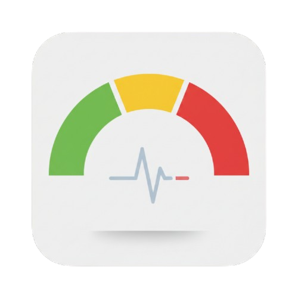

# IoBroker.otlp
**Тесты:** 

## Адаптер протокола Open Telemetry Protocol (OTLP) для ioBroker
Этот адаптер позволяет передавать исторические данные в шлюз, совместимый с протоколом OTLP.

Получение исторических данных по своей сути невозможно.
Поскольку данные/состояния публикуются в виде метрик, можно записывать только числовые значения.

## Почему?
Экспорт точек данных — скважин `number` и `boolean` — в шлюз, совместимый с OTLP, позволяет абстрагироваться от базового хранилища данных.

Благодаря большому количеству доступных открытых экспортеров телеметрии, этот проект функционирует как адаптер для хранилищ, подобных этим.

- [Прометей](https://prometheus.io/)/[Мимир](https://github.com/grafana/mimir)
- InfluxDB (очевидно, не такая мощная, как [существующий адаптер](https://github.com/ioBroker/ioBroker.influxdb/tree/master))
- Кафка

Эти хранилища данных настраиваются в открытом сборщике телеметрии (который является целью данной службы), где могут быть применены дополнительные параметры. Если для экспорта включено нечисловое состояние, оно будет _игнорировано_, и данные не будут записаны.

## Нецелевые показатели
**Все значения/состояния должны быть логическими или числовыми, поскольку они рассматриваются как метрика, а точнее, как индикатор.**

Использование строки или даже сложного объекта в качестве метрики просто не имеет смысла; и это не сработает.
Никогда не будет поддержки чего-либо, кроме чисел и логических значений.

## Конфигурация экземпляра
В административном интерфейсе адаптера можно установить следующие параметры:

| Ключ | Описание |
|-------------------------|-------------------------------------------------------------------------------------------------------------------------------------------------------------------------------------|
| Протокол | Протокол сервера (`http` или `https`). Это _не_ OTLP! |
| Открытый протокол телеметрии | Протокол, используемый для отправки телеметрических данных/метрик (`gRPC` или `http (protobuf)`) |
| Порт | Порт шлюза otelcol. Обычно `4317 (gRPC)` или `4318 (http)` |
| Порт | Порт шлюза otelcol. Обычно `4317 (gRPC)` или `4318 (http)` |
| Название счетчика | Название создаваемого счетчика SDK. Обычно это только внутреннее имя SDK |
| Атрибуты ресурса | Список ключ-значение [атрибуты ресурса](https://opentelemetry.io/docs/concepts/resources/#introduction) для глобального заполнения |
| Атрибуты ресурса | Список атрибутов ресурса в формате ключ-значение для глобального заполнения |

## Настройка пользовательского состояния
Адаптер позволяет включить экспорт метрик по каждому состоянию отдельно, что можно настроить так же, как и для любого другого адаптера истории.
Если указано значение для `aliasId`, оно будет использоваться в качестве имени метрики.

Примечание: В зависимости от используемого хранилища временных рядов может произойти переименование частей метрики.
Например, Prometheus заменит точку на подчеркивание, поэтому псевдоним `my.metric` будет храниться как `my_metric`.

В дополнение к `aliasId` для каждого экспортируемого значения может быть указан список атрибутов, т.е. пар ключ-значение.

### Витрины
Практические примеры представлены в приведенных ниже демонстрационных материалах:

* [Prometheus и Grafana: Обнаружение открытых окон](./docs/showcase.prom-graf.md)

## Changelog
<!--
    Placeholder for the next version (at the beginning of the line):
    ### **WORK IN PROGRESS**
-->
### 0.1.0 (2025-12-28)

* (OlliMartin) Implement connection test by exporting (empty) dummy metric and shutdown on error
* (OlliMartin) Recreate all meters on custom config change; Fixes alias renames only taking affect after adapter restart
* (OlliMartin) Fix [issue #3](https://github.com/OlliMartin/ioBroker.otlp/issues/3) where configured headers would not be applied correctly to the respective exporter
* (OlliMartin) Translate admin & custom UI (i18n)
* (OlliMartin) Add missing layout column definitions to custom settings UI
* (OlliMartin) Remove unnecessary `noTranslation` flags
* (OlliMartin) Remove `.stop()` call on invalid configuration

### 0.0.3 (2025-12-20)

* (OlliMartin) Include MIT Copyright Notice from [ioBroker.influxdb](https://github.com/ioBroker/ioBroker.influxdb)

### 0.0.2 (2025-12-20)

* (OlliMartin) Fix invalid number-range in MeterName (type: text)

### 0.0.1 (2025-12-20)
* (OlliMartin) Final cleanup & release first stable

### 0.0.1-rc.5 (2025-12-20)

* (OlliMartin) More cleanup

### 0.0.1-rc.4 (2025-12-20)

* (OlliMartin) Update logo (transparent background)

### 0.0.1-rc.3 (2025-12-20)

* (OlliMartin) Still trying to automate release

### 0.0.1-rc.2 (2025-12-20)

* (OlliMartin) preparing automated release

### **0.0.1-rc.1 (20.12.2025)**
* (OlliMartin) initial release
  * Basic OTLP exporter functionality (periodic exporting)
  * gRPC or HTTP otlp transport

## License
MIT License

Copyright (c) 2026 OlliMartin <oss@ollimart.in>

Permission is hereby granted, free of charge, to any person obtaining a copy
of this software and associated documentation files (the "Software"), to deal
in the Software without restriction, including without limitation the rights
to use, copy, modify, merge, publish, distribute, sublicense, and/or sell
copies of the Software, and to permit persons to whom the Software is
furnished to do so, subject to the following conditions:

The above copyright notice and this permission notice shall be included in all
copies or substantial portions of the Software.

THE SOFTWARE IS PROVIDED "AS IS", WITHOUT WARRANTY OF ANY KIND, EXPRESS OR
IMPLIED, INCLUDING BUT NOT LIMITED TO THE WARRANTIES OF MERCHANTABILITY,
FITNESS FOR A PARTICULAR PURPOSE AND NONINFRINGEMENT. IN NO EVENT SHALL THE
AUTHORS OR COPYRIGHT HOLDERS BE LIABLE FOR ANY CLAIM, DAMAGES OR OTHER
LIABILITY, WHETHER IN AN ACTION OF CONTRACT, TORT OR OTHERWISE, ARISING FROM,
OUT OF OR IN CONNECTION WITH THE SOFTWARE OR THE USE OR OTHER DEALINGS IN THE
SOFTWARE.