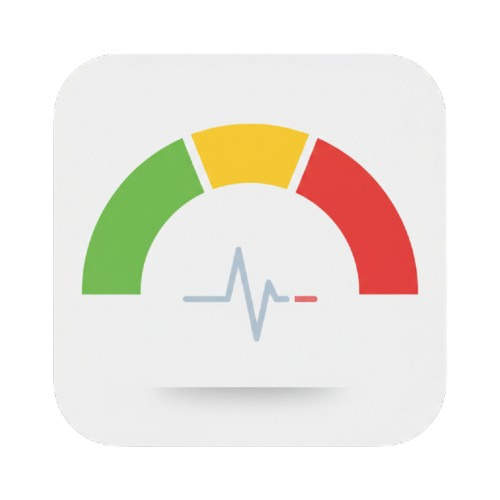

# ioBroker.otlp

## Адаптер протокола Open Telemetry Protocol (OTLP) для ioBroker

Этот адаптер позволяет передавать исторические данные в шлюз, совместимый с протоколом OTLP.

_Получение_ исторических данных — по замыслу разработчиков — **невозможно** . Поскольку данные/состояния публикуются в виде метрик, можно записывать _только числовые значения_ .

## Почему?

Экспорт точек данных - хорошо`number` и`boolean` - Подключение к шлюзу, совместимому с OTLP, позволяет абстрагироваться от базового хранилища данных.

Благодаря большому количеству доступных открытых экспортеров телеметрии, этот проект функционирует как адаптер для таких хранилищ, как...

- [Прометей](https://prometheus.io/) / [Мимир](https://github.com/grafana/mimir)
- InfluxDB (очевидно, не такой мощный, как [существующий адаптер](https://github.com/ioBroker/ioBroker.influxdb/tree/master) )
- Кафка

Эти хранилища данных настраиваются в открытом сборщике телеметрии (который является целью данной службы), где могут быть применены дополнительные параметры. Если для экспорта включено нечисловое состояние, оно будет _проигнорировано_ , и данные не будут записаны.

## Нецелевые показатели

**Все точки данных/состояния должны быть логическими или числовыми, поскольку они рассматриваются как метрика, а точнее, как индикатор.**

Использование строки или даже сложного объекта в качестве метрики просто не имеет смысла; и это не сработает. Поддержка чего-либо, кроме чисел и логических значений, никогда не будет обеспечена.

## Конфигурация экземпляра

В административном интерфейсе адаптера можно установить следующие параметры:

| Ключ                         | Описание                                                                                                                                  |
| ---------------------------- | ----------------------------------------------------------------------------------------------------------------------------------------- |
| Протокол                     | Протокол сервера (`http` или`https` Это _не_ OTLP!                                                                                        |
| Открытый протокол телеметрии | Протокол, используемый для отправки телеметрических данных/метрик (`gRPC` или`http (protobuf)` )                                          |
| Хозяин                       | Имя хоста целевого сервера/телефонного шлюза                                                                                              |
| Порт                         | Порт шлюза Otelcol. Обычно`4317 (gRPC)` или`4318 (http)`                                                                                  |
| Название счетчика            | Название счетчика создания SDK. Обычно это только внутренний параметр SDK.                                                                |
| Заголовки                    | Список заголовков в формате «ключ-значение», добавляемых к каждому запросу. Так можно настроить _аутентификацию._                         |
| Атрибуты ресурса             | Список ключевых значений [атрибутов ресурсов](https://opentelemetry.io/docs/concepts/resources/#introduction) для глобального заполнения. |

## Настройка пользовательского состояния

Адаптер позволяет включить экспорт метрик по каждому состоянию отдельно, что можно настроить так же, как и для любого другого адаптера истории. Если значение для`aliasId` Если указано иное, то именно это будет использоваться в качестве названия метрики.

**Примечание:** В зависимости от используемого хранилища временных рядов может происходить переименование частей метрики. Например, Prometheus заменит точку на подчеркивания, поэтому`my.metric` В качестве идентификатора псевдонима будет сохранено следующее:`my_metric` .

Помимо этого`aliasId` Для каждого экспортируемого значения может быть указан список атрибутов, то есть пар ключ-значение.

### Витрины

Практические примеры представлены в приведенных ниже демонстрационных материалах:

- [Prometheus и Grafana: обнаружение открытых окон](/#/docs/adapterref/iobroker.otlp/docs/showcase.prom-graf.md)

## Changelog

<!--
    Placeholder for the next version (at the beginning of the line):
    ### **WORK IN PROGRESS**
-->

### **WORK IN PROGRESS**

* (OlliMartin) Remove `info.refreshTimerRuntime` state creation through code

### 0.2.1 (2026-03-15)

* (OlliMartin) Add state role for refresh job execution duration

### 0.2.0 (2026-03-15)

* (OlliMartin) Recurringly export data points/metrics (hardcoded to every minute)
  * This fixes an issue where the OpenTelemetry Framework would stop exporting data after some time (~30 minutes) where the data did not change, which makes the metrics harder to consume in downstream services, because it produces gaps in the metrics. Especially Prometheus/Mimir cannot deal with missing values that well.
* (OlliMartin) Add runtime (execution duration) state of periodic worker to be used as a metric itself (e.g. to monitor the performance of the adapter)

### 0.1.0 (2025-12-28)

* (OlliMartin) Implement connection test by exporting (empty) dummy metric and shutdown on error
* (OlliMartin) Recreate all meters on custom config change; Fixes alias renames only taking affect after adapter restart
* (OlliMartin) Fix [issue #3](https://github.com/OlliMartin/ioBroker.otlp/issues/3) where configured headers would not be applied correctly to the respective exporter
* (OlliMartin) Translate admin & custom UI (i18n)
* (OlliMartin) Add missing layout column definitions to custom settings UI
* (OlliMartin) Remove unnecessary `noTranslation` flags
* (OlliMartin) Remove `.stop()` call on invalid configuration

### 0.0.3 (2025-12-20)

* (OlliMartin) Include MIT Copyright Notice from [ioBroker.influxdb](https://github.com/ioBroker/ioBroker.influxdb)

### 0.0.2 (2025-12-20)

* (OlliMartin) Fix invalid number-range in MeterName (type: text)

### 0.0.1 (2025-12-20)
* (OlliMartin) Final cleanup & release first stable

### 0.0.1-rc.5 (2025-12-20)

* (OlliMartin) More cleanup

### 0.0.1-rc.4 (2025-12-20)

* (OlliMartin) Update logo (transparent background)

### 0.0.1-rc.3 (2025-12-20)

* (OlliMartin) Still trying to automate release

### 0.0.1-rc.2 (2025-12-20)

* (OlliMartin) preparing automated release

### **0.0.1-rc.1 (20.12.2025)**
* (OlliMartin) initial release
  * Basic OTLP exporter functionality (periodic exporting)
  * gRPC or HTTP otlp transport

## License
MIT License

Copyright (c) 2026 OlliMartin <oss@ollimart.in>

Permission is hereby granted, free of charge, to any person obtaining a copy
of this software and associated documentation files (the "Software"), to deal
in the Software without restriction, including without limitation the rights
to use, copy, modify, merge, publish, distribute, sublicense, and/or sell
copies of the Software, and to permit persons to whom the Software is
furnished to do so, subject to the following conditions:

The above copyright notice and this permission notice shall be included in all
copies or substantial portions of the Software.

THE SOFTWARE IS PROVIDED "AS IS", WITHOUT WARRANTY OF ANY KIND, EXPRESS OR
IMPLIED, INCLUDING BUT NOT LIMITED TO THE WARRANTIES OF MERCHANTABILITY,
FITNESS FOR A PARTICULAR PURPOSE AND NONINFRINGEMENT. IN NO EVENT SHALL THE
AUTHORS OR COPYRIGHT HOLDERS BE LIABLE FOR ANY CLAIM, DAMAGES OR OTHER
LIABILITY, WHETHER IN AN ACTION OF CONTRACT, TORT OR OTHERWISE, ARISING FROM,
OUT OF OR IN CONNECTION WITH THE SOFTWARE OR THE USE OR OTHER DEALINGS IN THE
SOFTWARE.