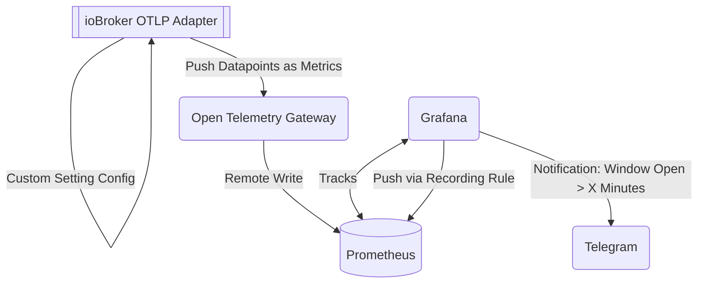

В этом документе описывается конфигурация, в которой`ioBroker.otlp` Адаптер используется для передачи данных с оконных датчиков и отправки напоминаний, если окно обнаружено открытым дольше определенного времени.`X` минут.

## Общий обзор

У меня есть несколько совместимых с Matter оконных датчиков, подключенных к ioBroker. Каждая точка данных/состояние генерирует временной ряд для одного и того же имени метрики (`contact-sensor-open` ):

В результате этого`ioBroker.otlp` адаптер публикует эти метрики через`OTLP` на настроенный открытый телеметрический шлюз/сборщик. Сборщик настроен на отправку (удаленная запись) метрик в (без сохранения состояния)`Prometheus` , которая служит мне краткосрочным хранилищем для исторических данных.

**Примечание:** Разумеется, я _мог бы_ хранить данные и в базе данных временных рядов, например, InfluxDB, но для данного случая мне, как правило, не требуется и нежелательно долговременное хранение. Меня не заинтересует, будет ли мое окно открыто _сегодня_ через 3 месяца; по сути, это бесполезные данные после того, как окно будет закрыто.

После сохранения данных в Prometheus, Grafana выполняет запрос к этим данным и перезаписывает их с помощью правила записи:

Это немного упрощает работу с данными, поскольку PROMQL доставляет немало хлопот при работе с относительными временными метками, сбросами и отсутствующими точками данных. Полученная метрика выглядит так — вы можете увидеть, где отсутствуют точки данных, потому что окно было закрыто в течение длительного времени:

На скриншоте выше вы можете увидеть (неуклонно) увеличивающееся время работы соответствующих комнат. С учетом этого, легко настроить оповещение, которое должно отправляться, если какой-либо временной ряд превысит определенный порог:

Оповещение настроено на доставку через Telegram, что показалось самым простым вариантом.`Contact-Point` для достижения этой цели и поставляется в комплекте с Grafana:

