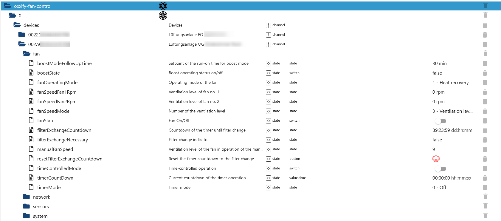
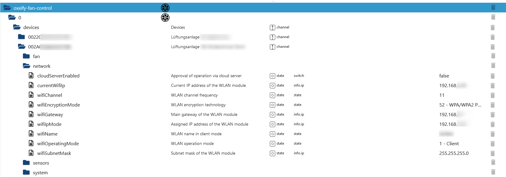
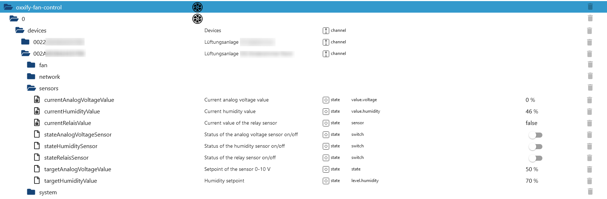
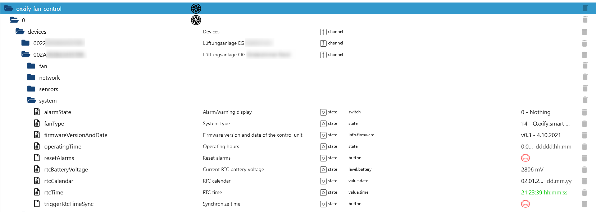

# IoBroker.oxxify-fan-control
**Тесты:** 

## Адаптер oxxify-fan-control для ioBroker
Интегрируйте вентиляторы Oxxify в свою систему «умного дома». Все предоставленные данные ioBroker основаны на протоколе связи, описанном в [здесь](./doc/BDA_Anschluss_SmartHome_RV_V2.pdf). Поскольку другие производители используют тот же протокол (например, вентиляторы Blauberg), весьма вероятно, что они также будут работать.

## Рабочие устройства
- Oxxify smart 50 (проверено мной)
- Любое другое устройство Oxxify с поддержкой Wi-Fi
- Blauberg Vents и другие устройства с аналогичным протоколом (следующие работают).
- Blauberg D180 S21
- Vento Expert A50-1 S10 W V.2

### Описание дерева объектов
В дереве объектов находится папка с именем "devices", в которой создается запись для каждого настроенного вентилятора. Каналы ниже создаются с использованием уникального идентификатора вентилятора, предоставленного производителем. В столбце _name_ используется запись из конфигурации для лучшего различения вентиляторов. Под каждым вентилятором создаются четыре канала для группировки данных, предоставляемых для каждого вентилятора. Они описаны ниже:

#### Данные о вентиляторах
Этот канал содержит все данные, связанные с вентилятором, такие как таймеры, скорость вращения вентилятора, состояние включения/выключения и информацию об интервале очистки/замены фильтра. Режимы работы вентилятора содержат числовое значение из протокола связи, а также голосовое сообщение о состоянии. Значения могут быть записаны только числом (например, 1 для режима восстановления после нагрева). То же самое относится к режиму таймера и режиму скорости вращения вентилятора, который принимает значения 1, 2, 3 и 255 для ручной настройки скорости. Скорость вращения вентилятора 2 недоступна на моих устройствах (Oxxify pro 50) и остается либо на уровне 0 об/мин в выключенном состоянии, либо на уровне 1500 об/мин в любом рабочем состоянии. Другое значение изменяется в зависимости от скорости.

#### Сетевые данные
В настоящее время сетевые данные доступны только для чтения; запись/изменение значений здесь пока не реализовано и может быть выполнено с помощью приложения производителя. То же самое относится и к состоянию управления облачным сервером.

#### Данные датчиков
Ввод данных с датчиков осуществляется в соответствии с протоколом. Значение аналогового напряжения указывается в процентах, как определено в протоколе. К аналоговому и релейному датчикам ничего не подключено, поэтому я не могу проверить, что произойдет, если их активировать.

#### Системные данные
Этот канал содержит системные данные об оборудовании и прошивке, а также о времени работы, напряжении батареи RTC и дате/времени. Здесь можно сбросить будильники, а также установить время RTC на основе настроенного NTP-сервера. По моему опыту, иногда после синхронизации времени RTC новые (правильные) значения отображаются не сразу, и это происходит только после следующего опроса данных.

## Задачи
- Внедрение большего количества тестов
- Дополнить недостающие данные (например, расписание, запись сетевых данных и управление облаком).

<!-- Заполнитель для следующей версии (в начале строки):

### **РАБОТА В ПРОЦЕССЕ** -->

## Changelog
### 0.0.15 (2026-05-05)

- Security vulnerabilities fixed (#141)

### 0.0.14 (2026-05-05)

- Added missing JSDoc comments
- (copilot) Adapter requires node.js >= 22 now
- Warning [W5039] fixed

### 0.0.13 (2026-04-08)

- Auto PRs merged
- Fixing other deployment issues...

### 0.0.12 (2026-04-06)

- Deploy workflow changed from "npm install" to "npm ci"

### 0.0.11 (2026-04-06)

- TypeScript updated to 6.0
- Some dependency work

## License

Copyright (c) 2025-2026 N-b-dy <daten4me@gmx.de>

                    GNU GENERAL PUBLIC LICENSE
                       Version 3, 29 June 2007

### Disclaimer of Warranty.

THERE IS NO WARRANTY FOR THE PROGRAM, TO THE EXTENT PERMITTED BY
APPLICABLE LAW. EXCEPT WHEN OTHERWISE STATED IN WRITING THE COPYRIGHT
HOLDERS AND/OR OTHER PARTIES PROVIDE THE PROGRAM "AS IS" WITHOUT WARRANTY
OF ANY KIND, EITHER EXPRESSED OR IMPLIED, INCLUDING, BUT NOT LIMITED TO,
THE IMPLIED WARRANTIES OF MERCHANTABILITY AND FITNESS FOR A PARTICULAR
PURPOSE. THE ENTIRE RISK AS TO THE QUALITY AND PERFORMANCE OF THE PROGRAM
IS WITH YOU. SHOULD THE PROGRAM PROVE DEFECTIVE, YOU ASSUME THE COST OF
ALL NECESSARY SERVICING, REPAIR OR CORRECTION.

### Limitation of Liability.

IN NO EVENT UNLESS REQUIRED BY APPLICABLE LAW OR AGREED TO IN WRITING
WILL ANY COPYRIGHT HOLDER, OR ANY OTHER PARTY WHO MODIFIES AND/OR CONVEYS
THE PROGRAM AS PERMITTED ABOVE, BE LIABLE TO YOU FOR DAMAGES, INCLUDING ANY
GENERAL, SPECIAL, INCIDENTAL OR CONSEQUENTIAL DAMAGES ARISING OUT OF THE
USE OR INABILITY TO USE THE PROGRAM (INCLUDING BUT NOT LIMITED TO LOSS OF
DATA OR DATA BEING RENDERED INACCURATE OR LOSSES SUSTAINED BY YOU OR THIRD
PARTIES OR A FAILURE OF THE PROGRAM TO OPERATE WITH ANY OTHER PROGRAMS),
EVEN IF SUCH HOLDER OR OTHER PARTY HAS BEEN ADVISED OF THE POSSIBILITY OF
SUCH DAMAGES.