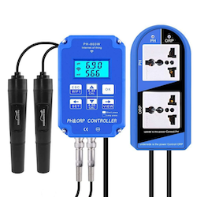

# ioBroker.ph803w

## адаптер ph803w для ioBroker

**Этот адаптер использует библиотеки Sentry для автоматического сообщения разработчикам об исключениях и ошибках в коде.** Более подробную информацию, а также инструкции по отключению отправки сообщений об ошибках см. [в документации Sentry-Plugin](https://github.com/ioBroker/plugin-sentry#plugin-sentry) ! Система отчетности Sentry используется начиная с js-controller 3.0.

Получайте значения pH и окислительно-восстановительного потенциала от устройств PH803-W в вашей сети.

## Конфигурация

Адаптер не требует никакой настройки. Он автоматически обнаружит устройства PH803W через UDP-пакеты в вашей сети. Это означает, что сервер ioBroekr и устройство должны находиться в одной сети. Обнаружение происходит при запуске адаптера, поэтому для обнаружения новых устройств, добавленных во время работы адаптера, может потребоваться его перезапуск.

## Все

- Улучшение тестирования: проверка состояния и использование setState.
- При необходимости разрешить указание локального сетевого интерфейса для прослушивания UDP-пакетов.
- При необходимости разрешите добавление собственных устройств по IP-адресу, если функция обнаружения не работает.
- При необходимости добавьте состояние для отправки еще одного пакета обнаружения во время работы адаптера, чтобы обеспечить обнаружение новых устройств без перезапуска адаптера.

## Как сообщать о проблемах и отправлять запросы на добавление новых функций

Пожалуйста, используйте для этого раздел "Проблемы" на GitHub.

Лучше всего установить для адаптера режим отладочного логирования (Экземпляры -> Экспертный режим -> Уровень логирования столбцов). Затем, пожалуйста, получите лог-файл с диска (подкаталог "log" в каталоге установки ioBroker, а не из административной панели, поскольку административная панель обрезает строки). Если вы не хотите предоставлять его в рамках задачи на GitHub, вы также можете отправить его мне по электронной почте ( <iobroker@fischer-ka.de> ). Пожалуйста, добавьте ссылку на соответствующую задачу на GitHub И опишите, что я вижу в логе и в какое время.

## Changelog
### 1.2.0 (2024-04-21)
* IMPORTANT: The adapter requires at least Node.js 18.x
* (foxriver76) Fix write flag of redox switch indicator

### 1.1.1 (2022-06-03)
* (Apollon77) Fix potential crash case on the IP-changed detection logic

### 1.1.0 (2022-05-28)
* (Apollon77) Make sure adapter enters discovery mode even if an existing device cannot be connected to
* (Apollon77) Detect the same device ID under a new IP and adjust the objects accordingly
* (Apollon77) Add connected state for each device and also use it for Admin connection display

### 1.0.3 (2022-04-28)
* (Apollon77) Make sure devices have an id when initializing them

### 1.0.1 (2021-07-05)
* (Apollon77) Optimize connection status edge cases

### 1.0.0 (2021-07-01)
* Declare adapter as stable, so lets do a 1.0
* (Apollon77) Add tier for js-controller 3.3

### 0.1.5 (2021-06-09)
* (Apollon77) Optimize edge cases on device connection and try reconnect and make sure connection status is correct
* (Apollon77) Better handle pingpong related reconnects

### 0.1.4 (2021-06-09)
* (Apollon77) Remove unit from PH again after feedback

### 0.1.3 (2021-06-09)
* (Apollon77) Add title property

### 0.1.2 (2021-06-09)
* (Apollon77) Add unit for PH value

### 0.1.1 (2021-06-09)
* (Apollon77) Initial commit

## License
MIT License

Copyright (c) 2021-2024 Ingo Fischer <github@fischer-ka.de>

Permission is hereby granted, free of charge, to any person obtaining a copy
of this software and associated documentation files (the "Software"), to deal
in the Software without restriction, including without limitation the rights
to use, copy, modify, merge, publish, distribute, sublicense, and/or sell
copies of the Software, and to permit persons to whom the Software is
furnished to do so, subject to the following conditions:

The above copyright notice and this permission notice shall be included in all
copies or substantial portions of the Software.

THE SOFTWARE IS PROVIDED "AS IS", WITHOUT WARRANTY OF ANY KIND, EXPRESS OR
IMPLIED, INCLUDING BUT NOT LIMITED TO THE WARRANTIES OF MERCHANTABILITY,
FITNESS FOR A PARTICULAR PURPOSE AND NONINFRINGEMENT. IN NO EVENT SHALL THE
AUTHORS OR COPYRIGHT HOLDERS BE LIABLE FOR ANY CLAIM, DAMAGES OR OTHER
LIABILITY, WHETHER IN AN ACTION OF CONTRACT, TORT OR OTHERWISE, ARISING FROM,
OUT OF OR IN CONNECTION WITH THE SOFTWARE OR THE USE OR OTHER DEALINGS IN THE
SOFTWARE.