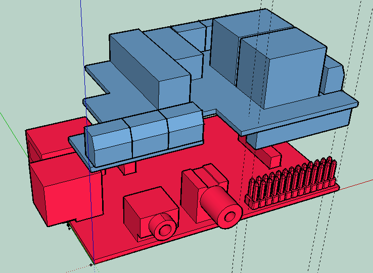

# ioBroker.piface

Этот адаптер позволяет управлять Piface на Raspberry Pi.

В нём используется node-pifacedigital: <https://github.com/tualo/node-pifacedigital>

Адаптер создает 8 входных и выходных объектов в iobroker. Выходами можно управлять с помощью кнопок из VIS или путем установки для объекта значения «true», «false», «1» или «0».

### ! Внимание !

Пожалуйста, ознакомьтесь с предварительными требованиями к адаптеру. Для работы адаптера требуется версия Node >= v4.0.0. Вам необходимо установить через консоль следующие библиотеки и включить поддержку SPI для Raspberry Pi, настроив это в файле "raspi-config".

```
git clone https://github.com/piface/libmcp23s17.git
cd libmcp23s17/
make
sudo make install
```

```
git clone https://github.com/piface/libpifacedigital.git
cd libpifacedigital/
make
sudo make install
```

Если возникают ошибки из-за слишком низкой версии Node.js, пожалуйста, обновите версию Node.js.

- Установка прошла успешно с использованием версии Node.js: v4.2.1

### Настройки в iobroker


## номер платы PiFace

На одном Raspberry Pi можно установить до 4 плат. Адресация платы должна осуществляться с помощью перемычки. Для адресации плат используйте следующие настройки перемычек:

| Номер доски | JP1 | JP2 |
| ----------- | :-: | :-: |
| доска 0     |  0  |  0  |
| доска 1     |  1  |  0  |
| доска 2     |  0  |  1  |
| доска 3     |  1  |  1  |

Если вы используете более одной платы, пожалуйста, создайте дополнительные экземпляры для каждой платы и измените номер платы в настройках соответствующего экземпляра.

## PiFace считывает входные данные в миллисекундах

Это значение определяет интервал проверки входных данных. Значение указывается в миллисекундах.

## Обратные входные данные

Вы можете инвертировать входные данные.

## Инициализация выходных данных

Если этот параметр отмечен, то при перезапуске адаптера выходные значения будут обнулены.

## Что нужно сделать:

## Changelog

### 1.0.0.(2017-09-19)
* (Eisbaeeer)
* Solving issue #6 (RAM)

### 0.0.9 (2017-03-05)
* (Eisbaeeer)
* Activating Travis - no changes
* (Apollon77)
* Added basic testing

### 0.0.50 (2016-05-07)
* (Eisbeeer)
* Optimized loggin because of RPI´s flash

### 0.0.40
* (Eisbaeeer) RC
added:
* addressing boards

### 0.0.30
* (Eisbaeeer) first aplpha
added:
* Read interval in setup (ms)
* Selectable invers input (pullup)

### 0.0.20
* (Eisbaeeer) first beta

### 0.0.10
* (Eisbaeeer) initial version

## License
MIT