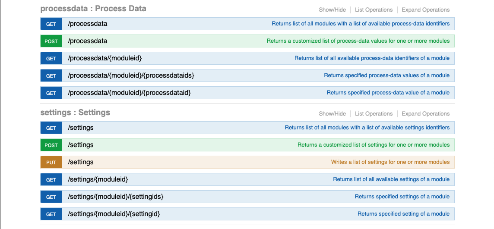
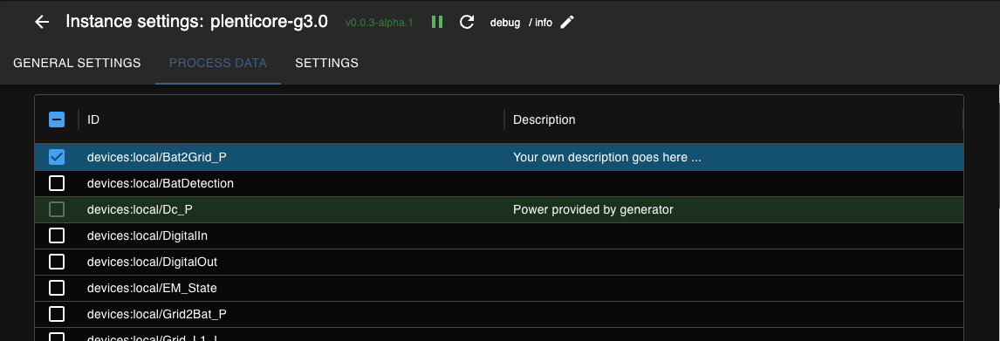

  

# IoBroker.plenticore-g3
**Тесты:** 

## Адаптер plenticore-g3 для ioBroker
Адаптер для связи с KOSTAL Plenticore (различные модели, см. раздел ниже) через REST API. Этот API гораздо мощнее Modbus. Он предоставляет доступ примерно к 200 точкам данных, доступным только для чтения (processdata), и примерно к 250 записываемым параметрам. Документация по этому API доступна по ссылке:

http://\<хост plenticore>/api/v1

   

Этот адаптер использует «Данные процесса» и «Настройки» REST API. Поскольку пользователю не нужны все доступные данные, адаптер имеет лишь очень небольшое количество предустановленных данных процесса и настроек, но предоставляет пользователю возможность выбирать дополнительные точки данных из списка всех доступных данных процесса и настроек соответственно.

  

Вы также можете добавить собственные описания к дополнительным точкам данных, которые будут отображаться в виде описаний в дереве объектов iobroker. В большинстве случаев назначение точки данных можно определить по её названию. Например, «devices:local/HomeBat_P» отображает мощность, потребляемую домом от аккумулятора.

### Именование
Собственные объекты состоят из идентификатора модуля и идентификатора данных, например, «scb:statistic:EnergyFlow/Statistic:Yield:Day». Часть перед косой чертой — это идентификатор модуля. В данном случае это «scb:statistic:EnergyFlow». В дереве объектов iobroker будет создана структура папок для идентификаторов модулей:  скб  статистика  EnergyFlow 

Двоеточия в идентификаторе данных заменяются подчеркиванием:  «Statistic:Yield:Day» станет «Statistic_Yield_Day»

## Поддерживаемые/протестированные модели Plenticore
Несмотря на то, что название адаптера может указывать на поддержку только моделей G3, поддерживаются и другие модели. API, по всей видимости, аналогичен, могут различаться только доступные точки данных. Ниже представлен список моделей, успешно протестированных пользователями.

- Пленкёр G3
- Plenticore plus 10 (G1) - Версия прошивки 01.30.12092
- Plenticore BI 10/26 (G2) - Версия прошивки 02.15.19562

## Changelog
### 0.4.1 (2025-10-17)
- move to npm trusted publishing

### 0.4.0 (2025-10-07)
- improve init process: do preinit, if inverter is not in state FeedIn; trigger init as soon as inverter goes to FeedIn

### 0.3.0 (2025-10-06)
- update documentation with soction of tested models
- enhance port selection related to http/https for base settings
- do not poll data points related to battery, if no battery is present
- update dependencies

### 0.2.1 (2025-08-29)
- update dependencies

### 0.2.0 (2025-07-22)
- check Inverter_State for FeedIn before init
- suspend error logging on too many errors
- add timeout to API calls
- update translations

### 0.1.4 (2025-06-17)
- fix logging for preset and optional data

### 0.1.3 (2025-06-15)
- add some logging for debugging
- fix log warnings

### 0.1.2 (2025-06-01)
- add node 24 to tests
- chores

### 0.1.1 (2025-04-07)

- fix object hierarchy
- fix missing translations, adjust translations based on system language
- fix state roles

### 0.1.0 (2025-03-29)

- add notification on available updates
- make sure init completes without errors

### 0.0.8 (2025-03-28)

- fix writing of settings after 0.0.7
- fix crash after failed API requests

### 0.0.7 (2025-03-26)

- replace ':' by '_' in object IDs
- delete unused objects and channels

### 0.0.6 (2025-03-14)

-   fix repo url in package.json

### 0.0.5 (2025-03-14)

-   avoid potential issues: js-controller >= 7.0.6

### 0.0.4 (2025-03-14) 0.0.4

-   prepare for iobroker repo

### 0.0.4-beta.1 (2025-03-14) beta 1 with translations

-   update translations

### 0.0.4-beta.0 (2025-03-13) beta 1

-   exclude react from test:js
-   terminate on authentication issue (fix)
-   add read and write for settings

### 0.0.3-alpha.1 (2025-03-10)

-   eslint
-   remove node 18.x from github workflow

### 0.0.3-alpha.0 (2025-03-10)

-   Did some changes
-   Did some more changes

### v0.0.1 (2025-03-10)

Initial release

## License
MIT License

Copyright (c) 2025 fernetmenta <fernetmenta@online.de>

Permission is hereby granted, free of charge, to any person obtaining a copy
of this software and associated documentation files (the "Software"), to deal
in the Software without restriction, including without limitation the rights
to use, copy, modify, merge, publish, distribute, sublicense, and/or sell
copies of the Software, and to permit persons to whom the Software is
furnished to do so, subject to the following conditions:

The above copyright notice and this permission notice shall be included in all
copies or substantial portions of the Software.

THE SOFTWARE IS PROVIDED "AS IS", WITHOUT WARRANTY OF ANY KIND, EXPRESS OR
IMPLIED, INCLUDING BUT NOT LIMITED TO THE WARRANTIES OF MERCHANTABILITY,
FITNESS FOR A PARTICULAR PURPOSE AND NONINFRINGEMENT. IN NO EVENT SHALL THE
AUTHORS OR COPYRIGHT HOLDERS BE LIABLE FOR ANY CLAIM, DAMAGES OR OTHER
LIABILITY, WHETHER IN AN ACTION OF CONTRACT, TORT OR OTHERWISE, ARISING FROM,
OUT OF OR IN CONNECTION WITH THE SOFTWARE OR THE USE OR OTHER DEALINGS IN THE
SOFTWARE.