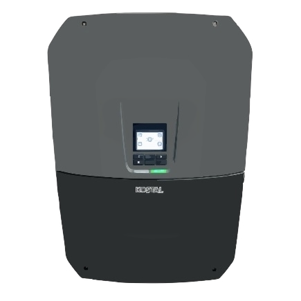
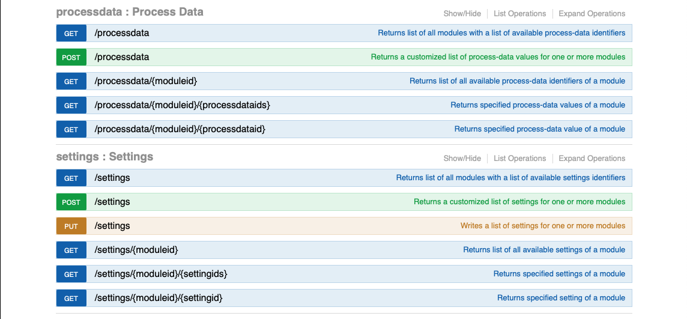
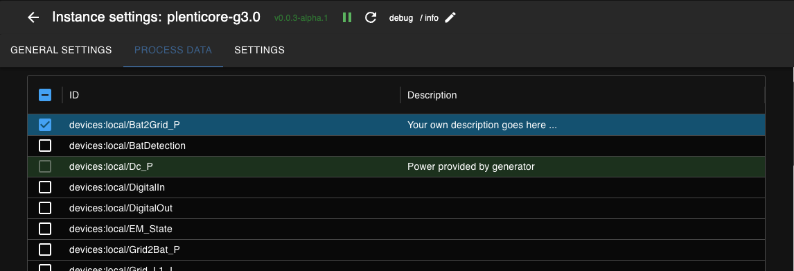

    

# ioBroker.plenticore-g3

## Адаптер plenticore-g3 для ioBroker

Адаптер для связи с KOSTAL Plenticore (различные модели, см. раздел ниже) через REST API. Этот API значительно мощнее, чем Modbus. Он предоставляет доступ примерно к 200 точкам данных только для чтения, называемым «процессными данными», и примерно к 250 записываемым настройкам. Документация по этому API доступна по следующему адресу:

http\://\<plentocore host>/api/v1

    
    

Этот адаптер использует разделы «Данные процесса» и «Настройки» REST API. Поскольку пользователю не нужны все доступные данные, адаптер содержит лишь очень небольшое количество предустановленных данных процесса и настроек, но предоставляет пользователю возможность выбирать дополнительные точки данных из списка всех доступных данных процесса и настроек соответственно.

    

Вы также можете добавить собственные описания к необязательным точкам данных, которые будут отображаться в виде описаний в дереве объектов iobroker. В большинстве случаев назначение точки данных можно определить по ее имени. Например, 'devices:local/HomeBat\_P' обозначает количество энергии, потребляемой Home от батареи.

### Название

Нативные объекты состоят из идентификатора модуля и идентификатора данных, например, 'scb:statistic:EnergyFlow/Statistic:Yield:Day'. Часть до косой черты — это идентификатор модуля. В данном случае это 'scb:statistic:EnergyFlow'. В дереве объектов iobroker для идентификаторов модулей будет создана структура папок:  scb  статистика  Поток энергии 

Двоеточия в идентификаторе данных заменяются подчеркиванием:  'Statistic:Yield:Day' станет 'Statistic\_Yield\_Day'

## Поддерживаемые/протестированные модели Plenticore

Несмотря на то, что название адаптера может наводить на мысль о поддержке только моделей G3, поддерживаются и другие модели. API, по-видимому, одинаков, различаются лишь доступные параметры. Ниже приведён список моделей, успешно протестированных пользователями.

- Плентикор G3
- Plenticore plus 10 (G1) - Версия прошивки 01.30.12092
- Plenticore BI 10/26 (G2) - Версия прошивки 02.15.19562

## Changelog
### 1.0.2 (2026-09-01)
- update dependencies

### 1.0.1 (2026-06-29)
- update dependencies

### 1.0.0 (2026-05-12)
- (copilot) Adapter requires node.js >= 22 now
- update dependencies
- reduce number of retries on init

### 0.5.3 (2026-04-02)
- update dependencies
- fix notification, only send notification about firmware updates every 14 days

### 0.5.2 (2026-01-04)
- fix skipping optionals that have become preselected
- fix not showing settings for battery when present
- update dependencies

[Older changelogs can be found there](https://github.com/FernetMenta/ioBroker.plenticore-g3/blob/main/CHANGELOG_OLD.md)

## License
MIT License

Copyright (c) 2025-2026 fernetmenta <fernetmenta@online.de>

Permission is hereby granted, free of charge, to any person obtaining a copy
of this software and associated documentation files (the "Software"), to deal
in the Software without restriction, including without limitation the rights
to use, copy, modify, merge, publish, distribute, sublicense, and/or sell
copies of the Software, and to permit persons to whom the Software is
furnished to do so, subject to the following conditions:

The above copyright notice and this permission notice shall be included in all
copies or substantial portions of the Software.

THE SOFTWARE IS PROVIDED "AS IS", WITHOUT WARRANTY OF ANY KIND, EXPRESS OR
IMPLIED, INCLUDING BUT NOT LIMITED TO THE WARRANTIES OF MERCHANTABILITY,
FITNESS FOR A PARTICULAR PURPOSE AND NONINFRINGEMENT. IN NO EVENT SHALL THE
AUTHORS OR COPYRIGHT HOLDERS BE LIABLE FOR ANY CLAIM, DAMAGES OR OTHER
LIABILITY, WHETHER IN AN ACTION OF CONTRACT, TORT OR OTHERWISE, ARISING FROM,
OUT OF OR IN CONNECTION WITH THE SOFTWARE OR THE USE OR OTHER DEALINGS IN THE
SOFTWARE.