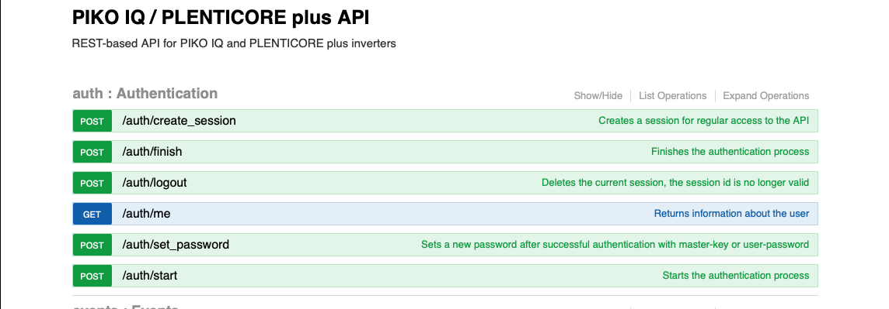

  

# IoBroker.plenticore-g3
**Тесты:** 

## Адаптер plenticore-g3 для ioBroker
Адаптер для связи с KOSTAL Plenticore plus через REST API. Этот API намного мощнее, чем modbus. Он предоставляет доступ примерно к 200 точкам данных только для чтения, называемым «processdata», и примерно к 250 записываемым настройкам. Этот API задокументирован по этому URL:

http://\<хост plenticore>/api/v1

   

Этот адаптер использует «Данные процесса» и «Настройки» REST API. Поскольку ни одному пользователю не нужны все доступные данные, адаптер имеет только очень небольшое количество предустановленных данных процесса и настроек, но дает пользователю возможность выбирать дополнительные точки данных из списка всех доступных данных процесса и настроек соответственно.

  

Вы также можете добавлять собственные описания к необязательным точкам данных, которые будут отображаться как описания в дереве объектов iobroker. В большинстве случаев назначение точки данных можно определить по ее имени. Например, 'devices:local/HomeBat_P' представляет мощность, которую дом использует от батареи.

### Именование
Собственные объекты состоят из идентификатора модуля и идентификатора данных, например, &#39;scb:statistic:EnergyFlow/Statistic:Yield:Day&#39;. Часть перед косой чертой — это идентификатор модуля. В этом случае &#39;scb:statistic:EnergyFlow&#39;. В дереве объектов iobroker будет создана структура папок для идентификатора модуля:  скб  статистика  EnergyFlow 

Двоеточия в идентификаторе данных заменяются подчеркиванием:  «Статистика:Доходность:День» станет «Статистика_Доходность_День»

## Changelog
### 0.1.1 (2025-04-07)

- fix object hierarchy
- fix missing translations, adjust translations based on system language
- fix state roles

### 0.1.0 (2025-03-29)

- add notification on available updates
- make sure init completes without errors

### 0.0.8 (2025-03-28)

- fix writing of settings after 0.0.7
- fix crash after failed API requests

### 0.0.7 (2025-03-26)

- replace ':' by '_' in object IDs
- delete unused objects and channels

### 0.0.6 (2025-03-14)

-   fix repo url in package.json

### 0.0.5 (2025-03-14)

-   avoid potential issues: js-controller >= 7.0.6

### 0.0.4 (2025-03-14) 0.0.4

-   prepare for iobroker repo

### 0.0.4-beta.1 (2025-03-14) beta 1 with translations

-   update translations

### 0.0.4-beta.0 (2025-03-13) beta 1

-   exclude react from test:js
-   terminate on authentication issue (fix)
-   add read and write for settings

### 0.0.3-alpha.1 (2025-03-10)

-   eslint
-   remove node 18.x from github workflow

### 0.0.3-alpha.0 (2025-03-10)

-   Did some changes
-   Did some more changes

### v0.0.1 (2025-03-10)

Initial release

## License
MIT License

Copyright (c) 2025 fernetmenta <fernetmenta@online.de>

Permission is hereby granted, free of charge, to any person obtaining a copy
of this software and associated documentation files (the "Software"), to deal
in the Software without restriction, including without limitation the rights
to use, copy, modify, merge, publish, distribute, sublicense, and/or sell
copies of the Software, and to permit persons to whom the Software is
furnished to do so, subject to the following conditions:

The above copyright notice and this permission notice shall be included in all
copies or substantial portions of the Software.

THE SOFTWARE IS PROVIDED "AS IS", WITHOUT WARRANTY OF ANY KIND, EXPRESS OR
IMPLIED, INCLUDING BUT NOT LIMITED TO THE WARRANTIES OF MERCHANTABILITY,
FITNESS FOR A PARTICULAR PURPOSE AND NONINFRINGEMENT. IN NO EVENT SHALL THE
AUTHORS OR COPYRIGHT HOLDERS BE LIABLE FOR ANY CLAIM, DAMAGES OR OTHER
LIABILITY, WHETHER IN AN ACTION OF CONTRACT, TORT OR OTHERWISE, ARISING FROM,
OUT OF OR IN CONNECTION WITH THE SOFTWARE OR THE USE OR OTHER DEALINGS IN THE
SOFTWARE.