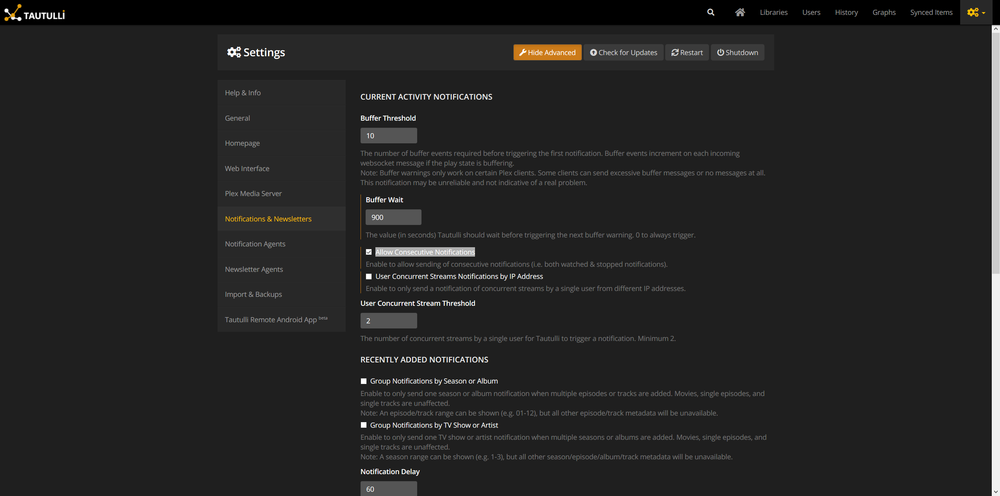
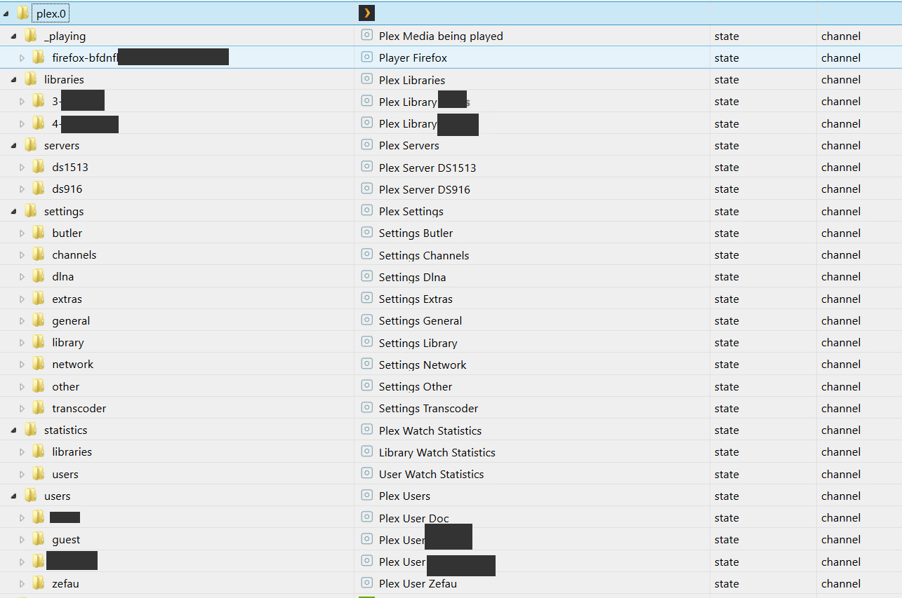

# IoBroker.plex Интеграция медиасервера Plex в ioBroker (с Plex Pass или без него). Кроме того, интеграция Таутулли.
[](https://travis-ci.com/Zefau/ioBroker.plex)

**Оглавление**

1. [Функции](#1-функции)
2. [Инструкции по установке](#2-инструкции по настройке)
   1. [Базовая настройка](#21-базовая-настройка)
   2. [Расширенная настройка](#22-advanced-setup-plex-pass-or-tautulli)
3. [Каналы и состояния](#3-каналы--состояния)
   1. [с базовой настройкой](#31-с-базовой-настройкой)
   2. [с расширенной настройкой](#32-с-расширенной-настройкой)
4. [Журнал изменений](#changelog)
5. [Лицензия](#license)

## 1. Особенности
- Получение подробной медиа-информации о текущем воспроизводимом медиа-элементе (например, битрейт видео, кодек, информация о субтитрах, аудио; см. [Расширенные настройки] (https://github.com/Zefau/ioBroker.plex/blob/master/README- States.md#with-advanced-setup) для полного списка)
- Получать «события» от Plex (через [Plex Webhook] (https://support.plex.tv/articles/115002267687-webhooks/#toc-0) и [уведомления Plex] (https://support.plex.tv). /articles/push-notifications/#toc-0) с помощью Plex Pass или через Tautulli, [__see setup!__](#22-advanced-setup-plex-pass-or-tautulli))
- Управление воспроизведением для игроков
- Получить `серверы`
- Получить `библиотеки`
- Получить все элементы в библиотеке
- Получить `пользователей` (только с Tautulli)
- Получить «статистику» (только с Tautulli)
- Получить `плейлисты`
- Получить `настройки`
- Веб-интерфейс, который показывает последние события из Plex:

  

## 2. Инструкции по установке
### 2.1. Базовая настройка
Для базовой настройки необходимо указать IP-адрес (и порт) вашей установки Plex. Кроме того, вам необходимо получить выделенный токен для адаптера для получения данных из Plex.

Как только это будет предоставлено, ioBroker.plex получит все основные данные (включая серверы, библиотеки). Полный список основных данных см. в [Каналы и состояния](#21-with-basis-setup).

### 2.2. Расширенная настройка (Plex Pass или Tautulli)
#### 2.2.1. Плекс Пасс
__Веб-перехватчик__

Если вы являетесь пользователем Plex Pass, вы можете [настроить вебхук](https://support.plex.tv/articles/115002267687-webhooks/#toc-0) в настройках Plex получить текущее событие/действие с вашего Plex Media Server (воспроизведение, пауза, возобновление, остановка, просмотр и оценка).

Перейдите к своему Plex Media Server и перейдите к ```Settings``` и ```Webhook```. Создал новый веб-перехватчик, нажав ```Add Webhook``` и введя свой IP-адрес ioBroker с пользовательским портом, указанным в настройках ioBroker.plex, и конечным путем ```/plex```, например. ```http://192.168.178.29:41891/plex```:


__События__

Для получения информации об уведомлениях Plex, пожалуйста, [см. официальную документацию](https://support.plex.tv/articles/push-notifications/#toc-0). Чтобы включить уведомления на Plex Media Server, перейдите в раздел `Settings` > `Server` > `General`, а затем включите параметр `Push Notifications`.

#### 2.2.2.Таутулли
[Tautulli — это стороннее приложение](https://tautulli.com/#about), которое вы можете запускать вместе со своим Plex Media Server для мониторинга активности и отслеживания различной статистики. Самое главное, эта статистика включает в себя то, что смотрели, кто смотрел, когда и где смотрели и как смотрели. Вся статистика представлена в приятном и понятном интерфейсе с множеством таблиц и графиков, что позволяет легко хвастаться своим сервером перед всеми остальными. Ознакомьтесь с [предварительной версией Tautulli] (https://tautulli.com/#preview) и [установите ее в предпочитаемой системе.](https://github.com/Tautulli/Tautulli-Wiki/wiki/Installation), если вам интересно.

Этот адаптер подключается к [API Таутулли](https://github.com/Tautulli/Tautulli/blob/master/API.md), а также получает события веб-перехватчика от Tautulli.

##### 2.2.2.1. API
После установки Tautulli откройте страницу _Settings_ из панели инструментов Tautulli и перейдите к _Web Interface_. Прокрутите вниз до раздела _API_ и убедитесь, что установлен флажок ```Enable API```. Скопируйте ```API key``` и введите его в настройках ioBroker.plex. Кроме того, добавьте IP-адрес и порт Tautulli, чтобы разрешить связь через API.

##### 2.2.2.2. Вебхук
###### Обзор
Чтобы настроить веб-книгу с помощью Tautulli, следуйте приведенным ниже инструкциям и убедитесь, что вы выполнили все 4 шага:

1. Добавьте агент уведомлений
2. Настройте веб-перехватчик в агенте уведомлений
3. Настройте триггеры в агенте уведомлений
4. Настройте данные в агенте уведомлений
5. Настройте параметры уведомлений

###### Описание
После установки откройте страницу настроек на панели инструментов Tautulli и перейдите к агентам уведомлений, как показано ниже:


1. Нажмите _Добавить новый агент уведомлений_ и _Webhook_.
2. Введите IP-адрес вашего ioBroker с пользовательским портом, указанным в настройках ioBroker.plex, и завершающим путем ```/tautulli```, например ```http://192.168.178.29:41891/tautulli```:

 Кроме того, выберите ```POST``` для _Метода веб-перехватчика_ и введите любое описание в поле _Описание_.

3. Далее переходим на вкладку _Триггеры_, выбираем нужные (или просто все) агенты уведомлений. Включенный агент уведомлений инициирует событие, которое затем будет отправлено в ioBroker. __Обязательно__ предоставьте необходимые данные для каждого включенного агента уведомлений на следующем шаге!
4. Теперь, __самое главное__, заполните соответствующие полезные данные на вкладке _Данные_ в соответствии с __[конфигурацией уведомлений, найденной здесь](README-tautulli.md#notification-configuration)__.

   Скопируйте конфигурацию уведомлений соответствующих агентов уведомлений из предыдущего шага (например, ```Playback Start```, ```Playback Stop```, ```Playback Pause``` и ```Playback Resume```) в каждое из текстовых полей, как показано ниже для § §JJJJJ_4§§:

   

5. Наконец, установите флажок «Разрешить последовательные уведомления», чтобы разрешить отправку последовательных уведомлений (например, как просмотренных, так и остановленных уведомлений):

   

## 3. Каналы и состояния
После настройки как базовой, так и расширенной настройки появятся следующие каналы (библиотеки, серверы и пользователи, конечно, являются только примерами). [полный список каналов и состояний](#21-with-basis-setup) см. ниже.



### 3.1. С базовой установкой
После успешной базовой настройки будут созданы каналы в соответствии со следующей таблицей. Для получения списка всех состояний, которые будут созданы, пожалуйста, [см. специальный список состояний](README-states.md#with-basis-setup).

| Канал / Папка | Описание |
| ------- | ----------- |
| __библиотеки__ | Библиотеки Plex |
| __серверы__ | плекс-серверы |
| __настройки__ | Настройки Plex |

### 3.2. С расширенной настройкой
После успешной расширенной настройки будут _дополнительно_ созданы следующие каналы. Для получения списка всех состояний, которые будут созданы, пожалуйста, [см. специальный список состояний](README-states.md#with-advanced-setup).

| Канал / Папка | Описание | Примечание |
| ---------------- | ----------- | ------ |
| __\_играет__ | Plex Media воспроизводится | с Plex Pass или Tautulli |
| __статистика__ | Плекс Смотреть Статистика | только с Таутулли |
| __пользователи__ | Пользователи Plex | только с Таутулли |

## Changelog
<!--
    Placeholder for the next version (at the beginning of the line):
    ### **WORK IN PROGRESS**
-->
### 1.0.1 (2023-08-21)
- (ticaki) Xmlparser call fixed

### 1.0.0 (2023-08-20)
- (ticaki) fixed: several minor issues have been fixed

### 1.0.0-alpha.3 (2023-08-16)
- (ticaki) fixed: common.type warnings have been fixed and missing state definitions have been added #114 #101 #100
- (ticaki) fixed: player controls  
- (ticaki) fixed: history page has been fixed 
- (ticaki) fixed: translation error has been fixed #108

### 0.9.0 (2020-05-23)
- (Zefau) added option for webhook IP address in case Plex is running in a Docker environment (see [#53](https://github.com/Zefau/ioBroker.plex/issues/53))
- (Zefau) updated dependencies

### 0.8.11 (2020-02-26)
- (Zefau) fixed error with state retrieval on startup when no states are given
- (Zefau) updated dependencies

### 0.8.10 (2020-02-16)
- (Zefau) fixed error with state retrieval on startup when no states are given
- (Zfeau) fixed incorrect handling of certificates when using secure connection
- (Zefau) updated dependencies

### 0.8.9 (2019-12-14)
- (Zefau) updated dependencies
- (Zefau) fixed missing spaces in events (and thus Adapter Web View)
- (Zefau) fixed using username instead of email for statistics (see [#17](https://github.com/Zefau/ioBroker.plex/issues/17))

### 0.8.8 (2019-12-05)
- (Zefau) fixed player controls

### 0.8.7 (2019-12-02)
- (Zefau) fixed error with http / https settings

### 0.8.6 (2019-12-02)
- (Zefau) added further states to Tautulli Notification (see [README-tautulli.md](https://github.com/Zefau/ioBroker.plex/blob/master/README-tautulli.md))
- (Zefau) fixed design issue with select-box in the adapter settings
- (Zefau) fixed not showing thumbnails in adapter web view (when not using a secure connection)

### 0.8.5 (2019-12-01)
- (Zefau) fixed missing user / library statistics
- (Zefau) fixed using username instead of email for statistics (see [#17](https://github.com/Zefau/ioBroker.plex/issues/17))

### 0.8.4 (2019-11-07)
- (Zefau) added support for remote player control via cloud / iot adapter
- (Zefau) added thumbnail to notifications as well as web interface of adapter
- (Zefau) fixed icons within the web interface of adapter

### 0.8.3 (2019-11-06)
- (Zefau) fixed player controls (error when triggering `start`, `stop`, etc.)
- (Zefau) added additional states to `event` channel

### 0.8.1 (2019-11-02)
- (Zefau) fixed error `Cannot read property 'forEach' of undefined`

### 0.8.0 (2019-10-28)
- (Zefau) added support for Plex Notifications including customization in adapter settings
- (Zefau) added count of streams (see [#14](https://github.com/Zefau/ioBroker.plex/issues/14))
- (Zefau) reworked cleaning up states when new webhook is received (see [#11](https://github.com/Zefau/ioBroker.plex/issues/11))

### 0.7.0 (2019-10-17)
- (Zefau) reworked duty cycle (clean up of outdated / old states)
- (Zefau) fixed incorrect states (see [#15](https://github.com/Zefau/ioBroker.plex/issues/15))

### 0.6.0 (2019-08-19)
- (Zefau) replaced password with token authentication

### 0.5.0 (2019-08-18)
- (Zefau) added support for Plex Notifications (see [#9](https://github.com/Zefau/ioBroker.plex/issues/9))
- (Zefau) added support for all Tautulli triggers
- (Zefau) added Adapter Web Interface that shows the recent events

### 0.4.3 (2019-08-11)
- (Zefau) Performance improvements (dutyCycleRun and state comparison)
- (Zefau) added refresh button (to scan library files) to libraries

### 0.4.1 / 0.4.2 (2019-08-03)
- (Zefau) fixed newly introduced playback control not working for certain players
- (Zefau) removed unnecessary dependencies

### 0.4.0 (2019-08-01)
- (Zefau) added playback control for players
- (Zefau) added configuration options to only retrieve specific objects from Plex

### 0.3.2 / 0.3.3 (2019-07-25)
- (Zefau) added file, streaming and transcoding information to Tautulli event
- (Zefau) fixed bug when no playlists exist
- (Zefau) fixed missing `EVENTS.json`

### 0.3.1 (2019-07-20)
- (Zefau) updated dependencies to fix security vulnerabilities in depending packages

### 0.3.0 (2019-05-16)
- ([@Apollon77](https://github.com/Apollon77)) updated testing for Node.js v12 (see [#6](https://github.com/Zefau/ioBroker.plex/pull/6))
- (Zefau) added support / discovery in [iobroker.discovery](https://github.com/ioBroker/ioBroker.discovery) (see [#62](https://github.com/ioBroker/ioBroker.discovery/pull/62))
- (Zefau) added playlists to states
- (Zefau) added state description for object tree ```_playing```
- (Zefau) updated German translation (instead of generating it from English)

### 0.2.0 (2019-05-14)
- (Zefau) added authentication method (using Plex user and Plex password)
- (Zefau) fixed @iobroker/adapter-core dependency

### 0.1.0 (2019-04-26)
- (Zefau) get initial data from Plex API
- (Zefau) receive events from Plex Webhook (Plex Pass only)
- (Zefau) receive events from Tatulli (if used)

## License
The MIT License (MIT)

Copyright (c) 2019-2020 Zefau <zefau@mailbox.org>
Copyright (c) 2023 iobroker-community-adapters

Permission is hereby granted, free of charge, to any person obtaining a copy
of this software and associated documentation files (the "Software"), to deal
in the Software without restriction, including without limitation the rights
to use, copy, modify, merge, publish, distribute, sublicense, and/or sell
copies of the Software, and to permit persons to whom the Software is
furnished to do so, subject to the following conditions:

The above copyright notice and this permission notice shall be included in
all copies or substantial portions of the Software.

THE SOFTWARE IS PROVIDED "AS IS", WITHOUT WARRANTY OF ANY KIND, EXPRESS OR
IMPLIED, INCLUDING BUT NOT LIMITED TO THE WARRANTIES OF MERCHANTABILITY,
FITNESS FOR A PARTICULAR PURPOSE AND NONINFRINGEMENT. IN NO EVENT SHALL THE
AUTHORS OR COPYRIGHT HOLDERS BE LIABLE FOR ANY CLAIM, DAMAGES OR OTHER
LIABILITY, WHETHER IN AN ACTION OF CONTRACT, TORT OR OTHERWISE, ARISING FROM,
OUT OF OR IN CONNECTION WITH THE SOFTWARE OR THE USE OR OTHER DEALINGS IN
THE SOFTWARE.